# Structural Economics: Computational Examples

A library of executable models in computational and structural economics. Every model is self-contained, runs with `python run.py`, and produces a documented report with equations, solutions, visualizations, and economic takeaways.

**Built with:** Python, JAX, NumPy, SciPy, Matplotlib | **License:** MIT

## Quick Start

```bash
pip install -r requirements.txt
cd dynamic-programming/cake-eating
python run.py
# -> generates README.md + figures/ + tables/
```

---

## Dynamic Programming

| | Model | Method | Key Insight |
|:---:|---|---|---|
| 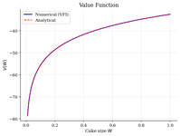 | [**Cake Eating**](dynamic-programming/cake-eating/) | Value Function Iteration | Optimal depletion: consume fraction $(1-\beta)$ each period |
| 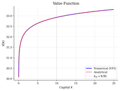 | [**Optimal Growth**](dynamic-programming/optimal-growth/) | VFI | Capital converges to steady state $k_{ss} = (\alpha\beta A)^{1/(1-\alpha)}$ |
| 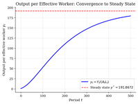 | [**Solow Growth**](dynamic-programming/solow-growth/) | Simulation | Exogenous savings drives long-run output per capita |
| 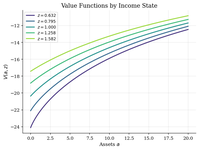 | [**Consumption-Savings**](dynamic-programming/consumption-savings/) | VFI + Markov income | Precautionary savings under income uncertainty |
| 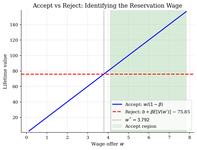 | [**Job Search (McCall)**](dynamic-programming/job-search-mccall/) | VFI | Reservation wage: be more selective when patient |
| 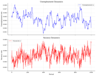 | [**DMP Search & Matching**](dynamic-programming/diamond-mortensen-pissarides/) | Log-linearization | Beveridge curve and the Shimer puzzle |
| 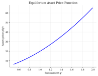 | [**Lucas Asset Pricing**](dynamic-programming/asset-pricing/) | Functional VFI | Price-dividend ratio depends on risk aversion |
| 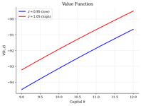 | [**Real Business Cycles**](dynamic-programming/rbc/) | VFI + simulation | Investment is 4x more volatile than output |
| 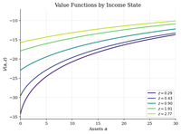 | [**Aiyagari (1994)**](dynamic-programming/aiyagari/) | VFI + GE bisection | Precautionary savings push $r < 1/\beta - 1$ |
| 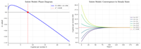 | [**ODE Methods**](dynamic-programming/ode-methods/) | Phase diagrams | Solow, Ramsey saddle paths, Lotka-Volterra cycles |

## Heterogeneous Agents

| | Model | Method | Key Insight |
|:---:|---|---|---|
| 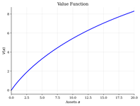 | [**VFI Deterministic**](heterogeneous-agents/vfi-deterministic/) | VFI | With $\beta R < 1$, agent runs down assets to zero |
| 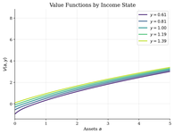 | [**VFI with IID Income**](heterogeneous-agents/vfi-iid-income/) | VFI | Income risk generates precautionary savings buffer |
| 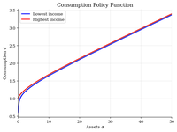 | [**Endogenous Grid Points**](heterogeneous-agents/endogenous-grid-points/) | EGP (Carroll 2006) | 10x faster than VFI by inverting the Euler equation |
| 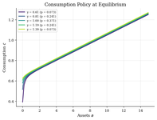 | [**EGP-Aiyagari**](heterogeneous-agents/egp-aiyagari/) | EGP + GE bisection | EGP makes GE loop feasible; $r < 1/\beta - 1$ in equilibrium |
| 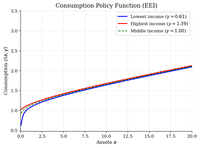 | [**Envelope Equation**](heterogeneous-agents/envelope-equation-iteration/) | EEI | Third approach: iterate on $V'(a)$ via envelope theorem |

## Industrial Organization

| | Model | Method | Key Insight |
|:---:|---|---|---|
| 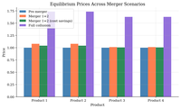 | [**Bertrand-Nash Logit**](industrial-organization/bertrand-logit-demand/) | Fixed point | Mergers raise prices; cost efficiencies can offset |
| 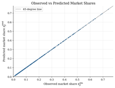 | [**BLP Random Coefficients**](industrial-organization/blp-random-coefficients/) | Contraction mapping | Heterogeneous preferences relax IIA |
| 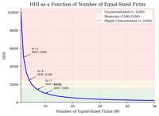 | [**Effective HHI**](industrial-organization/effective-hhi/) | Index computation | $\Delta \text{HHI} = 2 s_1 s_2 \times 10000$ for merger screening |
| 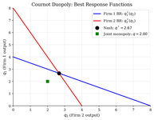 | [**Static Games**](industrial-organization/static-games/) | Nash equilibrium | Cournot output between monopoly and competition |
| 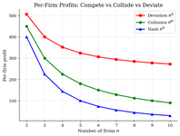 | [**Collusion Detection**](industrial-organization/collusion-detection/) | Repeated games | $\delta^* = 9/17$ for duopoly; more firms = harder to collude |
| 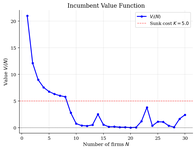 | [**Dynamic Entry/Exit**](industrial-organization/dynamic-entry-exit/) | Dynamic programming | Entry costs sustain above-competitive profits |
| 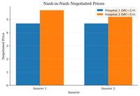 | [**Nash-in-Nash**](industrial-organization/nash-in-nash/) | Bilateral bargaining | Incremental value = leverage in vertical markets |
| 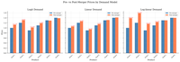 | [**Merger Simulation**](industrial-organization/merger-simulation/) | Multi-demand | Demand model choice drives policy conclusions |

## Choice & Demand

*A progression from nonparametric revealed preference to structural demand estimation:*
*GARP → Logit → Nested Logit → BLP, with supply-side markup recovery at each stage.*

| | Model | Method | Key Insight |
|:---:|---|---|---|
| 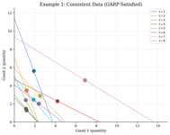 | [**Revealed Preference**](choice/revealed-preference-afriat/) | Afriat + Warshall | GARP: testable implication of utility maximization |
|  | [**GARP & Warshall**](choice/garp-warshall/) | Transitive closure | Bronars power increases with observations |
| 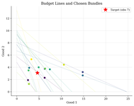 | [**Preference Recoverability**](choice/preference-recoverability/) | Afriat numbers | Bound indifference curves without functional form |
| 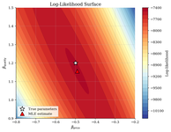 | [**Logit Discrete Choice**](choice/logit-discrete-choice/) | MLE | IIA property: cross-elasticities proportional to shares |
| 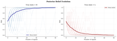 | [**Bayesian Learning**](choice/bayesian-learning/) | Bayes' rule | Optimal classifier; ML converges to Bayes |
| 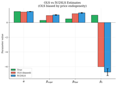 | [**Logit + Supply Side**](choice/logit-supply-side/) | IV/2SLS + FOC | Recover marginal costs from demand estimates alone |
| 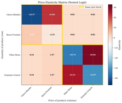 | [**Nested Logit**](choice/nested-logit/) | Berry inversion | Same-nest substitution 14x higher than cross-nest |
| 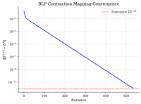 | [**BLP Full Pipeline**](choice/blp-full-pipeline/) | Contraction + GMM | Random coefficients: rich substitution patterns |

## Optimal Control

| | Model | Method | Key Insight |
|:---:|---|---|---|
| 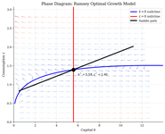 | [**Phase Diagrams**](optimal-control/phase-diagrams/) | Linearization | Ramsey steady state is a saddle point |
| 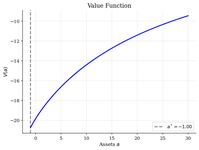 | [**Finite Differences**](optimal-control/finite-difference/) | Upwind FD | Implicit scheme for HJB equations in continuous time |
| 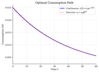 | [**Continuous Cake Eating**](optimal-control/continuous-cake-eating/) | Pontryagin | Shadow price rises at rate $\rho$ in current value |
| 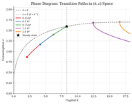 | [**Ramsey Growth**](optimal-control/ramsey-growth/) | Shooting method | Saddle path found by bisection on initial consumption |

## Dynare (DSGE)

| | Model | Method | Key Insight |
|:---:|---|---|---|
| 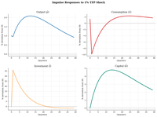 | [**RBC**](dynare/rbc/) | Log-linearization | TFP shock: output peaks on impact, capital builds slowly |
| 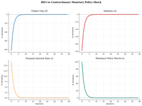 | [**New Keynesian**](dynare/nkdsge/) | Undetermined coefficients | Taylor principle: $\phi_\pi > 1$ for determinacy |
| 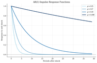 | [**AR Processes**](dynare/ar-processes/) | Simulation | Persistence drives business cycle propagation |
| 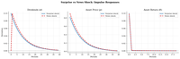 | [**Asset Pricing + News**](dynare/assetNews/) | Present-value pricing | News shocks: prices lead dividends |

## Continuous Time

| | Model | Method | Key Insight |
|:---:|---|---|---|
| 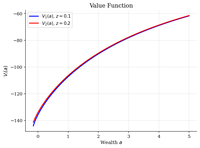 | [**Huggett (1993)**](continuous-time/huggett-incomplete-markets/) | HJB + KFE | Precautionary savings push $r < \rho$ in equilibrium |
| 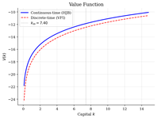 | [**HJB Growth**](continuous-time/hjb-growth/) | Upwind FD | Continuous-time growth via finite differences |

## Global DSGE

| | Model | Method | Key Insight |
|:---:|---|---|---|
| 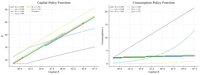 | [**RBC Nonlinear**](global-dsge/rbc-nonlinear/) | Global VFI | Asymmetric responses: recessions are sharper than expansions |
| 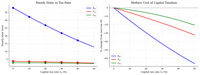 | [**RBC Capital Tax**](global-dsge/rbc-capital-tax/) | Global VFI | Laffer curve: revenue peaks then falls with tax rate |
| 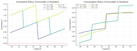 | [**Irreversible Investment**](global-dsge/rbc-irreversible-investment/) | VFI + constraint | Occasionally binding constraint amplifies downturns |

## Time Series

| | Model | Method | Key Insight |
|:---:|---|---|---|
| 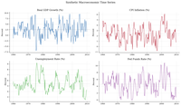 | [**FRED Macro Data**](time-series/fred-macro-data/) | HP filter | Okun's law, Phillips curve in cyclical components |
| 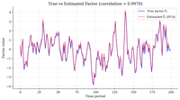 | [**Stock-Watson Factors**](time-series/stock-watson/) | PCA | One factor explains 57% of variance; 28% forecast gain |

---

## Structure

Each model folder is self-contained:

```
topic-area/
  model-name/
    run.py          # Single script: model + solve + generate report
    README.md       # Auto-generated: equations, solutions, figures, takeaways
    figures/        # PNG plots (value functions, policies, simulations)
    tables/         # CSV data (comparison tables, statistics)
```

Shared utilities live in `lib/`:

```
lib/
  grids.py          # Asset/state grid construction
  discretize.py     # Tauchen, Rouwenhorst for AR(1) processes
  interpolate.py    # Linear interpolation (JAX-compatible)
  vfi.py            # Generic VFI solver
  plotting.py       # Consistent matplotlib academic style
  output.py         # ModelReport class (auto-generates README.md)
```

Original files are preserved in `_legacy/`.

## License

MIT License. Copyright (c) 2021 Pranjal Rawat.
