# Computational Economics

This repository gives graduate students and researchers short, executable models from computational and structural economics. Each example is motivated by a by distinct economic question or computational method. Each can be run from its folders with `python run.py`.

This repo was sourced from ideas and contributions of PhD colleagues [Shahzoor Safdar](https://github.com/shahzoor), [Simon Lebastard](https://github.com/slebastard), [Max Blesch](https://github.com/MaxBlesch), [Enoch H. Kang](https://sites.google.com/view/hyunwookkang), [Hoang Nguyen](https://github.com/huuhoang2211), [Kathryn Nicholson](https://sites.google.com/gwmail.gwu.edu/kathrynnicholson/home), and [Weipeng Zhang](https://gufaculty360.georgetown.edu/s/contact/0033600001WDdwXAAT/weipeng-zhang). It also draws from the coursework from professors [John Rust](https://editorialexpress.com/jrust/), [Nathan Miller](http://www.nathanhmiller.org/), [Harry Paarsch](https://sites.google.com/site/hjpaarsch/), [Sanjog Misra](https://sanjogmisra.com/), [Toshihiko Mukoyama](https://sites.google.com/view/toshimukoyama/home), [Mark Huggett](https://sites.google.com/georgetown.edu/mark-huggett/home), [Dan Cao](https://dan-cao.facultysite.georgetown.edu/), and [Benjamin Moll](https://benjaminmoll.com/). At the bottom you will find a wider list of resources. 

Happy programming and building! =]

## Contents

- [Quick Start](#quick-start)
- [Numerical Methods](#numerical-methods)
- [Dynamic Programming](#dynamic-programming)
- [Macroeconomics](#macroeconomics)
- [Industrial Organization](#industrial-organization)
- [Structural Econometrics](#structural-econometrics)
- [Bayesian Methods](#bayesian-methods)
- [Choice and Demand](#choice-and-demand)
- [Computational Game Theory](#computational-game-theory)
- [Time Series](#time-series)
- [Agent-Based Models](#agent-based-models)
- [Selected External Resources](#selected-external-resources)

## Quick Start

```bash
pip install -r requirements.txt
cd dynamic-programming/cake-eating
python run.py
# -> generates README.md + figures/ + tables/
```

## Numerical Methods

Here we cover common tools the rest of the repo uses. This covers solving `f(x) = 0`, finding extrema of `f(x)`, and approximating a function.

| Preview | Tutorial | Description |
|---|---|---|
| [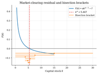](numerical-methods/root-finding/figures/trajectories.png) | **[Scalar Root Finding for Equilibrium Rates](numerical-methods/root-finding/)** | Find the interest rate that clears a stylized bond market. Bisection, secant, and Newton root-finding methods each solve f(x) = 0 and are benchmarked for speed and reliability. |
| [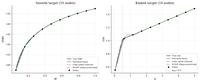](numerical-methods/interpolation/figures/target-vs-fit.png) | **[Off-Grid Function Approximation by Interpolation](numerical-methods/interpolation/)** | Approximate an unknown function from its values at a finite grid of points. Linear, cubic spline, and PCHIP interpolation each handle smooth and kinked curves differently. |
| [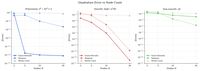](numerical-methods/quadrature/figures/error-vs-nodes.png) | **[Numerical Quadrature: Gauss-Hermite Nodes for Conditional Expectations](numerical-methods/quadrature/)** | Compute AR(1) conditional expectations that arise throughout dynamic models. Gauss-Hermite quadrature places nodes optimally for Gaussian integrands and converges geometrically, beating Monte Carlo at the same node count. |
| [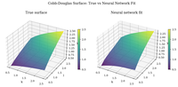](numerical-methods/neural-networks-regression/figures/fitted-surface.png) | **[Feedforward Neural Networks for Regression and Density Approximation](numerical-methods/neural-networks-regression/)** | Fit a noisy Cobb-Douglas production surface using a one-hidden-layer neural network. Feedforward network regression uses JAX autodiff, L2 weight decay, and Adam - the primitives reused across neural-network tutorials in the catalog. |
| [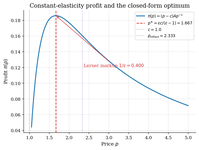](numerical-methods/scalar-optimization-monopoly-pricing/figures/profit-curve.png) | **[Scalar Optimization for Monopoly Pricing](numerical-methods/scalar-optimization-monopoly-pricing/)** | Maximize a monopolist's profit under constant-elasticity demand. Grid search, golden section, and Newton's method are benchmarked against the analytical solution. |
| [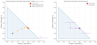](numerical-methods/constrained-optimization-kkt/figures/simplex-paths.png) | **[Constrained Optimization and KKT Conditions](numerical-methods/constrained-optimization-kkt/)** | Allocate a fixed budget across three projects with diminishing returns. Projected gradient, log barrier, and Sequential Least Squares Programming (SLSQP) are compared on convergence speed and accuracy. |
| [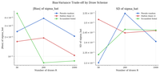](numerical-methods/simulated-likelihood/figures/bias-variance-vs-R.png) | **[Simulated Maximum Likelihood, Common Random Numbers, and Halton Sequences](numerical-methods/simulated-likelihood/)** | Estimate a model whose likelihood integral has no closed form. Simulated maximum likelihood (SML) averages over Halton or Sobol draws; common random numbers smooth the objective and reduce simulation bias below pseudo-random sampling. |
| [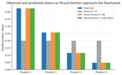](numerical-methods/fixed-point-acceleration/figures/share-fit.png) | **[Fixed-Point Iteration and Acceleration](numerical-methods/fixed-point-acceleration/)** | Recover product mean utilities from observed plain-logit shares using fixed point solvers. Picard, damped Picard, and Anderson acceleration are compared against the closed-form solution. |
| [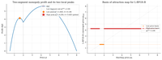](numerical-methods/global-search-multistart/figures/profit-surface.png) | **[Global Search and Multi-Start Diagnostics](numerical-methods/global-search-multistart/)** | Optimize a two-segment monopoly profit function with one local and one global maximum. Multi-start, random search, and simulated annealing each identify the global optimum where gradient methods get trapped locally. |

## Dynamic Programming

These tutorials start from one-state decision problems and build toward risk, search, asset pricing, business cycles, and general equilibrium.

| Preview | Tutorial | Description |
|---|---|---|
| [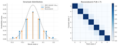](dynamic-programming/shock-discretization/figures/stationary-mass.png) | **[Discretizing Persistent Shocks](dynamic-programming/shock-discretization/)** | Replace a continuous AR(1) productivity or income process with a finite Markov chain so it can enter a Bellman equation. Tauchen and Rouwenhorst discretization are compared on accuracy and grid size. |
| [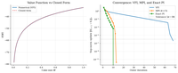](dynamic-programming/cake-eating/figures/value-function.png) | **[Finite-Resource Cake Eating](dynamic-programming/cake-eating/)** | A household allocates a fixed endowment across periods, with no replenishment. Value function iteration, modified policy iteration, and Howard improvement all recover the same closed-form consumption rule. |
| [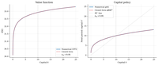](dynamic-programming/optimal-growth/figures/value-function.png) | **[Optimal Growth by Value Function Iteration](dynamic-programming/optimal-growth/)** | A planner splits output between consumption today and capital that raises output tomorrow. Value function iteration (VFI) recovers the log-utility saving rule and benchmarks it against the closed form. |
| [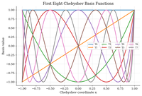](computational-methods/projection-methods/figures/chebyshev-basis.png) | **[Growth-Model Capital Policy by Chebyshev Projection](computational-methods/projection-methods/)** | Represent the planner's capital-saving rule in a deterministic growth model as a polynomial rather than a grid. Chebyshev projection recovers the optimal policy accurately with far fewer coefficients than VFI. |
| [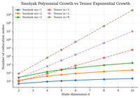](computational-methods/smolyak-sparse-grids/figures/grid-size-scaling.png) | **[High-Dimensional Growth Policy by Smolyak Sparse Grids](computational-methods/smolyak-sparse-grids/)** | A five-sector planner with continuous states makes a full tensor Chebyshev grid computationally infeasible. Smolyak sparse-grid collocation recovers the closed-form saving rule at a fraction of the node count. |
| [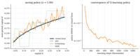](dynamic-programming/q-learning-growth/figures/policy-comparison.png) | **[Stochastic Optimal Growth by Q-Learning](dynamic-programming/q-learning-growth/)** | Find the optimal saving rule in the Brock-Mirman stochastic growth model without knowing the transition probabilities. Tabular Q-learning estimates the action-value function from sampled experience and converges to the VFI policy. |
| [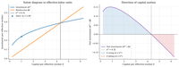](dynamic-programming/solow-growth/figures/solow-diagram.png) | **[Solow Growth and Conditional Convergence](dynamic-programming/solow-growth/)** | Capital per effective worker converges to a Solow steady state set by saving, depreciation, and productivity growth. Transition-map iteration shows how saving rates and population growth shift long-run income levels. |
| [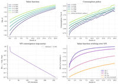](dynamic-programming/consumption-savings/figures/value-functions.png) | **[Buffer-Stock Saving with Persistent Income by VFI](dynamic-programming/consumption-savings/)** | Households facing persistent income risk and a borrowing limit save to buffer consumption. Value function iteration (VFI) on the asset-income grid recovers high marginal propensities to consume near the constraint and a buffer-stock target. |
| [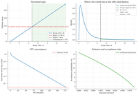](dynamic-programming/job-search-mccall/figures/accept-vs-reject.png) | **[McCall Job Search and the Reservation Wage](dynamic-programming/job-search-mccall/)** | An unemployed worker draws wage offers each period and decides whether to accept or keep searching. A scalar Bellman fixed point pins down the reservation wage, which finite-grid VFI replicates numerically. |
| [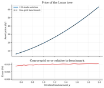](dynamic-programming/asset-pricing/figures/asset-price-function.png) | **[Lucas Tree I: SDF Baseline by Scaled-Price Iteration](dynamic-programming/asset-pricing/)** | Price a Lucas tree from the household Euler equation. Scaled-price iteration transforms the functional equation into a contraction and recovers equilibrium asset prices from dividend risk and persistence. |
| [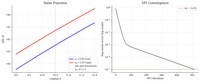](dynamic-programming/rbc/figures/comovements.png) | **[RBC Capital, Labor, and Business-Cycle Moments](dynamic-programming/rbc/)** | A representative household picks consumption, labor, and investment in an RBC model driven by productivity shocks. Global-grid VFI solves the Bellman equation and simulates investment, hours, and business-cycle moments. |
| [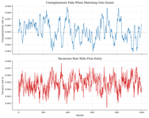](dynamic-programming/diamond-mortensen-pissarides/figures/productivity-tightness.png) | **[DMP Search, Vacancies, and Unemployment](dynamic-programming/diamond-mortensen-pissarides/)** | Workers and firms match via a search friction; free entry pins tightness in the Diamond-Mortensen-Pissarides (DMP) model. A nonlinear fixed point solves for vacancies and unemployment and shows how surplus calibration drives amplification. |
| [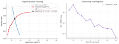](dynamic-programming/aiyagari/figures/capital-market.png) | **[Aiyagari Saving and Capital-Market Clearing](dynamic-programming/aiyagari/)** | Households with idiosyncratic income risk self-insure by saving when borrowing markets are incomplete. Value function iteration solves each household's problem and bisection clears the capital market to find the equilibrium interest rate. |

## Macroeconomics

This section covers heterogeneous households, DSGE models, nonlinear global solutions, and continuous-time control.

### Heterogeneous Agents

These tutorials focus on incomplete-markets households and equilibrium interest rates.

| Preview | Tutorial | Description |
|---|---|---|
| [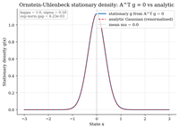](heterogeneous-agents/kolmogorov-forward-equation/figures/stationary-density-ou.png) | **[Kolmogorov Forward Equation and the Stationary Wealth Distribution](heterogeneous-agents/kolmogorov-forward-equation/)** | Find how savings decisions shape the cross-sectional wealth distribution in steady state. The Kolmogorov Forward Equation discretizes mass flow across wealth levels into a sparse linear system. |
| [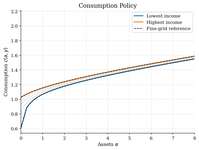](heterogeneous-agents/endogenous-grid-points/figures/consumption-policy.png) | **[Buffer-Stock Saving with IID Income by EGP](heterogeneous-agents/endogenous-grid-points/)** | Compute how a household saves when income is uncertain and borrowing is limited. Endogenous grid points (EGP) inverts the Euler equation to recover the consumption policy without a grid search. |
| [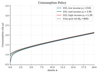](heterogeneous-agents/envelope-equation-iteration/figures/consumption-policy.png) | **[Buffer-Stock Saving with Persistent Income by Envelope-Equation Iteration](heterogeneous-agents/envelope-equation-iteration/)** | Compute saving decisions when income shocks carry over across periods rather than resetting each year. Envelope-equation iteration updates the marginal value of wealth directly, converging faster than value function iteration. |
| [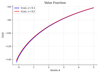](heterogeneous-agents/huggett-incomplete-markets/figures/bond-market.png) | **[Huggett Equilibrium and the Risk-Free Rate](heterogeneous-agents/huggett-incomplete-markets/)** | Find the interest rate at which households with uninsurable income risk collectively choose to hold zero net bonds. Coupled HJB and KFE equations pin down saving behavior and the wealth distribution; bisection clears the bond market. |
| [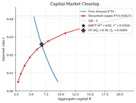](heterogeneous-agents/aiyagari-hact/figures/capital-market.png) | **[Continuous-time Aiyagari and the Mean-Field Game](heterogeneous-agents/aiyagari-hact/)** | Find the steady-state capital stock when households with income risk supply savings to competitive firms. The Lasry-Lions mean-field game couples the HJB, KFE, and capital-market clearing into one continuous-time system. |
| [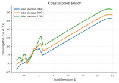](heterogeneous-agents/huggett-aggregate-risk-srl/figures/policy-consumption.png) | **[Structural Reinforcement Learning for Huggett with Aggregate Risk](heterogeneous-agents/huggett-aggregate-risk-srl/)** | Households face idiosyncratic and aggregate risk, keeping bond markets incomplete. Structural reinforcement learning trains a policy-gradient agent to discover saving rules that clear the bond market at every aggregate state. |
| [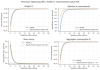](heterogeneous-agents/sequence-space-jacobian-hank/figures/irf-comparison.png) | **[Sequence-Space Jacobian for One-Asset HANK](heterogeneous-agents/sequence-space-jacobian-hank/)** | Trace how a monetary shock propagates when households differ in wealth and face borrowing limits. Sequence-space Jacobians linearize each model block and compose into a single matrix equation for the full transition path. |

### Linearized DSGE

These tutorials log-linearize DSGE models around steady state and solve the rational-expectations transition. They use coefficient matching or Klein-style QZ, the same first-order logic behind standard DSGE solvers.

| Preview | Tutorial | Description |
|---|---|---|
| [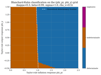](dsge/blanchard-kahn-determinacy/figures/bk-heatmap.png) | **[Blanchard-Kahn Conditions and Saddle-Path Selection in Linear Rational Expectations](dsge/blanchard-kahn-determinacy/)** | Determine when a linear rational-expectations model has exactly one stable path by counting explosive eigenvalues against predetermined variables. QZ decomposition selects the saddle path and rules out indeterminate or explosive outcomes. |
| [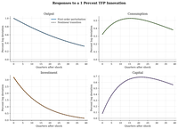](dsge/rbc/figures/irf-fixed-labor.png) | **[Linearized RBC by Perturbation and QZ (with and without endogenous labor)](dsge/rbc/)** | Trace how a technology shock shifts output, investment, and hours in a log-linearized real business cycle model. Klein QZ decomposes the first-order system to recover the stable policy rule. |
| [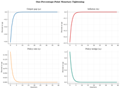](dsge/nkdsge/figures/irf-monetary-shock.png) | **[Sticky-Price Monetary Transmission in a New Keynesian DSGE](dsge/nkdsge/)** | Ask how a central bank rate change moves output and inflation when firms cannot reprice freely. Coefficient matching on the log-linearized equilibrium delivers impulse responses to monetary and demand shocks. |
| [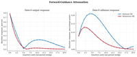](dsge/behavioral-nk/figures/forward-guidance-attenuation.png) | **[Cognitive Discounting in a Behavioral New Keynesian Model](dsge/behavioral-nk/)** | Ask how much a central bank's forward guidance moves current output when households cognitively discount distant news. A behavioral New Keynesian model solved by log-linearization shows pronounced forward-guidance attenuation. |
| [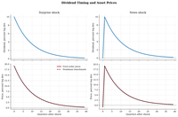](dsge/assetNews/figures/irf-surprise-vs-news.png) | **[Lucas Tree II: Dividend News by Linearized Pricing](dsge/assetNews/)** | Value a Lucas tree when the market learns about future dividends before the cash flows arrive. A log-linearized first-order pricing rule separates news shocks from contemporaneous payoffs. |
| [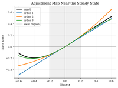](computational-methods/perturbation-linearization/figures/local-approximations.png) | **[Aggregate Adjustment Around a Steady State](computational-methods/perturbation-linearization/)** | Study how aggregate output recovers from a shock when the true law of motion is nonlinear. First-order Taylor perturbation around steady state delivers a local policy rule and tracks the transition path. |

### Global Nonlinear DSGE

These tutorials solve macro models on grids so constraints, taxes, and risk sharing remain visible.

| Preview | Tutorial | Description |
|---|---|---|
| [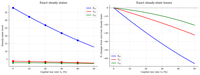](global-dsge/rbc-capital-tax/figures/steady-state-tax.png) | **[Capital Taxes and Saving in a Global RBC Model](global-dsge/rbc-capital-tax/)** | A rebated capital-income tax distorts the private return to capital and depresses saving. Global value function iteration solves the household policy on a full productivity grid. |
| [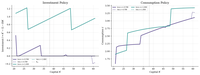](global-dsge/rbc-irreversible-investment/figures/policy-functions.png) | **[Capital Overhang from Irreversible Investment in RBC](global-dsge/rbc-irreversible-investment/)** | Installed capital becomes a drag after a negative productivity shock when investment cannot be reversed. Global value function iteration locates the capital threshold where disinvestment first binds. |
| [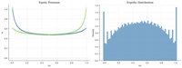](global-dsge/heaton-lucas/figures/equity-premium-and-distribution.png) | **[Heaton-Lucas Risk Sharing and Equity Premia](global-dsge/heaton-lucas/)** | Incomplete risk sharing forces households to hold portfolios that tie equity premia to wealth shares. Stochastic time-path forward iteration (STPFI) solves the recursive wealth-share transition under portfolio constraints. |
| [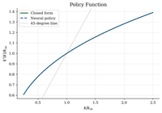](global-dsge/deep-learning-optimal-growth/figures/policy-comparison.png) | **[Deep Learning for Optimal Growth](global-dsge/deep-learning-optimal-growth/)** | The Brock-Mirman optimal growth model is used to benchmark a neural-network policy approximation. A small JAX network is trained via Euler-equation residuals on simulated capital states. |

### Continuous-Time Macro and Optimal Control

These examples cover HJB equations, phase diagrams, shooting, and shadow prices.

| Preview | Tutorial | Description |
|---|---|---|
| [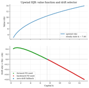](optimal-control/upwind-finite-differences/figures/value-and-drift.png) | **[Upwind Finite Differences for First-Order PDEs and the HJB State Constraint](optimal-control/upwind-finite-differences/)** | A planner on a bounded capital interval chooses consumption subject to a state constraint. Upwind finite differences discretize the HJB by selecting forward or backward differences based on drift sign, then enforce the boundary directly. |
| [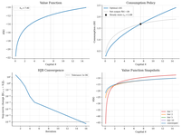](optimal-control/hjb-growth/figures/value-function.png) | **[Ramsey Capital Accumulation by HJB Upwinding](optimal-control/hjb-growth/)** | A Ramsey planner accumulates capital toward its golden-rule steady state. Upwind HJB discretization converts the continuous Bellman into a sparse linear system that recovers the shadow value of capital and the optimal consumption path. |
| [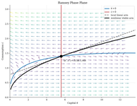](optimal-control/phase-diagrams/figures/phase-diagram.png) | **[Ramsey Consumption Choice and Saddle Paths](optimal-control/phase-diagrams/)** | A Ramsey economy has two state variables, consumption and capital, whose joint dynamics determine the long-run steady state. Phase-diagram analysis and backward integration from the saddle point trace the unique stable consumption path. |
| [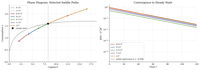](optimal-control/ramsey-growth/figures/phase-diagram.png) | **[Ramsey Saving by Saddle-Path Shooting](optimal-control/ramsey-growth/)** | A Ramsey planner inherits a capital stock and must choose initial consumption to reach the saddle steady state. Saddle-path shooting iterates over the initial consumption guess until the simulated trajectory converges to the steady state. |

## Industrial Organization

The IO section covers firm boundaries, vertical relationships, demand, pricing, production, mergers, collusion, bargaining, and industry dynamics.

| Preview | Tutorial | Description |
|---|---|---|
| [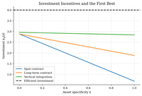](industrial-organization/theory-of-the-firm/figures/investment-incentives.png) | **[Firm Boundaries, Hold-Up, and Vertical Integration](industrial-organization/theory-of-the-firm/)** | Study when ownership should move inside the firm for relationship-specific investment. A grid comparison weighs incentives against hierarchy costs. |
| [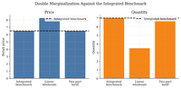](industrial-organization/vertical-relationships/figures/price-quantity.png) | **[Double Marginalization in Vertical Supply Chains](industrial-organization/vertical-relationships/)** | Compare a manufacturer-retailer channel with the integrated benchmark. Backward induction shows when a two-part tariff restores the joint optimum. |
| [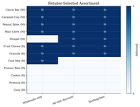](industrial-organization/vertical-contracts/figures/assortment-selection.png) | **[Vending Assortments Under Vertical Contracts](industrial-organization/vertical-contracts/)** | Vending contracts decide which products fit in scarce slots. Exact enumeration compares assortments under wholesale pricing, rebates, and slotting fees. |
| [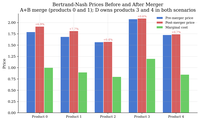](industrial-organization/bertrand-ownership-matrix/figures/prices-pre-post.png) | **[Multi-Product Bertrand-Nash Pricing and the Ownership Matrix](industrial-organization/bertrand-ownership-matrix/)** | Multi-product firms internalize cross-price effects across the products they own. The Bertrand-Nash ownership matrix and demand Jacobian form a linear system that solves for equilibrium prices and post-merger counterfactuals. |
| [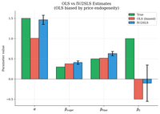](industrial-organization/logit-supply-side/figures/estimation-comparison.png) | **[Cereal Demand and Markup Recovery from Prices](industrial-organization/logit-supply-side/)** | Cereal demand has endogenous prices and unobserved costs. Berry inversion, IV/2SLS, and Bertrand-Nash FOCs recover markups and marginal costs. |
| [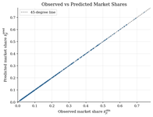](industrial-organization/blp-random-coefficients/figures/observed-vs-predicted-shares.png) | **[Differentiated-Products Demand with BLP](industrial-organization/blp-random-coefficients/)** | Study how consumer heterogeneity changes substitution in differentiated-products markets. A BLP contraction with IV/GMM estimates taste dispersion. |
| [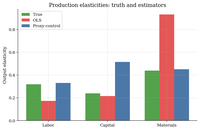](industrial-organization/production-functions-markups/figures/production-estimates.png) | **[Production Elasticities and Firm Markups](industrial-organization/production-functions-markups/)** | Recover firm-year markups from materials elasticities and shares. A proxy-control regression corrects productivity bias before the markup formula. |
| [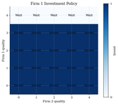](industrial-organization/dynamic-games/figures/investment-policy.png) | **[Quality-Ladder Dynamic Game: Solving the MPE](industrial-organization/dynamic-games/)** | Firms invest to climb a quality ladder while rivals move too. A Markov-perfect fixed point gives investment policies and continuation values. |
| [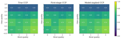](industrial-organization/dynamic-games-estimation/figures/ccp-heatmaps.png) | **[Quality-Ladder Dynamic Game: Estimating with CCPs](industrial-organization/dynamic-games-estimation/)** | Estimate payoff primitives in a two-firm quality ladder from observed investment choices. CCPs and forward-value evaluation replace repeated MPE solves. |
| [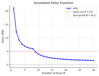](industrial-organization/dynamic-entry-exit/figures/value-function.png) | **[Entry, Exit, and Market Structure in Oligopoly](industrial-organization/dynamic-entry-exit/)** | Sunk entry costs make the firm count persistent in oligopoly. A finite-state Bellman fixed point yields entry, exit, and the long-run market structure. |
| [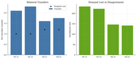](industrial-organization/nash-in-nash/figures/negotiated-prices.png) | **[Hospital-Insurer Network Bargaining](industrial-organization/nash-in-nash/)** | Hospital networks shape insurer outside options and negotiated payments. A Nash-in-Nash surplus split compares separate hospitals with a merged system. |
| [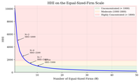](industrial-organization/merger-simulation/figures/hhi-vs-nfirms.png) | **[Merger Pricing: Concentration Screens, Diversion, and Bertrand-Nash Equilibrium](industrial-organization/merger-simulation/)** | A horizontal merger reshapes pricing by internalizing diversion among co-owned products. HHI screens and calibrated logit baselines compare UPP, GUPPI, welfare, and an efficiency frontier. |
| [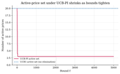](industrial-organization/online-pricing-partial-identification/figures/active-prices.png) | **[Online Pricing with Revealed-Preference Bounds](industrial-organization/online-pricing-partial-identification/)** | A seller posts prices on a grid and observes only buy or no-buy. WARP-style revealed-preference bounds eliminate dominated prices, and UCB-PI narrows the active set from twenty candidates to three within one hundred rounds. |

## Structural Econometrics

Structural econometrics focuses on estimating economic primitives from observed choices, transitions, and policies. These tutorials connect likelihoods, dynamic programs, revealed decisions, and reward recovery.

| Preview | Tutorial | Description |
|---|---|---|
| [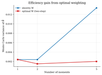](structural-econometrics/gmm-foundations/figures/efficiency-gain.png) | **[GMM Foundations: Moment Conditions, Identification, and Optimal Weighting](structural-econometrics/gmm-foundations/)** | A location-scale model illustrates how moment conditions pin down parameters. Hansen two-step optimal weighting shows that adding redundant moments shrinks rather than raises efficiency. |
| [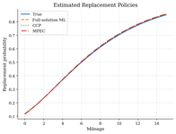](industrial-organization/dynamic-discrete-choice/figures/value-and-ccp.png) | **[Bus Engine Replacement: NFXP, CCP, MPEC, and the MCE-IRL Equivalence](industrial-organization/dynamic-discrete-choice/)** | A bus manager decides when to replace an engine as mileage raises operating costs. NFXP, conditional choice probabilities (CCP), MPEC, and inverse reinforcement learning all recover the same replacement hazard. |
| [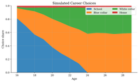](structural-econometrics/keane-wolpin-career-choice/figures/choice-shares.png) | **[Keane-Wolpin Career Choice by Emax Approximation](structural-econometrics/keane-wolpin-career-choice/)** | Young workers choose between school and occupations over a finite career horizon. Backward induction with expected-maximum value (Emax) regression cuts the state-space cost through interpolation. |
| [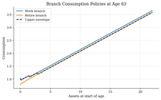](structural-econometrics/dcegm-retirement-saving/figures/branch-consumption.png) | **[Retirement and Saving by Discrete-Continuous EGM](structural-econometrics/dcegm-retirement-saving/)** | A household saves continuously and retires at most once, creating a kink in the policy function. The discrete-continuous endogenous grid method (DC-EGM) builds separate branches and applies an upper envelope at the kink. |
| [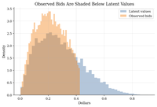](structural-econometrics/auction-valuation-recovery/figures/recovered-cdf.png) | **[Recovering Auction Values from First-Price Bids](structural-econometrics/auction-valuation-recovery/)** | Bidders have private values but submit sealed bids, so valuations are never observed directly. Bid-density inversion using first-price equilibrium conditions recovers the independent private values (IPV) distribution from the bids alone. |
| [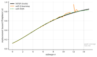](structural-econometrics/q-learning-bus-engine/figures/replacement-hazard.png) | **[Rust Bus Replacement by Soft Q-Learning and DQN](structural-econometrics/q-learning-bus-engine/)** | A bus manager decides when to replace an engine as mileage raises operating costs. Soft Q-learning recovers the replacement hazard without a transition matrix, and a deep Q-network (DQN) replicates it with function approximation. |
| [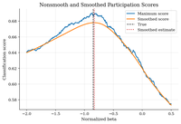](choice/maximum-score-binary-choice/figures/score-objectives.png) | **[Binary Participation with Maximum Score](choice/maximum-score-binary-choice/)** | A worker decides whether to participate in a program, but the error distribution is unknown. Maximum score estimation searches over the normalized surplus index, with kernel smoothing added for tractability. |
| [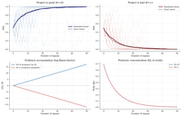](choice/bayesian-learning/figures/belief-evolution.png) | **[Sequential Investment Under Bayesian Learning](choice/bayesian-learning/)** | A firm holds an option to invest in a project whose quality is unknown and revealed slowly. Bayesian filtering and backward induction jointly determine when to invest, reject, or keep waiting. |
| [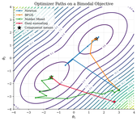](computational-methods/numerical-optimization/figures/optimizer-paths.png) | **[Latent-Regime Likelihoods and Optimizer Basins](computational-methods/numerical-optimization/)** | A latent-regime likelihood has two parameter regions that fit the data almost equally well. Multi-start gradient descent and basin-hopping expose how starting values determine which optimum is found. |
| [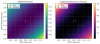](computational-methods/simulation-based-estimation/figures/criterion-surfaces.png) | **[Estimating a Search Acceptance Rule by Simulation](computational-methods/simulation-based-estimation/)** | A job seeker accepts or rejects wage offers, generating a reservation-wage rule. Method of simulated moments (MSM), indirect inference, and approximate Bayesian computation (ABC-SMC) all recover the structural parameter from the same data. |
| [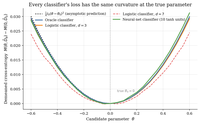](structural-econometrics/adversarial-estimation/figures/smm-vs-adversarial.png) | **[Adversarial Structural Estimation](structural-econometrics/adversarial-estimation/)** | A structural model needs moment conditions, but choosing them by hand is arbitrary. A logistic discriminator recovers optimally-weighted simulated method of moments (SMM) and a neural one approaches maximum likelihood as moments grow. |
| [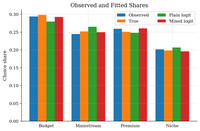](choice/mixed-logit-simulation/figures/choice-fit.png) | **[Mixed Logit Demand with Simulated Likelihood](choice/mixed-logit-simulation/)** | Consumers differ in price sensitivity and quality tastes, so a single logit elasticity misrepresents demand. Mixed logit with simulated probabilities allows flexible substitution and breaks independence of irrelevant alternatives (IIA). |
| [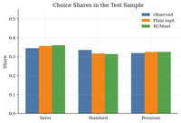](structural-econometrics/rum-choice-networks/figures/choice-fit.png) | **[Choice Prediction with RUMnets](structural-econometrics/rum-choice-networks/)** | Consumers have unobserved heterogeneous tastes for products, so standard logit misfits the data. A neural random-utility model (RUMnet) approximates choice probabilities through fixed latent draws while preserving utility maximization. |
| [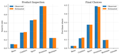](choice/sequential-search-ursu/figures/search-and-choice-fit.png) | **[Consumer Search with Sequential Inspection Costs](choice/sequential-search-ursu/)** | Consumers inspect products one at a time and stop when they find a satisfactory option. A Weitzman-style optimal search rule and simulated method of moments recover per-product search costs from observed search paths and purchases. |
| [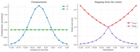](spatial-economics/allen-arkolakis/figures/equilibrium-wages-population.png) | **[Allen-Arkolakis Spatial Equilibrium on a Grid](spatial-economics/allen-arkolakis/)** | Workers and goods move across many locations facing trade costs and agglomeration forces. A two-equation fixed-point system delivers equilibrium wages and population shares across the spatial grid. |
| [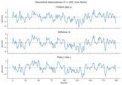](structural-econometrics/bayesian-dsge-hmc/figures/posterior-irfs.png) | **[Bayesian DSGE Estimation by HMC/NUTS](structural-econometrics/bayesian-dsge-hmc/)** | A two-shock New Keynesian model is estimated on simulated output and inflation data. Hamiltonian Monte Carlo (HMC) with the NUTS sampler targets the structural parameter posterior; the chain concentrates near the data-generating values. |

## Bayesian Methods

These tutorials teach Bayesian inference as a researcher's tool, ordered from closed-form conjugate examples through Monte Carlo machinery to function-space Bayes.

| Preview | Tutorial | Description |
|---|---|---|
| [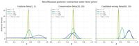](bayesian-methods/bayesian-foundations/figures/beta-posteriors.png) | **[Bayesian Foundations: Priors, Likelihoods, and Conjugate Posteriors](bayesian-methods/bayesian-foundations/)** | How does observed data sharpen a prior? Conjugate Bayesian updating gives closed-form posteriors for a Binomial proportion and a Gaussian regression, making shrinkage visible as a precision-weighted average. |
| [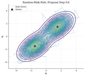](computational-methods/metropolis-hastings/figures/conjugate-posterior.png) | **[Posterior Sampling: Random-walk Metropolis-Hastings](computational-methods/metropolis-hastings/)** | A two-regime mixture posterior has no closed form, so random-walk Metropolis-Hastings samples it by chain. The Beta-Binomial conjugate posterior serves as a closed-form benchmark to verify chain accuracy. |
| [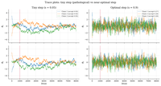](computational-methods/mcmc-diagnostics/figures/trace-plots.png) | **[MCMC Chain Diagnostics: ESS, R-hat, and Integrated Autocorrelation Time](computational-methods/mcmc-diagnostics/)** | How do you know when an MCMC chain has converged? ESS, integrated autocorrelation time, and R-hat each flag a different failure mode on a correlated-Gaussian target before any structural model is touched. |
| [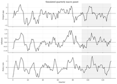](time-series/minnesota-svar/figures/policy-shock-irfs.png) | **[Monetary Policy SVARs with Minnesota Priors](time-series/minnesota-svar/)** | How does a contractionary rate increase ripple through output and inflation? Minnesota-prior shrinkage stabilizes a monetary-policy VAR, and recursive SVAR identification isolates the policy-rate shock from the responses. |
| [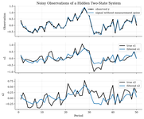](computational-methods/kalman-filter/figures/simulated-signal.png) | **[Nowcasting a Latent Business-Cycle State by Kalman Filtering](computational-methods/kalman-filter/)** | A latent business-cycle state is only observed with noise, so a linear state-space model is needed. The Kalman filter delivers the minimum-variance update each period and accumulates the marginal likelihood for estimation. |
| [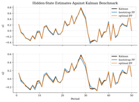](computational-methods/particle-filter/figures/filter-comparison.png) | **[Nowcasting Hidden Economic States by Particle Filtering](computational-methods/particle-filter/)** | A hidden economic state evolves nonlinearly, making the Kalman filter inexact. Particle filtering approximates the filtered distribution with weighted simulations, and effective sample size reveals when the proposal degrades. |
| [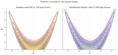](computational-methods/hamiltonian-monte-carlo/figures/posterior-coverage.png) | **[Hamiltonian Monte Carlo on a Banana Posterior](computational-methods/hamiltonian-monte-carlo/)** | Curved posteriors defeat random-walk proposals because the chain explores inefficiently. Hamiltonian Monte Carlo uses gradient-guided leapfrog steps to cross ridges, delivering order-of-magnitude gains in effective sample size. |
| [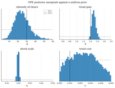](bayesian-methods/neural-posterior-brock-hommes/figures/posterior-pairs.png) | **[Likelihood-Free Bayes by Neural Posterior Estimation](bayesian-methods/neural-posterior-brock-hommes/)** | The Brock-Hommes asset-pricing model has no tractable likelihood, so simulation-based inference is needed. Neural posterior estimation trains a normalizing flow on simulator output to return a joint posterior over four parameters. |
| [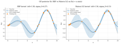](numerical-methods/gaussian-processes/figures/posterior-fit.png) | **[Gaussian Process Regression and Uncertainty Quantification](numerical-methods/gaussian-processes/)** | A Gaussian process places a prior over functions and conditions on noisy observations to return a posterior mean and credible band in closed form. Marginal likelihood optimization tunes the kernel length scale without cross-validation. |
| [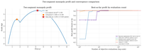](numerical-methods/bayesian-optimization/figures/bo-iterations.png) | **[Bayesian Optimization with a Gaussian-Process Surrogate](numerical-methods/bayesian-optimization/)** | A monopolist profit surface is expensive to evaluate and has multiple local peaks. Bayesian optimization pairs a Gaussian-process surrogate with Expected Improvement to find the global maximum in thirty function calls. |

## Choice and Demand

Choice and demand focuses on revealed preference, learning, and choice models.

| Preview | Tutorial | Description |
|---|---|---|
| [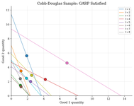](choice/revealed-preference-afriat/figures/budget-lines-consistent.png) | **[Consumer Rationalizability with Afriat's Test](choice/revealed-preference-afriat/)** | Can observed budget choices be rationalized by one stable utility function? Afriat's theorem tests GARP by checking transitive closure of revealed-preference edges. |
| [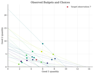](choice/preference-recoverability/figures/budget-lines.png) | **[Recovering Preference Bounds from Budget Choices](choice/preference-recoverability/)** | How much of a consumer's preference ordering can budget data pin down? Afriat inequalities recover the tightest rationalizing indifference contour from the observations. |
| [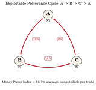](choice/money-pump-index/figures/money-pump-cycle.png) | **[Revealed-Preference Cycles and the Money Pump Index](choice/money-pump-index/)** | How costly are inconsistent budget choices relative to income? A maximum mean-cycle linear program converts each GARP violation into a money-pump severity index. |
| [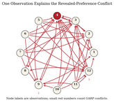](choice/houtman-maks-rational-subsets/figures/conflict-graph.png) | **[Rationalizable Choice Cores with Houtman-Maks](choice/houtman-maks-rational-subsets/)** | Which observations can be rationalized by a single utility even when the full dataset fails GARP? Houtman-Maks search finds the largest consistent core by removing the fewest conflicting choices. |
| [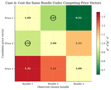](choice/revealed-price-preference/figures/price-cost-ratios.png) | **[Price-Regime Revealed Preference](choice/revealed-price-preference/)** | Can choices across tax or tariff regimes be rationalized by stable preferences over price vectors? The GAPP revealed-preference graph detects cycles that bundle-level GARP misses. |
| [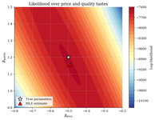](choice/logit-discrete-choice/figures/log-likelihood-surface.png) | **[Product Demand with Plain Logit and IIA](choice/logit-discrete-choice/)** | How do consumers substitute across products when one product's price rises? Maximum likelihood fits plain-logit tastes, and the IIA property reallocates lost buyers in proportion to existing market shares. |
| [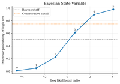](choice/urn-behavioral-mixtures/figures/bayes-likelihood-ratio.png) | **[Are People Bayesian? Decision-Rule Mixtures via EM](choice/urn-behavioral-mixtures/)** | Do subjects classify hidden urn states by Bayes' rule or by simpler cutoffs? An EM mixture recovers the shares of four candidate decision rules from repeated choices. |
| [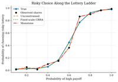](choice/risk-aversion-monotone-choice/figures/risky-choice-fits.png) | **[Lottery Risk Aversion with Monotone Choice](choice/risk-aversion-monotone-choice/)** | How risk-averse are subjects choosing along a ladder of binary lotteries? Monotone-constrained logit estimation enforces rising acceptance rates, removing spurious reversals in the fitted shares. |
| [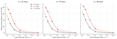](choice/convex-time-budget-present-bias/figures/identification-profile.png) | **[Estimating Present Bias from Convex Time Budgets](choice/convex-time-budget-present-bias/)** | How much do subjects discount the near future relative to the far future? NLS and Tobit MLE use front-end-delay variation in convex time budgets to separately identify present bias from long-run patience. |
| [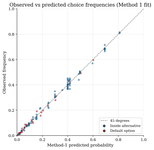](choice/consideration-set-estimation/figures/menu-removal-asymmetry.png) | **[Stochastic Choice and Random Consideration Sets](choice/consideration-set-estimation/)** | Why do choice frequencies shift when the menu changes even if preferences do not? Manzini-Mariotti maximum likelihood jointly recovers a preference ranking and per-alternative attention probabilities from menu-varying choices. |
| [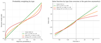](choice/probability-distortion-mixture/figures/weighting-functions.png) | **[Heterogeneous Probability Distortion via Finite-Mixture EM](choice/probability-distortion-mixture/)** | Do subjects weight probabilities linearly or do they overweight small chances? Bruhin-Fehr-Duda-Epper finite-mixture EM sorts subjects into EUT, mild-CPT, and strong-CPT types, with BIC selecting the number of types. |
| [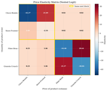](choice/nested-logit/figures/elasticity-heatmap.png) | **[Cereal Demand with Nested Logit Substitution](choice/nested-logit/)** | How do cereal buyers substitute within and across product groups after a price increase? Nested-logit IV estimation recovers the nesting parameter, then converts fitted shares into own and cross elasticities and diversion ratios. |
| [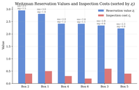](choice/weitzman-search-rule/figures/reservation-values.png) | **[Pandora's Box: Optimal Sequential Search and the Weitzman Reservation-Value Rule](choice/weitzman-search-rule/)** | A buyer inspects boxes with unknown values and pays a per-box inspection cost. Weitzman's reservation-value rule ranks boxes by their option value and proves that opening in decreasing order is exactly optimal under perfect recall. |

## Computational Game Theory

These tutorials introduce computational methods to solve game theoretic equilibria.

| Preview | Tutorial | Description |
|---|---|---|
| [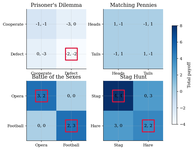](game-theory/normal-form-games/figures/pure-deviation-gains.png) | **[Finite Strategic Games and Nash Equilibrium Checks](game-theory/normal-form-games/)** | Coordination, matching, and prisoner's dilemma games each embody a distinct strategic tension. Deviation-gain enumeration finds every pure Nash equilibrium; 2x2 indifference conditions recover the mixed-strategy equilibrium. |
| [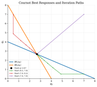](game-theory/static-games/figures/cournot-best-response.png) | **[Cournot Quantity Competition and Best-Response Iteration](game-theory/static-games/)** | Two firms choose quantities in a linear market where each firm's profit falls when the rival expands. Best-response iteration converges to the Cournot Nash equilibrium and matches the closed-form first-order condition solution. |
| [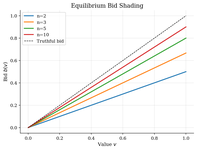](game-theory/first-price-auctions/figures/bid-functions.png) | **[First-Price Auctions, Bid Shading, and Deviation Checks](game-theory/first-price-auctions/)** | Bidders with private values shade below their value because the winner pays its own bid. The symmetric Bayesian Nash equilibrium bid function is derived in closed form and verified by a type-by-type deviation grid. |
| [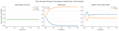](game-theory/regret-matching/figures/time-average-convergence.png) | **[Regret Matching and No-Regret Dynamics](game-theory/regret-matching/)** | Players in a repeated game adjust strategies based on how much they regret not playing differently. Regret matching drives time-average play to a correlated equilibrium and is the primitive behind CFR for extensive-form games. |
| [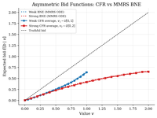](game-theory/cfr-asymmetric-auction/figures/bid-functions-asymmetric.png) | **[Asymmetric First-Price Auctions by Counterfactual Regret Minimization](game-theory/cfr-asymmetric-auction/)** | Two bidders draw values from different supports, so no closed-form Bayesian Nash equilibrium exists. Counterfactual regret minimization (CFR) converges to the equilibrium bid functions, verified against an ODE on inverse bids. |
| [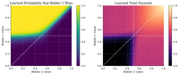](game-theory/deep-optimal-auctions/figures/learned-mechanism.png) | **[Deep Learning for Optimal Auction Design](game-theory/deep-optimal-auctions/)** | A revenue-maximizing auction is hard to characterize analytically for general bidder distributions. A neural network learns the mechanism by minimizing regret-penalized revenue loss, verified against Myerson's reserve-price benchmark. |
| [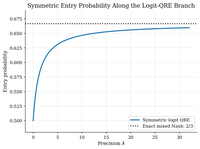](game-theory/quantal-response-equilibrium/figures/qre-path.png) | **[Market Entry with Quantal Response Equilibrium](game-theory/quantal-response-equilibrium/)** | Two firms decide whether to enter a small market, but neither plays a deterministic best response. Logit quantal response equilibrium (QRE) models the noisy entry decision and traces how equilibrium sharpens as rationality increases. |

## Time Series

These tutorials cover stochastic processes, macroeconomic data, and forecasting.

| Preview | Tutorial | Description |
|---|---|---|
| [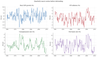](time-series/fred-macro-data/figures/time-series.png) | **[Business-Cycle Moments from a FRED-Style Macro Panel](time-series/fred-macro-data/)** | GDP, inflation, unemployment, and a policy rate share a recurring business cycle. Hodrick-Prescott filtering extracts cycles, measures comovement, and recovers an Okun slope. |
| [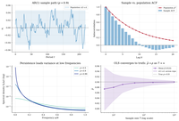](time-series/ar-processes/figures/ar1-irfs.png) | **[Fiscal-Shock Persistence and Income Dynamics](time-series/ar-processes/)** | A single spending shock reverberates through income when households re-spend each round. AR(1) impulse responses and multiplier-accelerator recursions trace how persistence shapes the full income path. |
| [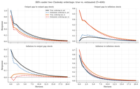](time-series/reduced-form-var/figures/irf-by-ordering.png) | **[Reduced-Form VARs and Cholesky Impulse Responses](time-series/reduced-form-var/)** | A bivariate VAR captures joint dynamics of output and prices, but shock identification requires an ordering assumption. Ordinary least squares estimation with Cholesky decomposition delivers impulse responses that differ across orderings. |
| [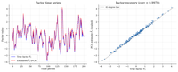](time-series/stock-watson/figures/factor-comparison.png) | **[Macro Forecasting with Stock-Watson Diffusion Indexes](time-series/stock-watson/)** | Industrial production is hard to forecast from any single indicator, but a latent common factor helps. Principal components analysis (PCA) extracts a diffusion index that beats an autoregressive baseline in expanding-window evaluation. |
| [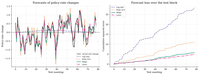](time-series/ridge-lasso-sparsity/figures/forecast-comparison.png) | **[Policy Forecasting with Ridge, Lasso, and Sparsity](time-series/ridge-lasso-sparsity/)** | Identifying monetary policy shocks requires separating anticipated from surprise rate changes. Ridge regression shrinks all coefficients uniformly while lasso selects a sparse predictor set, delivering different shock estimates. |

## Agent-Based Models

These tutorials simulate local behavior and market institutions, then compare the aggregate outcome with an economic benchmark.

| Preview | Tutorial | Description |
|---|---|---|
| [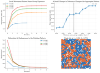](agent-based-models/schelling-segregation/figures/phase-transition.png) | **[Schelling Segregation on a Checkerboard](agent-based-models/schelling-segregation/)** | Local tolerance rules can sort a city into segregated neighborhoods without any planner or global objective. An agent-based simulation on a 50 x 50 checkerboard tracks how the segregation index rises as neighborhood tolerance tightens. |
| [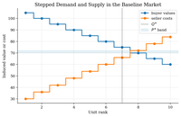](agent-based-models/zero-intelligence-traders/figures/demand-supply-schedule.png) | **[Zero-Intelligence Traders in a Double Auction](agent-based-models/zero-intelligence-traders/)** | Budget-constrained traders who bid randomly still recover most available surplus in a double auction. Zero-intelligence simulation shows ZIC is already near-efficient and ZIP (profit-seeking) mainly narrows price dispersion. |
| [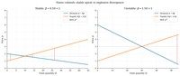](agent-based-models/cobweb-arifovic-ga-learning/figures/price-paths.png) | **[Cobweb Markets and Arifovic Genetic-Algorithm Learning](agent-based-models/cobweb-arifovic-ga-learning/)** | Firms encode production quantities as binary chromosomes and compete in a cobweb market where naive expectations produce cycles. Genetic-algorithm learning with Arifovic's election operator drives the population to rational expectations. |
| [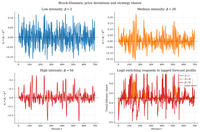](agent-based-models/brock-hommes-asset-pricing/figures/price-paths.png) | **[Brock-Hommes Asset Pricing with Strategy Switching](agent-based-models/brock-hommes-asset-pricing/)** | Asset prices deviate from fundamentals when traders switch between chartist and fundamentalist rules by profitability. Logit strategy switching and SMM calibration recover the switching parameter from simulated return moments. |
| [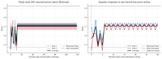](agent-based-models/algorithmic-collusion-q-learning/figures/price-paths.png) | **[Algorithmic Collusion by Q-Learning](agent-based-models/algorithmic-collusion-q-learning/)** | Two algorithmic pricing agents in repeated Bertrand competition learn supra-competitive prices without explicit coordination. Q-learning drives prices above the Nash benchmark, and agents respond to a forced deviation like a price war. |

## Selected External Resources

### Core Computational Economics

- [QuantEcon](https://github.com/QuantEcon)
- [John Stachurski GitHub](https://github.com/jstac)
- [OpenSourceEcon CompMethods](https://github.com/OpenSourceEcon/CompMethods)
- [OpenSourceEconomics](https://github.com/OpenSourceEconomics)
- [CompEcon (Iskhakov)](https://github.com/fediskhakov/CompEcon)
- [Sciences Po CompEcon CoursePack](https://github.com/ScPo-CompEcon/CoursePack)
- [EconRL](https://github.com/SimonHashtag/EconRL)

### Heterogeneous-Agent & HANK Models

- [Sequence-Jacobian](https://github.com/shade-econ/sequence-jacobian)
- [Rognlie ECON 411-3](https://github.com/mrognlie/econ411-3)
- [HARK](https://github.com/econ-ark/HARK)
- [Benjamin Moll Codes](https://benjaminmoll.com/codes/)
- [Quantitative Macro Models](https://github.com/hessjacob/Quantitative-Macro-Models)
- [BASEforHANK](https://github.com/BASEforHANK)

### Empirical IO & Structural Estimation

- [PyBLP](https://github.com/jeffgortmaker/pyblp)
- [Chris Conlon Grad IO](https://github.com/chrisconlon/Grad-IO)
- [Courthoud PhD Industrial Organization](https://github.com/matteocourthoud/Phd-Industrial-Organization)
- [respy](https://github.com/OpenSourceEconomics/respy)
- [Dynamic Structural Econometrics (DSE 2023)](https://github.com/dseconf/DSE2023)]
- [Kenneth Train Software](https://eml.berkeley.edu/~train/software.html)
- [Victor Aguirregabiria Computer Code](https://sites.google.com/view/victoraguirregabiriaswebsite/computer-code?authuser=0)
- [EmpiricalIO](https://github.com/kohei-kawaguchi/EmpiricalIO)
- [Archive of Empirical Dynamic Programming Research](https://github.com/CForg/Archive-of-Empirical-Dynamic-Programming-Research)

### DSGE, Dynamics, and Filtering

- [New York Fed DSGE.jl](https://github.com/FRBNY-DSGE/DSGE.jl)
- [Global DGSE Solver](https://github.com/gdsge/gdsge)
- [DSGE_mod](https://github.com/JohannesPfeifer/DSGE_mod)
- [DynamicalSystems.jl](https://github.com/JuliaDynamics/DynamicalSystems.jl)
- [Kalman and Bayesian Filters in Python](https://github.com/rlabbe/Kalman-and-Bayesian-Filters-in-Python)
