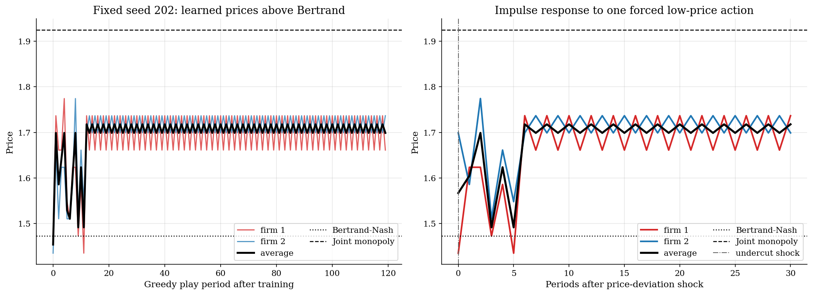
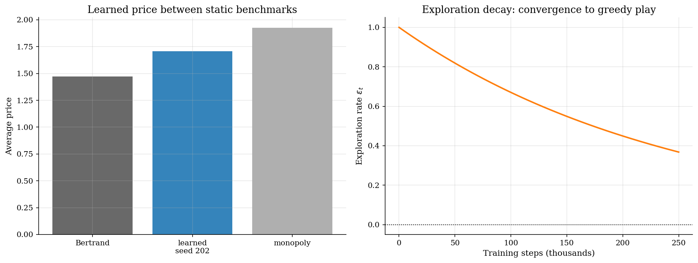

# Algorithmic Collusion by Q-Learning

## Overview

In Aiyagari (1994) and in most macro models, firms solve a well-specified optimization problem. Calvano, Calzolari, Denicolo, and Pastorello (2020) document a different possibility: pricing algorithms that never solve the game can still learn to coordinate above the Bertrand benchmark. The gap in the literature was the absence of a tractable model that connects machine learning to oligopoly theory. Tabular Q-learning fills that gap because it requires no game-theoretic reasoning, only repeated observations of own profit.

Two firms choose prices again and again. They do not solve the dynamic game. They only observe the profit from the price they chose and update a table of action values.

The economic question is whether this feedback can move prices above the static *Bertrand-Nash* benchmark. In a one-shot differentiated-products Bertrand game, each firm sets a price that is a best response to the rival's price. Joint monopoly gives the upper benchmark because one owner would internalize substitution between the two products.

This tutorial is deliberately smaller than the Calvano et al. experiment and the Courthoud replication code. It keeps the same model class and moves the main hyperparameters toward the Courthoud replication defaults: logit demand, a finite price grid, Courthoud's exponential exploration rule, and independent tabular Q-learning. The page follows one compact calibrated run with seed 202. It is not a robustness exercise.

## Read before

- [Stochastic optimal growth by Q-learning](../../dynamic-programming/q-learning-growth/README.md)
- [Optimal growth model](../../dynamic-programming/optimal-growth/README.md)
- [Shock discretization with Rouwenhorst](../../dynamic-programming/shock-discretization/README.md)

## Equations

There are two firms, indexed by $`i = 1,2`$. Firm $`i`$ chooses price $`p_i`$ and has
constant marginal cost $`c`$. Product quality is $`a`$, the outside-option value is
$`a_0`$, and $`\mu`$ controls product differentiation. The *inside utility index* is

```math
u_i = \frac{\lbrace a - p_i\rbrace}{\lbrace\mu\rbrace}, \qquad u_0 = \frac{\lbrace a_0\rbrace}{\lbrace\mu\rbrace}.
```

The braces mark the numerator and denominator of each utility index. A lower
price raises $`u_i`$; a larger $`\mu`$ makes a given price difference matter less.
Logit demand is

```math
s_i(p) = \frac{\exp(u_i)}{\exp(u_0) + \sum_{j=1}^2 \exp(u_j)}.
```

The numerator is product $`i`$'s exponentiated utility. The denominator is the
outside-good term plus the exponentiated utilities of the two inside goods.

Current profit is

```math
\pi_i(p) = (p_i - c)s_i(p).
```

The own-price derivative of the logit share is

```math
\frac{\partial s_i}{\partial p_i} = -\frac{s_i(p)(1-s_i(p))}{\mu}.
```

The static Bertrand-Nash price sets $`\partial \pi_i / \partial p_i = 0`$:

```math
\frac{\partial \pi_i}{\partial p_i} = s_i(p) + (p_i-c)\frac{\partial s_i}{\partial p_i} = s_i(p)[1 - \frac{(p_i-c)(1-s_i(p))}{\mu}] = 0.
```

Since $`s_i(p)>0`$, the Bertrand first-order condition is

```math
1 - \frac{(p_i - c)(1 - s_i(p))}{\mu} = 0.
```

The joint monopolist maximizes $`\Pi(p)=\pi_1(p)+\pi_2(p)`$. Its condition for
product $`i`$ keeps the Bertrand own-profit term and adds the cross-product term:

```math
1 - \frac{(p_i - c)(1 - s_i(p))}{\mu} + \frac{(p_j - c)s_j(p)}{\mu} = 0,\quad j \ne i.
```

The price grid uses the static benchmarks. Let $`p_B`$ be the Bertrand price,
$`p_M`$ be the monopoly price, and $`\Delta`$ be the grid step. The action set is

```math
\mathcal{P} = \lbrace p_B-\Delta\rbrace \cup \lbrace p_B, p_B+\Delta,\dots,p_M\rbrace \cup \lbrace p_M+\Delta\rbrace.
```

The Q-learning state is the previous-period price-index pair
$`s_t = (a_{1,t-1}, a_{2,t-1})`$ (here $`s_t`$ is the Q-learning state pair, distinct from the demand share $`s_i(p)`$ defined above). Firm $`i`$'s action is its current price-grid
index $`a_{i,t}`$ (where $`a_{i,t}`$ is a price-grid index, not the product quality parameter $`a`$ defined above). After observing current profit and next state $`s_{t+1}`$,
the tabular update is

```math
Q_i(s_t, a_{i,t}) \leftarrow (1-\alpha) Q_i(s_t, a_{i,t}) + \alpha [\pi_i(p_t) + \delta \max_a Q_i(s_{t+1}, a)].
```

The reported collusion index is

```math
\mathrm{CI} = \frac{\bar p_{\mathrm{learned}} - p_{\mathrm{Bertrand}}}{p_{\mathrm{Monopoly}} - p_{\mathrm{Bertrand}}}.
```

## Worked Numerical Example

Run one Q-update on a 2-action toy slice of the calibrated model to see how the collusive incentive enters before the algorithm has learned anything. The object being updated is the *Q-table*, one entry per state-action pair. Use the README parameters $`a = 2`$, $`a_0 = 0`$, $`\mu = 0.25`$, $`c = 1`$, $`\alpha = 0.15`$, $`\delta = 0.95`$. Restrict each firm to two prices, the Bertrand benchmark and the monopoly benchmark, $`\mathcal{P} = \{1.473, 1.925\}`$. The state is the previous price-index pair, so there are four states; initialise $`Q_i(s, a) = 0`$ everywhere.

Suppose the previous state is $`s_t = (1.473, 1.473)`$ (both at Bertrand) and the firms now play $`a_{1,t} = 1.925`$ (firm 1 deviates upward to the monopoly price) and $`a_{2,t} = 1.473`$ (firm 2 stays at Bertrand). Inside utilities are $`u_1 = (2 - 1.925)/0.25 = 0.300`$ and $`u_2 = (2 - 1.473)/0.25 = 2.108`$, with outside utility $`u_0 = 0`$. Exponentiating gives $`e^{u_1} = 1.350`$, $`e^{u_2} = 8.230`$, $`e^{u_0} = 1`$, so the logit denominator is $`D = 1 + 1.350 + 8.230 = 10.580`$.

Shares and current profits are

```math
s_1 = \frac{1.350}{10.580} = 0.1276, \qquad s_2 = \frac{8.230}{10.580} = 0.7778,
```

```math
\pi_1 = (1.925 - 1)(0.1276) = 0.1181, \qquad \pi_2 = (1.473 - 1)(0.7778) = 0.3679.
```

The next state is $`s_{t+1} = (1.925, 1.473)`$. Every Q-entry is still zero, so $`\max_a Q_1(s_{t+1}, a) = 0`$. The firm-1 update is

```math
Q_1\bigl((1.473, 1.473), 1.925\bigr) \leftarrow 0.85 \cdot 0 + 0.15 \cdot [0.1181 + 0.95 \cdot 0] = \boxed{0.01772}.
```

Firm 1 earns less this period than firm 2 because undercutting still pays in a static stage game ($`\pi_2 > \pi_1`$), but the Q-table now scores the higher price with a positive value where everything else is still zero. Repeated updates back nonzero continuation values into $`Q_1`$ from states where the rival also prices high, and the greedy action drifts toward the monopoly side of the grid. That is the mechanism the full 250,000-step run amplifies into the collusion index of 0.52 reported below.

## Model Setup

The grid is centered on the static economic benchmarks. First solve the Bertrand-Nash and joint-monopoly first-order conditions. Then form 13 evenly spaced prices spanning from the Bertrand to the monopoly benchmark with both endpoints included, and add one *padding point* below and above. The padding point below Bertrand is the one-period undercut in the impulse-response diagnostic.

| Object | Value | Role | Details |
|---|---:|---|---|
| Firms $`n`$ | 2 | Symmetric sellers | Independent learners |
| Product value $`a`$ | 2.00 | Inside-good quality | Logit numerator |
| Outside value $`a_0`$ | 0.00 | Outside option utility | Denominator term |
| Differentiation $`\mu`$ | 0.25 | Substitutability | Smaller = closer substitutes |
| Marginal cost $`c`$ | 1.00 | Constant cost | Symmetric firms |
| Bertrand price | 1.473 | Static competitive benchmark | Lower grid anchor |
| Monopoly price | 1.925 | Joint-profit benchmark | Upper grid anchor |
| Price grid size | 15 | Discrete action count | Includes two padding points |
| Training steps | 250,000 | Q-learning updates | Fixed compact budget |
| Discount factor $`\delta`$ | 0.95 | Future profit weight | Standard value |
| Learning rate $`\alpha`$ | 0.15 | Q-table update weight | Courthoud default |
| Exploration decay $`\beta`$ | 4e-06 | $`\Pr(\text{explore})=\exp(-\beta t)`$ | Exponential schedule |
| Training seed | 202 | Fixed calibrated run | One illustrative path |

These are replication-style hyperparameters, but the computational budget is intentionally compact. The page reports one fixed run rather than a multi-seed robustness table.

## Solution Method

The algorithm is *independent Q-learning*. Each firm treats the rival and the market state as part of the environment. There is no explicit collusion constraint and no direct communication.

```
          N firms, Q tables (optimistic init), price grid, T episodes
                              |
                              v
    +---------- multi-agent Q-learning loop ----------+
    |  (s, a_1, a_2) --> [ env step ] --> (r, s')     |
    |  (r, s') --> [ Q update each firm ] --> Q        |
    +-------- episodes remain: repeat ----------------+
                              |
                        budget exhausted
                              v
                    Q*(s, a), greedy pricing rules
```

The exploration rate decays exponentially as $`\epsilon_t = \exp(-\beta t)`$, so early training explores the full price grid and late training exploits the learned Q-values. The impulse response applies the frozen policy after a single forced undercut.

## Results

*Greedy play* after training is above the Bertrand price in the fixed seed 202 run. The learned path does not reach the monopoly benchmark. It sits in the middle of the benchmark interval, which is enough for the teaching point: independent profit feedback can support supra-Bertrand prices in a repeated pricing environment.

Prose above refers to the left panel. The right panel shows the impulse response: after a one-period forced undercut at period 0, the greedy policy returns to near its pre-shock level within two periods.



In the fixed seed 202 run, the learned average price is 1.708. The collusion index is 0.52, so the greedy policy sits about halfway between the Bertrand and monopoly benchmarks. After the one-period price-deviation shock, the lowest post-shock average price is 1.492; the path returns to 95 percent of its pre-shock level after 2 periods. The single run shows how the frozen policy reacts after one forced undercut, but it does not establish robust price-war discipline.

The left panel below puts the learned price between the static benchmarks. The right panel shows the exploration rate, which decays to near zero by step 250,000 and confirms that the greedy policy is effectively frozen at the end of training.



The Bertrand and monopoly prices are solved from the continuous-price first-order conditions before the finite action grid is built.

### Static benchmark summary

| Statistic | Value | Statistic | Value |
|---|---:|---|---:|
| Bertrand price | 1.47293 | Monopoly price | 1.92498 |
| Competitive profit | 0.222927 | Monopoly profit | 0.33749 |
| Price grid size | 15 | Training steps | 250,000 |

A recovery horizon of -1 means the average price did not return to 95 percent of the pre-shock price within the plotted impulse-response window.

### Single-run Q-learning outcomes

| Statistic | Value | Statistic | Value |
|---|---:|---|---:|
| Seed | 202 | Collusion index | 0.521 |
| Learned average price | 1.708 | Learned profit | 0.305 |
| Pre-shock average price | 1.708 | Min post-shock price | 1.492 |
| Recovery horizon (periods) | 2 | | |

## Takeaway

*Algorithmic coordination* emerges without communication or strategic reasoning. Q-learning pricing agents learn supra-Bertrand prices purely from repeated profit signals, which is the central surprise in Calvano et al. (2020). The impulse response is more qualified. It shows the reaction of one frozen learned policy to one forced undercut. That distinction matters: supra-Bertrand learning appears clearly here; robust collusive discipline would require a larger and more careful replication. The framework anchors a growing literature on AI regulation and algorithmic antitrust, where the question is not whether algorithms collude intentionally but whether profit feedback alone is sufficient.

## See also

- [Stochastic optimal growth by Q-learning](../../dynamic-programming/q-learning-growth/README.md)
- [Aiyagari saving and capital-market clearing](../../dynamic-programming/aiyagari/README.md)
- [Deep Q-network (Atari)](../../reinforcement-learning/dqn-atari/README.md)

## References

- [Calvano, E., Calzolari, G., Denicolo, V., and Pastorello, S. (2020). Artificial Intelligence, Algorithmic Pricing, and Collusion. *American Economic Review*, 110(10), 3267-3297.](https://www.aeaweb.org/articles?id=10.1257/aer.20190623)
- [Matteo Courthoud. Algorithmic Collusion Replication. GitHub repository.](https://github.com/matteocourthoud/Algorithmic-Collusion-Replication)
