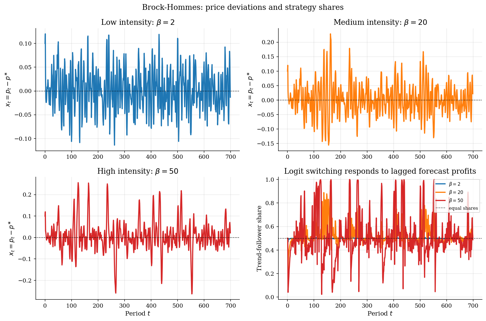
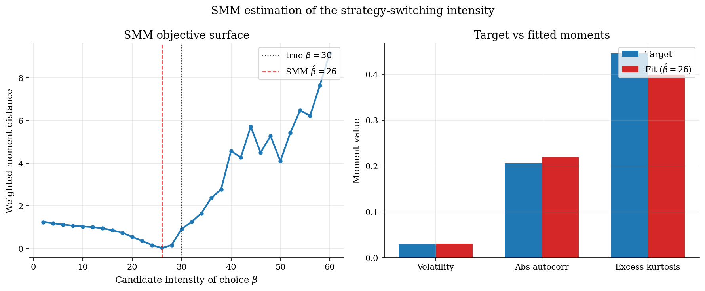

# Brock-Hommes Asset Pricing with Strategy Switching

## Overview

Standard asset pricing assumes all investors share the same rational belief. Brock and Hommes (1998) asked what happens when traders choose among competing forecasting rules based on past profits. The gap the paper filled was a missing endogenous belief-switching mechanism: earlier heterogeneous-belief models fixed shares exogenously.

The object of interest is a *price deviation* from the rational-expectations fundamental, driven by logit switching between fundamentalist and trend-following rules. When trend followers earn high recent profits, more traders adopt their rule. The amplification can make volatility persistent and create bubble-like departures.

The simulation compares low, medium, and high intensity of choice. A small SMM exercise then estimates the switching intensity from simulated return moments.

## Read before

- [Rational expectations asset pricing](../../asset-pricing/lucas-tree/README.md)
- [Logit discrete choice](../../structural-econometrics/logit-discrete-choice/README.md)
- [SMM estimation](../../structural-econometrics/gmm-foundations/README.md)

## Equations

The risky asset pays a constant dividend $`d`$. The gross risk-free return is $`R = 1+r`$. Let $`p_t`$ be the risky asset price and let $`p^{\ast}`$ be the constant fundamental price. Let $`x_t = p_t - p^{\ast}`$ be the deviation from that fundamental. The two forecasting rules are fundamentalist ($`F`$) and trend follower ($`T`$). Rule $`h`$ has forecast $`f_{h,t}`$, share $`n_{h,t}`$, smoothed score $`U_{h,t}`$, profit score $`\pi_{h,t}`$, and cost $`c_h`$. The shock $`\epsilon_t`$ is noise-trader supply.

If dividends are constant and all traders expect the same future price, the no-arbitrage price is constant. It equals the present value of the dividend stream:

```math
p^{\ast} = \frac{d}{R-1}.
```

The model studies deviations from that benchmark. A positive $`x_t`$ means the asset is priced above the dividend fundamental. A negative $`x_t`$ means it is priced below it.

*Fundamentalists* forecast that the deviation will disappear:

```math
f_{F,t} = 0.
```

Trend followers forecast that recent price movements will continue. The raw trend forecast is

```math
\tilde f_{T,t} = x_{t-1} + g(x_{t-1} - x_{t-2}).
```

The hyperbolic tangent bounds it by $`\bar x`$, keeping bubbles finite:

```math
f_{T,t} = \bar x \tanh(\tilde f_{T,t} / \bar x).
```

Market clearing sets today's deviation equal to a weighted average of beliefs, scaled by the risk-free return, plus noise-trader supply:

```math
x_t = \frac{n_{F,t-1} f_{F,t} + n_{T,t-1} f_{T,t}}{R} + \epsilon_t.
```

The realized excess return in deviation form is $`e_t = x_t - R x_{t-1}`$. Rule $`h`$ forecasted excess return $`f_{h,t} - R x_{t-1}`$. A rule earns a high profit score when its forecasted position has the same sign as the realized excess return:

```math
\pi_{h,t} = \frac{e_t (f_{h,t} - R x_{t-1})}{a\sigma^2} - c_h.
```

Here $`a > 0`$ is the coefficient of absolute risk aversion and $`\sigma^2`$ is the variance of excess returns. The model calibrates $`a\sigma^2`$ as a single combined risk-scaling constant.

Scores are smoothed over time,

```math
U_{h,t} = \lambda U_{h,t-1} + (1-\lambda)\pi_{h,t}.
```

Next-period rule shares follow logit choice:

```math
n_{h,t} = \frac{\exp(\beta U_{h,t})}{\exp(\beta U_{F,t}) + \exp(\beta U_{T,t})}.
```

The parameter $`\beta`$ is the intensity of choice. As $`\beta \to 0`$, shares stay near one half. As $`\beta`$ rises, small score gaps produce large reallocations across forecasting rules.

## Worked Numerical Example

*Strategy switching* is easiest to read after one full update of forecasts, market clearing, profit scoring, and logit reallocation. Use the calibration in Model Setup with intensity $`\beta = 50`$, start from equal shares $`n_{F} = n_{T} = 0.5`$ and zero past scores $`U_{F} = U_{T} = 0`$, and set $`x_{t-2} = 0.10`$, $`x_{t-1} = 0.20`$, $`\epsilon_t = 0`$.

The untruncated trend forecast is

```math
\tilde f_{T,t} = x_{t-1} + g(x_{t-1} - x_{t-2}) = 0.20 + 1.40 \cdot 0.10 = 0.34.
```

Bounding by $`\bar x = 0.35`$ via $`\tanh`$:

```math
f_{T,t} = 0.35 \cdot \tanh(0.34 / 0.35) = 0.35 \cdot \tanh(0.9714) = 0.35 \cdot 0.7494 = 0.2623.
```

The fundamentalist forecast is $`f_{F,t} = 0`$. Market clearing at $`R = 1.01`$ delivers

```math
x_t = \frac{0.5 \cdot 0 + 0.5 \cdot 0.2623}{1.01} = \frac{0.1311}{1.01} = 0.1299.
```

The realized excess return in deviation form is

```math
e_t = x_t - R x_{t-1} = 0.1299 - 1.01 \cdot 0.20 = -0.0721.
```

Each rule's forecasted excess-return position is $`f_{h,t} - R x_{t-1}`$. For fundamentalists that position is $`-0.2020`$ and for trend followers it is $`0.0603`$. Profit scores with $`a\sigma^2 = 0.04`$, $`c_F = 0`$, $`c_T = 0.001`$ are

```math
\pi_{F,t} = \frac{(-0.0721)(-0.2020)}{0.04} - 0 = 0.3643,
```

```math
\pi_{T,t} = \frac{(-0.0721)(0.0603)}{0.04} - 0.001 = -0.1098.
```

Smoothing with $`\lambda = 0.80`$ and $`U_{h,t-1} = 0`$ gives $`U_{F,t} = 0.0729`$ and $`U_{T,t} = -0.0220`$. Logit choice with $`\beta = 50`$ yields $`\beta U_{F,t} = 3.643`$ and $`\beta U_{T,t} = -1.098`$. Therefore $`\exp(\beta U_{F,t}) = 38.19`$ and $`\exp(\beta U_{T,t}) = 0.334`$. New shares are

```math
n_{F,t} = \frac{38.19}{38.19 + 0.334} = 0.9913,
```

```math
n_{T,t} = \frac{0.334}{38.19 + 0.334} = 0.0087.
```

The realized $`x_t = 0.130`$ fell below $`R x_{t-1} = 0.202`$, so the asset earned a negative excess return. The fundamentalist's short position ($`f_{F,t} - R x_{t-1} = -0.202`$) matched that sign and the trend follower's positive position did not. Logit choice reallocates almost entirely to fundamentalists in one step. High $`\beta`$ turns the small score gap $`U_{F,t} - U_{T,t} \approx 0.095`$ into a near-corner share split. Lowering $`\beta`$ to 2 would leave $`n_{F,t} \approx 0.55`$ and keep the market closer to fifty-fifty.

## Model Setup

| Parameter | Value | Parameter | Value |
|---|---:|---|---:|
| Gross risk-free return $`R`$ | 1.01 | Trend gain $`g`$ | 1.40 |
| Dividend $`d`$ | 0.20 | Forecast bound $`\bar x`$ | 0.35 |
| Fundamental price $`p^{\ast}`$ | 20.00 | Shock scale $`\sigma_\epsilon`$ | 0.02 |
| Score memory $`\lambda`$ | 0.80 | Risk scale $`a\sigma^2`$ | 0.04 |
| Fundamentalist cost $`c_F`$ | 0.000 | Trend cost $`c_T`$ | 0.001 |
| Initial deviation lag $`x_0`$ | 0.10 | Initial deviation $`x_1`$ | 0.12 |
| Simulation horizon $`T_{sim}`$ | 700 | Burn-in $`T_0`$ | 100 |

The plotted intensity values are $`\beta = 2`$, $`\beta = 20`$, and $`\beta = 50`$. The SMM exercise sets the true value to $`\beta_0 = 30`$ and searches over even candidates from 2 to 60.

## Solution Method

The solution is simulation plus a moment-matching outer loop. There is no representative-agent Euler equation after beliefs become endogenous. Today's shares are state variables created by past forecast profits.

```
    H trader types, beta, R, T periods
                    |
                    v
    +---------- simulation loop ----------+
    |                                     |
    |  x_t, n_t --> [ price update ] --> x_{t+1}    |
    |  x_{t+1} --> [ profit scoring ] --> pi_{h,t}  |
    |  pi_{h,t} --> [ score smoothing ] --> U_{h,t} |
    |  U_{h,t} --> [ logit DMS ] --> n_{t+1}        |
    |                                     |
    +---------- t < T: repeat -----------+
                    |
                  done
                    v
              price path, share path
                    |
                    v
    +------ SMM outer loop (grid over beta) ------+
    |                                              |
    |  beta --> [ simulate ] --> moment vector     |
    |  moment vector --> [ distance ] --> Q(beta)  |
    |                                              |
    +------ all candidates evaluated ------------+
                    |
                    v
              beta_hat (argmin Q)
```

```python
# Simulation: for each t, update price, profit, score, and shares.
def simulate(beta, params, shocks):
    for t in range(2, params.periods):
        f_T = params.xbar * np.tanh(
            (x[t-1] + params.g * (x[t-1] - x[t-2])) / params.xbar
        )
        # market clearing: x_t = (n_F f_F + n_T f_T) / R + epsilon_t
        x[t] = (n[t-1, 0] * 0.0 + n[t-1, 1] * f_T) / params.R + shocks[t]
        e = x[t] - params.R * x[t-1]
        # profit: pi_h = e * (f_h - R x_{t-1}) / (a sigma^2) - c_h
        pi = e * (forecasts - params.R * x[t-1]) / params.asigma2 - params.costs
        U[t] = params.lam * U[t-1] + (1 - params.lam) * pi
        # logit DMS: n_h = exp(beta U_h) / sum_j exp(beta U_j)
        n[t] = np.exp(beta * U[t]) / np.exp(beta * U[t]).sum()
```

The simulation runs in one pass. The SMM grid evaluates every candidate intensity on a shared shock bank to isolate the switching effect from Monte Carlo noise.

## Results

With low intensity, deviations are short-lived and remain close to zero. At medium intensity, trend followers gain share after profitable runs. Deviations last longer. At high intensity, the rule that just earned profits briefly dominates the market. Reversal profits then pull agents back toward fundamentalists, creating bubble-like departures and returns. The share plot shows this channel directly. Low intensity keeps the trend-follower share near one half. High intensity turns small score gaps into near-corner allocations.



The SMM block treats a simulated high-switching economy as pseudo-data. It matches volatility, autocorrelation of absolute returns, and excess kurtosis of price-deviation returns. The left panel shows the objective surface over candidate intensities. The right panel compares target and fitted moments at the selected intensity.



### SMM fit diagnostics

| Quantity | Target | Quantity | Fit |
|---|---:|---|---:|
| Intensity $`\beta`$ (true) | 30 | Intensity $`\hat\beta`$ (estimated) | 26 |
| Volatility (target) | 0.0295 | Volatility (fit) | 0.0310 |
| Abs return autocorr (target) | 0.206 | Abs return autocorr (fit) | 0.219 |
| Excess kurtosis (target) | 0.445 | Excess kurtosis (fit) | 0.398 |

## Takeaway

*Realized-profit switching* turns logit choice from a static demand formula into an endogenous source of market instability. The rational-expectations fundamental remains a valid steady state, but high switching intensity makes it locally fragile. The route to instability depends on the belief types. Trend chasers generate pitchfork bifurcations, contrarians generate period-doubling, and opposite biased predictors generate Hopf-style fluctuations. The framework became the reference model for heterogeneous-agent asset pricing and agent-based finance.

## See also

- [Herd behavior and information cascades](../../information/herd-behavior/README.md)
- [Heterogeneous agent HANK model](../../heterogeneous-agents/sequence-space-jacobian-hank/README.md)
- [Calibration via SMM](../../structural-econometrics/smm-calibration/README.md)

## References

- Brock, W. A., and Hommes, C. H. (1998). Heterogeneous beliefs and routes to chaos in a simple asset pricing model. *Journal of Economic Dynamics and Control*, 22(8-9), 1235-1274.
- Hommes, C. H. (2006). Heterogeneous agent models in economics and finance. *Handbook of Computational Economics*, 2, 1109-1186.
- Brock, W. A., and Hommes, C. H. (1997). A rational route to randomness. *Econometrica*, 65(5), 1059-1095.
