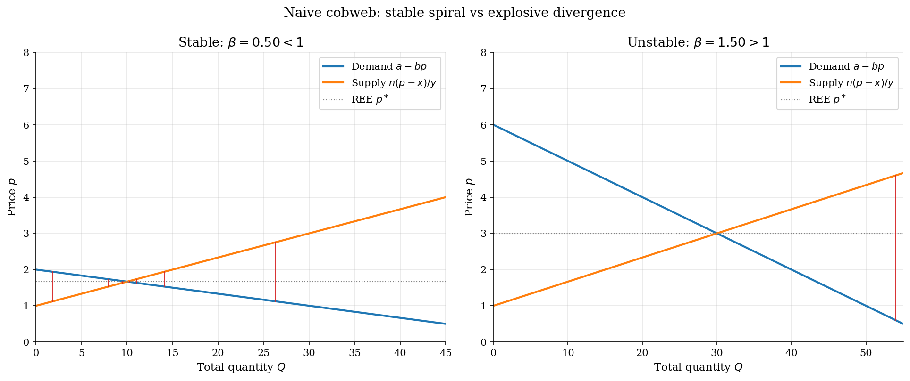
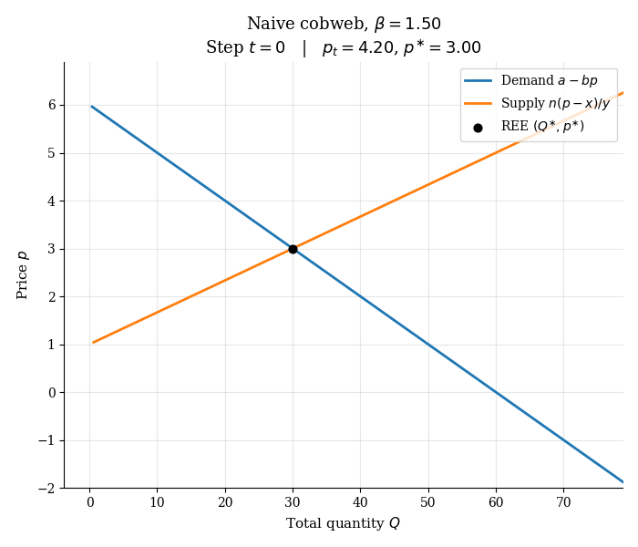
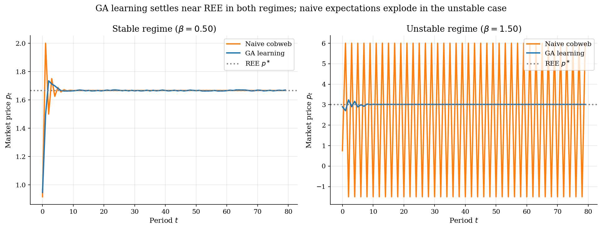
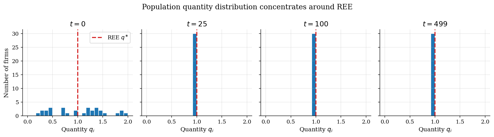
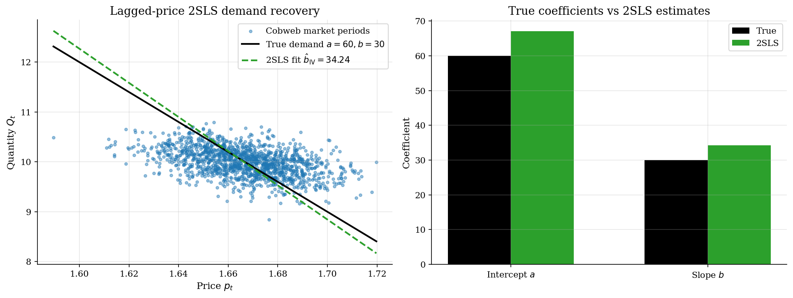

# Cobweb Markets and Arifovic Genetic-Algorithm Learning

## Overview

Strawberries take a season to grow. Farmers must decide how much to plant before the price is known, and many of them have to make that choice at the same time. The classical cobweb model puts a linear demand on top of a linear supply curve and assumes farmers expect the next price to equal the last one.

When supply is more elastic than demand, this naive feedback loop is unstable. Each year overshoots the rational-expectations price by a larger amount and the market explodes. Arifovic (1994) asked whether a population of boundedly rational farmers, learning by genetic operators on binary production rules, could nevertheless settle on the rational price. The gap in the literature was the absence of any mechanism that could rescue convergence in the explosive regime without imposing rational expectations. The GA with an election operator fills that gap.

This tutorial reproduces the headline result. We solve for the REE in closed form, simulate naive cobweb dynamics in a stable and an unstable regime, run Arifovic's GA on the same parameters, and finally take a noisy cobweb price series and recover the true demand curve via lagged-price IV.

## Read before

- [Consumption-savings under income risk](../../dynamic-programming/consumption-savings/README.md)
- [Cobweb model and rational expectations](../../dynamic-programming/optimal-growth/README.md)
- [Q-learning and policy improvement](../../dynamic-programming/q-learning-growth/README.md)

## Equations

| Symbol | What it means | Symbol | What it means |
|---|---|---|---|
| $`t`$ | Period index. One season. | $`i`$ | Firm index, $`1`$ to $`n`$. |
| $`p_t`$ | Market price in period $`t`$. | $`q_{i,t}`$ | Quantity firm $`i`$ plants for period $`t`$. |
| $`Q_t`$ | Total market quantity, $`\sum_i q_{i,t}`$. | $`\pi_{i,t}`$ | Firm $`i`$'s realized profit after clearing. |
| $`\sigma(i)`$ | Tournament-selected parent index at slot $`i`$. | $`a`$ | Demand intercept (choke price). |
| $`b`$ | Demand slope. | $`\varepsilon_t`$ | i.i.d. demand shock, mean zero. |
| $`x`$ | Marginal-cost intercept. | $`y`$ | Marginal-cost slope. |
| $`n`$ | Number of firms. | $`L`$ | Chromosome length in bits. |
| $`N`$ | GA population size, equal to $`n`$. | $`T`$ | Number of GA generations. |
| $`p_c`$ | Per-pair crossover probability. | $`p_m`$ | Per-bit mutation probability. |

Per-firm cost is quadratic in own quantity: $`C(q) = x q + \tfrac{y}{2} q^{2}`$.

*Inverse demand with shock.* Market clearing gives

```math
p_t = \frac{1}{b}\Big(\underbrace{a}_{\text{choke price}} + \underbrace{\varepsilon_t}_{\text{i.i.d. demand shock}} - \underbrace{Q_t}_{\text{aggregate quantity}}\Big).
```

Firm $`i`$ forms a price expectation $`p_{i,t}^{e}`$ before producing, then sets $`q_{i,t}`$ to maximize expected profit. The first-order condition gives the price-taking supply rule

```math
q_{i,t} = \frac{p_{i,t}^{e} - x}{y}.
```

Plugging $`p_{i,t}^{e} = p_{t-1}`$ into the supply rule for every firm and substituting into inverse demand gives a one-step recursion in price:

```math
p_t = \underbrace{\alpha}_{\text{intercept}} - \underbrace{\beta}_{\text{slope ratio}} \cdot p_{t-1}, \qquad \alpha = \frac{a y + n x}{b y}, \quad \beta = \frac{n}{b y}.
```

The fixed point of this recursion is the rational-expectations equilibrium

```math
p^{\ast} = \frac{a y + n x}{b y + n}, \qquad q^{\ast} = \frac{p^{\ast} - x}{y}.
```

The naive cobweb converges to $`p^{\ast}`$ when $`\beta < 1`$ and explodes when $`\beta > 1`$.

Each firm carries a length-$`L`$ binary string $`b_i \in \lbrace0,1\rbrace^{L}`$ that decodes deterministically to a quantity in the bracket $`[q_\min, q_\max]`$. The population size equals the number of firms in the market, $`N = n`$, so each chromosome is one firm's production plan in the current period.

The realized profit at the cleared price $`p_t`$ is

```math
\pi_{i,t} = \underbrace{p_t \cdot q_{i,t}}_{\text{revenue}} - \underbrace{x \cdot q_{i,t}}_{\text{linear cost}} - \underbrace{\tfrac{y}{2} q_{i,t}^{2}}_{\text{convex cost}}.
```

Let $`\mathbf{B}_t = (b_{1,t}, \ldots, b_{n,t})`$ be the population of chromosomes at the start of period $`t`$. One generation executes:

```math
\begin{aligned}
\text{(1) Decode} \quad & q_{i,t} = \mathrm{decode}(b_{i,t}). \\
\text{(2) Clear} \quad & Q_t = \sum_{i=1}^{n} q_{i,t}, \qquad p_t = \tfrac{a + \varepsilon_t - Q_t}{b}. \\
\text{(3) Score} \quad & \pi_{i,t} = p_t \cdot q_{i,t} - x \cdot q_{i,t} - \tfrac{y}{2} q_{i,t}^{2}. \\
\text{(4) Select} \quad & \text{tournament on } \lbrace\pi_{i,t}\rbrace_{i=1}^{n} \text{ produces parent indices.} \\
\text{(5) Recombine} \quad & \text{crossover with prob.\ } p_c, \text{ then bit-flip mutation with per-bit prob.\ } p_m. \\
\text{(6) Elect} \quad & \text{keep child } b_i' \text{ iff } \pi(\mathrm{decode}(b_i'), p_t) \geq \pi_{\sigma(i),t}; \text{ else keep parent.} \\
\text{(7) Update} \quad & \mathbf{B}_{t+1} \leftarrow \text{surviving population.}
\end{aligned}
```

The simulation runs for $`T`$ generations. Here $`b_{i,t}`$ is firm $`i`$'s chromosome at the start of period $`t`$, and $`b_i'`$ is the candidate child produced by crossover and mutation at steps (4)-(5) before the election filter at step (6).

The election threshold $`\pi_{\sigma(i),t}`$ in step (6) is the realized profit of the tournament-selected parent placed at slot $`i`$, not of the original firm $`i`$. Tournament selection at step (4) writes a parent index $`\sigma(i)`$ into each slot $`i`$ of the new population, and the child at slot $`i`$ is built from that parent. The election filter then compares the child against its own parent, $`\pi_{\sigma(i),t}`$, which is the standard Arifovic (1994) election operator. Because $`\sigma(i)`$ is a tournament winner, $`\pi_{\sigma(i),t}`$ weakly exceeds the profit of a randomly drawn firm, so the filter is conservative: it accepts offspring only when they beat a parent that already survived selection.

## Worked Numerical Example

GA dynamics are hard to hand-trace because crossover and mutation are random. Two clean anchors carry the logic: the closed-form REE price, and one round of fitness-proportional selection on a tiny population. Use the stable-regime demand and cost parameters $`a=60`$, $`b=30`$, $`x=1`$, $`y=2`$, with a toy population of $`n=4`$ firms (in place of $`n=30`$) so the arithmetic stays compact.

The rational-expectations fixed point is

```math
p^{\ast} = \frac{ay + nx}{by + n} = \frac{(60)(2) + (4)(1)}{(30)(2) + 4} = \frac{124}{64} = 1.9375, \qquad q^{\ast} = \frac{p^{\ast} - x}{y} = \frac{0.9375}{2} = 0.4688.
```

Start from a population of four production plans $`q_1, q_2, q_3, q_4 = 0.30, 0.40, 0.50, 0.60`$, straddling $`q^{\ast}`$. Aggregate quantity is

```math
Q = 0.30 + 0.40 + 0.50 + 0.60 = 1.80,
```

so the market clears (with $`\varepsilon_t = 0`$) at

```math
p_t = \frac{a - Q}{b} = \frac{60 - 1.80}{30} = 1.9400.
```

Realized profits use $`\pi_i = (p_t - x) q_i - \tfrac{y}{2} q_i^{2} = 0.94 \, q_i - q_i^{2}`$:

```math
\pi_1 = (0.94)(0.30) - (0.30)^{2} = 0.282 - 0.090 = 0.192,
```

```math
\pi_2 = (0.94)(0.40) - (0.40)^{2} = 0.376 - 0.160 = 0.216,
```

```math
\pi_3 = (0.94)(0.50) - (0.50)^{2} = 0.470 - 0.250 = 0.220,
```

```math
\pi_4 = (0.94)(0.60) - (0.60)^{2} = 0.564 - 0.360 = 0.204.
```

Sum of profits is $`\Pi = 0.832`$. Fitness-proportional selection probabilities $`\rho_i = \pi_i / \Pi`$ are $`0.2308, 0.2596, 0.2644, 0.2452`$. The expected mean quantity of the post-selection population is

```math
\mathbb{E}[\bar{q}^{\prime}] = \sum_{i=1}^{4} \rho_i \, q_i = (0.2308)(0.30) + (0.2596)(0.40) + (0.2644)(0.50) + (0.2452)(0.60) = \boxed{0.4524}.
```

The pre-selection mean is $`\bar{q} = 0.45`$; one selection step pulls it from $`0.4500`$ toward $`q^{\ast} = 0.4688`$. Selection alone moves the population in the right direction because firms whose quantities sit nearer the profit-maximizing $`q^{\ast}`$ earn higher $`\pi_i`$ and reproduce more often. Crossover and mutation supply variation; the election operator at step (6) of the GA loop filters out children whose realized profit at $`p_t`$ undercuts their parent's, which is what keeps the population from drifting away from $`q^{\ast}`$ once it arrives.

## Model Setup

Two regimes share the same demand intercept and per-firm cost, but differ in the demand slope $`b`$. The stable regime has $`\beta < 1`$; the unstable regime has $`\beta > 1`$ and naive expectations diverge.

| Object | Stable | Unstable | Role |
|---|---:|---:|---|
| Demand intercept $`a`$ | 60 | 60 | Choke price |
| Demand slope $`b`$ | 30 | 10 | Sensitivity of consumers to price |
| Cost intercept $`x`$ | 1 | 1 | Marginal cost at zero output |
| Cost curvature $`y`$ | 2 | 2 | Supply slope per firm |
| Number of firms $`n`$ | 30 | 30 | Population size |
| Naive slope $`\beta`$ | 0.50 | 1.50 | Cobweb stability |
| REE price $`p^{\ast}`$ | 1.67 | 3.00 | Fixed point |
| REE per-firm quantity $`q^{\ast}`$ | 0.33 | 1.00 | Steady-state output |

GA hyperparameters follow Arifovic's specification: chromosome length $`L = 8`$ giving $`256`$ encoded quantity levels in $`[0, 2]`$, one chromosome per firm so the population size equals $`N = n = 30`$, crossover probability $`p_c = 0.6`$, mutation probability per bit $`p_m = 0.02`$, and $`T = 500`$ generations. The election operator is always on in the headline runs.

## Solution Method

The model has no closed-form solution for the GA dynamics. Each generation is one market period: all chromosomes decode to quantities, the market clears at the aggregate supply, and the GA operators reshape the population. The election operator is the key step, scoring each candidate child at the just-realized price and keeping it only if it beats its own parent's profit there.

```
         N agents, chromosomes, market parameters, T generations
                               |
                               v
    +------------ GA loop ------------+
    |                                 |
    |  population --> [ decode ] --> quantities
    |                                 |
    |  quantities --> [ market clear ] --> price, profits
    |                                 |
    |  profits --> [ tournament select ] --> parents
    |                                 |
    |  parents --> [ crossover + mutate ] --> children
    |                                 |
    |  children --> [ election filter ] --> population
    |                                 |
    +---- generation < T: repeat -----+
                               |
                            done
                               v
                      price path, population history
```

Holland (1975) introduced the GA as a population-based heuristic on fixed-length bit strings. Arifovic's contribution is the election operator, which mirrors the policy-improvement step in Q-learning: a learner accepts a candidate update only if it would have been an improvement under the most recently observed state. Without election, lucky offspring from a crossover that happened to land in a low-supply period propagate on inflated profits even though their implied quantity is far from equilibrium.

## Results

The cobweb diagram makes the stability story visible. In the stable regime, the staircase spirals inward to the supply-demand crossing. In the unstable regime, the same construction spirals outward and prices would explode if firms truly used last period's price as their forecast.



Watching the unstable cobweb draw itself one period at a time makes the divergence visceral. Each frame adds one supply-then-demand step to the spiral, and the price walks farther from $`p^{\ast}`$ on every iteration.



Replacing naive expectations with the GA changes the picture. In the stable regime both rules behave similarly; the GA has a slightly noisier approach to REE because mutation never fully shuts off. In the unstable regime naive expectations diverge within a few periods while the GA settles into a tight band around the REE price.



Looking inside the GA population shows what convergence means in this model. The initial chromosome distribution is uniform over the encoded quantity grid. Within a few dozen generations the bulk of firms are producing close to the REE quantity, and by the final generation the population is concentrated in a narrow band around $`q^{\ast}`$.



The estimation block uses a naive-cobweb price series with i.i.d. demand-intercept shocks $`\varepsilon_t`$ as test data. The GA itself tracks REE so closely under the election operator that the resulting price barely moves. The naive cobweb provides the AR(1)-style persistence that makes the IV exercise interesting.

The data are the realized pairs $`\lbrace(p_t, Q_t)\rbrace_{t=1}^{T}`$. The demand we want to recover is

```math
Q_t = a - b \cdot p_t + \varepsilon_t.
```

Market clearing forces the realized price to absorb the demand shock,

```math
p_t = \frac{a + \varepsilon_t - Q_t}{b} \quad \Longrightarrow \quad \mathrm{Cov}(p_t,  \varepsilon_t) = \frac{\mathrm{Var}(\varepsilon_t)}{b} > 0.
```

An OLS regression of $`Q_t`$ on $`p_t`$ therefore underestimates the demand slope because $`\varepsilon_t`$ enters $`p_t`$ through market clearing. The lagged price $`p_{t-1}`$ is correlated with $`p_t`$ through firms' naive supply rule but uncorrelated with the current shock under i.i.d. $`\varepsilon_t`$,

```math
\mathrm{Cov}(p_{t-1},  p_t) \neq 0, \qquad \mathbb{E}[p_{t-1} \cdot \varepsilon_t] = 0.
```

Two-stage least squares with $`p_{t-1}`$ as instrument is consistent. The first stage projects $`p_t`$ onto $`(1, p_{t-1})`$; the second stage regresses $`Q_t`$ on the fitted prices.



### Diagnostics

Naive cobweb stability is a knife-edge in $`\beta`$. The GA tracks REE in both regimes; the absolute deviation of the last-100-period mean price from $`p^{\ast}`$ stays small even when the naive rule diverges.

| Regime | Demand slope $`b`$ | Naive slope $`\beta`$ | REE price $`p^{\ast}`$ | Naive diverges | GA mean $`p_t`$ (last 100) |
|:---|---:|---:|---:|:---|---:|
| Stable | 30 | 0.50 | 1.667 | No | see run |
| Unstable | 10 | 1.50 | 3.000 | Yes | see run |

Coefficients with HC0 standard errors. Naive OLS underestimates the demand slope because $`\varepsilon_t`$ enters $`p_t`$ through market clearing. 2SLS with lagged price as instrument is consistent.

| Parameter | True value | Naive OLS | OLS SE | 2SLS estimate | 2SLS SE |
|:---|---:|---:|---:|---:|---:|
| Intercept $`a`$ | 60 | see run | see run | see run | see run |
| Slope $`b`$ | 30 | see run | see run | see run | see run |

## Takeaway

Cobweb instability under naive expectations is a property of the aggregator, not of the agents. *The same parameter grid that explodes under last-price forecasts converges under a population of binary learners*, because the election operator filters out the lucky-price offspring whose decisions would not have been profitable in the current market. The quantitative surprise in Arifovic (1994) is how little structure is needed: no rational expectations, no central planner, only a profit-based filter on offspring, and the GA finds the competitive equilibrium. That result anchored a subsequent literature on evolutionary learning in games and markets.

On the econometric side, the simulated cobweb price series sits in the same simultaneity geometry as a real market: demand shocks feed into the realized price through clearing, so a same-period regression cannot identify the demand curve. Lagged price is the textbook instrument and recovers the demand structure here, underlining that the identification logic depends on the timing of shocks more than on whether the supply side is strictly rational.

## See also

- [Q-learning and policy improvement](../../dynamic-programming/q-learning-growth/README.md)
- [Heterogeneous-agent cobweb variants](../../agent-based-models/README.md)
- [Instrumental variables in dynamic settings](../../econometrics/iv-panel/README.md)

## References

- [Arifovic, J. (1994). Genetic algorithm learning and the cobweb model. *Journal of Economic Dynamics and Control*, 18(1), 3-28.](https://doi.org/10.1016/0165-1889(94)90067-1)
- [Ezekiel, M. (1938). The cobweb theorem. *Quarterly Journal of Economics*, 52(2), 255-280.](https://doi.org/10.2307/1881734)
- [Holland, J. H. (1975). *Adaptation in Natural and Artificial Systems*. University of Michigan Press.]
- [Koza, J. R. (1992). *Genetic Programming: On the Programming of Computers by Means of Natural Selection*. MIT Press.]
- [Hansen, N. and Ostermeier, A. (2001). Completely derandomized self-adaptation in evolution strategies. *Evolutionary Computation*, 9(2), 159-195.](https://doi.org/10.1162/106365601750190398)
