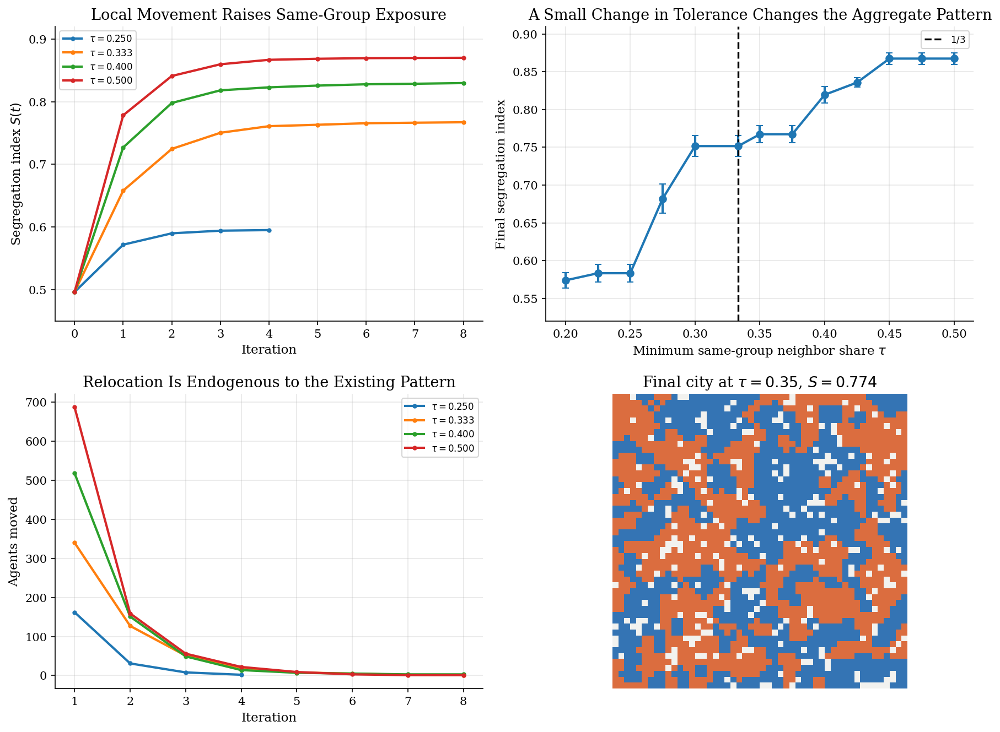

# Schelling Segregation on a Checkerboard

## Overview

Schelling starts with a simple city. Two groups fill a checkerboard. Some cells stay empty. Each person checks nearby neighbors. A person moves when too few neighbors belong to the same group.

*The gap in the pre-Schelling literature was that it studied legal barriers and income sorting. It had no model of voluntary sorting driven purely by local preferences.*

Agents do not choose segregation as a social outcome. They choose acceptable local neighborhoods. Their moves change the choices that other agents face next.

This tutorial keeps the classic model. We simulate a 50 x 50 city. We sweep the minimum same-group neighbor share threshold. We track the aggregate segregation index until the city stops moving.

## Read before

- [Zero-intelligence traders and emergent market structure](../zero-intelligence-traders/README.md)
- [Brock-Hommes asset-pricing with heterogeneous beliefs](../brock-hommes-asset-pricing/README.md)

## Equations

Use $`G`$ for the city grid. Track the whole checkerboard as the state. Do not
collapse the city to one aggregate stock. Write cell $`i`$ at iteration $`t`$ as
$`X_t(i)`$. Empty cells have $`X_t(i)=0`$. Occupied cells have group
$`g_i(t)=X_t(i)`$ with $`g_i(t)\in\lbrace A,B\rbrace`$.

For each occupied cell, $`N_i`$ gives the local Moore neighborhood. It includes
horizontal, vertical, and diagonal cells. It has at most eight cells. Empty
cells can receive movers. Empty cells do not enter the local group composition.
Count occupied neighbors as

```math
O_i(t)=\sum_{j\in N_i} \mathbf{1}[X_t(j)\neq 0].
```

Count same-group neighbors as

```math
m_i(t)=\sum_{j\in N_i} \mathbf{1}[X_t(j)=g_i(t)].
```

When $`O_i(t)>0`$, define the local same-group share as

```math
s_i(t)=\frac{m_i(t)}{O_i(t)}.
```

When an occupied cell has no occupied neighbors, set $`s_i(t)=1`$. This convention
treats isolation as acceptable. The threshold $`\tau`$ gives the minimum
acceptable same-group share. An agent stays content when

```math
s_i(t)\geq \tau.
```

If $`s_i(t)<\tau`$, the agent becomes dissatisfied. Let $`E_t`$ collect the vacant
cells. The agent can move only to a vacant cell that satisfies the same
threshold for that agent's group. Agents do not choose a global segregation
target. They search for an acceptable local neighborhood.

Measure aggregate segregation by average local exposure:

```math
S(t)=\frac{1}{M}\sum_{i:X_t(i)\neq 0} s_i(t),
```

where $`M`$ counts occupied cells. Moves keep $`M`$ fixed because each move swaps
one occupied cell with one vacancy. A random initial city with equal group sizes
puts $`S(t)`$ near one half. Large values of $`S(t)`$ mean that the typical person
mostly sees same-group neighbors. Each decision still uses only the local rule
above.

## Worked Numerical Example

A 3 by 3 city makes one wave of the Schelling rule hand-checkable. Place four red agents at the corners, four blue agents at the edge midpoints, and one empty cell at the center, with threshold $`\tau=0.5`$:

```math
\begin{pmatrix} R & B & R \\ B & E & B \\ R & B & R \end{pmatrix}.
```

Take the top-left corner agent at cell $`(0,0)`$. Its Moore neighborhood is $`\lbrace(0,1),(1,0),(1,1)\rbrace`$. Cell $`(1,1)`$ is empty, so $`O_{(0,0)}=2`$ and the two occupied neighbors are both $`B`$. The same-group share is

```math
s_{(0,0)}(0)=\frac{0}{2}=0<\tau,
```

so the top-left $`R`$ is dissatisfied. By symmetry every corner $`R`$ has $`s=0`$ and is dissatisfied. Take next the top-edge blue at $`(0,1)`$. Its neighborhood is $`\lbrace(0,0),(0,2),(1,0),(1,1),(1,2)\rbrace`$, with $`(1,1)`$ empty, giving $`O_{(0,1)}=4`$ occupied neighbors $`\lbrace R,R,B,B\rbrace`$ and

```math
s_{(0,1)}(0)=\frac{2}{4}=0.5\geq\tau,
```

so the edge $`B`$ is content. Symmetric counts hold at every edge, so the count of dissatisfied agents at $`t=0`$ is four (the corner reds). The aggregate index is

```math
S(0)=\frac{1}{8}\Big(4\cdot 0+4\cdot 0.5\Big)=0.25.
```

Now move the top-left $`R`$ into the empty center, $`(0,0)\to(1,1)`$, leaving $`(0,0)`$ vacant. The relocated $`R`$ at $`(1,1)`$ sees all eight surrounding cells with $`(0,0)`$ now empty, so $`O_{(1,1)}=7`$ with three reds at $`(0,2),(2,0),(2,2)`$, giving $`s_{(1,1)}(1)=3/7\approx 0.429`$. The three remaining corner reds now see one new same-group neighbor at $`(1,1)`$, lifting each to $`s=1/3\approx 0.333`$. The blues at $`(1,2)`$ and $`(2,1)`$, which previously had $`s=0.5`$, lose a same-group corner neighbor that flipped to the center and drop to $`s=2/5=0.4<\tau`$. The blues at $`(0,1)`$ and $`(1,0)`$ keep $`s=0.5`$. Counting strict violations of $`s<\tau`$:

```math
\boxed{D_0=4\ \text{(corner reds)},\qquad D_1=6\ \text{(four reds, plus two newly dissatisfied blues)},\qquad S(1)\approx 0.404.}
```

One local move raised the aggregate segregation index from $`0.25`$ to about $`0.404`$ but also created two new dissatisfied agents that were previously content. This is the externality at the heart of Schelling: each move improves the mover's own neighborhood at most weakly and changes the local composition that every other nearby agent faces, so equilibrium is reached only after enough rounds for these knock-on effects to die out. The 50 by 50 simulation in Results plays the same logic at scale.

## Model Setup

| Symbol | Value | Symbol | Value |
|---|---|---|---|
| $`G`$ | 50 x 50 cells | $`\tau`$ | 0.20 to 0.50 |
| $`E_t`$ | 10% initially vacant | $`S(t)`$ | average of $`s_i(t)`$ |
| $`g_i(t)`$ | $`A`$ or $`B`$ | $`T`$ | 100 iterations |
| $`N_i`$ | Moore, up to 8 cells | Replications | 5 per threshold |
| $`s_i(t)`$ | between 0 and 1 | | |

## Solution Method

We simulate agents directly. We do not solve for a representative agent. We do not optimize a global objective. The state is the whole checkerboard.

```
              grid, N agents, threshold tau, T steps
                              |
                              v
    +---------- Schelling dynamics ----------+
    |                                        |
    |  grid --> [ satisfaction check ] --> unhappy set  |
    |                                        |
    |  unhappy --> [ random relocation ] --> grid  |
    |                                        |
    +---- t < T and unhappy > 0: repeat ----+
                              |
                              v
                    {grid_t}, segregation path S(t)
```

A random visit order matters. One move changes nearby neighborhoods. That dependence drives the model. The city can then tip toward a much more sorted pattern.

## Results

The animation follows one run at $`\tau=0.35`$. Blue cells mark one group. Orange cells mark the other. Light cells mark empty locations.


The four panels below summarize the threshold sweep. The top-left path plot tracks $`S(t)`$ for four thresholds. The key parameter is $`\tau`$. At low thresholds the city settles with little sorting. Near one-third the same rule raises same-group exposure sharply. Small neighborhoods make this region important: one extra same-group neighbor can move an agent across the threshold. The top-right phase-transition plot makes the nonlinearity clear. Final segregation rises quickly once the local demand leaves the low-tolerance range. The bottom-left move-count plot shows that most movement happens early. The bottom-right shows the final city at $`\tau=0.35`$ with same-group clusters; each agent still used only local neighbor composition.



This table gives the simulation detail behind the phase-transition panel. Each row averages over 5 random initial cities.

| Threshold tau | Mean final S | SD final S | Mean iter | Mean moves | Converged | Reps |
|---:|---:|---:|---:|---:|---:|---:|
| 0.200 | 0.574 | 0.011 | 3.6 | 154 | 5 | 5 |
| 0.225 | 0.583 | 0.012 | 3.6 | 178 | 5 | 5 |
| 0.250 | 0.583 | 0.012 | 3.6 | 178 | 5 | 5 |
| 0.275 | 0.682 | 0.019 | 7.0 | 389 | 5 | 5 |
| 0.300 | 0.752 | 0.014 | 7.8 | 531 | 5 | 5 |
| 1/3 | 0.752 | 0.014 | 7.8 | 531 | 5 | 5 |
| 0.350 | 0.767 | 0.011 | 6.8 | 581 | 5 | 5 |
| 0.375 | 0.767 | 0.011 | 6.8 | 581 | 5 | 5 |
| 0.400 | 0.820 | 0.011 | 7.2 | 743 | 5 | 5 |
| 0.425 | 0.836 | 0.006 | 8.6 | 807 | 5 | 5 |
| 0.450 | 0.867 | 0.008 | 9.2 | 968 | 5 | 5 |
| 0.475 | 0.867 | 0.008 | 9.2 | 968 | 5 | 5 |
| 0.500 | 0.867 | 0.008 | 9.2 | 968 | 5 | 5 |

### Threshold sweep diagnostics

| Variable | Value | Variable | Value |
|---|---:|---|---:|
| Grid | 50 x 50 | Vacancy share | 10% |
| Group shares | 50 / 50 | Replications | 5 |
| $`\tau`$ range | 0.20 to 0.50 | Max iterations | 100 |

## Takeaway

*The Schelling model's quantitative surprise was how mild the local tolerance demand needed to be to produce near-total segregation. The framework went on to anchor computational social science and agent-based economics, from residential sorting models to network formation with local complementarities.*

The model warns us about aggregation. Modest local tolerance rules may not preserve a mixed city. Movement changes the local environment that other agents face. Individual relocation decisions can then create segregated aggregate patterns that look much stronger than the rule each agent follows.

## See also

- [Brock-Hommes asset-pricing with heterogeneous beliefs](../brock-hommes-asset-pricing/README.md)
- [Algorithmic collusion and Q-learning](../algorithmic-collusion-q-learning/README.md)
- [Cobweb model with genetic algorithm learning](../cobweb-arifovic-ga-learning/README.md)

## References

- Schelling, T. C. (1969). Models of Segregation. *American Economic Review*, 59(2), 488-493.
- [Schelling, T. C. (1971). Dynamic Models of Segregation. *The Journal of Mathematical Sociology*, 1(2), 143-186.](https://doi.org/10.1080/0022250X.1971.9989794)
- Schelling, T. C. (1978). *Micromotives and Macrobehavior*. W. W. Norton.
