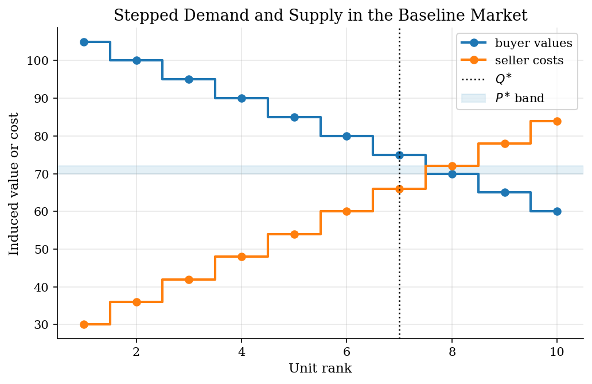
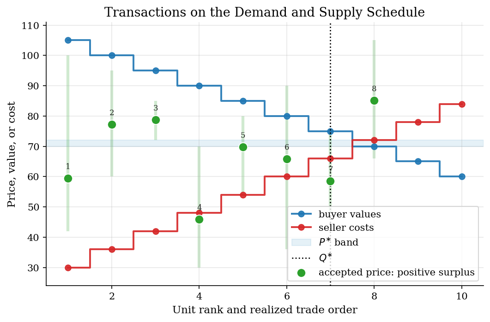
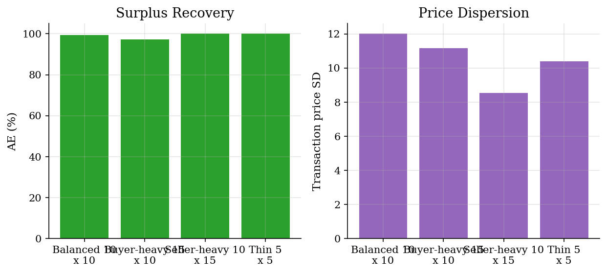
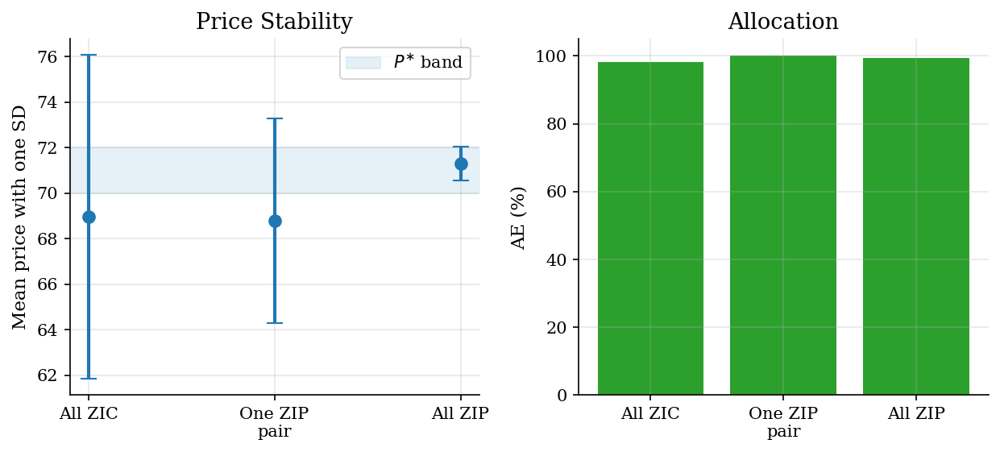

# Zero-Intelligence Traders in a Double Auction

## Overview

In a double auction, buyers post bids and sellers post asks while the market is open. A trade clears when the best bid is at least as high as the best ask. Before Gode and Sunder (1993), the prevailing view was that market efficiency required intelligent, optimizing traders. Gode and Sunder showed that the institution itself can do most of the allocative work.

*Zero-intelligence constrained* traders draw random quotes, but buyers never bid above their private value and sellers never ask below their private cost. That simple budget discipline is enough to recover most of the competitive surplus in a standard double-auction market.

The tutorial then adds a ZIP-style adaptive rule. Adaptation pulls quotes toward recent transaction prices while preserving the no-loss constraints. The comparison isolates the margin on which intelligence helps: prices become less dispersed, while efficiency rises only a little because ZIC already allocates well.

## Read before

- [Brock-Hommes asset pricing](../brock-hommes-asset-pricing/README.md)
- [Schelling segregation](../schelling-segregation/README.md)
- [Algorithmic collusion with Q-learning](../algorithmic-collusion-q-learning/README.md)

## Equations

Buyer $`i`$ has value $`v_i`$ for one unit. Seller $`j`$ has cost $`c_j`$ for one unit.
At event $`t`$, the active bid book and ask book are

```math
B_t=\lbrace b_i(t): i\in \mathcal{B}_t\rbrace
\qquad\text{and}\qquad
A_t=\lbrace a_j(t): j\in \mathcal{A}_t\rbrace.
```

ZIC buyers and sellers draw feasible quotes:

```math
b_i(t)\sim U[0,v_i],
\qquad
a_j(t)\sim U[c_j,\bar p].
```

A trade clears when the best bid crosses the best ask:

```math
\max B_t \geq \min A_t.
```

The transaction price splits the spread:

```math
p_t=\frac{1}{2}\left(\max B_t+\min A_t\right).
```

The surplus from matching buyer $`i`$ with seller $`j`$ is

```math
\Delta S_t=v_i-c_j.
```

Sort values from high to low and costs from low to high. The efficient quantity
and maximum surplus are

```math
Q^{\ast}=\sum_q \mathbf{1}[v_{(q)}-c_{(q)}>0],
\qquad
S^{\ast}=\sum_{q=1}^{Q^{\ast}}\left(v_{(q)}-c_{(q)}\right).
```

The competitive price band is

```math
P^{\ast}=
\left[
\max\lbrace c_{(Q^{\ast})},v_{(Q^{\ast}+1)}\rbrace,
\min\lbrace v_{(Q^{\ast})},c_{(Q^{\ast}+1)}\rbrace
\right],
```

with the next-unit term omitted when that side has no next unit. Allocative
efficiency and price dispersion are

```math
\mathrm{AE}=\frac{\sum_t \Delta S_t}{S^{\ast}},
\qquad
\sigma_p=\sqrt{\frac{1}{T_p}\sum_{t:p_t\ \mathrm{exists}}(p_t-\bar p_T)^2}.
```

Here $`T_p`$ is the number of realized transactions and $`\bar p_T`$ is the mean transaction price (distinct from $`\bar p`$, the maximum ask support defined above).

ZIP-style buyers and sellers maintain feasible quote targets $`z_i^B(t)`$ and
$`z_j^S(t)`$. After an accepted price $`p_t`$, active adaptive agents update by

```math
z_i^B(t+1)=(1-\lambda)z_i^B(t)+\lambda \min\lbrace v_i,p_t+\kappa\rbrace,
```

and

```math
z_j^S(t+1)=(1-\lambda)z_j^S(t)+\lambda \max\lbrace c_j,p_t-\kappa\rbrace.
```

Quotes are noisy draws around these targets, clipped so buyers still satisfy
$`b_i(t)\leq v_i`$ and sellers still satisfy $`a_j(t)\geq c_j`$.

## Worked Numerical Example

A four-trader market makes the Gode-Sunder benchmark visible by hand. Take buyers with values $`v=(10, 6)`$, sellers with costs $`c=(3, 5)`$, and ask support $`\bar p=10`$.

Sort values high to low and costs low to high:

```math
v_{(1)}=10,\ v_{(2)}=6;\qquad c_{(1)}=3,\ c_{(2)}=5.
```

Both sorted gaps are positive, $`v_{(1)}-c_{(1)}=7`$ and $`v_{(2)}-c_{(2)}=1`$, so

```math
Q^{\ast}=2,\qquad S^{\ast}=7+1=8.
```

The competitive price band uses the last included unit and the first excluded unit. With no third buyer or seller, the next-unit terms drop:

```math
P^{\ast}=\left[c_{(Q^{\ast})},\ v_{(Q^{\ast})}\right]=[5,\ 6].
```

Now run one ZIC event. Suppose buyer 1 draws $`b_1=7\in[0,10]`$ and seller 1 draws $`a_1=4\in[3,10]`$. The books are $`B_t=\lbrace 7\rbrace`$ and $`A_t=\lbrace 4\rbrace`$. The cross condition $`\max B_t=7\geq \min A_t=4`$ holds, so the trade clears at the midpoint:

```math
p_t=\tfrac{1}{2}(7+4)=5.5\in P^{\ast},\qquad \Delta S_t=v_1-c_1=10-3=7.
```

Remove the matched buyer and seller. The remaining traders are buyer 2 with $`v_2=6`$ and seller 2 with $`c_2=5`$. A trade is feasible whenever the new draws satisfy $`b_2\geq a_2`$, which holds on the support rectangle $`[0,6]\times[5,10]`$ with positive probability. Conditional on a trade, $`\Delta S_t=6-5=1`$, so the cumulative realized surplus equals the competitive benchmark:

```math
\boxed{\sum_t \Delta S_t=7+1=8=S^{\ast},\qquad \mathrm{AE}=100\%.}
```

The arithmetic shows the Gode-Sunder mechanism in one line: no-loss draws restrict trades to within the supply-demand intersection, so any sequence of accepted ZIC trades exhausts $`S^{\ast}`$ once each side's marginal unit clears. The full simulation in Results runs this logic on the stepped ten-by-ten market and recovers $`\mathrm{AE}=99.3\%`$.

## Model Setup

| Parameter | Value | Parameter | Value |
|---|---:|---|---:|
| Baseline buyers $`N_B`$ | 10 | Baseline sellers $`N_S`$ | 10 |
| Buyer values $`v_i`$ | 105, 100, ..., 60 | Seller costs $`c_j`$ | 30, 36, ..., 84 |
| Maximum ask support $`\bar p`$ | 125 | Efficient quantity $`Q^{\ast}`$ | 7 |
| Maximum competitive surplus $`S^{\ast}`$ | 294.00 | Competitive price band $`P^{\ast}`$ | [70.00, 72.00] |
| Realized AE (baseline ZIC) | 99.3% | Price dispersion $`\sigma_p`$ (baseline) | 12.01 |
| ZIP learning rate $`\lambda`$ | 0.35 | ZIP spread $`\kappa`$ | 1.25 |
| ZIP quote noise | 0.90 | | |

## Solution Method

*Auction simulation* runs directly: each event draws one side at random, posts a constrained quote, and checks whether the best bid crosses the best ask. The competitive benchmark sorts values and costs analytically and never touches the auction. The market-type sweep repeats the auction across four induced-value schedules. The agent-mix sweep replaces ZIC quote rules with ZIP-style targets and reruns the same clearing logic.

```
          N buyers, N sellers, valuation distributions, T events
                              |
                              v
    +---------- auction simulation ----------+
    |                                        |
    |   active traders --> [ quote draw ]    |
    |                                        |
    |   bid book, ask book --> [ crossing ]  |
    |                                        |
    |   trade --> [ ZIP target update ]      |
    |                                        |
    +------ event < T and traders remain ----+
                              |
                           done
                              v
                  transaction log, AE, price path
```

## Results

The baseline induced-value schedule has $`Q^{\ast}=7`$ and $`S^{\ast}=294.00`$. The competitive price band is [70.00, 72.00]. This is the object the random market is trying to approximate without optimization or forecasting.



In the baseline ZIC run, random constrained orders clear 8 trades. Realized allocative efficiency is 99.3%, with mean price 67.58 and price dispersion 12.01. The transaction overlay shows how random constrained trades land near the surplus-relevant region even without strategy.



Baseline Transaction Log

|   Trade |   Event |   Buyer value |   Seller cost |   Accepted bid |   Accepted ask |   Price |   Surplus |
|--------:|--------:|--------------:|--------------:|---------------:|---------------:|--------:|----------:|
|       1 |      12 |           100 |            42 |         66.284 |         52.687 |  59.486 |        58 |
|       2 |      18 |            95 |            60 |         86.083 |         68.435 |  77.259 |        35 |
|       3 |      20 |            85 |            72 |         84.697 |         72.894 |  78.796 |        13 |
|       4 |      28 |            70 |            30 |         59.212 |         32.56  |  45.886 |        40 |
|       5 |      44 |            80 |            54 |         75.28  |         64.225 |  69.753 |        26 |
|       6 |      50 |            90 |            36 |         66.763 |         64.907 |  65.835 |        54 |
|       7 |      51 |            75 |            48 |         58.971 |         58.061 |  58.516 |        27 |
|       8 |     137 |           105 |            66 |         93.376 |         76.865 |  85.121 |        39 |

Changing market thickness and imbalance mostly changes price paths, not the basic surplus result. The thin market has fewer opportunities and more volatile prices. Buyer-heavy and seller-heavy markets move the price level because one side has more quoting pressure. Allocative efficiency remains high because every accepted trade still obeys the buyer value and seller cost constraints.



Market-Type Summary

| Market type          |   Buyers |   Sellers |   Efficient quantity |   Competitive price low |   Competitive price high |   Trades |   Mean price |   Price SD | Allocative efficiency   |
|:---------------------|---------:|----------:|---------------------:|------------------------:|-------------------------:|---------:|-------------:|-----------:|:------------------------|
| Balanced 10 x 10     |       10 |        10 |                    7 |                      70 |                       72 |        8 |        67.58 |      12.01 | 99.3%                   |
| Buyer-heavy 15 x 10  |       15 |        10 |                    8 |                      73 |                       78 |        9 |        74.08 |      11.16 | 97.2%                   |
| Seller-heavy 10 x 15 |       10 |        15 |                    8 |                      66 |                       70 |        8 |        68.52 |       8.54 | 100.0%                  |
| Thin 5 x 5           |        5 |         5 |                    4 |                      68 |                       72 |        4 |        68.13 |      10.4  | 100.0%                  |

The ZIP-style comparison changes the quote rule, not the budget rule. With one adaptive buyer and one adaptive seller, most of the market is still random. With all ZIP-style traders, quotes are pulled toward recent accepted prices. The visible effect is tighter prices and more mass inside the competitive band. The efficiency gain is small because the all-ZIC market already captures almost all available surplus.



Agent-Mix Summary

| Strategy mix                     |   ZIP buyers |   ZIP sellers |   Trades |   Mean price |   Price SD | Allocative efficiency   | Price inside competitive band   |
|:---------------------------------|-------------:|--------------:|---------:|-------------:|-----------:|:------------------------|:--------------------------------|
| All ZIC                          |            0 |             0 |        7 |        68.95 |       7.11 | 98.3%                   | 28.6%                           |
| One ZIP buyer and one ZIP seller |            1 |             1 |        7 |        68.79 |       4.49 | 100.0%                  | 0.0%                            |
| All ZIP                          |           10 |            10 |        8 |        71.3  |       0.74 | 99.3%                   | 62.5%                           |

## Takeaway

*Market institutions allocate.* The Gode-Sunder result was surprising because economists expected rationality to be the primary source of efficiency. Instead, the double-auction mechanism itself enforces most of the surplus extraction once traders respect their own budget constraints. That finding reoriented the field toward mechanism design and away from rationality as the first-order explanation.

Adaptivity helps on a different margin. ZIP-style quote targets reduce price dispersion and pull transaction prices toward the competitive band. They do not transform the allocation, because constrained random trading was already close to efficient. The legacy is a benchmark: any claim that smarter agents improve market outcomes must clear the bar that budget-constrained random traders already set.

## See also

- [Brock-Hommes asset pricing with heterogeneous beliefs](../brock-hommes-asset-pricing/README.md)
- [Algorithmic collusion with Q-learning](../algorithmic-collusion-q-learning/README.md)
- [Schelling segregation model](../schelling-segregation/README.md)

## References

- Gode, D. K. and Sunder, S. (1993). Allocative Efficiency of Markets with Zero-Intelligence Traders: Market as a Partial Substitute for Individual Rationality. *Journal of Political Economy*, 101(1), 119-137.
- Smith, V. L. (1962). An Experimental Study of Competitive Market Behavior. *Journal of Political Economy*, 70(2), 111-137.
- Cliff, D. and Bruten, J. (1997). Minimal-intelligence agents for bargaining behaviors in market-based environments. Technical report, Hewlett-Packard Laboratories.
