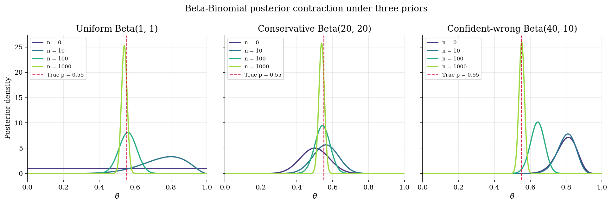
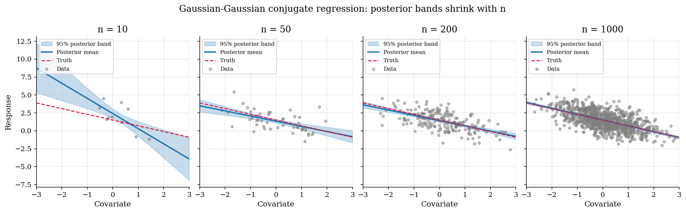
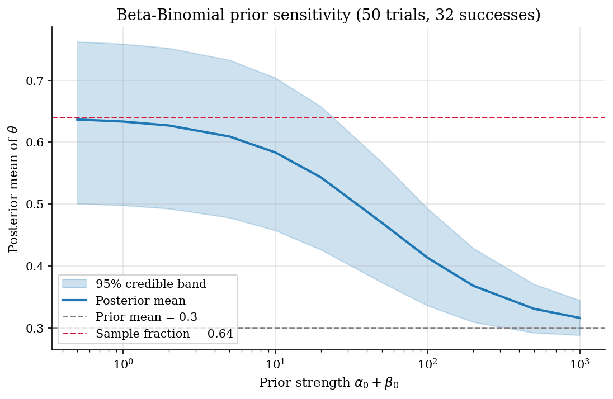

# Bayesian Foundations: Priors, Likelihoods, and Conjugate Posteriors

## Overview

Bayes rule combines a prior and a likelihood into a posterior. Two cases admit closed forms. The Beta-Binomial gives a scalar conjugate update for a probability of success. The Gaussian-Gaussian conjugate regression gives a vector update whose posterior mean is the precision-weighted average of the prior mean and the ordinary-least-squares estimate.

When conjugacy fails the response is sampling, covered in [`computational-methods/metropolis-hastings/`](../../computational-methods/metropolis-hastings/). The Gaussian-Gaussian update drives the Minnesota-prior BVAR in [`time-series/minnesota-svar/`](../../time-series/minnesota-svar/). Its function-space version is the Gaussian-process posterior in [`numerical-methods/bayesian-optimization/`](../../numerical-methods/bayesian-optimization/).

Three runnable examples carry the lesson: posterior contraction under three priors as the sample grows, posterior regression bands shrinking with sample size, and a prior-sensitivity sweep from prior-dominated to data-dominated.

## Equations

Let $`\theta`$ be the unknown parameter and $`y`$ the observed data. Bayes rule combines a prior $`p(\theta)`$ and likelihood $`p(y \mid \theta)`$ into a posterior:

```math
p(\theta \mid y) = \frac{p(y \mid \theta)  p(\theta)}{\int p(y \mid \theta')  p(\theta')  d\theta'}
\propto p(y \mid \theta)  p(\theta).
```

The denominator is constant in $`\theta`$, so the posterior is proportional to the prior-times-likelihood kernel. Closed forms arise when prior and posterior share a parametric family.

### Beta-Binomial conjugate update

The scalar parameter $`\theta \in (0, 1)`$ is a probability of success. The prior is Beta with shapes $`\alpha > 0`$ and $`\beta > 0`$:

```math
\theta \sim \mathrm{Beta}(\alpha, \beta),
\qquad
p(\theta) \propto \theta^{\alpha - 1} (1 - \theta)^{\beta - 1}.
```

Given $`n`$ independent Bernoulli trials with $`s`$ successes, the likelihood is proportional to $`\theta^s (1 - \theta)^{n - s}`$. Multiplying by the prior gives the posterior kernel:

```math
p(\theta \mid y) \propto \theta^{\alpha - 1} (1 - \theta)^{\beta - 1} \cdot \theta^s (1 - \theta)^{n - s}
= \theta^{\alpha + s - 1} (1 - \theta)^{\beta + n - s - 1}.
```

The kernel is Beta, so the posterior is Beta with updated shapes:

```math
\theta \mid y \sim \mathrm{Beta}(\alpha + s,  \beta + n - s).
```

The posterior mean is a convex combination of prior mean and sample fraction:

```math
\mathbb{E}[\theta \mid y] = \frac{\alpha + \beta}{\alpha + \beta + n} \cdot \frac{\alpha}{\alpha + \beta} + \frac{n}{\alpha + \beta + n} \cdot \frac{s}{n}.
```

The prior weight $`(\alpha + \beta) / (\alpha + \beta + n)`$ shrinks to zero as $`n`$ grows, so a flat prior with a large sample reports the sample fraction.

### Gaussian-Gaussian conjugate linear regression

Linear regression with known residual variance $`\sigma^2`$ has data $`y \in \mathbb{R}^n`$, design matrix $`X \in \mathbb{R}^{n \times p}`$, and coefficient vector $`\beta \in \mathbb{R}^p`$. The likelihood is

```math
p(y \mid \beta) \propto \exp\left[-\frac{1}{2 \sigma^2} (y - X \beta)^{\top} (y - X \beta)\right].
```

The conjugate prior is Gaussian with mean $`b_0 \in \mathbb{R}^p`$ and precision $`V_0^{-1}`$:

```math
\beta \sim \mathcal{N}(b_0,  V_0).
```

Completing the square gives a Gaussian posterior with precision and mean

```math
V^{-1} = V_0^{-1} + \frac{X^{\top} X}{\sigma^2},
\qquad
b = V \left[V_0^{-1} b_0 + \frac{X^{\top} y}{\sigma^2}\right].
```

Posterior precision sums prior and data precision. Writing $`\hat\beta_{\mathrm{OLS}} = (X^{\top} X)^{-1} X^{\top} y`$, the posterior mean is the precision-weighted average of prior mean and OLS:

```math
b = V \left[V_0^{-1} b_0 + \frac{X^{\top} X}{\sigma^2} \hat\beta_{\mathrm{OLS}}\right].
```

As $`n`$ grows the data precision $`X^{\top} X / \sigma^2`$ dominates $`V_0^{-1}`$. With a tight prior or small sample the prior anchors the posterior instead.

### Posterior predictive density

The predictive density for a new observation $`\tilde y`$ averages over the posterior:

```math
p(\tilde y \mid y) = \int p(\tilde y \mid \theta)  p(\theta \mid y)  d\theta.
```

For Beta-Binomial with one new trial the predictive probability equals the posterior mean:

```math
\Pr(\tilde y = 1 \mid y) = \mathbb{E}[\theta \mid y] = \frac{\alpha + s}{\alpha + \beta + n}.
```

Integrating over $`p(\theta \mid y)`$ widens the predictive against the plug-in density at $`\mathbb{E}[\theta \mid y]`$.

## Model Setup

| Object | Symbol | Role |
|---|---|---|
| Parameter | $`\theta`$ | Unknown probability or coefficient vector (`metropolis-hastings` writes $`p(\theta \mid D)`$ where this prelim writes $`p(\theta \mid y)`$; $`D`$ and $`y`$ both name the observed data) |
| Data | $`y`$ | Observed outcomes |
| Beta prior shapes | $`\alpha, \beta`$ | Pseudo-counts in the Beta-Binomial prior |
| Sample size | $`n`$ | Number of Bernoulli trials |
| Successes | $`s`$ | Trial successes |
| True coin probability | $`p^{\ast}`$ | Data-generating probability in Example A |
| Sample sizes | $`\{0, 10, 100, 1000\}`$ | Posterior snapshots in Example A |
| Three priors | $`\mathrm{Beta}(1, 1)`$, $`\mathrm{Beta}(20, 20)`$, $`\mathrm{Beta}(40, 10)`$ | Uniform, conservative-correct, confident-wrong |
| Regression coefficient | $`\beta`$ | Coefficient vector in Example B |
| Regression noise scale | $`\sigma`$ | Known Gaussian residual standard deviation |
| Prior mean vector | $`b_0`$ | Vector prior mean |
| Prior precision | $`V_0^{-1}`$ | Inverse prior covariance |
| Posterior precision | $`V^{-1}`$ | $`V_0^{-1} + X^{\top} X / \sigma^2`$ |
| Posterior mean | $`b`$ | Precision-weighted average of $`b_0`$ and $`\hat\beta_{\mathrm{OLS}}`$ |
| Sample-size grid (B) | $`\{10, 50, 200, 1000\}`$ | Bands shrink with $`n`$ |
| Prior strengths (C) | $`\{0.5, 1, 2, \ldots, 1000\}`$ | Sweep of $`\alpha_0 + \beta_0`$ at a fixed prior mean |

## Solution Method

All three examples share one recipe: form the prior, write the likelihood, multiply, recognize the family, read off the posterior. No simulation, exact answer.

### Beta-Binomial conjugacy

```text
Input : prior shapes alpha, beta; n trials, s successes
Output: posterior shapes and moments
  alpha_post = alpha + s
  beta_post  = beta  + n - s
  mean       = alpha_post / (alpha_post + beta_post)
  variance   = alpha_post * beta_post /
               ((alpha_post + beta_post)^2 * (alpha_post + beta_post + 1))
```

Three priors face draws from a coin with $`p^{\ast} = 0.55`$: flat $`\mathrm{Beta}(1, 1)`$, conservative $`\mathrm{Beta}(20, 20)`$, confident-wrong $`\mathrm{Beta}(40, 10)`$. The same draws update each, with posterior shapes recorded at $`n \in \{0, 10, 100, 1000\}`$.

### Gaussian-Gaussian conjugate linear regression

```text
Input : design matrix X, response y, noise scale sigma,
        prior mean b0, prior precision V0_inv
Output: posterior mean b and covariance V
  data_precision   = X' X / sigma^2
  posterior_prec   = V0_inv + data_precision
  posterior_cov    = inverse(posterior_prec)
  posterior_rhs    = V0_inv b0 + X' y / sigma^2
  posterior_mean   = posterior_cov * posterior_rhs
```

A synthetic dataset uses intercept and one covariate, true coefficients $`(1.5, -0.8)`$, Gaussian noise. The weakly informative prior is mean zero with standard deviation 5 on each coefficient. The posterior is computed at $`n \in \{10, 50, 200, 1000\}`$.

### Prior sensitivity

```text
Input : n trials, s successes; prior mean p0;
        grid of prior strengths kappa in {0.5, 1, ..., 1000}
Output: posterior mean and credible bands across kappa
  for each kappa in grid:
    alpha0 = p0 * kappa
    beta0  = (1 - p0) * kappa
    alpha_post = alpha0 + s
    beta_post  = beta0  + n - s
    posterior_mean = alpha_post / (alpha_post + beta_post)
    record 2.5% and 97.5% Beta quantiles
```

Data are fixed at 50 trials with 32 successes; the prior anchor $`p_0 = 0.3`$ sits far below the sample fraction $`0.64`$. Sweeping $`\kappa = \alpha_0 + \beta_0`$ slides the posterior mean from data-dominated (small $`\kappa`$) to prior-dominated (large $`\kappa`$).

## Results

All three posteriors contract toward $`p^{\ast} = 0.55`$ as the sample grows. The flat prior peaks at the noisy 10-observation sample fraction. The conservative $`\mathrm{Beta}(20, 20)`$ moves more slowly because the prior carries forty pseudo-observations. The confident-wrong $`\mathrm{Beta}(40, 10)`$ stays pinned near $`0.80`$ for the first ten observations; only by $`n = 1000`$ does the data drag it onto the dashed red target.



The precision identity drives the regression panels: posterior precision grows linearly in $`n`$, so the posterior standard deviation falls as $`1 / \sqrt{n}`$. At $`n = 10`$ the band is wide and the posterior mean is shifted by sampling noise. By $`n = 50`$ the band has halved and the posterior mean matches OLS to three decimals. At $`n = 200`$ and $`n = 1000`$ intercept and slope sit on the dashed truth line and the band is barely visible.



The prior-sensitivity fan separates the two regimes. With $`\kappa < 50`$ the posterior mean stays near the sample fraction $`0.64`$. At $`\kappa = 50`$ prior and data weights match and the posterior mean lands halfway between the anchors. As $`\kappa`$ grows further the posterior mean drifts toward $`0.3`$. The 95% credible band shrinks throughout because $`\alpha + \beta + n`$ keeps growing.



The predictive probability of success on the next trial is $`(\alpha + s) / (\alpha + \beta + n)`$. On the confident-wrong prior at $`n = 1000`$ this evaluates to $`0.55`$, matching the posterior mean and the analytic Bernoulli predictive. The Beta-Binomial is the smallest non-trivial Bayesian model whose predictive checks by hand.

## Takeaway

Conjugate Bayes is the starting point. The Beta-Binomial gives a closed-form scalar update and predictive. The Gaussian-Gaussian regression gives a closed-form vector update whose posterior mean is the precision-weighted average of prior mean and OLS. Both updates fall out of the prior-times-likelihood kernel without simulation, and serve as the baseline any sampler should match.

Most structural posteriors are not conjugate. With non-Gaussian likelihoods, bounded parameter spaces, or latent variables, the posterior is known only up to a normalizing constant and the response is sampling. Random-walk Metropolis-Hastings in [`computational-methods/metropolis-hastings/`](../../computational-methods/metropolis-hastings/) is the gradient-free option. Hamiltonian Monte Carlo in [`computational-methods/hamiltonian-monte-carlo/`](../../computational-methods/hamiltonian-monte-carlo/) uses gradients for curved posteriors. Chain diagnostics in [`computational-methods/mcmc-diagnostics/`](../../computational-methods/mcmc-diagnostics/) decide whether to trust the averages.

## References

- Gelman, A., Carlin, J. B., Stern, H. S., Dunson, D. B., Vehtari, A., and Rubin, D. B. (2013). *Bayesian Data Analysis*, 3rd edition. Chapman and Hall / CRC. Chapters 1-2 on conjugacy foundations; Chapter 14 on the normal linear regression update.
- Koop, G. (2003). *Bayesian Econometrics*. Wiley, Chapter 2. Conjugacy in econometric practice.
- Robert, C. P. (2007). *The Bayesian Choice*, 2nd edition. Springer, Chapter 3. Decision-theoretic framing for conjugate priors.
- Hamilton, J. D. (1994). *Time Series Analysis*. Princeton University Press, Chapter 12. Scalar Bayes to Bayesian VARs.
- **See also.** The Beta-Binomial closed-form baseline is the check on the random-walk sampler in [`computational-methods/metropolis-hastings/`](../../computational-methods/metropolis-hastings/). The Gaussian-Gaussian update is the building block of the Minnesota-prior BVAR in [`time-series/minnesota-svar/`](../../time-series/minnesota-svar/). MCMC posterior-mean diagnostics live in [`computational-methods/mcmc-diagnostics/`](../../computational-methods/mcmc-diagnostics/).
