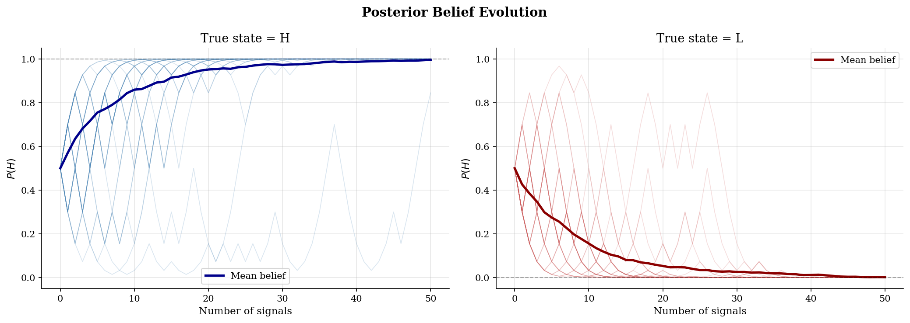
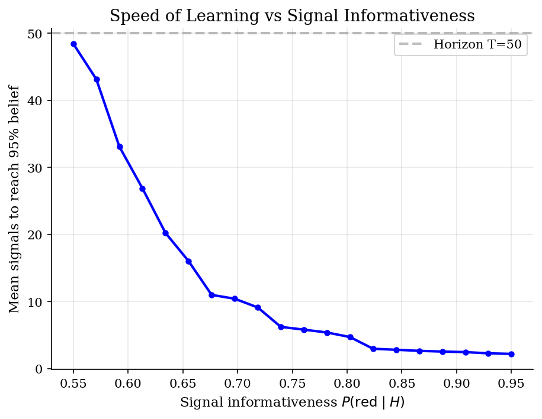
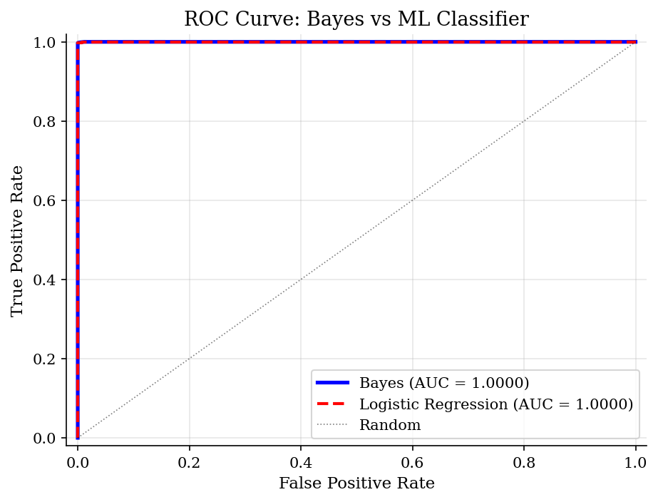
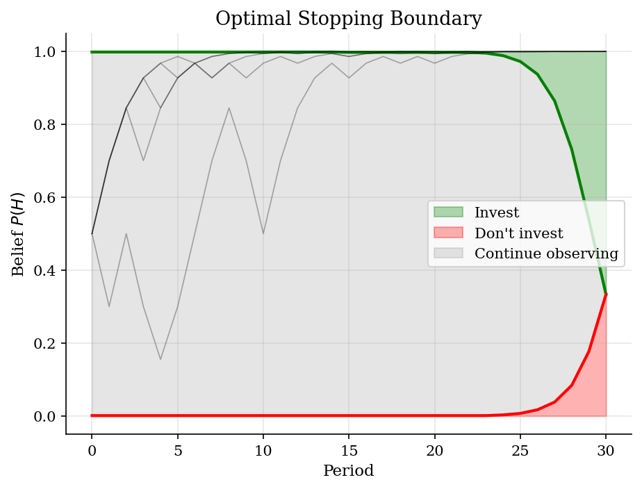

# Bayesian Learning

> How rational agents update beliefs from sequential signals under uncertainty.

## Overview

The Bayesian learning model is the structural approach to information problems. An agent faces uncertainty about the true state of the world and observes noisy signals over time. Bayes' rule provides the optimal way to aggregate information from these signals into a posterior belief.

We study the classic urn problem: nature selects one of two urns (H or L), and the agent draws balls sequentially, observing their color. Each draw provides partial information, and the agent's belief converges to the truth over time. This model is foundational for understanding financial markets, social learning, and optimal experimentation.

## Equations

**Bayes' rule (sequential updating):**

$$P(H \mid s_t) = \frac{P(s_t \mid H) \cdot P_t(H)}{P(s_t \mid H) \cdot P_t(H) + P(s_t \mid L) \cdot P_t(L)}$$

where $P_t(H)$ is the prior at time $t$ and $s_t \in \{\text{red}, \text{blue}\}$ is the signal.

**Signal structure (urn problem):**
- $P(\text{red} \mid H) = 0.7$, $P(\text{red} \mid L) = 0.3$
- Signals are i.i.d. conditional on the true state

**Log-likelihood ratio (sufficient statistic):**

$$\lambda_T = \sum_{t=1}^{T} \log \frac{P(s_t \mid H)}{P(s_t \mid L)} = k \log\frac{p_H}{p_L} + (T-k) \log\frac{1-p_H}{1-p_L}$$

where $k$ is the number of red signals out of $T$ draws.

**Optimal stopping:** The agent chooses when to stop gathering signals and act (invest or not).
The value of continuing to observe signals must exceed the value of acting now.

## Model Setup

| Parameter | Value | Description |
|-----------|-------|-------------|
| $p_H$ | 0.7 | P(red $\mid$ H) |
| $p_L$ | 0.3 | P(red $\mid$ L) |
| Prior $P(H)$ | 0.5 | Initial belief |
| $T$ | 50 | Number of signals |
| Paths | 200 | Simulations per state |
| Invest payoff (H) | 1.0 | Payoff if invest and state=H |
| Invest payoff (L) | -0.5 | Payoff if invest and state=L |
| Wait payoff | 0.0 | Payoff from not investing |

## Solution Method

**Bayesian updating** is applied sequentially: each signal updates the prior into a posterior, which becomes the prior for the next signal. By the martingale convergence theorem, beliefs converge almost surely to the truth.

**Optimal stopping** is solved by backward induction: at each period, the agent compares the value of acting now (invest or wait) against the expected continuation value from one more signal.

**ML comparison:** A logistic regression classifier is trained on signal sequences and compared against the Bayesian classifier. Since the data-generating process matches the Bayesian model exactly, Bayes' rule is the *optimal* classifier (it achieves the Bayes error rate, which is the irreducible minimum).

## Results


*Posterior belief P(H) over time for both true states. Beliefs converge to the truth as signals accumulate.*


*More informative signals (further from 0.5) lead to faster learning.*


*ROC curves for Bayesian and ML classifiers. Bayes achieves the theoretical optimum; ML approaches it asymptotically.*


*Optimal stopping regions: the agent invests when beliefs are high enough, abstains when low enough, and continues observing in between.*

**Classification Accuracy: Bayesian vs ML at Different Horizons**

|   Signals observed |   Bayes accuracy |   ML accuracy |   Bayes advantage |
|-------------------:|-----------------:|--------------:|------------------:|
|                  5 |           0.838  |        0.838  |            0      |
|                 10 |           0.899  |        0.9045 |           -0.0055 |
|                 20 |           0.97   |        0.9705 |           -0.0005 |
|                 30 |           0.9905 |        0.9865 |            0.004  |
|                 50 |           0.9985 |        0.9985 |            0      |

## Economic Takeaway

Bayesian learning is the structural approach to information problems. Rather than fitting a black-box classifier, the agent uses a model of how signals are generated to update beliefs optimally.

**Key insights:**
- **Convergence:** Beliefs converge to the truth almost surely (martingale convergence theorem). With symmetric signals ($p_H = 0.7$, $p_L = 0.3$), learning is equally fast in both states.
- **Informativeness matters:** More informative signals (further from 0.5) dramatically speed up learning. Near-uninformative signals ($p \approx 0.5$) require many draws.
- **Bayes is optimal:** When the true data-generating process matches the model, Bayes' rule achieves the minimum possible classification error (the Bayes error rate). No ML method can beat it --- they can only approach it with enough data.
- **Optimal stopping:** The value of information creates an option value of waiting. The agent continues gathering signals when beliefs are in an intermediate range, and acts only when sufficiently confident.
- **Sufficient statistics:** The number of red draws $k$ out of $T$ is a sufficient statistic for the state. The full signal history can be compressed without information loss --- this is why logistic regression (which uses running averages) approximates Bayes well.

## Reproduce

```bash
python run.py
```

## References

- DeGroot, M. (1970). *Optimal Statistical Decisions*. McGraw-Hill.
- Chamley, C. (2004). *Rational Herds: Economic Models of Social Learning*. Cambridge University Press.
- El-Gamal, M. and Grether, D. (1995). Are People Bayesian? Uncovering Behavioral Strategies. *Journal of the American Statistical Association*, 90(432), 1137-1145.
- Berger, J. (1985). *Statistical Decision Theory and Bayesian Analysis*. Springer, 2nd edition.
