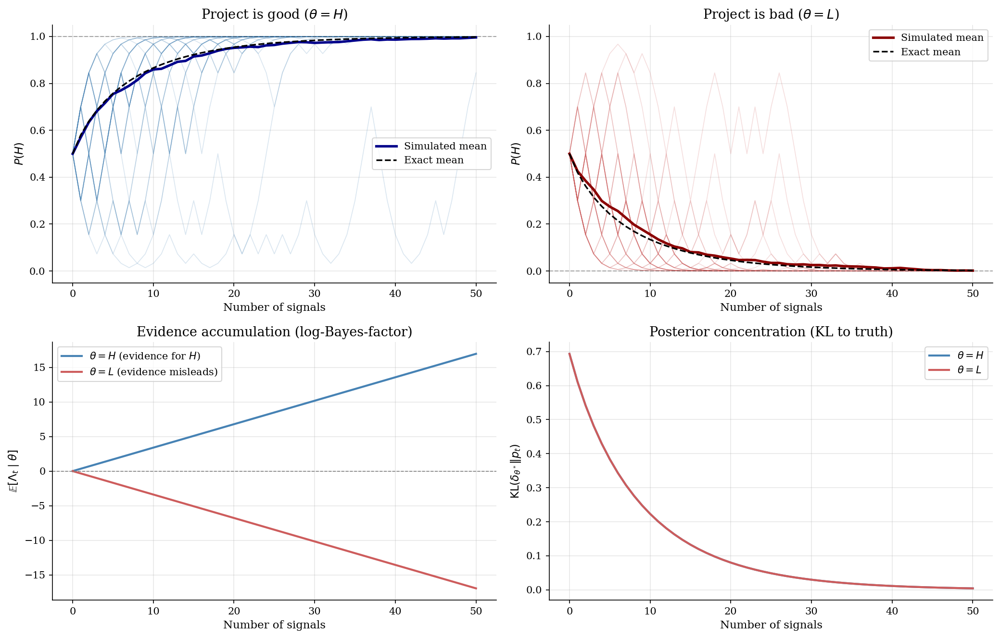
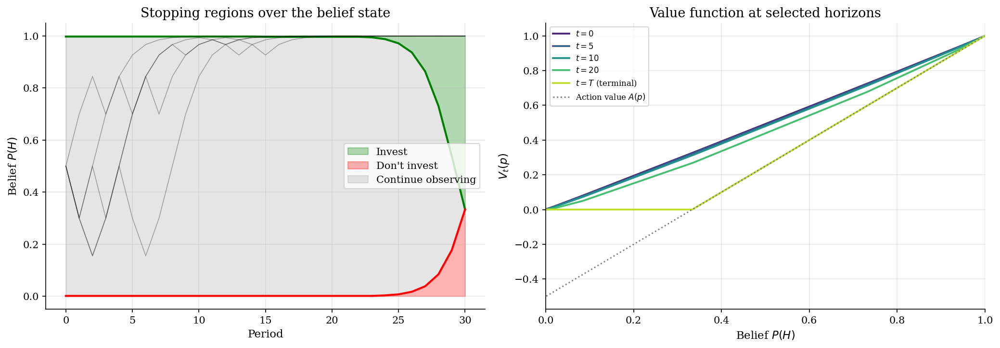

# Sequential Investment Under Bayesian Learning

## Overview

Roberts and Weitzman (1981) asked when it is worth paying to gather more information before committing to an irreversible project. The gap they addressed was a decision-theory literature (DeGroot 1970) that characterized optimal *Bayesian updating* in the abstract but said little about when the agent should stop and act.

The object here is the posterior belief about project quality. It is the sufficient statistic for both learning and investment timing. High beliefs make investment attractive. Low beliefs make rejection attractive. Middle beliefs can justify waiting for one more signal.

The computation applies Bayes' rule sequentially and then solves a finite-horizon Bellman problem by backward induction. At each period backward induction maps each belief into an invest, reject, or continue region.

## Read before

- [Weitzman sequential search rule](../weitzman-search-rule/README.md)
- [Urn behavioral mixtures](../urn-behavioral-mixtures/README.md)

## Equations

Let $`\theta\in\lbrace H,L\rbrace`$ denote the unknown project quality. Let $`s_t\in\lbrace R,B\rbrace`$ denote the period-$`t`$ signal. The signal probabilities are

```math
\Pr(R\mid H)=p_H,\qquad \Pr(R\mid L)=p_L,\qquad p_H>p_L.
```

Let $`p_t = \Pr(\theta = H \mid s_1, \ldots, s_t)`$ be the posterior after $`t`$ signals, and write $`f_\theta(s) = \Pr(s \mid \theta)`$ for the signal likelihood. The *Bayes update* after signal $`s_{t+1}`$ is

```math
p_{t+1}
=\frac{f_H(s_{t+1})\,p_t}
{f_H(s_{t+1})\,p_t+f_L(s_{t+1})(1-p_t)}.
```

Posterior odds evolve additively in log-likelihood ratios,

```math
\log\frac{p_{t+1}}{1-p_{t+1}}
=\log\frac{p_t}{1-p_t}
+\log\frac{f_H(s_{t+1})}{f_L(s_{t+1})}.
```

After $`T`$ signals with $`k_T`$ red, the cumulative log-Bayes-factor is

```math
\Lambda_T
=k_T\log\frac{p_H}{p_L}
+(T-k_T)\log\frac{1-p_H}{1-p_L}.
```

For the stopping problem, investing gives payoff $`\pi_H`$ in state $`H`$ and $`\pi_L`$ in state $`L`$. Rejecting gives zero. At belief $`p`$, the action value is

```math
A(p)=\max[\,p\,\pi_H+(1-p)\,\pi_L,\ 0\,].
```

With one more signal available, the continuation value is

```math
C_t(p)=\Pr(R\mid p)\,V_{t+1}(p_R')+\Pr(B\mid p)\,V_{t+1}(p_B'),
```

where $`\Pr(R\mid p)=p\,p_H+(1-p)\,p_L`$ is the predictive probability of red at belief $`p`$, and $`p_R'`$, $`p_B'`$ are the Bayes-updated beliefs after red or blue. The finite-horizon recursion is

```math
V_t(p)=\max[\,A(p),\ C_t(p)\,].
```

## Worked Numerical Example

Take $`p_H = 0.7`$, $`p_L = 0.3`$, prior $`p_0 = 0.5`$, and observe two red signals.

The *Bayes update* after the first red applies $`f_H(R) = 0.7`$ and $`f_L(R) = 0.3`$:

```math
p_1 = \frac{0.7 \times 0.5}{0.7 \times 0.5 + 0.3 \times 0.5} = \frac{0.35}{0.50} = 0.70.
```

The second red updates $`p_1 = 0.70`$:

```math
p_2 = \frac{0.7 \times 0.70}{0.7 \times 0.70 + 0.3 \times 0.30} = \frac{0.49}{0.58} \approx 0.8448.
```

The log-odds form gives the same answer in one step. The per-signal log-likelihood ratio is $`\log(7/3)\approx 0.8473`$. Starting log-odds are $`\log(0.5/0.5)=0`$, so after $`k_T=2`$ reds:

```math
\Lambda_2 = 2\times 0.8473 = 1.6946, \qquad p_2 = \frac{e^{1.6946}}{1+e^{1.6946}} \approx 0.8448.
```

With $`\pi_H=1.0`$ and $`\pi_L=-0.5`$, plug into the action value:

```math
A(p_2) = \max[\,0.8448\times 1.0 + 0.1552\times(-0.5),\ 0\,] = \max[\,0.7672,\ 0\,] = \boxed{0.7672}.
```

Two red signals lift the posterior from $`0.5`$ to $`0.8448`$ and push action value well above zero. The log-odds form makes clear why a longer red streak eventually swamps any finite prior. $`\Lambda_T`$ grows linearly in the red count, so the posterior converges to one geometrically fast.

## Model Setup

| Parameter | Value | Parameter | Value |
|---|---:|---|---:|
| Signal prob. in $`H`$: $`p_H`$ | 0.7 | Signal prob. in $`L`$: $`p_L`$ | 0.3 |
| Prior $`p_0 = \Pr(H)`$ | 0.5 | Simulated paths per state | 200 |
| Signal horizon $`T`$ | 50 | Stopping horizon | 30 |
| Investment payoff in $`H`$: $`\pi_H`$ | 1.0 | Investment payoff in $`L`$: $`\pi_L`$ | -0.5 |
| Reject payoff | 0.0 | Belief grid (backward induction) | 1 000 pts |

## Solution Method

What's new relative to one-shot decision theory is the *backward induction* that prices the option to wait. The Bayes filter compresses the signal history into one posterior. Backward induction uses that posterior as the state variable.

```
                 prior p_0, likelihoods f_H f_L, payoffs pi_H pi_L, horizon T
                                         |
                                         v
+--------------------------- outer loop (backward induction) -------------------+
|                                                                               |
|   set terminal value V_T(p) = max[A(p), 0]  for all p on belief grid         |
|                                                                               |
|   +------------- inner step: one period back (t = T-1, ..., 0) -------------+|
|   |  for each p_i:                                                           ||
|   |    compute p_R' and p_B' via Bayes update                               ||
|   |    C_t(p_i) = Pr(R|p_i) * V_{t+1}(p_R') + Pr(B|p_i) * V_{t+1}(p_B')   ||
|   |    V_t(p_i) = max[ A(p_i), C_t(p_i) ]                                  ||
|   +--------------------------------------------------------------------------+|
|                                                                               |
|   record invest / continue / reject regions from V_t                         |
|                                                                               |
+---------------- repeat until t = 0 ------------------------------------------+
                                         |
                                   converged (t = 0)
                                         |
                                         v
                         V_0(p), stopping boundary, regions
```

```python
# Backward induction: price the option to wait one more signal.
def backward_induction(T, payoff_H, payoff_L, p_red_H, p_red_L, p_grid):
    def a(p):   # action value: invest or reject
        return max(p * payoff_H + (1 - p) * payoff_L, 0.0)

    # terminal value: no more signals, just act
    V = np.array([a(p) for p in p_grid])

    for t in range(T - 1, -1, -1):
        V_new = np.zeros_like(V)
        for i, p in enumerate(p_grid):
            # Bayes update after red and blue (see filtering section above)
            p_red = p * p_red_H + (1 - p) * p_red_L
            p_R = p * p_red_H / p_red
            p_B = p * (1 - p_red_H) / (1 - p_red) if p_red < 1 else p
            # continuation: expected value of one more signal
            C = p_red * np.interp(p_R, p_grid, V) + (1 - p_red) * np.interp(p_B, p_grid, V)
            V_new[i] = max(a(p), C)
        V = V_new
    return V
```

Backward induction runs for 30 periods on a 1 000-point belief grid. Each sweep evaluates the continuation value at every grid point by linear interpolation of the previous-period value function.

## Results

Beliefs fan out over time. Under $`\theta = H`$ the mean path drifts toward one. Under $`\theta = L`$ it drifts toward zero. Individual paths show substantial early dispersion because each agent starts with the same uninformative prior. The *posterior concentration* tightens as signals accumulate. The evidence panel (bottom left) shows how the expected log-Bayes-factor diverges in sign across the two states. The convergence panel (bottom right) tracks the KL divergence from the posterior to the true state. Both quantities decay toward zero as signals accumulate, confirming that the posterior concentrates on the truth.



The stopping boundary separates belief space into three regions. Above the upper boundary, investing is immediately optimal. Below the lower boundary, rejection is optimal. In the middle, waiting for one more signal is worth the delay. The continuation region shrinks as the deadline approaches because the value of waiting falls with fewer periods remaining. The right panel shows the value function $`V_t(p)`$ at selected horizons. Early on, $`V_t`$ sits well above the action value $`A(p)`$ across a wide middle range. Close to the terminal period, $`V_t`$ collapses onto $`A(p)`$ everywhere.



### Optimal stopping diagnostics

| Object | Value | Object | Value |
|---|---:|---|---:|
| $`p_H`$ | 0.70 | $`p_L`$ | 0.30 |
| Terminal invest threshold | 0.333 | Reject threshold (terminal) | 0.333 |
| Invest threshold at $`t = 0`$ | ~0.82 | Reject threshold at $`t = 0`$ | ~0.18 |
| Belief grid points | 1 000 | Stopping horizon | 30 |
| Simulated paths per state | 200 | KL at $`t = 0`$ (prior) | ~0.69 |

## Takeaway

*Sequential Bayesian updating* compresses an arbitrarily long signal history into one number, the posterior belief, that is sufficient for both learning and stopping. The continuation region widens early in the horizon because information is more valuable when many periods remain to exploit it. Roberts and Weitzman (1981) showed that the option to keep learning has a well-defined value and that it is typically worth paying for only when beliefs are near the uninformative middle. The framework anchors the broad literature on sequential experimentation, from multi-armed bandits in operations research to social learning and herding models in economics.

## See also

- [Pandora's box: Weitzman search rule](../weitzman-search-rule/README.md)
- [Consumer sequential search (Ursu)](../sequential-search-ursu/README.md)
- [Nowcasting a latent state by Kalman filtering](../../computational-methods/kalman-filter/README.md)

## References

- DeGroot, M. H. (1970). *Optimal Statistical Decisions*. McGraw-Hill. (Wiley Classics reprint 2004.)
- Roberts, K. and Weitzman, M. L. (1981). Funding Criteria for Research, Development, and Exploration Projects. *Econometrica*, 49(5), 1261-1288.
- Chamley, C. (2003). *Rational Herds: Economic Models of Social Learning*. Cambridge University Press.
