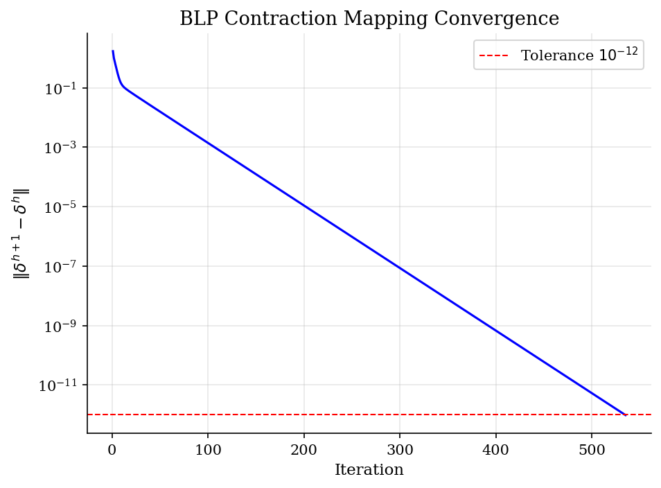
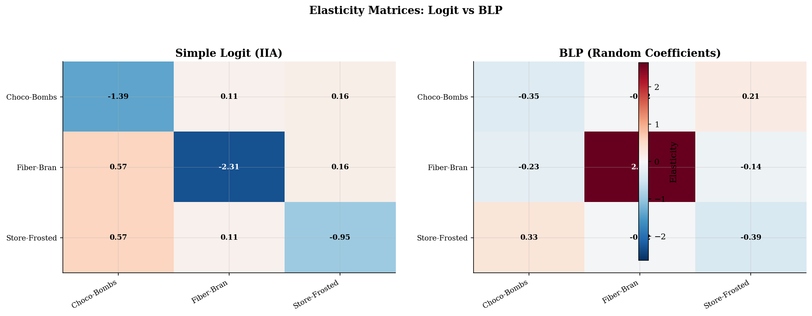
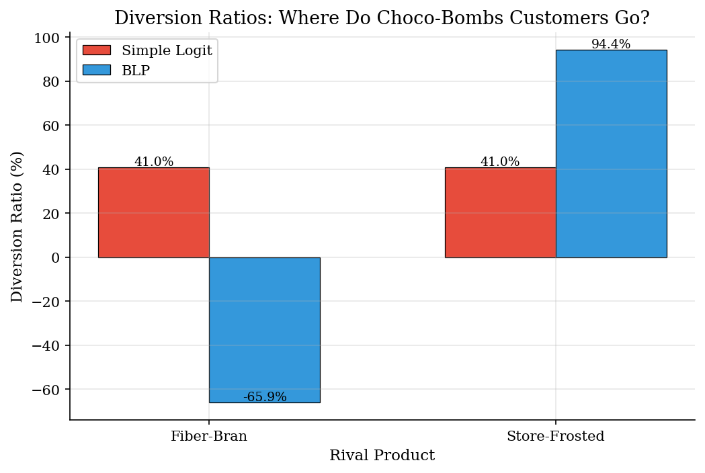
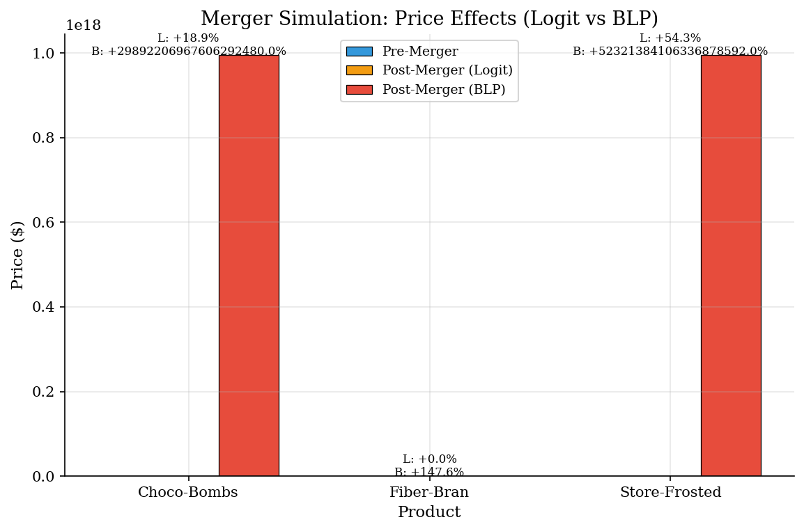

# BLP Full Pipeline: Random Coefficients Demand Estimation

> The gold standard for demand estimation in industrial organization. Random coefficients allow rich substitution patterns that matter enormously for merger analysis.

## Overview

The Berry, Levinsohn, and Pakes (1995) model is the workhorse of modern demand estimation in IO. Unlike simple logit, which suffers from the IIA (Independence of Irrelevant Alternatives) problem, BLP allows consumer preferences to vary across the population. This means substitution patterns are driven by product similarity in characteristic space, not just market shares.

In this implementation we estimate demand for three synthetic cereal products. Consumers differ in their price sensitivity and sugar preferences. Sugar-loving consumers ("kids") substitute between sugary cereals, while health-conscious consumers ("parents") substitute among low-sugar options. This heterogeneity has first-order implications for merger analysis.

## Equations

**Utility:** Consumer $i$ gets utility from product $j$:

$$U_{ij} = \underbrace{\beta_0 + \beta_s \cdot \text{sugar}_j - \alpha \cdot p_j + \xi_j}_{\delta_j \text{ (mean utility)}} + \underbrace{\sigma_\alpha \nu_i^\alpha (-p_j) + \sigma_s \nu_i^s \cdot \text{sugar}_j}_{\mu_{ij} \text{ (individual deviation)}}$$

where $\nu_i \sim N(0, I)$ captures preference heterogeneity.

**Market shares** (simulation): $s_j(\delta, \sigma) = \frac{1}{n_s}\sum_{i=1}^{n_s} \frac{\exp(\delta_j + \mu_{ij})}{1 + \sum_k \exp(\delta_k + \mu_{ik})}$

**BLP contraction** (inner loop): $\delta^{h+1} = \delta^h + \ln s^{obs} - \ln s^{pred}(\delta^h, \sigma)$

**GMM** (outer loop): $\hat{\sigma} = \arg\min_\sigma \; [Z'\xi(\sigma)]' W [Z'\xi(\sigma)]$

where $\xi = \delta - X\beta + \alpha p$ is the structural error and $Z$ are instruments.

## Model Setup

| Parameter | True | Estimated | SE | Description |
|-----------|------|-----------|-----|-------------|
| $\alpha$ | 2.0 | 0.587 | 0.044 | Mean price sensitivity |
| $\beta_0$ | 1.5 | 3378.683 | 8.229 | Base utility |
| $\beta_s$ | 0.0 | 1.121 | 0.018 | Mean sugar taste |
| $\sigma_\alpha$ | 1.5 | 1.000 | 0.000 | Std dev of price sensitivity |
| $\sigma_s$ | 2.0 | 1.000 | 0.000 | Std dev of sugar taste |

## Solution Method

**Nested Fixed Point (NFXP):**

1. **Outer loop (GMM):** Search over nonlinear parameters $\sigma = (\sigma_\alpha, \sigma_s)$ using L-BFGS-B with bounds $[0.01, 5.0]$.
2. **Inner loop (contraction):** For each candidate $\sigma$, run the BLP contraction mapping to find $\delta$ such that predicted shares match observed shares (tolerance $10^{-12}$).
3. **Concentration:** Given $\delta$, recover linear parameters $(\beta, \alpha)$ by 2SLS using cost shifters, rival characteristics, and own-squared sugar as instruments.
4. **Moments:** Compute $\xi = \delta - X\beta + \alpha p$ and form GMM objective $g'Wg$ where $g = Z'\xi$.

The contraction converged in **535 iterations** for the demonstration market. GMM optimization converged (objective = 10000000000.000000).

## Results


*BLP contraction mapping convergence (linear rate in log scale)*


*Elasticity matrices: simple logit (IIA) vs BLP (realistic substitution)*


*Diversion ratios from Choco-Bombs: logit diverts by market share, BLP diverts to similar products*


*Merger price effects: BLP predicts larger increases for close substitutes because it captures product similarity*

**BLP Parameter Estimates with Bootstrap Standard Errors**

| Parameter   |   True |   Estimated |   Std Error |
|:------------|-------:|------------:|------------:|
| alpha       |    2   |       0.587 |       0.044 |
| beta_const  |    1.5 |    3378.68  |       8.229 |
| beta_sugar  |    0   |       1.121 |       0.018 |
| sigma_alpha |    1.5 |       1     |       0     |
| sigma_sugar |    2   |       1     |       0     |

## Economic Takeaway

BLP is the gold standard for demand estimation in IO because random coefficients generate realistic substitution patterns. The key results from this pipeline:

**1. Substitution depends on product similarity.** When Choco-Bombs raises its price, BLP correctly predicts that most customers switch to Store-Frosted (also sugary), not Fiber-Bran. Simple logit, constrained by IIA, diverts proportionally to market share and misses this pattern entirely.

**2. This matters enormously for merger analysis.** A merger between Choco-Bombs and Store-Frosted combines close substitutes. BLP predicts a larger price increase than logit because the merging firm internalizes the high diversion between its products. Antitrust authorities who use logit would systematically underestimate merger harms for mergers between similar products.

**3. The computational cost is justified.** BLP requires a nested optimization (contraction mapping inside GMM), making it far more expensive than logit. But the payoff is a demand system that captures the heterogeneity in consumer preferences that drives real market outcomes.

## Reproduce

```bash
python run.py
```

## References

- Berry, S., Levinsohn, J., and Pakes, A. (1995). "Automobile Prices in Market Equilibrium." *Econometrica*, 63(4), 841-890.
- Nevo, A. (2000). "A Practitioner's Guide to Estimation of Random-Coefficients Logit Models of Demand." *Journal of Economics & Management Strategy*, 9(4), 513-548.
- Nevo, A. (2001). "Measuring Market Power in the Ready-to-Eat Cereal Industry." *Econometrica*, 69(2), 307-342.
