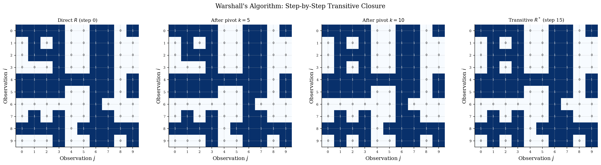
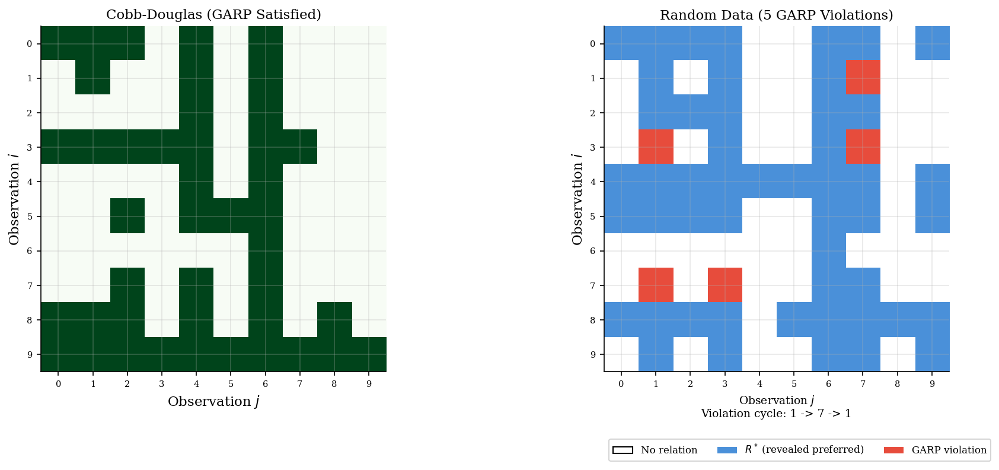
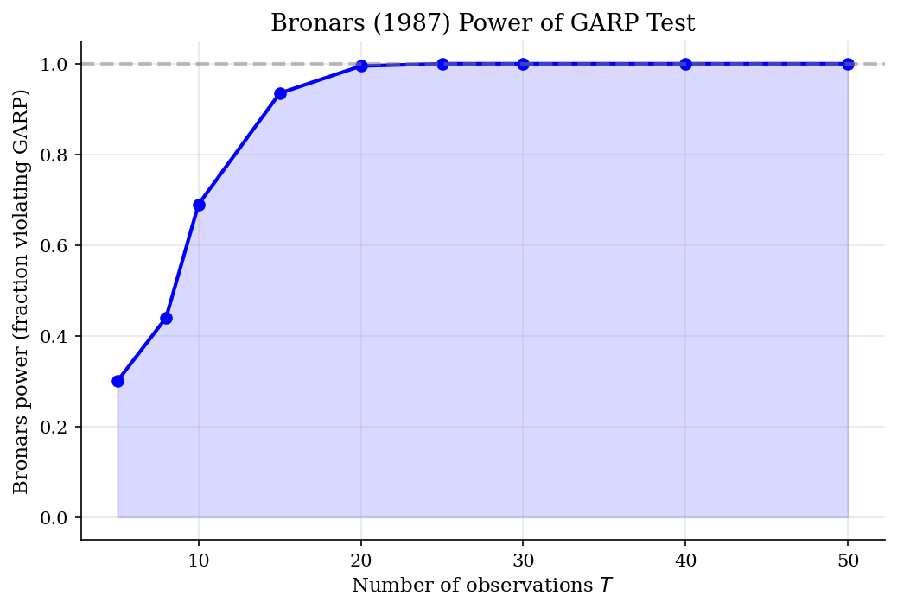
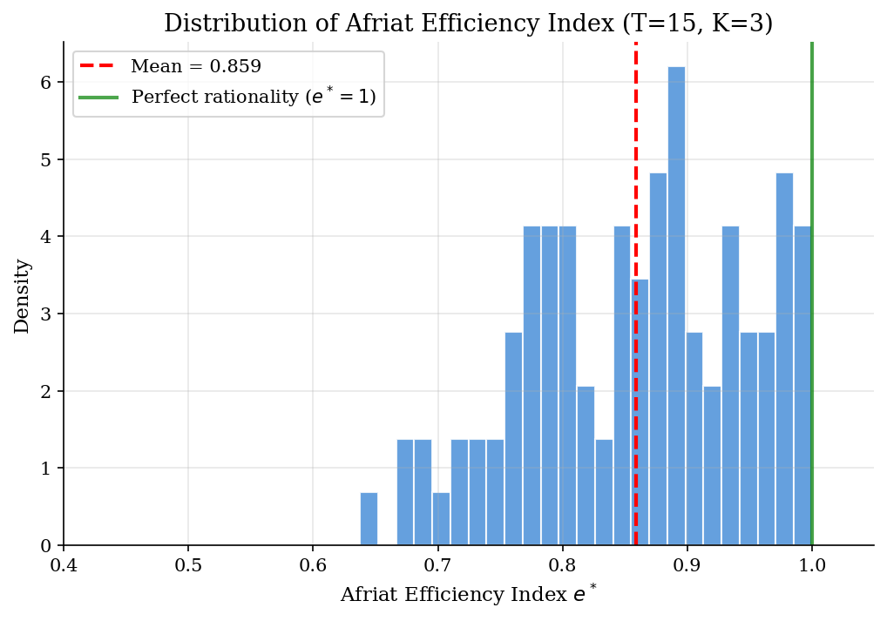

# GARP Testing via Warshall's Algorithm

> Testing the Generalized Axiom of Revealed Preference using transitive closure.

## Overview

The Generalized Axiom of Revealed Preference (GARP) is the fundamental testable implication of utility maximization. Given a dataset of prices and chosen bundles, GARP asks: could this data have been generated by a consumer maximizing a well-behaved utility function subject to a budget constraint?

Testing GARP requires computing the *transitive closure* of the direct revealed preference relation. Warshall's algorithm does this in $O(T^3)$ time, making GARP testing practical even for large datasets. We also implement the Bronars (1987) power test and the Afriat (1967) efficiency index.

## Equations

**Direct Revealed Preference:** Bundle $x_i$ is *directly revealed preferred* to $x_j$ if

$$p_i \cdot x_i \ge p_i \cdot x_j$$

i.e., bundle $j$ was affordable when $i$ was chosen.

**Transitive Closure (Warshall):** $i \; R^* \; j$ iff there exists a chain $i \; R \; k_1 \; R \; k_2 \; R \cdots R \; j$.

$$R^{(k)}[i,j] = R^{(k-1)}[i,j] \;\lor\; \bigl(R^{(k-1)}[i,k] \;\land\; R^{(k-1)}[k,j]\bigr)$$

**GARP Violation:** The data violates GARP if there exist $i, j$ such that $i \; R^* \; j$ (revealed preferred through a chain) and $p_j \cdot x_j > p_j \cdot x_i$ (bundle $i$ was strictly cheaper at $j$'s prices).

**Afriat Efficiency Index:** The largest $e \in [0,1]$ such that the $e$-adjusted data satisfies GARP, where the adjusted relation uses $e \cdot p_i \cdot x_i \ge p_i \cdot x_j$.

## Model Setup

| Parameter | Value | Description |
|-----------|-------|-------------|
| $K$ | 3 | Number of goods |
| $T$ | 15 | Number of observations |
| $\alpha$ | (0.4, 0.35, 0.25) | Cobb-Douglas budget shares |
| Bronars sims | 200 | Random datasets per T value |
| Afriat datasets | 100 | Random datasets for efficiency index |

## Solution Method

**Warshall's Algorithm:** Starting from the direct revealed preference matrix $R$, we iterate over each observation $k$ as a potential intermediate node. For each pair $(i, j)$, if $i$ can reach $k$ and $k$ can reach $j$, then $i$ can reach $j$. After $T$ pivots, the matrix $R^*$ encodes all transitive preference chains.

**Complexity:** $O(T^3)$ for the transitive closure, $O(T^2 K)$ for building the direct preference matrix.

**Results:** Cobb-Douglas data: 0 GARP violations (as expected). Random data: 5 GARP violations detected.

## Results


*Warshall algorithm: progressive construction of the transitive closure from direct preferences*


*GARP violation detection: Cobb-Douglas data (left, no violations) vs random data (right, violations in red)*


*Bronars power: fraction of random datasets violating GARP, increasing with T*


*Afriat efficiency index distribution for random data: distance from rationalizability*

**Direct Revealed Preference R and Transitive Closure R* (random data, first 10 obs)**

|   Obs |   R (direct) |   R* (transitive) |   New edges |
|------:|-------------:|------------------:|------------:|
|     0 |   1111001101 |        1111001101 |           0 |
|     1 |   0101001100 |        0101001100 |           0 |
|     2 |   0111001100 |        0111001100 |           0 |
|     3 |   0001001100 |        0101001100 |           1 |
|     4 |   1111111101 |        1111111101 |           0 |
|     5 |   1111001101 |        1111001101 |           0 |
|     6 |   0000001000 |        0000001000 |           0 |
|     7 |   0101001100 |        0101001100 |           0 |
|     8 |   1111011111 |        1111011111 |           0 |
|     9 |   0001001101 |        0101001101 |           1 |

## Economic Takeaway

GARP is the testable implication of utility maximization. Warshall's algorithm efficiently computes the transitive closure, making GARP testing practical even for large datasets. The Afriat efficiency index measures 'how close' data is to being rationalizable.

**Key insights:**
- Cobb-Douglas data always satisfies GARP — this is a direct consequence of Afriat's theorem: any dataset rationalizable by a locally non-satiated utility function must satisfy GARP.
- Bronars power increases with the number of observations $T$. With more data points, random behavior is increasingly likely to produce preference cycles, giving GARP more opportunities to reject.
- The Afriat efficiency index provides a continuous measure of 'near-rationality'. Even random data often has $e^*$ close to 1, reflecting the difficulty of detecting irrationality from small samples.
- Warshall's $O(T^3)$ complexity is far more efficient than checking all possible chains explicitly, making it the standard algorithm for empirical revealed preference analysis.

## Reproduce

```bash
python run.py
```

## References

- Varian, H. (1982). The nonparametric approach to demand analysis. *Econometrica*, 50(4), 945-973.
- Bronars, S. (1987). The power of nonparametric tests of preference maximization. *Econometrica*, 55(3), 693-698.
- Afriat, S. (1967). The construction of utility functions from expenditure data. *International Economic Review*, 8(1), 67-77.
- Warshall, S. (1962). A theorem on Boolean matrices. *Journal of the ACM*, 9(1), 11-12.
