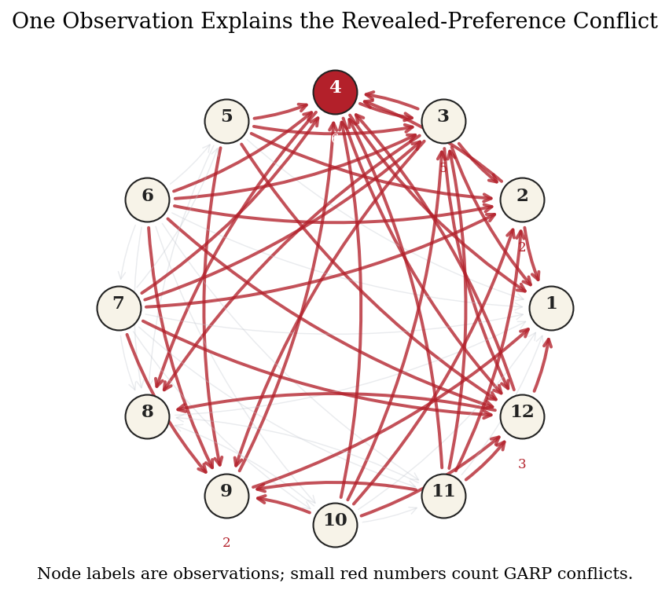
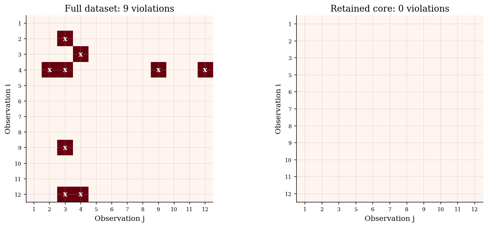

# Rationalizable Choice Cores with Houtman-Maks

## Overview

Revealed-preference data can fail GARP even when most observations fit stable preferences. The failure says the full dataset is not rationalizable.

The Houtman-Maks index is the largest number of observations that can be kept while satisfying GARP. It measures the rationalizable core of the dataset.

Finding the core requires search over subsets of observations. This tutorial builds the revealed-preference graph, checks GARP on candidate subsets, and compares exact search with a greedy graph rule.

## Equations

There are $`T`$ observations. Observation $`t`$ has prices $`p_t \in \mathbb{R}_{+}^{J}`$ and chosen bundle $`x_t \in \mathbb{R}_{+}^{J}`$. Expenditure is $`m_t=p_t \cdot x_t`$.

Choice $`t`$ directly weakly reveals $`x_t`$ preferred to $`x_s`$ when $`x_s`$ was affordable at prices $`p_t`$:

```math
x_t R^D x_s \quad \Longleftrightarrow \quad p_t \cdot x_t \geq p_t \cdot x_s.
```

The direct relation is strict when the inequality is strict. Let $`R`$ be the transitive closure of $`R^D`$. GARP holds on a subset $`S`$ if there is no pair $`t,s \in S`$ such that

```math
x_t R x_s \quad \text{and} \quad p_s \cdot x_s > p_s \cdot x_t.
```

Let $`\mathrm{GARP}(S)=1`$ when these restrictions hold after keeping only observations in $`S`$. The Houtman-Maks index is

```math
HM = \max_{S \subseteq \lbrace1,\ldots,T\rbrace} |S| \quad \text{s.t.} \quad \mathrm{GARP}(S)=1.
```

The minimum number of observations needed to restore GARP is

```math
T - HM.
```

## Worked Numerical Example

Take $`T = 4`$ observations on $`J = 2`$ goods.

| Observation | Price vector $`p_t`$ | Chosen bundle $`x_t`$ | Expenditure $`m_t`$ |
|:-----------:|:-------------------:|:--------------------:|:-------------------:|
| 1 | $`(2,\,1)`$ | $`(3,\,2)`$ | 8 |
| 2 | $`(1,\,2)`$ | $`(2,\,3)`$ | 8 |
| 3 | $`(1,\,1)`$ | $`(1,\,1)`$ | 2 |
| 4 | $`(3,\,3)`$ | $`(3,\,3)`$ | 18 |

Build the direct revealed-preference matrix. For each pair $`(t,s)`$, check whether $`p_t \cdot x_s \leq m_t`$.

```math
p_1 \cdot x_2 = (2)(2)+(1)(3) = 7 \leq 8 \implies x_1\, R^D\, x_2 \text{ (strict)}
```

```math
p_2 \cdot x_1 = (1)(3)+(2)(2) = 7 \leq 8 \implies x_2\, R^D\, x_1 \text{ (strict)}
```

Observation 1 can also afford bundle 3 at its prices ($`p_1 \cdot x_3 = 4 \leq 8`$), and observation 2 can afford bundle 3 ($`p_2 \cdot x_3 = 3 \leq 8`$). Observation 4 can afford all three other bundles ($`p_4 \cdot x_t = 15,\,15,\,6`$, all below 18). Observation 3 cannot afford any other bundle ($`m_3 = 2`$). The full direct relation is

```math
R^D = \{(1,2),\,(1,3),\,(2,1),\,(2,3),\,(4,1),\,(4,2),\,(4,3)\}.
```

Take the transitive closure $`R^{\ast}`$. The only new arcs from transitivity are $`(1,1)`$ and $`(2,2)`$ (the self-loops generated by the 1-2 back-and-forth). No new inter-observation arcs are added because observation 3 has no outgoing arcs, and observation 4 already reaches 1, 2, and 3 directly.

A GARP violation requires $`x_t\, R^{\ast}\, x_s`$ and $`p_s \cdot x_s > p_s \cdot x_t`$ (strictly).

Check the pair $`(t,s) = (1,2)`$: observation 1 reveals preference over bundle 2, so $`x_1\, R^{\ast}\, x_2`$. Now check whether bundle 2 was strictly more expensive than bundle 1 at prices $`p_2`$:

```math
p_2 \cdot x_2 = 8 > p_2 \cdot x_1 = 7. \quad \text{GARP violated.}
```

Check the pair $`(t,s) = (2,1)`$: symmetric argument gives $`p_1 \cdot x_1 = 8 > p_1 \cdot x_2 = 7`$. GARP violated again. Observations 3 and 4 are not part of any cycle. The unique violating pair is $`\{1,\,2\}`$.

Now find the minimum deletion. Dropping observation 1 or observation 2 breaks the cycle. Dropping one observation leaves $`T - 1 = 3`$ observations. To confirm no size-3 subset does better, check all four candidates:

| Subset of size 3 | GARP holds? |
|:----------------:|:-----------:|
| $`\{1,2,3\}`$ | No (cycle $`1 \leftrightarrow 2`$ survives) |
| $`\{1,2,4\}`$ | No (cycle $`1 \leftrightarrow 2`$ survives) |
| $`\{1,3,4\}`$ | Yes |
| $`\{2,3,4\}`$ | Yes |

Two rational subsets of size 3 exist. The full dataset of size 4 fails GARP.

```math
\boxed{HM = 3, \quad T - HM = 1.}
```

One deletion restores rationalizability. The minimum repair removes either observation 1 or observation 2 - either choice is exact.

## Model Setup

| Object | Value | Interpretation |
|---|---:|---|
| Observations $`T`$ | 12 | Shopping trips with prices and chosen bundles |
| Goods $`J`$ | 3 | Small multi-good demand environment |
| Data-generating preferences | Cobb-Douglas shares $`(0.45,0.35,0.20)`$ | Choices before the swap |
| Synthetic corruption | bundles in rows 3 and 4 swapped | Known source of the GARP failure |
| Full-sample GARP violations | 9 | Contradictions after taking transitive closure |
| Exact Houtman-Maks index | 11 | Largest rationalizable subset size |
| Greedy deletion | observation 4 | Same deletion selected by the heuristic |

## Solution Method

The exact routine treats the dataset as a finite search problem. It builds the revealed-preference graph for each candidate subset. It then checks whether any strict budget cycle remains.

```text
Algorithm: exact Houtman-Maks core
Inputs: observations {(p_t, x_t)}[t=1]^T
Output: largest subset S* satisfying GARP

for k = T, T-1, ..., 1:
    for each subset S with |S| = k:
        build R^D on S using p_t dot x_t >= p_t dot x_s
        compute the transitive closure R of R^D
        if no strict budget cycle remains:
            return S* = S and HM = k
```

Enumeration is exact, but the number of subsets grows quickly. The greedy rule uses the same graph to choose deletions. It removes observations from violating strongly connected components.

```text
Algorithm: SCC greedy Houtman-Maks diagnosis
Inputs: observations {(p_t, x_t)}[t=1]^T
Output: a GARP-consistent retained set S

initialize S = {1, ..., T}
while GARP(S) fails:
    compute weak arcs, strict arcs, and violating pairs on S
    find strongly connected components of the weak graph
    restrict attention to components of more than one observation with a strict internal arc
    remove the observation with the most violation participation,
        breaking ties by strict-arc degree, then by lower observation id
return S
```

In this run, the greedy rule removes observation 4, the same receipt removed by exact search. The retained set keeps 11 of 12 observations.

## Results

The table reports how each receipt enters the GARP rejection. Observation 4 has the most conflict participation. Exact search and the greedy rule remove the same receipt.

**Which Receipts Carry the Rejection**

|   Observation |   Violation participation | Synthetic swap row   | Exact HM action   | Greedy action   |
|--------------:|--------------------------:|:---------------------|:------------------|:----------------|
|             1 |                         0 | no                   | keep              | keep            |
|             2 |                         2 | no                   | keep              | keep            |
|             3 |                         5 | yes                  | keep              | keep            |
|             4 |                         6 | yes                  | remove            | remove          |
|             5 |                         0 | no                   | keep              | keep            |
|             6 |                         0 | no                   | keep              | keep            |
|             7 |                         0 | no                   | keep              | keep            |
|             8 |                         0 | no                   | keep              | keep            |
|             9 |                         2 | no                   | keep              | keep            |
|            10 |                         0 | no                   | keep              | keep            |
|            11 |                         0 | no                   | keep              | keep            |
|            12 |                         3 | no                   | keep              | keep            |

The conflict graph shows why one deletion restores consistency. Red fill marks the exact deletion. The black x marks the greedy deletion. Gold rings mark the two swapped receipts.



The heat maps show GARP violations before and after the deletion. The retained core has no strict budget-cycle contradictions.



## Takeaway

Houtman-Maks turns a GARP rejection into the size of the rationalizable core. In this example, one deletion keeps 11 of 12 observations. The index locates a minimal repair, not every bad receipt.

## References

- Houtman, M., & Maks, J. A. H. (1985). Determining all maximal data subsets consistent with revealed preference. Kwantitatieve Methoden, 19, 89-104.
- Heufer, J., & Hjertstrand, P. (2015). Consistent subsets: Computationally feasible methods to compute the Houtman-Maks-index. Economics Letters, 128, 87-89.
- Varian, H. R. (1982). The nonparametric approach to demand analysis. Econometrica, 50(4), 945-973.
