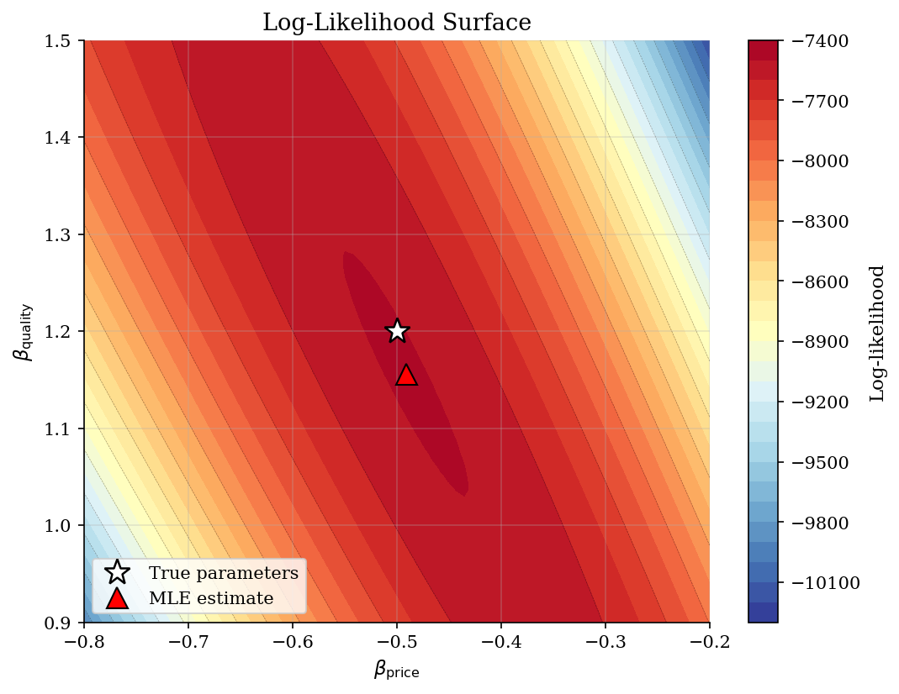
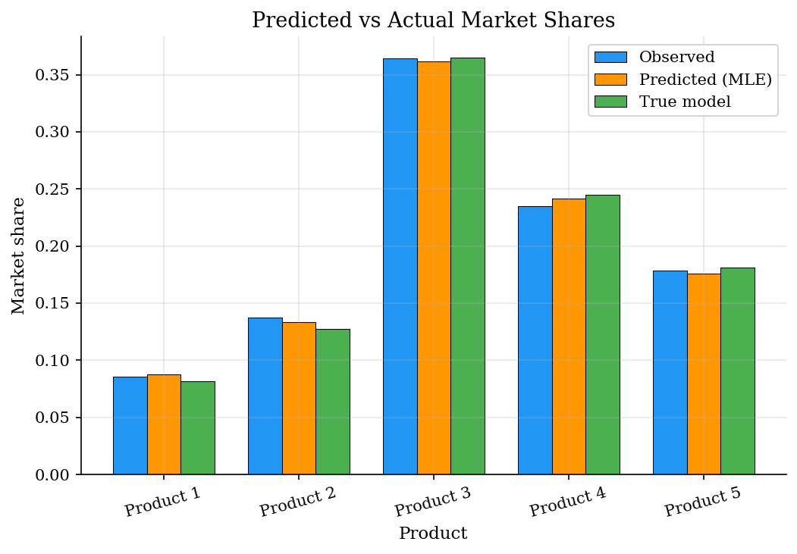
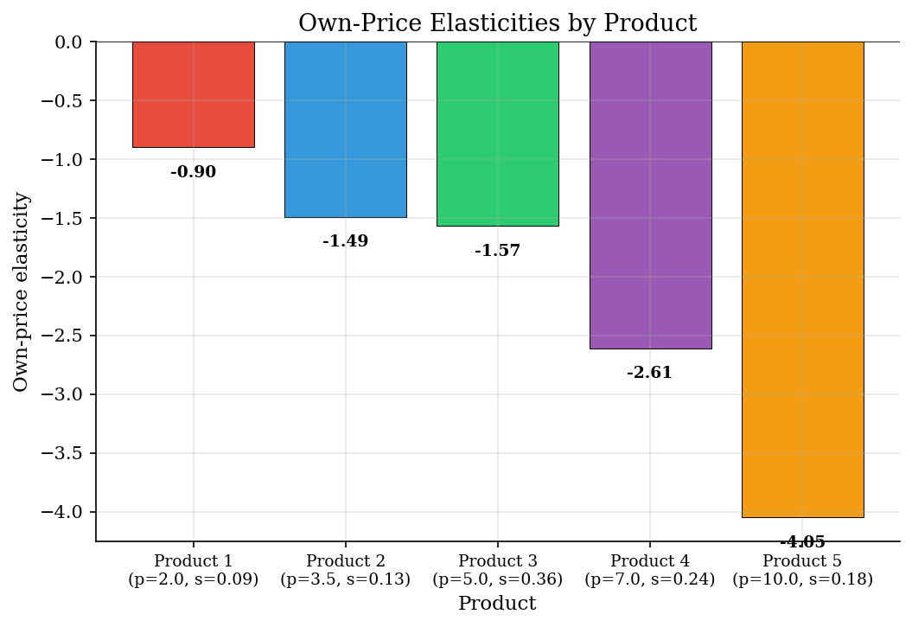
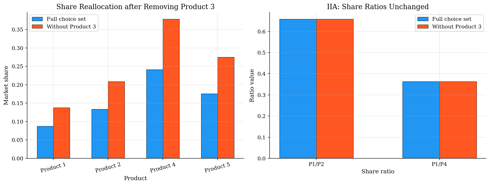

# Logit Discrete Choice Model

> Maximum likelihood estimation of a multinomial logit demand model with simulated consumer choice data.

## Overview

The multinomial logit model is the workhorse of discrete choice analysis in industrial organization. Consumers choose among $J$ differentiated products to maximize utility, which depends on observed product characteristics (price, quality) and an unobserved idiosyncratic taste shock drawn from a Type I Extreme Value distribution.

This distributional assumption yields the elegant logit choice probability formula and makes maximum likelihood estimation tractable. The model is the foundation for BLP (1995) and virtually all modern demand estimation in IO.

## Equations

**Utility:**
$$U_{ij} = \beta_{\text{price}} \, p_j + \beta_{\text{quality}} \, q_j + \varepsilon_{ij}$$

where $\varepsilon_{ij} \sim$ Type I Extreme Value (Gumbel) i.i.d. across consumers and products.

**Choice probability (McFadden, 1974):**
$$P(i \text{ chooses } j) = \frac{\exp(V_j)}{\sum_{k=1}^{J} \exp(V_k)}, \qquad V_j = \beta_{\text{price}} \, p_j + \beta_{\text{quality}} \, q_j$$

**Log-likelihood:**
$$\ell(\beta) = \sum_{i=1}^{N} \ln P(y_i \mid x; \beta)$$

**Own-price elasticity:**
$$\eta_{jj} = \beta_{\text{price}} \, p_j \, (1 - s_j)$$

**Cross-price elasticity (IIA):**
$$\eta_{jk} = -\beta_{\text{price}} \, p_k \, s_k$$

## Model Setup

| Parameter | Value | Description |
|-----------|-------|-------------|
| $N$ | 5000 | Number of consumers |
| $J$ | 5 | Number of alternatives |
| $\beta_{\text{price}}$ | -0.5 | True price coefficient |
| $\beta_{\text{quality}}$ | 1.2 | True quality coefficient |
| Estimation | MLE via BFGS | scipy.optimize.minimize |

## Solution Method

**Maximum Likelihood Estimation (MLE):** Given observed choices $\{y_i\}_{i=1}^N$ and product characteristics, we maximize the log-likelihood function:

$$\hat{\beta} = \arg\max_{\beta} \sum_{i=1}^N \ln P(y_i \mid x; \beta)$$

The logit log-likelihood is globally concave (McFadden, 1974), so any gradient-based optimizer converges to the unique global maximum. We use BFGS, which also produces an approximation to the inverse Hessian for standard error computation.

Converged in **9 iterations** (log-likelihood = -7493.95).

## Results


*Log-likelihood surface: the logit likelihood is globally concave, with the MLE close to the true parameters*


*Predicted vs actual market shares: the estimated model closely recovers observed choice frequencies*


*Own-price elasticities: higher-priced products have more elastic demand in the logit model*


*IIA property: removing an alternative does not change the ratio of choice probabilities between remaining alternatives*

**MLE Estimation Results: Estimated vs True Parameters**

| Parameter    |   True |   Estimate |   Std Error |   t-stat |   p-value |
|:-------------|-------:|-----------:|------------:|---------:|----------:|
| beta_price   |   -0.5 |    -0.4913 |      0.0174 |   -28.21 |         0 |
| beta_quality |    1.2 |     1.1559 |      0.0362 |    31.94 |         0 |

**Price Elasticity Matrix (row = product whose share changes, column = product whose price changes)**

| Product   |   Product 1 |   Product 2 |   Product 3 |   Product 4 |   Product 5 |
|:----------|------------:|------------:|------------:|------------:|------------:|
| Product 1 |      -0.896 |        0.23 |       0.889 |       0.83  |       0.863 |
| Product 2 |       0.086 |       -1.49 |       0.889 |       0.83  |       0.863 |
| Product 3 |       0.086 |        0.23 |      -1.568 |       0.83  |       0.863 |
| Product 4 |       0.086 |        0.23 |       0.889 |      -2.609 |       0.863 |
| Product 5 |       0.086 |        0.23 |       0.889 |       0.83  |      -4.051 |

## Economic Takeaway

The multinomial logit is the workhorse of discrete choice demand estimation, but its elegance comes at a cost: the **Independence of Irrelevant Alternatives (IIA)** property.

**Key insights:**
- MLE recovers the true parameters precisely with N=5000 observations. The logit likelihood is globally concave, so estimation is fast and reliable.
- Own-price elasticities depend on price level and market share: $\eta_{jj} = \beta_p \, p_j (1 - s_j)$. Higher-priced products are more elastic.
- **Cross-elasticities are proportional to market shares**, not to product similarity. When a product is removed, its share is reallocated to all remaining products in proportion to their existing shares. This is the same substitution pattern as in symmetric Bertrand competition.
- IIA is unrealistic: if a luxury product exits the market, the logit predicts its share goes equally (proportionally) to budget and premium products. The nested logit and mixed logit (BLP) relax this restriction.
- Despite its limitations, the logit remains the starting point for demand estimation because of its computational tractability and clean closed-form expressions.

## Reproduce

```bash
python run.py
```

## References

- McFadden, D. (1974). Conditional Logit Analysis of Qualitative Choice Behavior. In P. Zarembka (Ed.), *Frontiers in Econometrics*. Academic Press.
- Train, K. (2009). *Discrete Choice Methods with Simulation*. Cambridge University Press, 2nd edition.
- Berry, S., Levinsohn, J., and Pakes, A. (1995). Automobile Prices in Market Equilibrium. *Econometrica*, 63(4), 841-890.
