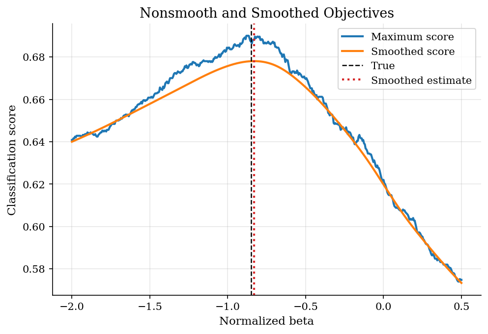
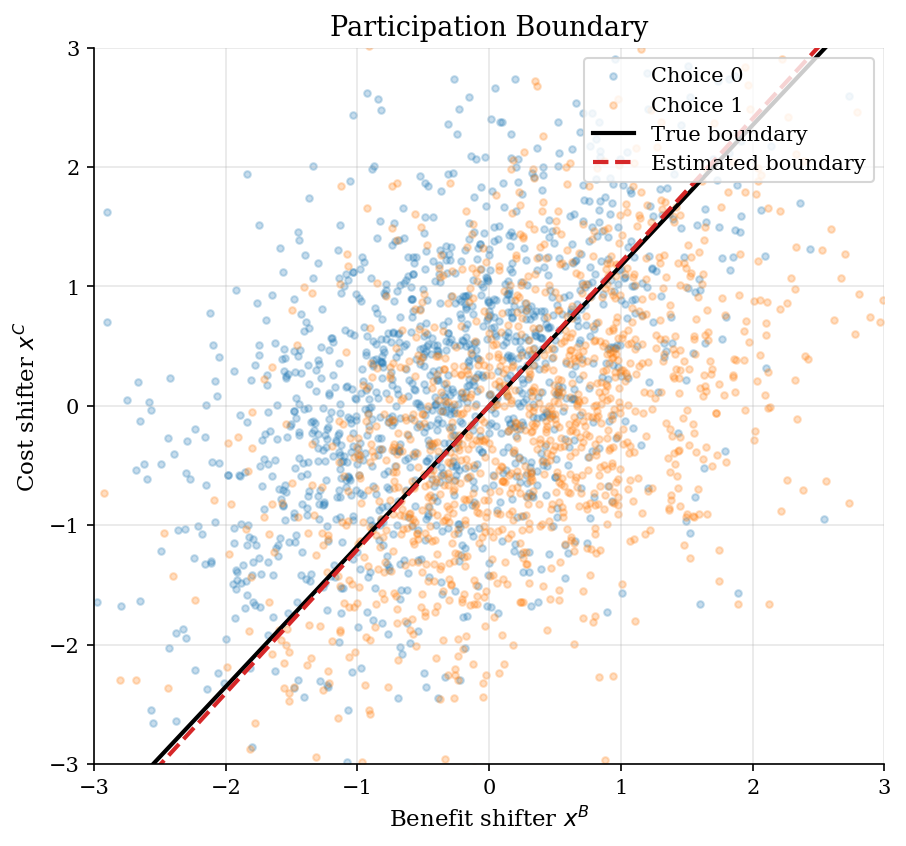
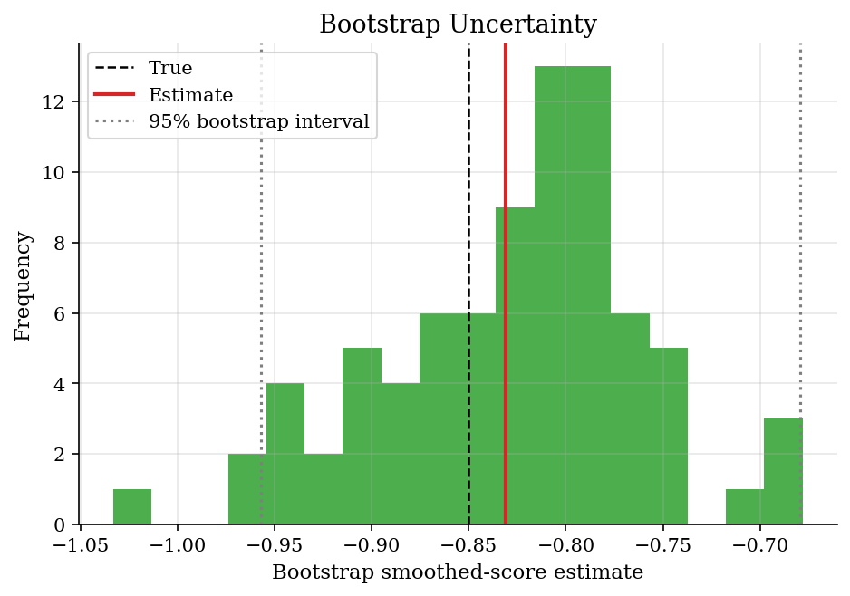

# Binary Participation with Maximum Score

## Overview

A worker enrolls in training when expected gains exceed travel and time costs. The econometrician observes participation and covariates, not latent surplus.

The object is the sign boundary of a binary choice index. We normalize the benefit coefficient to one and estimate the relative cost weight.

Maximum score searches for the index that classifies the most choices correctly. Its objective is flat and jumpy, so smoothing gives a cleaner numerical target.

## Equations

The simulated decision is a participation rule:

```math
y_i = 1\lbrace x^B_i+\beta x^C_i+\varepsilon_i \geq 0\rbrace.
```

Here $`x^B_i`$ is the benefit shifter, $`x^C_i`$ is the cost shifter, and $`\varepsilon_i`$ is an idiosyncratic error term.
A negative $`\beta`$ means higher costs lower participation.
Only the index direction is identified.
The coefficient on $`x^B_i`$ is normalized to one.
Manski's maximum-score estimator solves

```math
\hat\beta = \arg\max_b \frac{1}{n}\sum_i \left[y_i 1\lbrace x^B_i+b x^C_i\geq 0\rbrace + (1-y_i)1\lbrace x^B_i+b x^C_i<0\rbrace\right].
```

Smoothing replaces the hard indicator with a normal CDF:

```math
S_h(b)=\frac{1}{n}\sum_i \left[y_i \Phi((x^B_i+b x^C_i)/h) +(1-y_i)\lbrace1-\Phi((x^B_i+b x^C_i)/h)\rbrace\right].
```

## Worked Numerical Example

Four workers with benefit shifter $`x^B_i = 1`$ for all $`i`$ and cost shifters $`x^C = (0.3, 1.0, -0.5, -1.2)`$. The observed participation decisions are $`y = (1, 1, 0, 0)`$. The normalized benefit coefficient is one, so the index is $`x^B_i + b\, x^C_i`$.

Evaluate the maximum-score objective at three candidate cost weights $`b \in \{-1.0,\; 0.5,\; 1.0\}`$. The objective counts the share of choices correctly classified:

```math
S(b) = \frac{1}{4}\sum_{i=1}^{4}
  \left[y_i\,\mathbf{1}\lbrace x^B_i + b\,x^C_i \geq 0\rbrace
       + (1-y_i)\,\mathbf{1}\lbrace x^B_i + b\,x^C_i < 0\rbrace\right].
```

At $`b = 1.0`$, the four index values are $`1 + 0.3 = 1.3`$, $`1 + 1.0 = 2.0`$, $`1 - 0.5 = 0.5`$, $`1 - 1.2 = -0.2`$. Signs are $`(+, +, +, -)`$, so predicted participation is $`(1, 1, 1, 0)`$. Comparing to $`y = (1, 1, 0, 0)`$: workers 1, 2, and 4 are classified correctly; worker 3 is not:

```math
S(1.0) = \frac{1}{4}(1 + 1 + 0 + 1) = \frac{3}{4} = 0.75.
```

At $`b = 0.5`$, the index values are $`1.15`$, $`1.5`$, $`0.75`$, $`0.4`$. All four are positive, so predicted participation is $`(1, 1, 1, 1)`$. Workers 1 and 2 are correctly classified; workers 3 and 4 are not:

```math
S(0.5) = \frac{1}{4}(1 + 1 + 0 + 0) = \frac{2}{4} = 0.50.
```

At $`b = -1.0`$, the index values are $`1 - 0.3 = 0.7`$, $`1 - 1.0 = 0.0`$, $`1 + 0.5 = 1.5`$, $`1 + 1.2 = 2.2`$. Treating the boundary $`\geq 0`$ as participating, all four indices are non-negative, so predicted participation is $`(1, 1, 1, 1)`$. Only workers 1 and 2 are correctly classified:

```math
S(-1.0) = \frac{1}{4}(1 + 1 + 0 + 0) = \frac{2}{4} = 0.50.
```

Comparing the three candidates:

```math
S(1.0) = 0.75 > S(0.5) = S(-1.0) = 0.50.
```

The cost-shifter index $`x^B_i + b\,x^C_i`$ separates participants from non-participants best when $`b`$ is positive, because a positive weight on $`x^C`$ pushes workers with low or negative cost shifters below the threshold. The grid maximum-score estimator selects

```math
\boxed{\hat{b} = 1.0}.
```

A negative $`\hat{b}`$ would imply that higher costs raise participation, contradicting the data pattern. This four-observation example shows why grid search over $`b`$ is sufficient: the step-function objective changes only when the index crosses zero for some worker, so the maximum always occurs between two such crossing points.

## Model Setup

| Object | Value | Role |
|--------|-------|------|
| Observations | 2,500 | Simulated participation decisions |
| Normalized coefficient | 1 | Benefit shifter weight |
| True $`\beta`$ | -0.85 | Cost shifter weight |
| Error distribution | heteroskedastic logistic | Median zero, logit likelihood misspecified |
| Grid points | 501 | Direct search over nonsmooth objective |
| Smoothing bandwidth | 0.25 | Smooth boundary approximation |
| Bootstrap draws | 80 | Finite-sample check for smoothed estimate |

## Solution Method

The score is a step function, so local derivatives miss the jumps. The code first evaluates candidate cost weights on a grid. It then replaces the indicator with Phi((x^B_i+b x^C_i)/h) and optimizes the smooth approximation. The bandwidth controls how sharply points near the boundary switch classifications.

```text
Algorithm: estimate a binary participation index
Input: choices y_i, benefit shifter x^B_i, cost shifter x^C_i, grid B, bandwidth h
Normalize the benefit-shifter coefficient to one
For each b in B:
  classify i as a participant when x^B_i + b x^C_i >= 0
  record the share of choices classified correctly
Choose the grid value with the largest score
For the smoothed estimate:
  replace the hard classification rule with Phi((x^B_i+b x^C_i)/h)
  maximize the smooth score over b
Bootstrap observations and repeat the smoothed estimate
Output: normalized cost weight, classification score, and bootstrap interval
```

The normalization fixes the scale. Multiplying every coefficient by a positive constant leaves the surplus sign unchanged. The estimate is a cost weight relative to the benefit shifter.

## Results

The raw score is flat when moving the boundary changes no classifications. The smoothed curve peaks at **-0.831**, close to the true cost weight **-0.850**. The estimate keeps the negative cost effect without using the logit likelihood.

Smoothing keeps the same boundary target while making the search surface easier to optimize.



The scatterplot shows the boundary problem. Benefit shifters raise participation, while cost shifters move choices the other way. Noise leaves overlap, so no linear boundary classifies everyone correctly.

The estimated median-surplus boundary tracks the simulated boundary despite heteroskedastic noise.



The nonparametric bootstrap interval is **[-0.957, -0.679]**. It summarizes how much the smoothed estimate moves across resampled data.

The bootstrap distribution shows finite-sample uncertainty for the smoothed estimator.



**Estimator comparison**

| Estimator                |   Normalized beta |    Error |   Classification score |
|:-------------------------|------------------:|---------:|-----------------------:|
| True participation index |          -0.85    |  0       |                 0.6872 |
| Grid maximum score       |          -0.88    | -0.03    |                 0.69   |
| Smoothed maximum score   |          -0.83084 |  0.01916 |                 0.6884 |
| Misspecified logit ratio |          -0.66013 |  0.18987 |                 0.6816 |

The score is the share of choices classified by the normalized index.

**Score and bootstrap diagnostics**

| Diagnostic                     |      Value |
|:-------------------------------|-----------:|
| Choice-one share               |  0.4908    |
| Grid maximum score             |  0.69      |
| Smoothed score                 |  0.678026  |
| Smoothed optimizer success     |  1         |
| Smoothed optimizer evaluations | 22         |
| Bootstrap mean                 | -0.826309  |
| Bootstrap standard deviation   |  0.0683461 |
| Bootstrap lower 95             | -0.95708   |
| Bootstrap upper 95             | -0.679272  |

## Takeaway

Maximum score estimates the median-surplus boundary without a full probability model. The objective counts correct classifications, so it is nonsmooth. Smoothing gives a continuous search target while preserving the normalized-index interpretation.

## References

- [Manski, C. F. (1975). Maximum Score Estimation of the Stochastic Utility Model of Choice. *Journal of Econometrics*, 3(3), 205-228.](https://doi.org/10.1016/0304-4076(75)90032-9)
- [Horowitz, J. L. (1992). A Smoothed Maximum Score Estimator for the Binary Response Model. *Econometrica*, 60(3), 505-531.](https://doi.org/10.2307/2951573)
