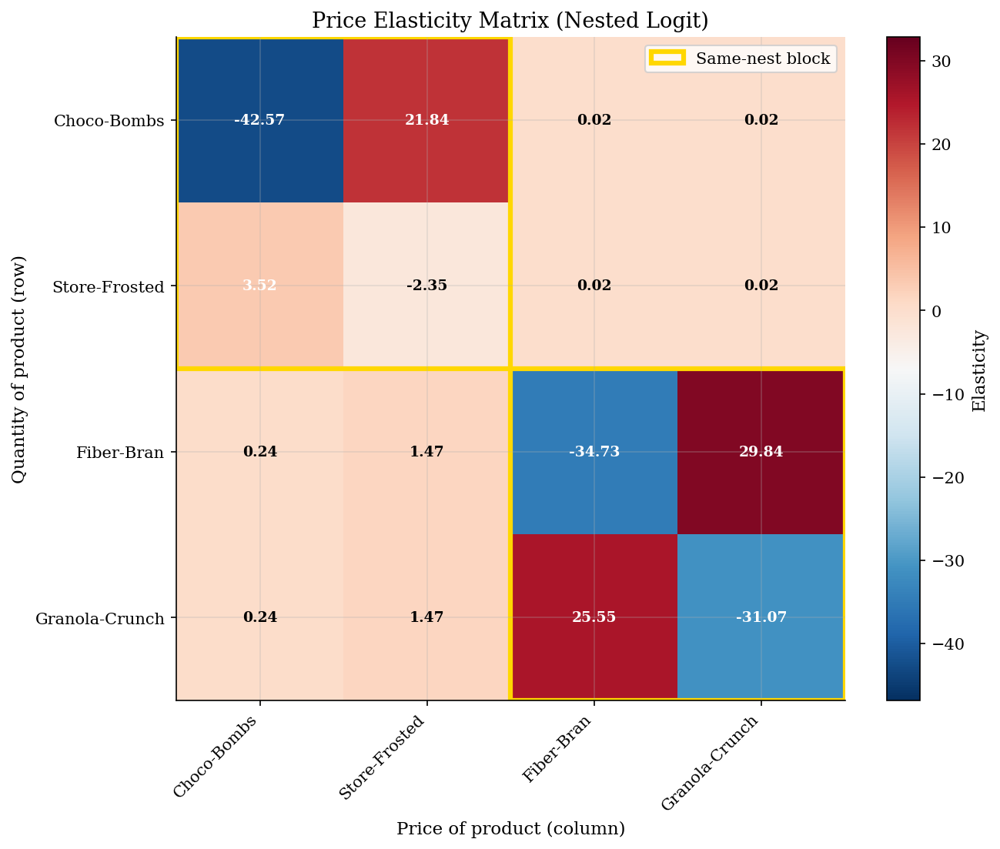
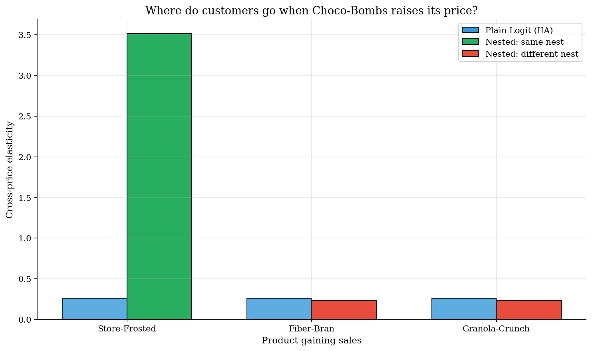
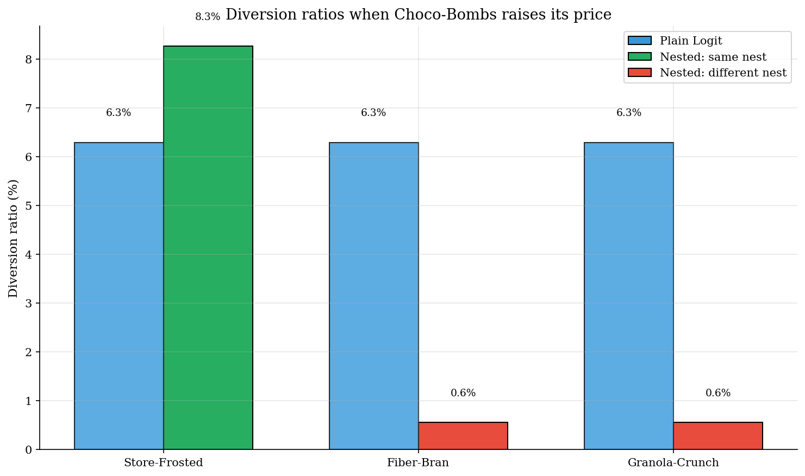
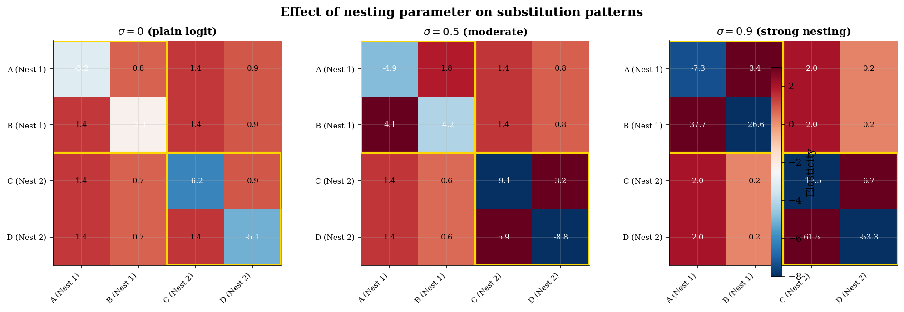

# Nested Logit Demand Model

> The simplest fix for the IIA problem: grouping products into nests so that closer substitutes have higher cross-price elasticities.

## Overview

The plain logit imposes the Independence of Irrelevant Alternatives (IIA): the ratio of any two products' market shares is independent of the attributes of all other products. This means a price increase for Choco-Bombs sends customers to Fiber-Bran and Store-Frosted in proportion to their market shares, regardless of how similar those products are.

The **nested logit** fixes this by grouping products into nests (e.g., sugary vs healthy cereals). Within a nest, products are closer substitutes. The nesting parameter $\sigma \in [0,1)$ controls the degree of within-nest correlation:
- $\sigma = 0$: collapses to plain logit (IIA holds)
- $\sigma \to 1$: products within a nest are perfect substitutes

This is the first step in the Berry (1994) hierarchy: logit $\to$ nested logit $\to$ random-coefficients logit (BLP).

## Equations

$$s_j = s_{j|g} \cdot s_g$$

**Within-nest share:**
$$s_{j|g} = \frac{\exp\!\bigl(\delta_j / (1-\sigma)\bigr)}{D_g}, \qquad D_g = \sum_{k \in g} \exp\!\bigl(\delta_k / (1-\sigma)\bigr)$$

**Nest share:**
$$s_g = \frac{D_g^{\,1-\sigma}}{1 + \sum_h D_h^{\,1-\sigma}}$$

**Berry inversion (estimation equation):**
$$\ln s_j - \ln s_0 = \mathbf{x}_j \beta - \alpha \, p_j + \sigma \ln s_{j|g} + \xi_j$$

Both $p_j$ and $\ln s_{j|g}$ are endogenous; we instrument with cost shifters,
rival characteristics, number of products in nest, and same-nest rival characteristics.

## Model Setup

| Parameter | Value | Description |
|-----------|-------|-------------|
| $\alpha$ | 1.5 | Price sensitivity |
| $\beta_{\text{sugar}}$ | 0.3 | Taste for sugar |
| $\beta_0$ | 1.0 | Base utility |
| $\sigma$ | 0.7 | Nesting parameter |
| Products | 4 (2 nests of 2) | Sugary: Choco-Bombs, Store-Frosted; Healthy: Fiber-Bran, Granola-Crunch |
| Markets | 30 | Cross-sectional variation for IV |

## Solution Method

**Two-Stage Least Squares (2SLS)** on the Berry-inverted equation.

The nested logit introduces a second endogenous variable, $\ln s_{j|g}$, because within-nest shares depend on unobserved quality $\xi_j$. We need instruments for **both** price and within-nest share:

| Instrument | Targets | Rationale |
|------------|---------|----------|
| Cost shifter | Price | Supply-side variation |
| Rival sugar (all) | Price | BLP-style characteristic sum |
| Number of products in nest | $\ln s_{j|g}$ | Affects within-nest competition |
| Same-nest rival sugar | $\ln s_{j|g}$ | Within-nest characteristic variation |

## Results


*Nested logit elasticity matrix with nest blocks highlighted. Same-nest cross-elasticities (inside gold boxes) are higher than cross-nest elasticities.*


*Logit vs nested logit cross-elasticities when Choco-Bombs raises its price. Nested logit sends more customers to Store-Frosted (same nest).*


*Diversion ratios: fraction of Choco-Bombs' lost sales captured by each rival. Nested logit predicts much higher diversion to same-nest products.*


*Effect of the nesting parameter sigma on substitution patterns. As sigma increases, within-nest substitution intensifies while cross-nest substitution stays flat.*

**Parameter estimates: true values vs plain logit vs nested logit**

| Parameter   |   True | Logit   |   Nested Logit |
|:------------|-------:|:--------|---------------:|
| alpha       |    1.5 | 1.605   |          1.468 |
| beta_sugar  |    0.3 | 0.413   |          0.277 |
| beta_const  |    1   | -0.198  |          1.568 |
| sigma       |    0.7 | ---     |          0.913 |

## Economic Takeaway

The nested logit is the simplest departure from the IIA assumption. By grouping products into nests, it allows consumers who leave one product to disproportionately switch to similar products rather than spreading evenly across the market.

**Key insights:**
- The nesting parameter $\sigma$ controls within-nest correlation. We estimated $\hat{\sigma} = 0.913$ vs the true value of 0.7, confirming that products within a nest are closer substitutes.
- Same-nest cross-price elasticities are **higher** than cross-nest elasticities. When Choco-Bombs raises its price, customers primarily switch to Store-Frosted (also sugary), not to Fiber-Bran.
- The plain logit gets the overall price sensitivity roughly right but completely misses the substitution pattern -- this matters for merger analysis and targeted pricing.
- Estimation requires instruments for **both** price and the within-nest share $\ln s_{j|g}$, since both are endogenous. Standard BLP-style instruments (rival characteristics, nest size) serve this purpose.

## Reproduce

```bash
python run.py
```

## References

- Berry, S. (1994). Estimating Discrete-Choice Models of Product Differentiation. *RAND Journal of Economics*, 25(2), 242--262.
- McFadden, D. (1978). Modelling the Choice of Residential Location. In A. Karlqvist et al. (Eds.), *Spatial Interaction Theory and Planning Models*. North-Holland.
- Train, K. (2009). *Discrete Choice Methods with Simulation*. Cambridge University Press, 2nd edition, Ch. 4.
