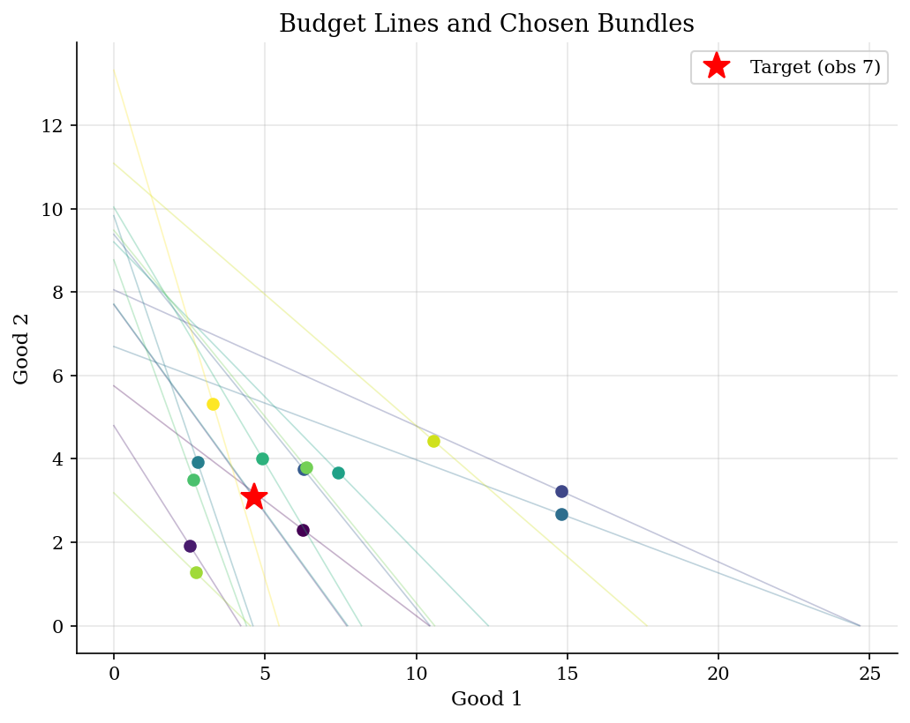
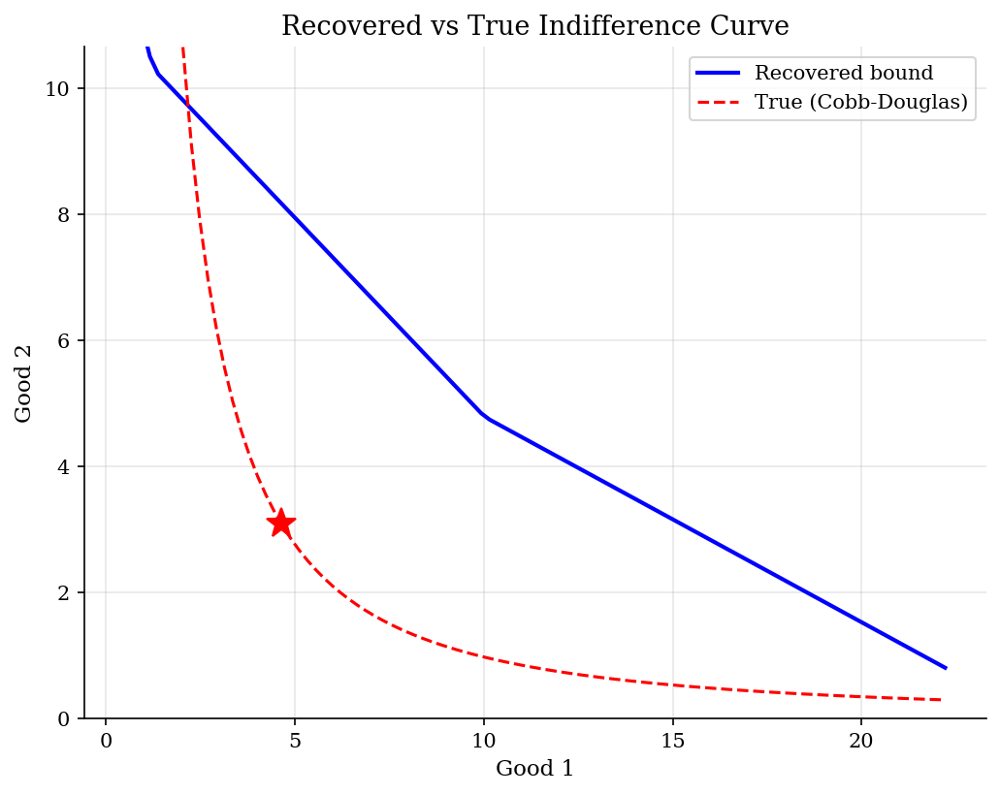
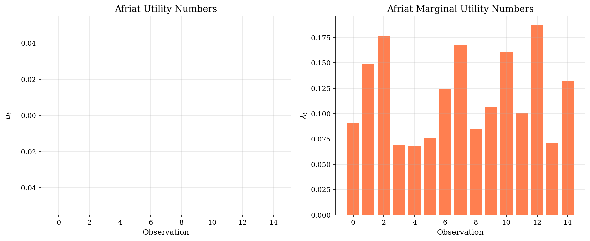

# Preference Recoverability

> Bounding utility functions and indifference curves from revealed preference data.

## Overview

Afriat's theorem tells us *whether* data is consistent with utility maximization. Preference recoverability goes further: given GARP-consistent data, *what can we learn* about the underlying utility function?

Using Varian's (1982) construction, we can compute Afriat numbers $(u_t, \lambda_t)$ that form a piecewise-linear utility function rationalizing the data. These numbers provide bounds on indifference curves and welfare measures (compensating variation) without assuming any functional form for utility.

## Equations

**Afriat's theorem:** Data $\{(p_t, x_t)\}_{t=1}^T$ satisfies GARP if and only if there exist numbers $u_t, \lambda_t > 0$ such that:
$$u_t - u_s \leq \lambda_s \, p_s \cdot (x_t - x_s) \quad \forall \, t, s$$

**Recovered utility at any bundle** $x$:
$$\hat{U}(x) = \min_s \left\{ u_s + \lambda_s \, p_s \cdot (x - x_s) \right\}$$

This is a piecewise-linear, concave function that passes through all observed points.

**Indifference curve bounds:** For a given utility level $\bar{u}$, the set of bundles with $\hat{U}(x) = \bar{u}$ can be bounded using the Afriat inequalities.

**Compensating variation:** $CV_t = \lambda_t \cdot \Delta p \cdot x_t$ provides a bound on welfare change from price changes.

## Model Setup

| Parameter | Value | Description |
|-----------|-------|-------------|
| True $\alpha$ | 0.6 | Cobb-Douglas parameter |
| $T$ | 15 | Number of observations |
| Goods | 2 | For visualization |
| GARP violations | 0 | Confirmed zero |

## Solution Method

**Step 1:** Compute the direct revealed preference relation $R$ and its transitive closure $R^*$ via Warshall's algorithm.

**Step 2:** Construct Afriat numbers $(u_t, \lambda_t)$ satisfying the Afriat inequalities using Varian's iterative tightening procedure.

**Step 3:** Use the Afriat numbers to bound indifference curves and compute compensating variation bounds for hypothetical price changes.

## Results


*Budget constraints and optimal choices from Cobb-Douglas consumer*


*Nonparametric bounds on indifference curve vs true Cobb-Douglas*


*Afriat numbers (u_t, lambda_t) that rationalize the data*

**Afriat Numbers and Welfare Bounds**

|   Observation |    x1 |   x2 |   u_t |   lambda_t |   CV bound |
|--------------:|------:|-----:|------:|-----------:|-----------:|
|             0 |  6.26 | 2.3  |     0 |     0.0903 |       0.18 |
|             1 |  2.52 | 1.92 |     0 |     0.1491 |       0.18 |
|             2 |  4.62 | 3.08 |     0 |     0.177  |       0.18 |
|             3 | 14.81 | 3.22 |     0 |     0.069  |       0.18 |
|             4 |  6.27 | 3.75 |     0 |     0.0682 |       0.18 |
|             5 | 14.79 | 2.68 |     0 |     0.0764 |       0.18 |
|             6 |  2.76 | 3.93 |     0 |     0.1243 |       0.18 |
|             7 |  4.64 | 3.08 |     0 |     0.1673 |       0.18 |
|             8 |  7.43 | 3.68 |     0 |     0.0844 |       0.18 |
|             9 |  4.91 | 4.01 |     0 |     0.1064 |       0.18 |
|            10 |  2.63 | 3.51 |     0 |     0.1608 |       0.18 |
|            11 |  6.36 | 3.79 |     0 |     0.1005 |       0.18 |
|            12 |  2.71 | 1.27 |     0 |     0.1871 |       0.18 |
|            13 | 10.58 | 4.43 |     0 |     0.071  |       0.18 |
|            14 |  3.28 | 5.33 |     0 |     0.1318 |       0.18 |

## Economic Takeaway

Preference recoverability shows how much we can learn without functional form assumptions:

**Key insights:**
- **Nonparametric identification**: Afriat numbers provide a complete characterization of all utility functions consistent with the data. No need to assume Cobb-Douglas, CES, or any specific functional form.
- **Indifference curve bounds**: The recovered bounds on indifference curves tighten as more data becomes available. With enough observations, the bounds converge to the true indifference curve.
- **Welfare bounds**: Compensating variation can be bounded without knowing the exact utility function — useful for policy evaluation when preferences are unknown.
- **Limitations**: The bounds can be wide with few observations or when prices don't vary enough to reveal preferences in different regions of the consumption space.

## Reproduce

```bash
python run.py
```

## References

- Afriat, S. (1967). "The Construction of Utility Functions from Expenditure Data." *International Economic Review*, 8(1).
- Varian, H. (1982). "The Nonparametric Approach to Demand Analysis." *Econometrica*, 50(4).
- Varian, H. (2006). "Revealed Preference." In *Samuelsonian Economics and the Twenty-First Century*, Oxford University Press.
