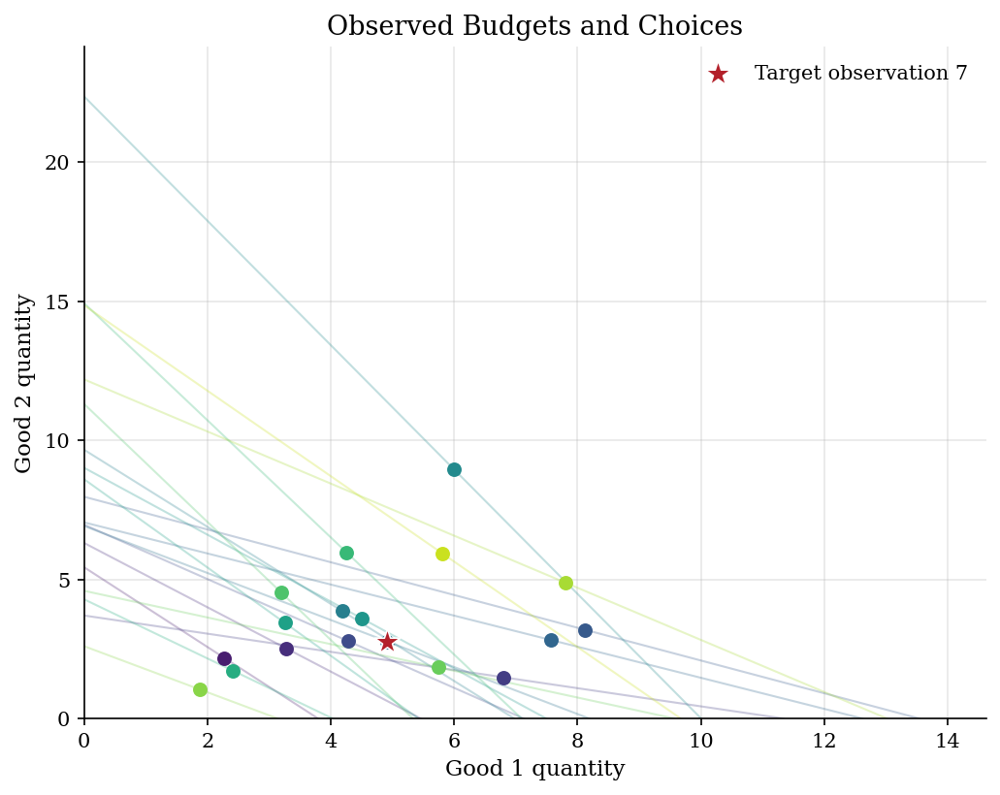
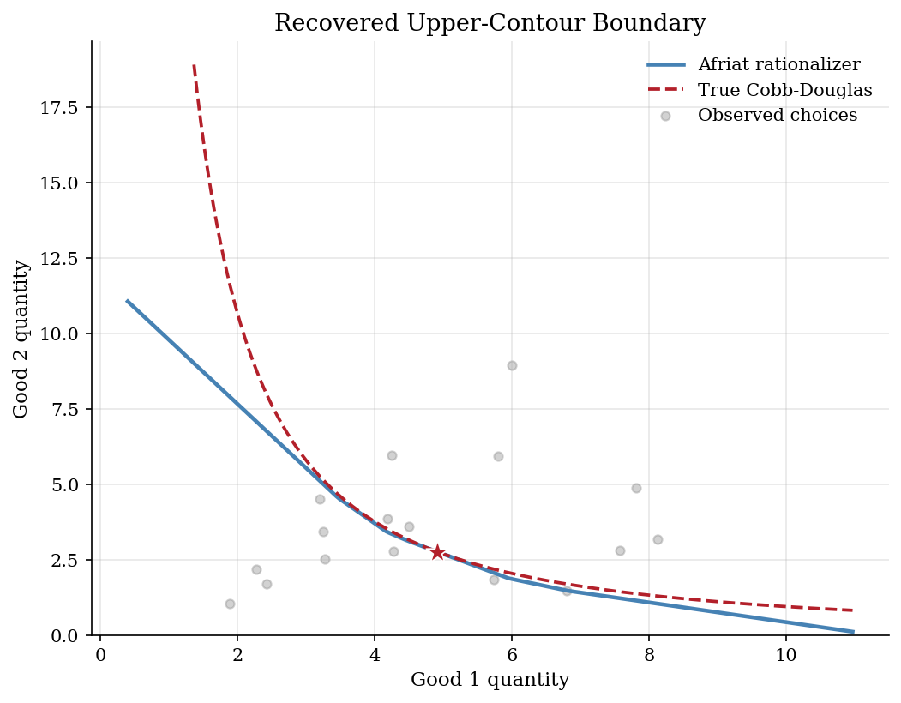
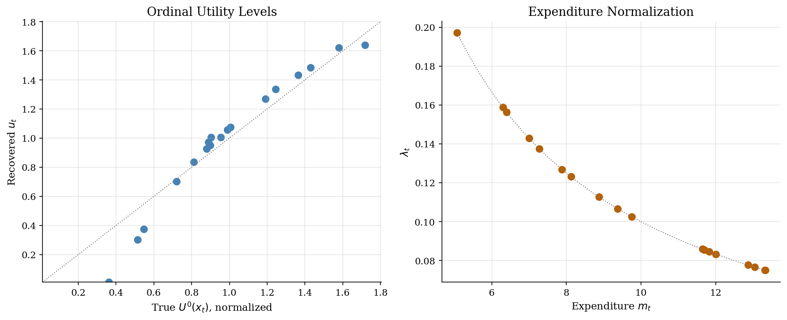

# Recovering Preference Bounds from Budget Choices

## Overview

Suppose we observe a consumer choosing bundles from several two-good budgets. Prices rotate the budget line, and income shifts it. The analyst sees prices and chosen bundles, not the utility function.

The object is the preference ordering implied by these finite choices. A GARP-consistent sample can be rationalized by many utility functions. We recover one upper-contour boundary through a chosen bundle.

The computation uses Afriat inequalities. The supporting slopes are fixed to one over expenditure before the program runs, so a linear program only finds the utility scores. The lower envelope of those supports draws the contour.

## Equations

There are two goods and $`T`$ budget-choice observations. Observation $`t`$ has
prices $`p_t=(p_{1t},p_{2t})\in\mathbb{R}_{++}^{2}`$ and chosen bundle
$`x_t=(x_{1t},x_{2t})\in\mathbb{R}_{+}^{2}`$. Expenditure is $`m_t=p_t\cdot x_t`$.

Afriat recovery asks for ordinal utility scores $`u_t`$ and positive supporting
slopes $`\lambda_t`$ such that

```math
u_i-u_j \leq \lambda_j p_j\cdot(x_i-x_j)
\qquad \text{for all } i,j=1,\ldots,T .
```

When these inequalities are feasible, one rationalizing utility index is

```math
\widehat U(y)=\min_{j=1,\ldots,T}
\left[u_j+\lambda_j p_j\cdot(y-x_j)\right].
```

This utility is the lower envelope of affine supporting functions. It is
concave, monotone when prices and $`\lambda_j`$ are positive, and satisfies
$`\widehat U(x_t)=u_t`$ at the observed choices.

For a target observation $`k`$, the recovered upper-contour set is

```math
\widehat U(y)\geq u_k .
```

Writing $`y=(y_1,y_2)`$, its lower boundary can be computed pointwise:

```math
y_2(y_1) =
\max_{j=1,\ldots,T}
\left[
x_{2j} +
\frac{
u_k-u_j-\lambda_j p_{1j}(y_1-x_{1j})
}{
\lambda_j p_{2j}
}
\right].
```

The data-generating benchmark, used only for comparison, is

```math
U^0(x)=x_1^{\alpha}x_2^{1-\alpha},\qquad \alpha=0.60 .
```

## Worked Numerical Example

Take $`T = 2`$ observations: prices $`p_1 = (1, 2)`$ with chosen bundle $`x_1 = (3, 1)`$, and
$`p_2 = (2, 1)`$ with chosen bundle $`x_2 = (1, 3)`$. Expenditures are
$`m_1 = p_1 \cdot x_1 = 5`$ and $`m_2 = p_2 \cdot x_2 = 5`$. Supporting slopes are
$`\lambda_1 = \lambda_2 = 1/5 = 0.2`$.

Check GARP first. For a revealed-preference cycle to exist, $`x_2`$ must be affordable
under budget 1 and $`x_1`$ affordable under budget 2. Checking:

```math
p_1 \cdot x_2 = (1)(1) + (2)(3) = 7 > 5 = m_1,
\qquad
p_2 \cdot x_1 = (2)(3) + (1)(1) = 7 > 5 = m_2.
```

Neither bundle was affordable under the other budget. No revealed preference is
established in either direction, so the sample passes GARP with no cycle.

Now solve the Afriat LP. With $`T = 2`$, the inequalities reduce to two constraints.
Set $`u_1 = 0`$. The inequality for the pair $`(i=2, j=1)`$ gives

```math
u_2 - u_1 \leq \lambda_1\, p_1 \cdot (x_2 - x_1)
= 0.2\bigl[(1)(1-3) + (2)(3-1)\bigr]
= 0.2 \times 2 = 0.4.
```

The inequality for the pair $`(i=1, j=2)`$ gives

```math
u_1 - u_2 \leq \lambda_2\, p_2 \cdot (x_1 - x_2)
= 0.2\bigl[(2)(3-1) + (1)(1-3)\bigr]
= 0.2 \times 2 = 0.4,
```

so $`u_2 \geq -0.4`$. Combined with non-negativity, the feasible range is
$`u_2 \in [0,\, 0.4]`$. Choosing $`u_2 = 0.4`$ (binding on the first inequality) gives
Afriat scores $`u_1 = 0`$ and $`u_2 = 0.4`$.

Compute bounds at $`y = (2, 2)`$. Evaluate $`p_t \cdot y = (1)(2) + (2)(2) = 6`$ for
$`t = 1`$ and $`p_t \cdot y = (2)(2) + (1)(2) = 6`$ for $`t = 2`$. Since
$`p_t \cdot y = 6 > 5 = m_t`$ for both observations, $`y`$ lies outside both budget sets.
No observation has $`p_t \cdot x_t \geq p_t \cdot y`$, so the data place no upper bound
on $`U(y)`$ from direct revealed preference.

For the lower bound, both observations satisfy $`p_t \cdot y \geq p_t \cdot x_t`$,
meaning $`y`$ is more expensive than $`x_t`$ at every observed price vector. A consumer
who faces prices $`p_t`$ and can afford $`y`$ can also afford $`x_t`$, so

```math
U_{\mathrm{low}}(y) = \max_{t:\, p_t \cdot y \,\geq\, p_t \cdot x_t} u_t
= \max(u_1,\, u_2) = \max(0,\, 0.4) = 0.4.
```

Apply the Afriat recovery at $`y`$. The constructed utility index evaluates the lower
envelope of supporting affine functions:

```math
\widehat U(y) = \min_{j=1,2}\bigl[u_j + \lambda_j\, p_j \cdot (y - x_j)\bigr].
```

For $`j = 1`$:

```math
u_1 + \lambda_1\, p_1 \cdot (y - x_1)
= 0 + 0.2\bigl[(1)(2-3) + (2)(2-1)\bigr]
= 0.2 \times 1 = 0.2.
```

For $`j = 2`$:

```math
u_2 + \lambda_2\, p_2 \cdot (y - x_2)
= 0.4 + 0.2\bigl[(2)(2-1) + (1)(2-3)\bigr]
= 0.4 + 0.2 \times 1 = 0.6.
```

Taking the minimum: $`\widehat U(y) = \min(0.2,\, 0.6) = 0.2`$. The envelope is
determined by observation 1; observation 2 contributes a slack bound of 0.6. With two
observations neither of which was in the other budget, the sample establishes only a
lower bound on $`U(y)`$:

```math
\boxed{U(y) \geq 0.4.}
```

The Afriat function assigns $`\widehat U(y) = 0.2`$, one member of the rationalizing
family. The gap between 0.2 and the lower bound 0.4 reflects partial identification:
with $`y`$ outside both observed budget sets, different normalizations of the Afriat LP
assign different values at $`y`$, and the two-observation sample cannot pin down
$`U(y)`$ to a closed interval.

## Model Setup

| Object | Value | Role in the exercise |
|---|---:|---|
| Observations $`T`$ | 18 | Price-bundle pairs observed by the analyst |
| Goods | 2 | Makes the recovered contour visible |
| True $`\alpha`$ | 0.60 | Cobb-Douglas benchmark, hidden from recovery |
| Income range | [5.07, 13.33] | Moves budget lines outward or inward |
| Price range | [0.57, 1.96] | Rotates the observed budgets |
| GARP violations | 0 | Screen before utility recovery |
| Max Afriat residual | 1.30e-15 | Feasibility error from the inequalities |
| Target observation | 7 | Bundle whose contour is drawn |

## Solution Method

Afriat recovery uses a linear program because the unknown utility scores enter only through pairwise inequalities. The GARP screen protects the economic interpretation: if a strict revealed-preference cycle exists, no monotone concave utility can rationalize all choices. Once the screen passes, the linear program chooses one ordinal utility score for each observed bundle. The lower envelope then extends those scores to nearby bundles.

```text
Algorithm: Afriat contour recovery
Input: budgets (p_t, x_t) for t=1,...,T and target observation k
Output: recovered utility index U_hat and contour through x_k

1. Mark i R j when bundle x_j was affordable under budget i.
2. Close R transitively and check for a strict revealed-preference reversal.
3. Set lambda_t = 1 / (p_t . x_t) to normalize supporting slopes.
4. Solve for ordinal scores u_t subject to
       u_i - u_j <= lambda_j p_j . (x_i - x_j) for every pair (i,j),
       sum_t u_t = T, and u_t >= 0.
5. Define U_hat(y) = min_j [u_j + lambda_j p_j . (y - x_j)].
6. For a grid of y_1 values, compute the smallest y_2 that satisfies
       U_hat((y_1,y_2)) >= u_k.
```

## Results

Each line is an observed budget set. Each dot is the chosen bundle. Prices rotate budget lines, and income shifts them. The starred bundle is the target contour. The recovery ignores the Cobb-Douglas source.



The blue curve is not a Cobb-Douglas estimate. It is one concave contour through the target choice. It also rationalizes every observed bundle. The dashed curve is the true simulation contour. It is shown only as a benchmark. On the plotted overlap, the median recovered-to-true $`x_2`$ ratio is **0.86**. The largest absolute contour gap is **9.89** units of good 2.



Afriat numbers are a finite-data certificate. The scores $`u_t`$ rank observed bundles while respecting budget comparisons. The $`\lambda_t`$ values give supporting slopes in utility units. The simulated sample lets us compare the recovered ordering with true utility. The correlation is **0.973**.



The last column checks that recovered utility equals $`u_t`$ at each observed bundle. The true-utility column is a simulation diagnostic, not an input.

**Afriat numbers and fit diagnostics**

|   Observation |   Expenditure |    Utility ($`u_t`$) |   Multiplier ($`\lambda_t`$) |   True U normalized |   Fit error |
|--------------:|--------------:|-------:|-----------:|--------------------:|------------:|
|             1 |          6.3  | 0.3738 |     0.1587 |              0.5457 |    0        |
|             2 |          9.76 | 0.7013 |     0.1025 |              0.7205 |    0        |
|             3 |          7.27 | 1.0046 |     0.1376 |              0.9025 |    0        |
|             4 |         11.7  | 0.9263 |     0.0855 |              0.8797 |    0        |
|             5 |          9.37 | 1.4329 |     0.1067 |              1.3645 |    0        |
|             6 |         13.33 | 1.3368 |     0.075  |              1.2453 |    0        |
|             7 |         12    | 1.0048 |     0.0833 |              0.9537 |    0        |
|             8 |          8.12 | 1.0568 |     0.1231 |              0.9896 |    0        |
|             9 |         13.32 | 1.6398 |     0.0751 |              1.7191 |    0        |
|            10 |         13.05 | 1.0747 |     0.0766 |              1.0049 |    0        |
|            11 |          8.87 | 0.8358 |     0.1127 |              0.8122 |    0        |
|            12 |          7.88 | 0.3015 |     0.1269 |              0.5145 |    0        |
|            13 |         11.82 | 1.2694 |     0.0846 |              1.1898 |    0        |
|            14 |          6.4  | 0.9517 |     0.1563 |              0.8971 |    0        |
|            15 |          7    | 0.9713 |     0.1429 |              0.8885 |   -1.33e-15 |
|            16 |          5.07 | 0.0113 |     0.1971 |              0.3625 |    0        |
|            17 |         12.87 | 1.6214 |     0.0777 |              1.5794 |    0        |
|            18 |         11.65 | 1.4857 |     0.0858 |              1.4304 |    0        |

## Takeaway

Finite choices can do more than test rationalizability. They still do not identify one full utility function. Afriat numbers recover one utility index and one local contour. Those objects respect every observed budget comparison. Budgets pin down preferences only where prices create support.

## References

- Afriat, S. N. (1967). The Construction of Utility Functions from Expenditure Data. *International Economic Review*, 8(1), 67-77.
- Varian, H. R. (1982). The Nonparametric Approach to Demand Analysis. *Econometrica*, 50(4), 945-973.
- Varian, H. R. (2006). Revealed Preference. In M. Szenberg et al. (Eds.), *Samuelsonian Economics and the Twenty-First Century*. Oxford University Press.
