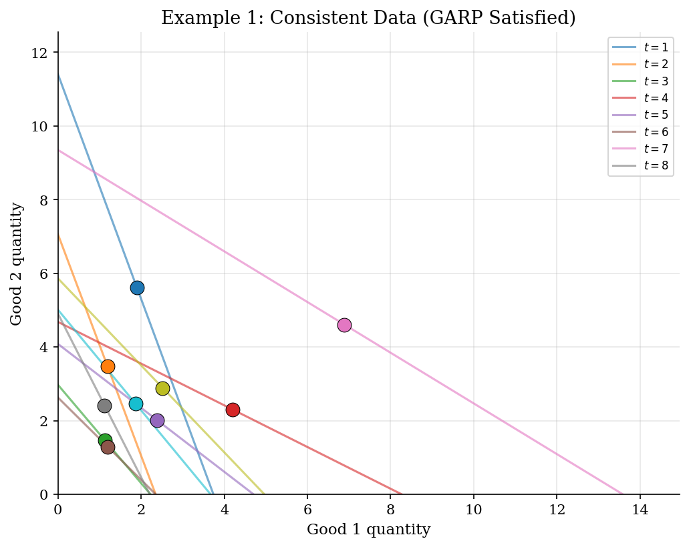
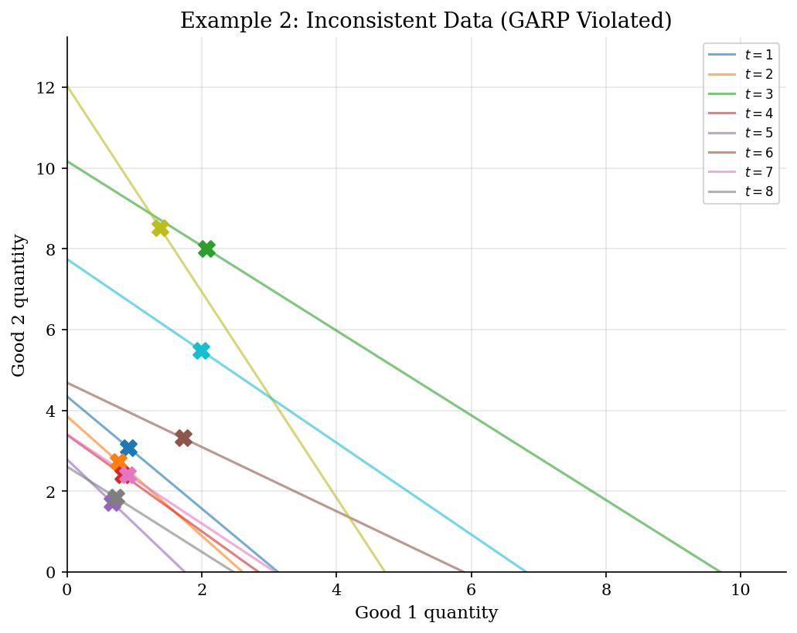
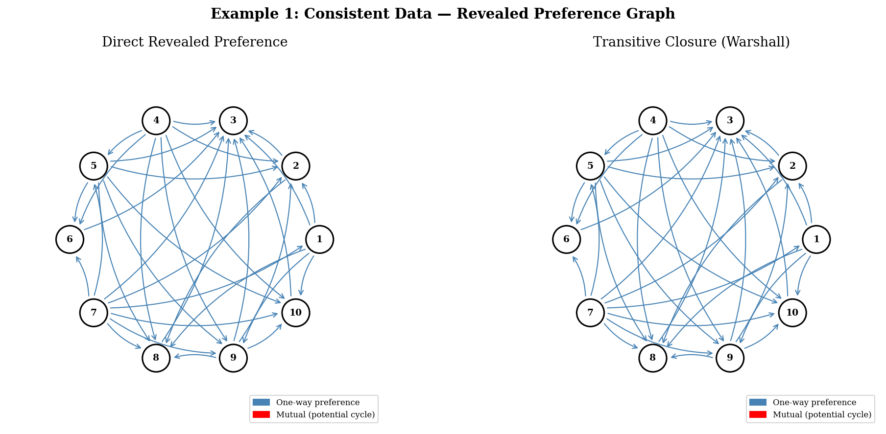
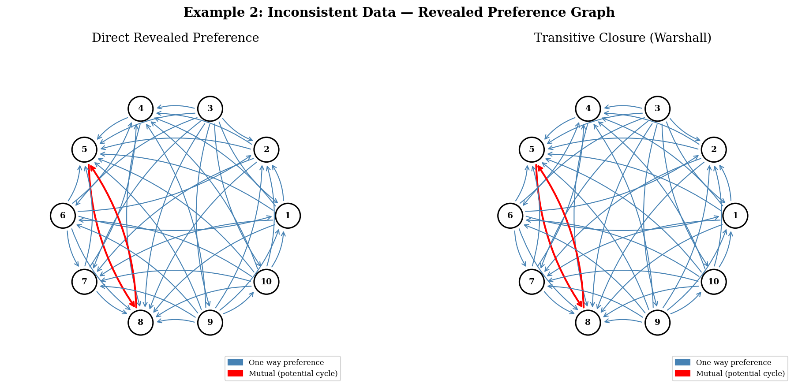
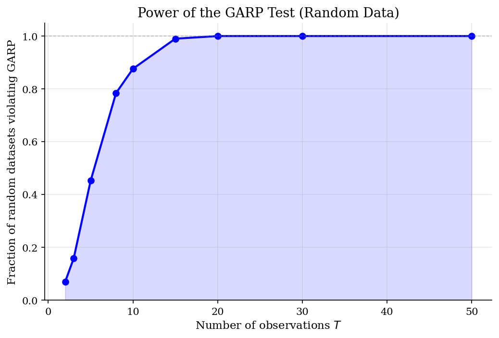

# Revealed Preference and Afriat Inequalities

> Testing whether observed consumption data is consistent with utility maximization.

## Overview

Revealed preference theory asks a fundamental empirical question: can observed consumer choices be rationalized by *any* well-behaved utility function? Afriat's theorem (1967) provides a complete answer — observed data $(p_t, x_t)_{t=1}^T$ is consistent with utility maximization if and only if it satisfies the Generalized Axiom of Revealed Preference (GARP).

This is the empirical foundation of consumer theory. Unlike parametric demand estimation, the revealed preference approach is entirely nonparametric — it does not assume a functional form for utility. If the data passes GARP, there EXISTS a nonsatiated, continuous, concave, monotone utility function that rationalizes it.

## Equations

**Direct Revealed Preference:** Observation $i$ is *directly revealed preferred* to $j$ if:
$$p_i \cdot x_i \geq p_i \cdot x_j$$
i.e., bundle $x_j$ was affordable when $x_i$ was chosen.

**GARP:** For all $i, j$: if $x_i \; R^* \; x_j$ (revealed preferred, possibly indirectly), then:
$$p_j \cdot x_j \leq p_j \cdot x_i$$
i.e., $x_i$ must not lie strictly inside $j$'s budget set.

**Afriat Inequalities:** Data is rationalizable $\iff$ there exist scalars $u_i, \lambda_i > 0$ such that:
$$u_i - u_j \leq \lambda_j \, p_j \cdot (x_i - x_j) \quad \forall \, i, j$$

**Afriat's Theorem (1967):** The following are equivalent:
1. Data satisfies GARP
2. Afriat inequalities have a solution
3. Data can be rationalized by a nonsatiated, continuous, concave utility function

## Model Setup

| Parameter | Value | Description |
|-----------|-------|-------------|
| $T$ | 10 | Number of observations |
| Goods | 3 | Number of goods per bundle |
| Example 1 | Cobb-Douglas | Data generated from utility maximizer |
| Example 2 | Perturbed | Swapped bundles to induce GARP violation |
| Power test | 500 trials | Random data, $T \in \{2, 3, 5, 8, 10, 15, 20, 30, 50\}$ |

## Solution Method

**Step 1 — Direct Revealed Preference:** For each pair $(i, j)$, check if $p_i \cdot x_i \geq p_i \cdot x_j$. This builds the direct preference matrix $R$.

**Step 2 — Transitive Closure (Warshall's Algorithm):** Compute $R^*$, the transitive closure of $R$. If $i \; R \; k$ and $k \; R \; j$, then $i \; R^* \; j$. This runs in $O(T^3)$ time.

**Step 3 — GARP Check:** For all pairs where $i \; R^* \; j$, verify that $p_j \cdot x_j \leq p_j \cdot x_i$. Any violation means the data cannot be rationalized by utility maximization.

**Example 1** (consistent): GARP satisfied = **True**, violations = 0.

**Example 2** (inconsistent): GARP satisfied = **False**, violations = **2**.

## Results


*Budget lines and chosen bundles (2D projection) for consistent data generated from a Cobb-Douglas utility maximizer. All choices lie on their respective budget lines.*


*Budget lines and chosen bundles for inconsistent data. Swapped bundles create revealed preference cycles that cannot be rationalized by any utility function.*


*Directed graph of the revealed preference relation for consistent data. Red edges indicate mutual relations. No GARP-violating cycles exist.*


*Directed graph for inconsistent data. Mutual red edges in the transitive closure reveal GARP-violating cycles — these observations cannot be rationalized.*


*Power of the GARP test: fraction of random datasets that violate GARP as a function of the number of observations T. With more data, random choices are increasingly likely to produce violations — GARP has real empirical bite.*

**Pairwise Revealed Preference Relation (Example 1: Consistent). R = directly revealed preferred, R* = indirectly (via transitive closure)**

|        | Obs 1   | Obs 2   | Obs 3   | Obs 4   | Obs 5   | Obs 6   | Obs 7   | Obs 8   | Obs 9   | Obs 10   |
|:-------|:--------|:--------|:--------|:--------|:--------|:--------|:--------|:--------|:--------|:---------|
| Obs 1  | --      | R       | R       |         |         |         |         | R       | R       | R        |
| Obs 2  |         | --      | R       |         |         |         |         | R       |         |          |
| Obs 3  |         |         | --      |         |         |         |         |         |         |          |
| Obs 4  |         | R       | R       | --      | R       | R       |         | R       | R       | R        |
| Obs 5  |         | R       | R       |         | --      | R       |         | R       | R       | R        |
| Obs 6  |         |         | R       |         |         | --      |         |         |         |          |
| Obs 7  | R       | R       | R       |         | R       | R       | --      | R       | R       | R        |
| Obs 8  |         |         | R       |         |         |         |         | --      |         |          |
| Obs 9  |         | R       | R       |         |         |         |         | R       | --      | R        |
| Obs 10 |         |         | R       |         |         |         |         |         |         | --       |

## Economic Takeaway

Afriat's theorem provides the deepest link between observable behavior and economic theory. It says that the neoclassical model of consumer choice — utility maximization subject to a budget constraint — is *testable* with finite data, and the test is constructive.

**Key insights:**
- **Nonparametric power:** GARP does not assume Cobb-Douglas, CES, or any specific functional form. If the data passes, *some* well-behaved utility function rationalizes it. If it fails, *no* such function exists.
- **Empirical bite increases with data:** As the number of observations $T$ grows, random data is increasingly likely to violate GARP. This means GARP is not vacuous — it makes sharp, falsifiable predictions.
- **Constructive theorem:** When GARP holds, Afriat's proof constructs an explicit utility function (piecewise linear) via the Afriat numbers $u_i, \lambda_i$.
- **Foundation for welfare analysis:** If choices are rationalizable, we can perform welfare comparisons, compute equivalent/compensating variation, and do counterfactual policy analysis — all without specifying a parametric model.

## Reproduce

```bash
python run.py
```

## References

- Afriat, S. N. (1967). The Construction of Utility Functions from Expenditure Data. *International Economic Review*, 8(1), 67-77.
- Varian, H. R. (1982). The Nonparametric Approach to Demand Analysis. *Econometrica*, 50(4), 945-973.
- Varian, H. R. (2006). Revealed Preference. In M. Szenberg et al. (Eds.), *Samuelsonian Economics and the Twenty-First Century*. Oxford University Press.
