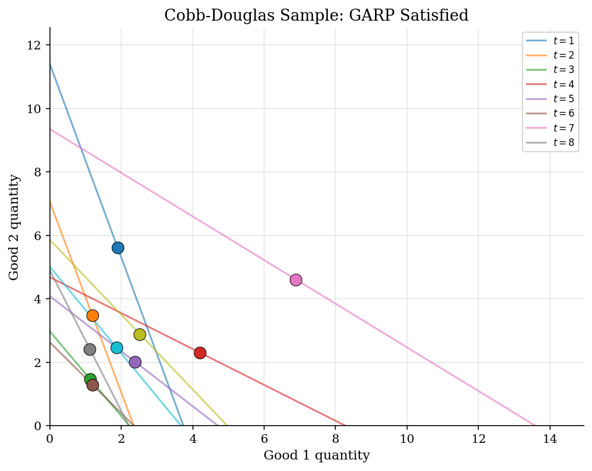
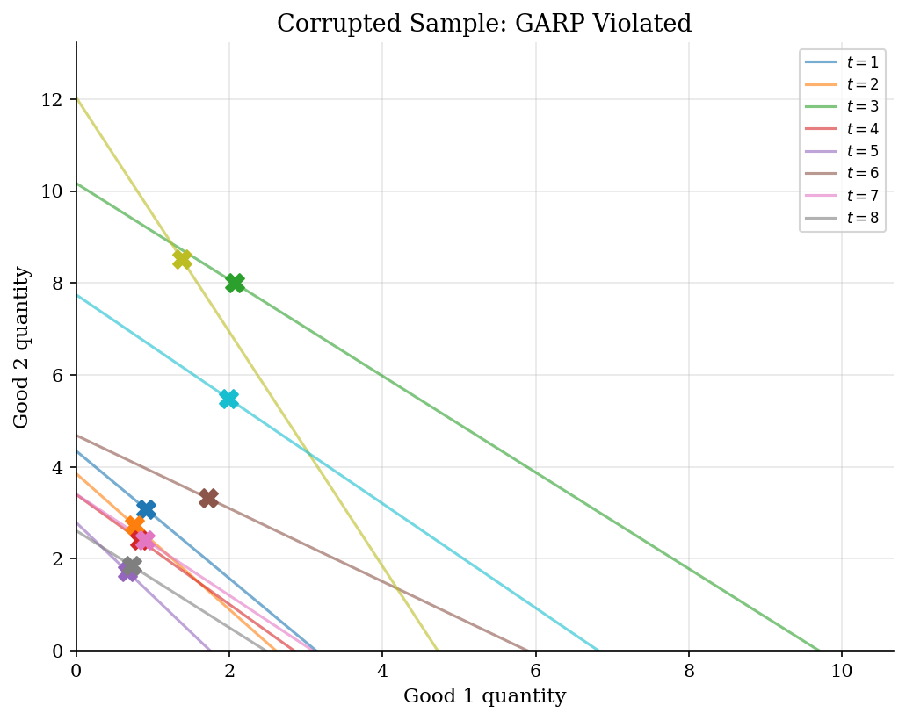
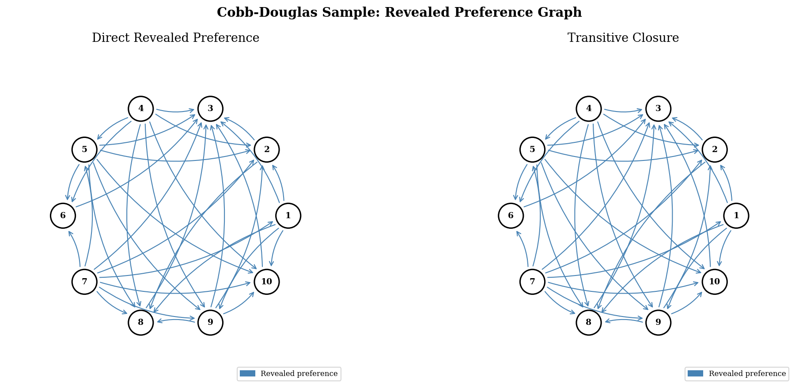
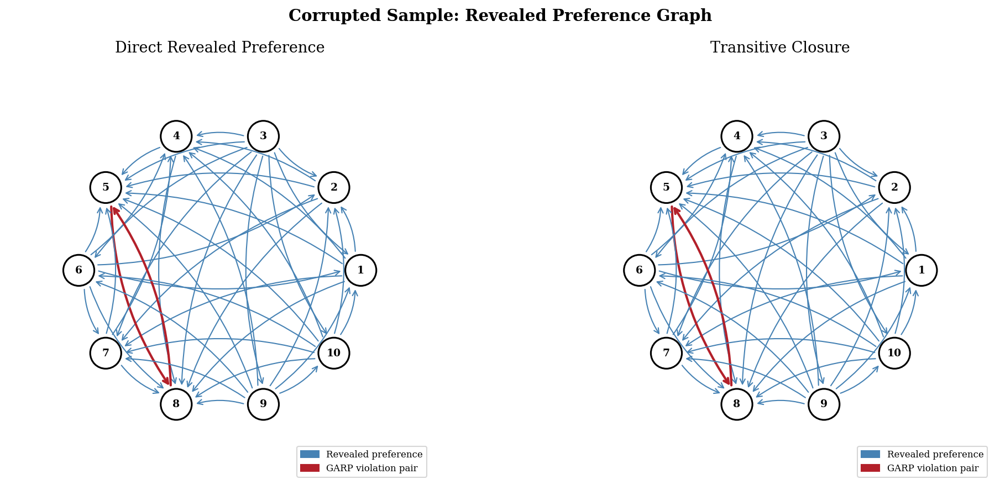

# Consumer Rationalizability with the GARP Test

## Overview

Prices and budgets change across shopping trips. Each trip leaves one chosen bundle, so the data show choices under different budget sets. The economic question is whether one stable utility function could have chosen all bundles.

The object is a finite revealed-preference relation. If a bundle was affordable when another bundle was chosen, the data reveal that the chosen bundle is weakly preferred to the affordable one. A violation appears when chained comparisons return to a bundle that was strictly cheaper at a later budget.

The computation builds that relation, closes it transitively, and checks the GARP contradiction. The run compares a rational Cobb-Douglas sample with one corrupted sample.

## Equations

Let $`\mathcal{D}=\lbrace(p_t,x_t)\rbrace_{t=1}^T`$ denote the observed data. Price vectors are positive, and bundles are nonnegative. Expenditure at observation $`t`$ is $`m_t=p_t\cdot x_t`$.

Direct revealed preference is written as $`iRj`$.

```math
m_i \geq p_i\cdot x_j .
```

The bundle $`x_j`$ was affordable when $`x_i`$ was chosen.

Let $`R^{\ast}`$ denote the transitive closure of $`R`$. GARP rules out this pair of statements.

```math
iR^{\ast}j
\quad\text{and}\quad
m_j > p_j\cdot x_i .
```

The first statement says $`x_i`$ is revealed at least as good as $`x_j`$ through a chain of budgets. The second says that, at budget $`j`$, $`x_i`$ was strictly cheaper than the bundle actually chosen.

Afriat's theorem makes this finite test enough. If GARP holds, the data are rationalizable by a monotone concave utility function.

## Worked Numerical Example

Take three observations: $`(p_1, x_1) = ((2,1),\,(1,2))`$, $`(p_2, x_2) = ((1,2),\,(2,1))`$, and $`(p_3, x_3) = ((1,1),\,(1,1))`$.

Compute expenditure at each budget.

```math
m_1 = p_1\cdot x_1 = (2)(1)+(1)(2) = 4, \qquad
m_2 = p_2\cdot x_2 = (1)(2)+(2)(1) = 4, \qquad
m_3 = p_3\cdot x_3 = (1)(1)+(1)(1) = 2.
```

Build the direct revealed-preference matrix $`R^D`$. Entry $`R^D[i,j]=1`$ when $`m_i\geq p_i\cdot x_j`$, that is, when bundle $`x_j`$ was affordable at budget $`i`$. Compute the cross-expenditure terms.

```math
p_1\cdot x_2 = (2)(2)+(1)(1) = 5, \qquad p_1\cdot x_3 = (2)(1)+(1)(1) = 3,
```

```math
p_2\cdot x_1 = (1)(1)+(2)(2) = 5, \qquad p_2\cdot x_3 = (1)(1)+(2)(1) = 3,
```

```math
p_3\cdot x_1 = (1)(1)+(1)(2) = 3, \qquad p_3\cdot x_2 = (1)(2)+(1)(1) = 3.
```

Compare each with the row expenditure $`m_i`$.

| Pair $`(i,j)`$ | $`m_i`$ | $`p_i\cdot x_j`$ | $`m_i \geq p_i\cdot x_j`$? | $`R^D[i,j]`$ |
|:---:|:---:|:---:|:---:|:---:|
| (1,1) | 4 | 4 | yes | 1 |
| (1,2) | 4 | 5 | no | 0 |
| (1,3) | 4 | 3 | yes | 1 |
| (2,1) | 4 | 5 | no | 0 |
| (2,2) | 4 | 4 | yes | 1 |
| (2,3) | 4 | 3 | yes | 1 |
| (3,1) | 2 | 3 | no | 0 |
| (3,2) | 2 | 3 | no | 0 |
| (3,3) | 2 | 2 | yes | 1 |

Written as a matrix with rows as origins and columns as destinations:

```math
R^D =
\begin{pmatrix}
1 & 0 & 1 \\
0 & 1 & 1 \\
0 & 0 & 1
\end{pmatrix}.
```

Observation 1 directly reveals $`x_1 \succsim x_3`$. Observation 2 directly reveals $`x_2 \succsim x_3`$. Neither observation 1 nor observation 2 could afford the other's chosen bundle.

Take the transitive closure $`R^{\ast}`$ via Warshall's algorithm. Pass through intermediate node $`k=1`$: no row has $`R^D[\cdot,1]=1`$ except row 1 itself, so no new edges open. Pass through $`k=2`$: similarly, $`R^D[\cdot,2]`$ is zero outside the diagonal. Pass through $`k=3`$: $`R^D[i,3]=1`$ for $`i=1,2,3`$, but $`R^D[3,j]=0`$ for $`j=1,2`$, so no indirect path reaches 1 or 2. The closure adds nothing, and $`R^{\ast}=R^D`$.

Check GARP. For each pair where $`iR^{\ast}j`$, test whether $`m_j > p_j\cdot x_i`$ (bundle $`x_i`$ was strictly cheaper at budget $`j`$, which would contradict $`iR^{\ast}j`$).

| Pair $`(i,j)`$ with $`iR^{\ast}j`$ | $`m_j`$ | $`p_j\cdot x_i`$ | $`m_j > p_j\cdot x_i`$? |
|:---:|:---:|:---:|:---:|
| (1,3) | 2 | 3 | no |
| (2,3) | 2 | 3 | no |
| diagonal | - | - | no |

No pair satisfies $`iR^{\ast}j`$ and $`m_j > p_j\cdot x_i`$ simultaneously.

```math
\boxed{\text{GARP passes. Zero violations.}}
```

Observation 3 is the cheapest budget and bundles 1 and 2 are mutually unaffordable across their own budgets, so no cycle can form. The three choices are consistent with a single preference ordering.

## Model Setup

| Object | Value | Role in the exercise |
|---|---|---|
| Observations $`T`$ | 10 | Budget-choice pairs in the two worked examples |
| Goods $`L`$ | 3 | Three-good bundles, with figures projected onto goods 1 and 2 |
| Cobb-Douglas weights | 0.337, 0.328, 0.335 | Ground-truth rational benchmark |
| Corrupted sample | 2 violations | Two chosen bundles are swapped until GARP fails |
| Rational benchmark | 0 violations | Utility-maximizing Cobb-Douglas choices should always pass GARP |

## Solution Method

The code checks GARP with the graph version of the revealed-preference test. Nodes are observed budgets and bundles. An edge $`i\to j`$ means bundle $`x_j`$ was affordable when $`x_i`$ was chosen. Warshall's algorithm then fills in every indirect comparison, and the violation scan reads off the GARP contradictions. The test returns a pass or fail decision; it does not construct the Afriat inequalities or a utility function.

```text
Input: prices p_t and chosen bundles x_t for t=1,...,T
Output: pass/fail GARP decision and violating observation pairs

1. For each pair (i,j), set R[i,j] = 1 if p_i . x_i + TOL >= p_i . x_j.
2. Initialize R_star = R.
3. For each intermediate node k:
       for each origin i and destination j:
           set R_star[i,j] = R_star[i,j] or (R_star[i,k] and R_star[k,j]).
4. For each reachable pair (i,j), flag a violation if p_j . x_j > p_j . x_i + TOL.
5. The data pass GARP exactly when the violation set is empty.
```

Both budget comparisons use a numerical tolerance TOL = 1e-10. It is added on the lax side when assigning revealed preference and on the strict side when flagging a violation, so observations that are equal up to floating-point error are not misread as a strict cycle.

The corrupted sample is built by a swap-retry loop. Each attempt swaps two chosen bundles in an otherwise rational dataset and rechecks GARP; the loop runs up to 200 attempts and returns the first dataset that fails. If no swap fails within 200 attempts, the code returns a hardcoded fallback dataset with a known violation. At the committed seed the swap path succeeds, so the figures show swap-corrupted data.

The Cobb-Douglas sample passes with 0 violations. The corrupted sample fails with 2 violating pairs.

## Results

The first pair of figures plots the residual budget line for goods 1 and 2, holding the third good fixed. Rational data can look irregular across budgets without creating a strict cycle.

In the rational benchmark, every observation comes from the same Cobb-Douglas preference vector. Prices and income vary, but the budget comparisons do not contradict one another.



After two bundles are swapped, the same price variation now creates a strict revealed-preference cycle. The failure is a logical inconsistency under the maintained utility-maximization model.



The graph view shows the test directly. An arrow from $`i`$ to $`j`$ means $`x_j`$ was affordable when $`x_i`$ was chosen. The right panel adds indirect comparisons. Red arrows mark strict GARP contradictions.

The rational sample has many revealed-preference links, especially after transitive closure. None returns to a strictly cheaper rejected bundle.



In the corrupted sample, transitive revealed preference points one way while a later budget strictly reveals the reverse comparison. Those pairs reject rationalizability for the full dataset.



## Takeaway

The GARP test asks whether finite household choice data can still be read as utility maximization after all budget comparisons are linked. By Afriat's theorem, passing GARP is equivalent to rationalizability, but it does not identify a unique utility function: it says some monotone concave utility function can rationalize the observed bundles. Failing GARP says no such utility function rationalizes the full dataset. A constructive companion would solve the Afriat inequalities for explicit utility levels and the Afriat efficiency index; this tutorial stops at the pass-or-fail decision.

## References

- Afriat, S. N. (1967). The Construction of Utility Functions from Expenditure Data. *International Economic Review*, 8(1), 67-77.
- Varian, H. R. (1982). The Nonparametric Approach to Demand Analysis. *Econometrica*, 50(4), 945-973.
