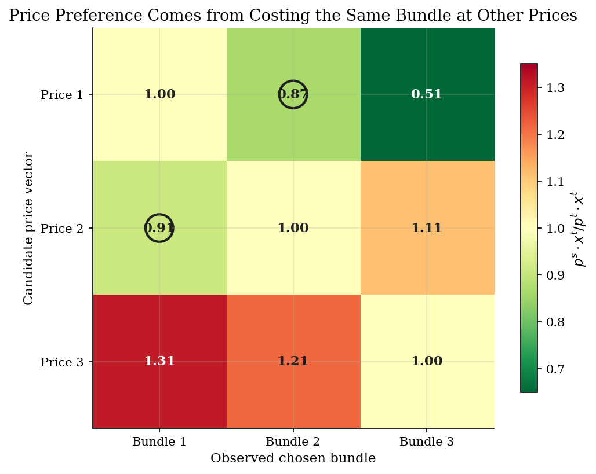
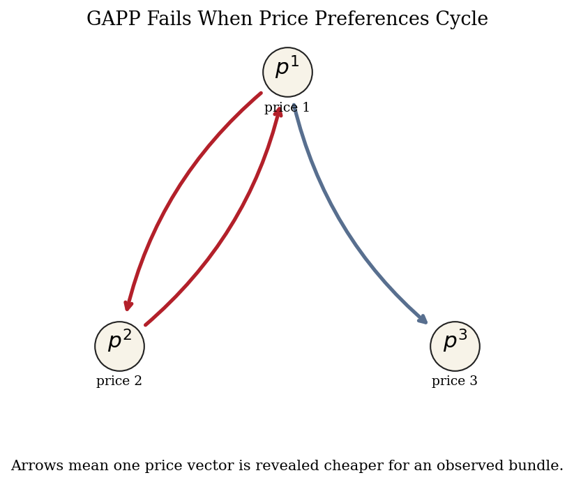
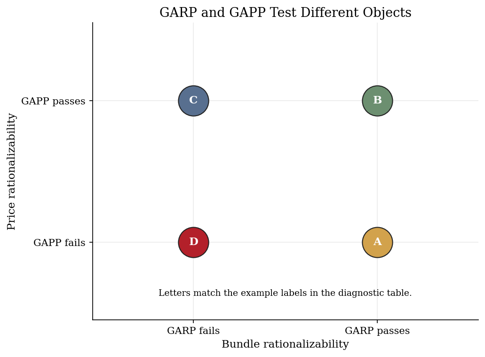

# Price-Regime Revealed Preference

## Overview

A researcher may observe one household, city, or market under several price schedules. The schedules could be tariffs, taxes, subsidies, or insurance menus. Each schedule produces one chosen bundle.

The object is the ranking of price schedules. Revealed price preference asks whether the observed bundles can rank those schedules consistently.

The computation compares every chosen bundle under every observed price vector. Those cross-cost comparisons form a directed graph. GAPP closes the graph and checks whether a strict reverse edge creates a cycle.

## Equations

The data are a finite sequence of price-bundle pairs

```math
\mathcal{D} = \lbrace (p^t, x^t) \rbrace_{t=1}^{T},
```

where the price vector $`p^t`$ is strictly positive and the chosen bundle $`x^t`$ is nonnegative, both of dimension $`L`$. Own expenditure at observation $`t`$ is $`m_t = p^t \cdot x^t`$.

For price-regime comparisons, where $`s,t\in\lbrace1,...,T\rbrace`$ each index an observation, define the cross-cost matrix

```math
C_{st}=p^s\cdot x^t .
```

Use this matrix to define direct weak preference between price vectors:

```math
sR_p^D t
\quad\Longleftrightarrow\quad
C_{st}\le C_{tt}=m_t .
```

This means schedule $`s`$ makes bundle $`t`$ no more expensive than schedule $`t`$ did.

The strict relation is

```math
sP_p^D t
\quad\Longleftrightarrow\quad
C_{st}<C_{tt}.
```

Let $`R_p`$ be the transitive closure of $`R_p^D`$. GAPP holds when there is no
pair $`(s,t)`$ such that

```math
sR_p t
\quad\text{and}\quad
tP_p^D s .
```

The first relation says the data rank schedule $`s`$ at least as good as schedule
$`t`$ after allowing indirect comparisons. The second relation says the direct
reverse comparison strictly favors $`t`$ over $`s`$. Together they form the
price-regime analogue of a revealed-preference cycle.

## Worked Numerical Example

Take $`T = 3`$ observations over $`L = 2`$ goods. The three price-bundle pairs are

| Observation $`t`$ | Price vector $`p^t`$ | Chosen bundle $`x^t`$ | Own expenditure $`m_t`$ |
|:---:|:---:|:---:|:---:|
| 1 | $`(3,\, 1)`$ | $`(4,\, 2)`$ | $`14`$ |
| 2 | $`(1,\, 3)`$ | $`(2,\, 4)`$ | $`14`$ |
| 3 | $`(5,\, 5)`$ | $`(3,\, 3)`$ | $`30`$ |

Form the cross-cost matrix $`C_{st} = p^s \cdot x^t`$. The GAPP test compares what each price schedule would charge for every other observation's chosen bundle.

```math
C = \begin{pmatrix}
C_{11} & C_{12} & C_{13} \\
C_{21} & C_{22} & C_{23} \\
C_{31} & C_{32} & C_{33}
\end{pmatrix}
=
\begin{pmatrix}
14 & 10 & 12 \\
10 & 14 & 12 \\
30 & 30 & 30
\end{pmatrix}.
```

The diagonal entries are own expenditures: $`C_{11} = m_1 = 14`$, $`C_{22} = m_2 = 14`$, $`C_{33} = m_3 = 30`$. Off-diagonal entry $`C_{12} = p^1 \cdot x^2 = 3 \cdot 2 + 1 \cdot 4 = 10`$ is what schedule 1 would charge for bundle 2.

Draw the direct preference edges. These are the raw revealed comparisons before transitive closure: edge $`s \to t`$ (weak) when $`C_{st} \le m_t`$, strict when $`C_{st} < m_t`$.

Comparing each off-diagonal entry against the column's own expenditure:

- $`C_{12} = 10 < 14 = m_2`$: schedule 1 makes bundle 2 cheaper, so $`1P_p^D 2`$ (strict).
- $`C_{13} = 12 < 30 = m_3`$: schedule 1 makes bundle 3 cheaper, so $`1P_p^D 3`$ (strict).
- $`C_{21} = 10 < 14 = m_1`$: schedule 2 makes bundle 1 cheaper, so $`2P_p^D 1`$ (strict).
- $`C_{23} = 12 < 30 = m_3`$: schedule 2 makes bundle 3 cheaper, so $`2P_p^D 3`$ (strict).
- $`C_{31} = 30 > 14 = m_1`$: no edge from schedule 3 to 1.
- $`C_{32} = 30 > 14 = m_2`$: no edge from schedule 3 to 2.

Direct graph: $`1 \to 2`$, $`1 \to 3`$, $`2 \to 1`$, $`2 \to 3`$. Schedule 3 has no outgoing edges.

Compute the transitive closure $`R_p`$. GAPP checks indirect as well as direct comparisons: a chain $`1 \to 2 \to 3`$ means schedule 1 is indirectly ranked at least as good as schedule 3 even if no direct edge exists.

Closing the graph: schedule 1 reaches $`\{1, 2, 3\}`$; schedule 2 reaches $`\{1, 2, 3\}`$; schedule 3 reaches only itself.

Check for GAPP violations. A violation at $`(s, t)`$ means the data simultaneously say schedule $`s`$ is at least as good as schedule $`t`$ (indirect chain) and schedule $`t`$ is strictly better than schedule $`s`$ (direct edge), a contradiction.

- Pair $`(1, 2)`$: $`1 R_p 2`$ (direct) and $`2 P_p^D 1`$ ($`C_{21} = 10 < 14 = m_1`$). Violation.
- Pair $`(2, 1)`$: $`2 R_p 1`$ (direct) and $`1 P_p^D 2`$ ($`C_{12} = 10 < 14 = m_2`$). Violation.
- Pair $`(1, 3)`$ and $`(2, 3)`$: schedule 3 has no strict outgoing edges, so no violation involving 3.

```math
\boxed{\text{GAPP fails. Violations: } (1,\, 2) \text{ and } (2,\, 1).}
```

The cycle reads: schedule 1 strictly undercuts schedule 2 for bundle 2, and schedule 2 strictly undercuts schedule 1 for bundle 1. No consistent ranking of the two price regimes can accommodate both comparisons. Schedule 3 is irrelevant to the cycle because it never undercuts either rival's own expenditure.

## Model Setup

| Object | Value | Interpretation |
|---|---:|---|
| Observations $`T`$ | 3 | Each case has three price-quantity observations |
| Goods $`L`$ | 3 | Bundles are finite consumption vectors |
| Deterministic cases | 4 | Examples separate bundle GARP from price GAPP |
| Main example | Case A | Bundle GARP passes while price GAPP fails |
| Main GAPP violations | 2 | Strict reverse edges close a price-schedule cycle |

## Solution Method

The computational object is a directed graph. Each node is an observed price vector. An edge from $`s`$ to $`t`$ means schedule $`s`$ made bundle $`t`$ weakly cheaper. Direct edges are not enough because indirect comparisons can matter. A Boolean transitive closure gives exact reachability on the finite data.

```text
Algorithm: GAPP test for price-regime rankings
Input: price vectors p^t and chosen bundles x^t for t=1,...,T
Output: pass/fail GAPP decision and violating price-vector pairs

1. Form C_st = p^s . x^t for every pair of observations (s,t).
2. Draw a weak edge s -> t when C_st <= C_tt.
3. Mark the edge strict when C_st < C_tt.
4. Compute reachability R_p by transitive closure of the weak edges.
5. For each pair (s,t), flag a violation if R_p[s,t] = 1 and the reverse
   direct edge t -> s is strict.
6. Accept GAPP when no violating pair remains.
```

The script also runs ordinary bundle GARP on the same observations. The two tests answer different questions. Stable bundle choices need not imply a stable ranking of the price schedules.

## Results

Case A is the main example. Bundle choices pass GARP there, but the price schedules fail GAPP.

**Bundle GARP and Price GAPP Tests**

| Case   | Economic comparison                 | GARP   | GAPP   |   Bundle violations |   Price violations |
|:-------|:------------------------------------|:-------|:-------|--------------------:|-------------------:|
| A      | Bundle-rational, price-inconsistent | pass   | fail   |                   0 |                  2 |
| B      | Both restrictions pass              | pass   | pass   |                   0 |                  0 |
| C      | Bundle-inconsistent, price-rational | fail   | pass   |                   4 |                  0 |
| D      | Both restrictions fail              | fail   | fail   |                   2 |                  2 |

The heat map shows the cross-cost ratio $`C_{st}/C_{tt}`$. Rows are candidate price vectors. Columns are observed bundles. Entries below one mark cheaper counterfactual prices for the same bundle.



The graph turns cost comparisons into revealed preferences over price schedules. Each arrow keeps the chosen bundle fixed.



Across the four panels, GARP and GAPP separate cleanly. The same data can pass one test and fail the other.



## Takeaway

Revealed price preference fits welfare exercises where schedules are the objects being compared. GARP asks whether one utility ordering rationalizes the bundles. GAPP asks whether observed price vectors have a consistent ranking. The tests can disagree on the same finite data.

## References

- Deb, R., Kitamura, Y., Quah, J. K. H., & Stoye, J. (2023). Revealed price preference: Theory and empirical analysis. Review of Economic Studies, 90(2), 707-743.
- Varian, H. R. (1982). The nonparametric approach to demand analysis. Econometrica, 50(4), 945-973.
- Chambers, C. P., & Echenique, F. (2016). Revealed Preference Theory. Cambridge University Press.
