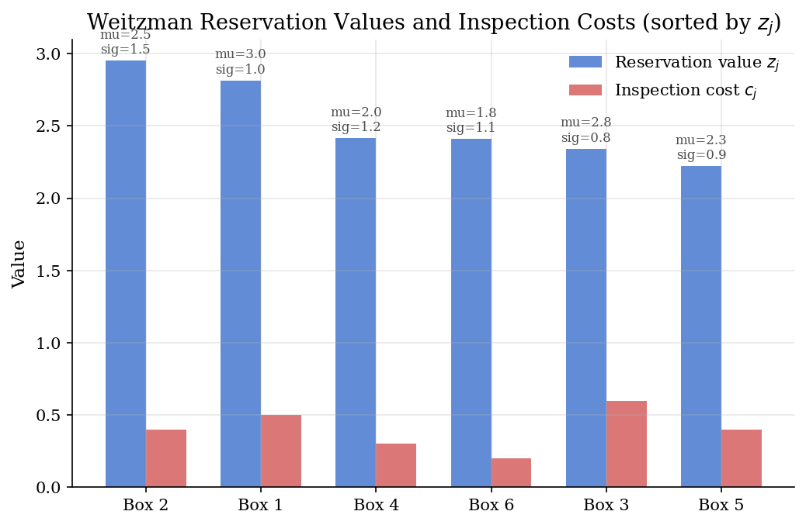
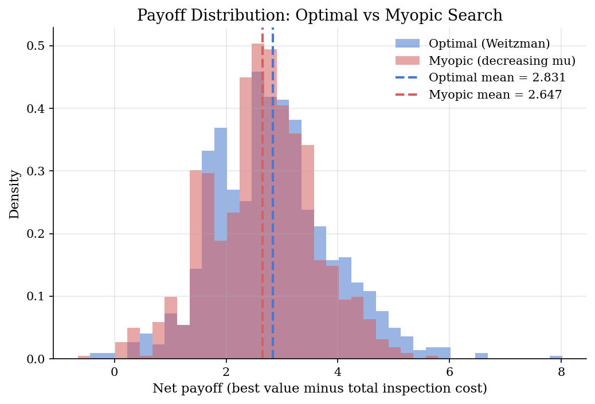
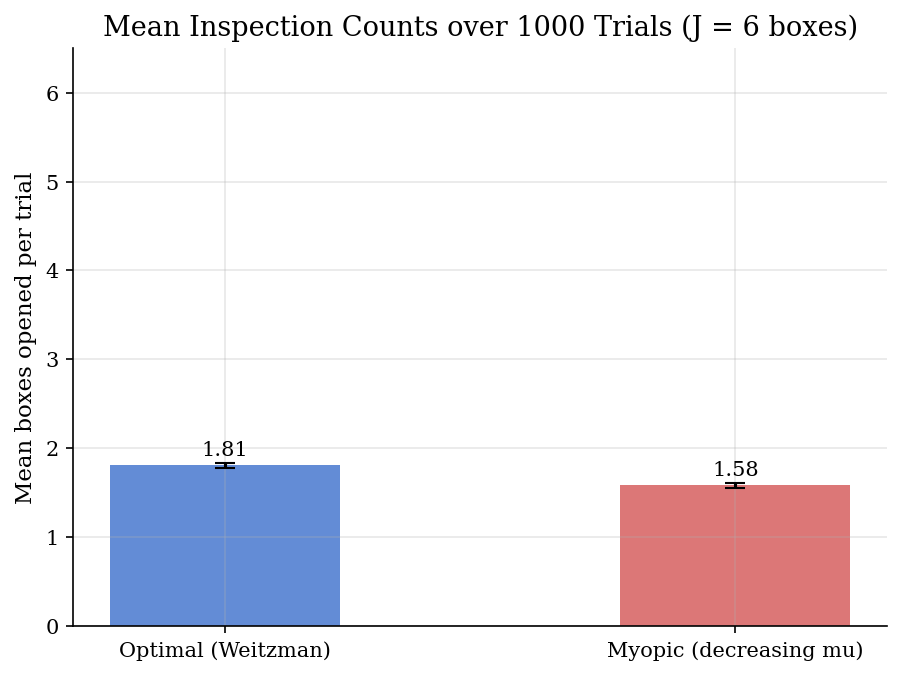

# Pandora's Box: Optimal Sequential Search and the Weitzman Reservation-Value Rule

## Overview

A buyer faces a small number of options, called boxes. Each box hides a random value, drawn from a known distribution that differs by box. The buyer can inspect a box at a cost to reveal its realised value, and can stop at any time and take the best inspected value so far. The question is which boxes to inspect, in what order, and when to stop.

Weitzman showed that this apparently complicated dynamic program has a strikingly simple solution. For each box, compute a single number called the reservation value, which trades the expected upside from inspection against the inspection cost. Open boxes in decreasing order of reservation value. Stop the moment the best inspected value exceeds the reservation value of every uninspected box. The reservation values do all the planning; the rest is bookkeeping.

This tutorial derives the reservation value for Gaussian box values, solves a six-box numerical example, and compares the Weitzman policy against a myopic policy that opens boxes in decreasing expected value. The myopic policy is the natural starting guess; the Weitzman policy reorders boxes to favour variance over mean, because a high-variance box has higher option value of inspection.

The same reservation-rule logic is the search backbone of [`choice/sequential-search-ursu/`](../../choice/sequential-search-ursu/), where it is plugged into a structural model of consumer search. It is also a close cousin of the McCall job-search reservation wage in [`dynamic-programming/job-search-mccall/`](../../dynamic-programming/job-search-mccall/), with the difference that McCall searches over a single distribution while Weitzman searches over heterogeneous boxes.

## Equations

We need notation that separates each box's primitives (cost, distribution) from the buyer's policy choices. Let $`j = 1, \ldots, J`$ index the boxes. Box $`j`$ has inspection cost $`c_j > 0`$ and a value $`V_j`$ drawn from a known distribution with cumulative distribution function $`F_j`$. The buyer chooses an order of inspection and a stopping time. Realised values are observed only on inspection, but the buyer has perfect recall (any inspected box can be selected later at no extra cost).

We need a one-number summary of each box that captures the trade-off between expected upside and inspection cost. Weitzman's reservation value $`z_j`$ is the unique scalar that equates the cost of inspecting box $`j`$ with the expected gain from observing a value above $`z_j`$:

```math
c_j = \mathbb{E}\big[\max(V_j - z_j,  0)\big] = \int_{z_j}^{\infty} (v - z_j)  dF_j(v).
```

The right-hand side is a smooth, strictly decreasing function of $`z_j`$ (the higher the threshold, the less probability mass above it), so the equation has a unique root and can be solved by one-dimensional bracketing. For Gaussian $`V_j \sim N(\mu_j, \sigma_j^2)`$, the integral has a closed form: $`\mathbb{E}[\max(V - z, 0)] = \sigma  \phi((\mu - z) / \sigma) + (\mu - z)  (1 - \Phi((\mu - z) / \sigma))`$, where $`\phi`$ and $`\Phi`$ are the standard-normal density and cumulative distribution function.

We need a policy statement. The Pandora's-box theorem says the optimal policy is to open boxes in decreasing $`z_j`$, and to stop the first time the best inspected value $`b`$ exceeds the reservation value of every uninspected box. Equivalently, with the boxes labelled so that $`z_1 \geq z_2 \geq \cdots \geq z_J`$:

```math
\text{open } j \text{ if and only if } b < z_j \text{ on arrival at box } j;
\qquad
\text{stop at step } t \text{ when } b_t \geq \max_{j \notin S_t} z_j,
```

where $`S_t`$ is the set of boxes inspected by step $`t`$. Perfect recall is what makes the policy stationary: the buyer's current state collapses to the scalar $`b`$. The reservation value $`z_j`$ encodes the value of the option to inspect $`j`$, and inspection is worthwhile only when the current alternative is worse than that option.

## Model Setup

| Object | Symbol | Role |
|---|---|---|
| Box index | $`j`$ | Box label, $`j = 1, \ldots, J`$ [from `sequential-search-ursu/`] |
| Number of boxes | $`J`$ | Set to 6 in the example |
| Inspection cost | $`c_j`$ | Paid up-front per box opened [from `sequential-search-ursu/`] |
| Box value | $`V_j`$ | Random reward inside the box [from `sequential-search-ursu/`] |
| Value distribution | $`F_j`$ | $`N(\mu_j, \sigma_j^2)`$ in this tutorial |
| Reservation value | $`z_j`$ | Weitzman's one-number summary [from `sequential-search-ursu/`] |
| Best inspected | $`b`$ | Running maximum over inspected boxes |
| Box means | $`\mu_j`$ | $`(3.0, 2.5, 2.8, 2.0, 2.3, 1.8)`$ |
| Box standard deviations | $`\sigma_j`$ | $`(1.0, 1.5, 0.8, 1.2, 0.9, 1.1)`$ |
| Inspection costs | $`c_j`$ | $`(0.5, 0.4, 0.6, 0.3, 0.4, 0.2)`$ |
| Monte Carlo trials | 1000 | Sample paths for policy evaluation |

The annotations record which symbols are shared with the dense tutorial that adopts this prelim.

## Solution Method

The procedure has three stages: solve for the reservation values, follow the optimal policy on a simulated path, and compare against the myopic alternative.

```text
Procedure: Weitzman optimal sequential search
Inputs : J boxes with (mu_j, sigma_j, c_j); N_SIM trials.
Outputs: reservation values z_j; mean payoff under Weitzman and under myopic.

1. For each box j:
   solve  c_j = E[max(V_j - z_j, 0)] for z_j by Brent's method.
   For Gaussian V_j, the right-hand side has a closed-form Mills-ratio expression.

2. Sort boxes by z_j in decreasing order.

3. For each Monte Carlo trial:
   draw v_j for all boxes once (this is the perfect-recall path).
   set b = -infinity, opens = empty.
   visit boxes in decreasing z order:
     stop if b is at least the maximum z over uninspected boxes.
     otherwise open the next box: opens = opens + {j}, observe v_j,
       update b = max(b, v_j), pay c_j.
   net payoff = b - (sum of c_j over inspected boxes).

4. Repeat step 3 with the myopic order (decreasing mu_j) and the same v_j draws,
   for a paired comparison.
```

The myopic baseline opens in decreasing $`\mu_j`$ but uses the same stopping condition with the appropriate maxima recomputed. Other search variants (search with bargaining, rational-inattention search, learning across boxes) build on this base and are out of scope.

## Results

The six-box calibration yields the reservation values shown below, against the inspection costs and box means.



Box 2 has the highest reservation value $`z_2 = 2.95`$, despite having only the second-highest mean ($`\mu_2 = 2.5`$). Its large standard deviation $`\sigma_2 = 1.5`$ gives it the highest option value of inspection, because the upside of a high realisation outweighs the chance of a disappointing draw. Box 5 sits at the bottom of the order with $`z_5 = 2.22`$, even though its mean is higher than Box 6's, because its lower variance (and higher cost relative to Box 6) shrink its option value. This reordering is the practical content of the Weitzman rule: variance, not mean, drives priority.

The realised payoff distribution over 1000 trials separates the two policies clearly.



The Weitzman policy averages $`2.83`$ in net payoff against $`2.65`$ for the myopic policy, a gain of $`0.18`$ per buyer. The full distributions overlap heavily, because both policies stop quickly when an early high draw arrives, so the difference is concentrated on the trials where Box 2's high-variance upside makes a measurable difference.

The inspection-count distribution explains how the policies trade cost against information.



The Weitzman policy opens $`1.8`$ boxes on average, the myopic policy opens $`1.6`$. The difference is concentrated on Box 2: the Weitzman policy opens it on most trials (the first stop), while the myopic policy does not always reach it because its cheaper, lower-variance neighbours sometimes terminate the search first.

## Takeaway

The Weitzman reservation value compresses each box's distribution and cost into one number. Opening in decreasing reservation value, then stopping when the best inspected value tops the reservation values of all remaining options, is fully optimal under perfect recall. Variance pays here. A high-variance box can be worth inspecting even when its mean is low, because the option of observing a high draw and stopping is itself valuable.

The same reservation-rule logic shows up in [`choice/sequential-search-ursu/`](../../choice/sequential-search-ursu/), where it is plugged into a structural model of consumer search across products. The McCall job-search reservation wage in [`dynamic-programming/job-search-mccall/`](../../dynamic-programming/job-search-mccall/) is the single-distribution special case (one box, indefinitely sampled).

## References

- Weitzman, M. L. (1979). "Optimal Search for the Best Alternative." *Econometrica*, 47(3), 641-654. Introduces $`z_j`$ and the index rule; proves perfect recall yields no advantage over the reservation rule.
- Kohn, M. G. and Shavell, S. (1974). "The Theory of Search." *Journal of Economic Theory*, 9(2), 93-123. Earlier reservation-wage stopping rules.
- Ljungqvist, L. and Sargent, T. J. (2018). *Recursive Macroeconomic Theory*, 4th edition. MIT Press, Chapters 6-7. Textbook treatment of sequential search.
- Choi, M., Dai, A. Y., and Kim, K. (2018). "Consumer Search and Price Competition." *Econometrica*, 86(4), 1257-1281. Modern application of the Weitzman index in market design.
- **See also.** The structural consumer-search application is in [`choice/sequential-search-ursu/`](../../choice/sequential-search-ursu/), which uses the reservation-value rule here as its policy primitive. The single-distribution analogue (McCall reservation wage) is in [`dynamic-programming/job-search-mccall/`](../../dynamic-programming/job-search-mccall/).
