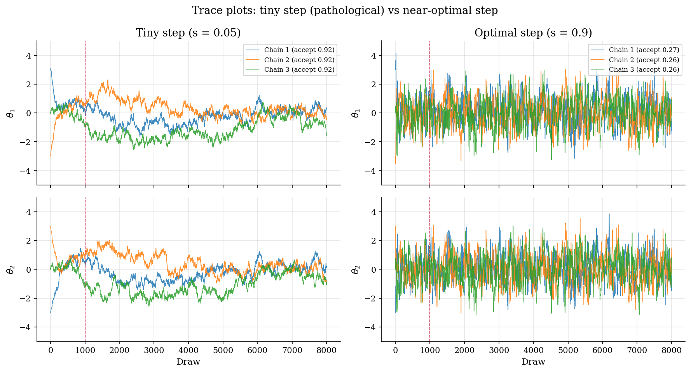
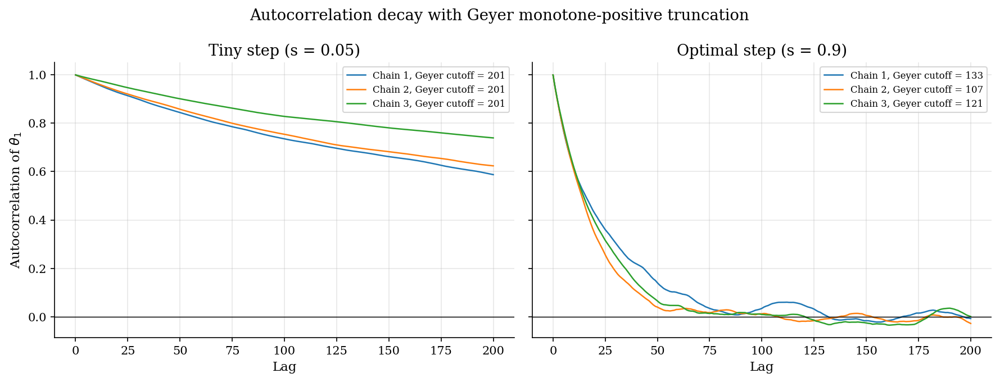
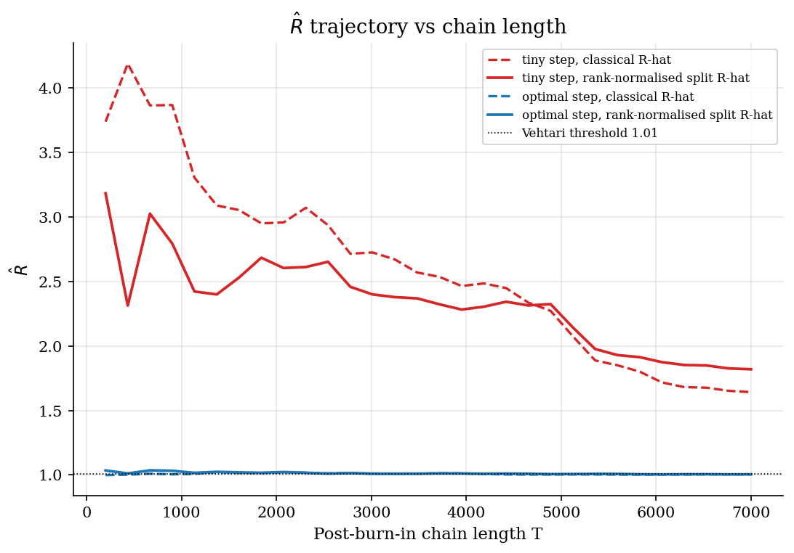

# MCMC Chain Diagnostics: ESS, R-hat, and Integrated Autocorrelation Time

## Overview

A trace plot can look settled even when the chain has only explored one region of the posterior. The visible mixing is local. The global picture may still be wrong. Diagnostics decide whether to trust the chain's averages.

Three questions need answers. How much information does each draw carry? Have independent chains agreed on the same posterior? Do those answers still hold when chains drift within their run or the posterior has heavy tails? Three diagnostics answer them. Integrated autocorrelation time and effective sample size measure information per draw. The classical Gelman-Rubin R-hat tests agreement across chains. The rank-normalised split variant sharpens that test for drift and for heavy tails.

Three random-walk Metropolis-Hastings chains run on a correlated bivariate Gaussian target. Two step sizes bracket the Roberts-Gelman-Gilks acceptance band. R-hat separates them even when the trace plots look similar.

The sampler lives in [`computational-methods/metropolis-hastings/`](../../computational-methods/metropolis-hastings/). The same R-hat column governs convergence in [`structural-econometrics/bayesian-dsge-hmc/`](../../structural-econometrics/bayesian-dsge-hmc/), where any chain above 1.01 is unconverged.

## Preliminary readings

- [`bayesian-methods/bayesian-foundations/`](../../bayesian-methods/bayesian-foundations/)
- [`computational-methods/metropolis-hastings/`](../../computational-methods/metropolis-hastings/)

## Equations

Let $`\theta`$ denote a single coordinate of the chain. Let $`(\theta_1, \ldots, \theta_T)`$ be the post-burn-in draws. Assume the chain has reached stationarity: it has settled into its target distribution, so the marginal of $`\theta_t`$ no longer depends on $`t`$ and any joint distribution depends only on the lag between draws.

Consecutive MCMC draws are not independent. Each step proposes a small move, so $`\theta_{t+1}`$ tends to sit near $`\theta_t`$. The lag-$`t`$ autocorrelation measures how quickly that dependence dies out:

```math
\rho_t = \mathrm{Corr}(\theta_s,  \theta_{s + t}).
```

Independent draws give $`\rho_t = 0`$ for $`t \ge 1`$. A slow-mixing chain keeps $`\rho_t`$ close to one for many lags: it steps slowly across the posterior, consecutive draws are nearly the same point, and many steps are needed to cover the support.

Autocorrelations at every lag are hard to summarise. The integrated autocorrelation time collapses them into one scalar that compares an average over correlated draws to one over independent draws:

```math
\tau = 1 + 2 \sum_{t \ge 1} \rho_t.
```

The number $`\tau`$ is a variance-inflation factor: $`\tau`$ correlated draws carry the information of one independent draw. The sum cannot run forever in practice. Estimates of $`\rho_t`$ at large $`t`$ use fewer pairs of draws, their standard error grows with $`t`$, and the tail is dominated by noise. Geyer's (1992) monotone-positive estimator handles the truncation: it pairs adjacent lags into sums $`\rho_{2i + 1} + \rho_{2i + 2}`$, walks forward until the first nonpositive pair, and enforces a running minimum on the survivors.

Once $`\tau`$ is in hand, the equivalent number of independent draws is just the inverse:

```math
\mathrm{ESS} = \frac{T}{\tau}.
```

ESS is the efficiency number reported in practice: $`T = 8000`$ draws with $`\tau = 40`$ are worth about $`200`$ independent ones.

The next question is whether independent chains have agreed on the same posterior. If they have, within-chain spread should look similar to the spread of the chain means. If they are stuck in different regions, the chain means will be far apart relative to within-chain spread. The Gelman-Rubin diagnostic formalises that comparison. Run $`M`$ chains of equal length $`T`$ from dispersed starts, and let $`\bar\theta_{m}`$ and $`s_m^2`$ denote chain $`m`$'s sample mean and variance. The within-chain variance averages the per-chain variances:

```math
W = \frac{1}{M} \sum_{m = 1}^{M} s_m^2.
```

The between-chain variance scales the variance of the chain means by $`T`$, so $`B`$ and $`W`$ share a scale under stationarity:

```math
B = \frac{T}{M - 1} \sum_{m = 1}^{M} (\bar\theta_m - \bar{\bar\theta})^2,
```

where $`\bar{\bar\theta}`$ is the grand mean. The classical Gelman-Rubin potential scale reduction factor combines the two:

```math
\hat R = \sqrt{\frac{T - 1}{T} + \frac{B}{T  W}}.
```

At $`\hat R = 1`$, within-chain and between-chain variances estimate the same posterior variance. The chains agree. Values above $`1.01`$ mean the chains have not agreed and the posterior averages cannot yet be trusted.

Classical $`\hat R`$ has two known failure modes. It misses drift inside a chain whose two halves still happen to give the same average. It also reacts weakly when the posterior has heavy tails: more probability mass far from the mean than a Gaussian. Vehtari et al. (2021) sharpen the diagnostic two ways. Splitting each chain in half computes $`\hat R`$ across the $`2M`$ half-chains, so within-chain variance picks up drift. Rank-normalising the pooled draws replaces each value by the standard-normal quantile of its rank, giving every draw a finite moment regardless of the original tail. Let $`r_{m, t}`$ be the rank of $`\theta_{m, t}`$ in the pooled sample and let

```math
z_{m, t} = \Phi^{-1}\left(\frac{r_{m, t} - 3/8}{M T + 1/4}\right),
```

where $`\Phi^{-1}`$ is the standard normal quantile. Classical $`\hat R`$ is then applied to the half-split $`z`$ values. This is the default in modern probabilistic-programming libraries.

## Worked Numerical Example

Compute effective sample size for a single short chain by hand, using only the lag-1 autocorrelation. The toy chain replaces the 8,000-draw run in Model Setup so the arithmetic stays on one page; the formula is identical.

Take a chain of $`N = 8`$ post-burn-in draws,

```math
\theta = (0.1,\; 0.3,\; 0.5,\; 0.4,\; 0.6,\; 0.5,\; 0.7,\; 0.9).
```

The sample mean is $`\bar\theta = 4.0 / 8 = 0.5`$. Center each draw by subtracting the mean:

```math
d = (-0.4,\; -0.2,\; 0,\; -0.1,\; 0.1,\; 0,\; 0.2,\; 0.4).
```

The sample variance uses the squared deviations $`d_t^2 = (0.16, 0.04, 0, 0.01, 0.01, 0, 0.04, 0.16)`$, which sum to $`0.42`$, so

```math
\widehat{\mathrm{Var}}(\theta) = \frac{1}{N - 1} \sum_{t = 1}^{N} d_t^2 = \frac{0.42}{7} = 0.06.
```

The lag-1 sample autocovariance pairs each centered draw with its successor. The seven products $`d_t d_{t + 1}`$ are $`(0.08, 0, 0, -0.01, 0, 0, 0.08)`$ and sum to $`0.15`$, giving

```math
\widehat{\mathrm{Cov}}(\theta_t, \theta_{t + 1}) = \frac{0.15}{7} \approx 0.02143,
\qquad
\rho_1 = \frac{0.02143}{0.06} \approx 0.357.
```

A first-order autoregressive approximation truncates the IAT sum at lag 1 with a geometric tail $`\rho_t \approx \rho_1^{\,t}`$, so $`\tau \approx (1 + \rho_1) / (1 - \rho_1)`$ and

```math
\mathrm{ESS} \approx N \cdot \frac{1 - \rho_1}{1 + \rho_1} = 8 \cdot \frac{0.643}{1.357} \approx \boxed{3.79}.
```

The eight correlated draws carry the information of about $`3.8`$ independent ones, a 53% efficiency loss from the positive lag-1 dependence. The full Geyer estimator in Solution Method uses every lag and the monotone-positive truncation, but the qualitative lesson is the same: positive autocorrelation deflates ESS below the raw chain length, and a chain with $`\rho_1`$ near one would lose almost all its draws to dependence.

## Model Setup

| Object | Symbol | Role |
|---|---|---|
| Parameter coordinate | $`\theta`$ | One component of the chain [from `metropolis-hastings`] |
| Chain length | $`T`$ | Post-burn-in draws [from `metropolis-hastings`] |
| Number of chains | $`M`$ | Independent chains from dispersed starts |
| Lag autocorrelation | $`\rho_t`$ | Correlation between draws $`t`$ steps apart [prelim introduces this; dense tutorials adopt on cut] |
| Integrated autocorrelation time | $`\tau`$ | $`1 + 2 \sum_{t \ge 1} \rho_t`$ [prelim introduces this; dense tutorials adopt on cut] |
| Effective sample size | $`\mathrm{ESS}`$ | $`T / \tau`$ [prelim introduces this; dense tutorials adopt on cut] |
| Within-chain variance | $`W`$ | Mean of per-chain sample variances [from Gelman-Rubin] |
| Between-chain variance | $`B`$ | $`T`$ times variance of chain means [from Gelman-Rubin] |
| Potential scale reduction | $`\hat R`$ | $`\sqrt{(T - 1)/T + B / (T W)}`$ [from Gelman-Rubin; convention shared with `bayesian-dsge-hmc`] |
| Target correlation | $`\rho`$ | 0.95 between $`\theta_1`$ and $`\theta_2`$ |
| Proposal step (tiny) | $`s_{\mathrm{tiny}}`$ | 0.05, deliberately too small |
| Proposal step (optimal) | $`s_{\mathrm{opt}}`$ | 0.9, near the Roberts-Gelman-Gilks acceptance band |
| Chain draws | 8,000 each | First 1,000 discarded as burn-in |
| Starts | $`\{(3, -3), (-3, 3), (0, 0)\}`$ | Dispersed initial points |

## Solution Method

Three diagnostics run on the same chains.

### Integrated autocorrelation time and effective sample size

```text
Algorithm: Geyer monotone-positive IAT
Input : a scalar chain coordinate of length T, maximum lag L
Output: tau and the truncation cutoff
  acf <- sample autocorrelation at lags 0, 1, ..., L
  pair_sums <- (acf[2i+1] + acf[2i+2]) for i = 0, 1, ...
  truncate pair_sums at the first nonpositive entry
  enforce a running minimum across the surviving pair sums
  tau <- 1 + 2 * sum of the resulting monotone sequence
  ESS <- T / tau
```

A reversible chain (transitions look the same forward and backward in time under the target) has positive autocovariance at adjacent lag pairs even when individual lags fluctuate around zero. Random-walk Metropolis-Hastings is reversible. The monotone projection exploits that to stabilise the noisy tail. The cutoff lag is reported alongside the IAT.

### Classical Gelman-Rubin R-hat

```text
Algorithm: classical R-hat across M chains
Input : an M-by-T array of one coordinate of M independent chains
Output: R-hat
  per-chain mean and sample variance
  W <- mean of per-chain variances
  B <- T * variance of chain means (sample variance, ddof = 1)
  var_hat <- (T - 1)/T * W + B / T
  R-hat <- sqrt(var_hat / W)
```

Three chains run from $`(3, -3)`$, $`(-3, 3)`$, and $`(0, 0)`$. Dispersed starts matter: chains launched from the same point can agree on a wrong posterior by exploring the same neighbourhood. Spread starts make stuck chains visible. After burn-in the chains should overlap, so $`B`$ stays small relative to $`W`$ and $`\hat R`$ approaches one.

### Rank-normalised split-R-hat

```text
Algorithm: rank-normalised split-R-hat
Input : an M-by-T array
Output: R-hat
  split each chain in half to give a 2M-by-(T/2) array
  pool the draws, compute ranks
  z <- normal quantile of (rank - 3/8) / (total + 1/4)
  return classical R-hat on the z array
```

Splitting catches drift between halves of a single chain. Rank normalisation handles heavy tails by giving every draw a finite moment. Vehtari treats any chain with split-rank-$`\hat R`$ above $`1.01`$ as unconverged.

The Roberts-Gelman-Gilks asymptotic acceptance optimum for random-walk Metropolis is $`0.234`$ as $`d \to \infty`$. On this $`d = 2`$ target the practical band is $`0.25`$ to $`0.40`$. The two step sizes used here bracket it, one well below and one inside.

## Results

The trace plots show the tuning story. Under the tiny step the three chains barely leave their starts. Each one explores a different region of the posterior over 8000 draws, and the coloured paths never overlap. Under the near-optimal step the chains mix within a few hundred draws and then overlap. Acceptance rates are 0.92 for the tiny step and 0.26 for the near-optimal step, inside the asymptotic band.



The autocorrelation decay panel quantifies the traces. Under the tiny step, lag-200 autocorrelation stays above 0.6 and Geyer's truncation pushes deep into the tail. Under the near-optimal step, autocorrelation crosses zero before lag 100 and the cutoff lands an order of magnitude earlier. The IAT falls from roughly 540 to 40; for 7000 retained draws ESS rises from about 13 to 170.



Only one step size passes $`\hat R`$. Under the near-optimal step, both classical and rank-normalised diagnostics fall below 1.01 after a few thousand draws. Under the tiny step both stay near 1.8 because the chains are still parked in different posterior regions. The dotted line at 1.01 is Vehtari's threshold. Anything above it should be re-run with more draws or a different proposal. Trace plots alone cannot tell the two regimes apart.



## Takeaway

Three diagnostics catch three failures. The first is wasted draws: a chain that looks fine on a trace plot but moves so slowly that thousands of correlated draws are worth a handful of independent ones. IAT and ESS flag it. The second is non-agreement across chains: independent chains parked in different posterior regions, often different modes. Classical $`\hat R`$ flags it. The third is drift inside a single chain or a heavy-tailed posterior. Rank-normalised split-$`\hat R`$ catches it. Trace plots are the cheapest visual cross-check but cannot be trusted alone. Any structural posterior with ESS below a few hundred or split-$`\hat R`$ above $`1.01`$ should be re-tuned and re-run.

These diagnostics are gradient-free. Hamiltonian Monte Carlo adds sampler-specific divergence counts, introduced in [`computational-methods/hamiltonian-monte-carlo/`](../../computational-methods/hamiltonian-monte-carlo/) and reported in the posterior summary of [`structural-econometrics/bayesian-dsge-hmc/`](../../structural-econometrics/bayesian-dsge-hmc/).

## References

- Gelman, A. and Rubin, D. B. (1992). "Inference from Iterative Simulation Using Multiple Sequences." *Statistical Science*, 7(4), 457-472. Sections 2-3 define the potential scale reduction factor.
- Geyer, C. J. (1992). "Practical Markov Chain Monte Carlo." *Statistical Science*, 7(4), 473-483. Sections 2-3 derive the IAT from the Kipnis-Varadhan central limit theorem and connect it to the effective sample size.
- Vehtari, A., Gelman, A., Simpson, D., Carpenter, B., and Bürkner, P.-C. (2021). "Rank-Normalization, Folding, and Localization: An Improved $`\hat R`$ for Assessing Convergence of MCMC." *Bayesian Analysis*, 16(2), 667-718. Sections 2-3 present the rank-normalised split-$`\hat R`$ used as the default modern threshold.
- Robert, C. P. and Casella, G. (2004). *Monte Carlo Statistical Methods*, 2nd edition. Springer. Chapter 12 on convergence diagnostics.
- **See also.** The sampler diagnosed here is [`computational-methods/metropolis-hastings/`](../../computational-methods/metropolis-hastings/). The gradient-based alternative is [`computational-methods/hamiltonian-monte-carlo/`](../../computational-methods/hamiltonian-monte-carlo/), which adds divergence counts. The same R-hat column governs convergence in [`structural-econometrics/bayesian-dsge-hmc/`](../../structural-econometrics/bayesian-dsge-hmc/). The conjugate posteriors that motivate sampling are in [`bayesian-methods/bayesian-foundations/`](../../bayesian-methods/bayesian-foundations/).
