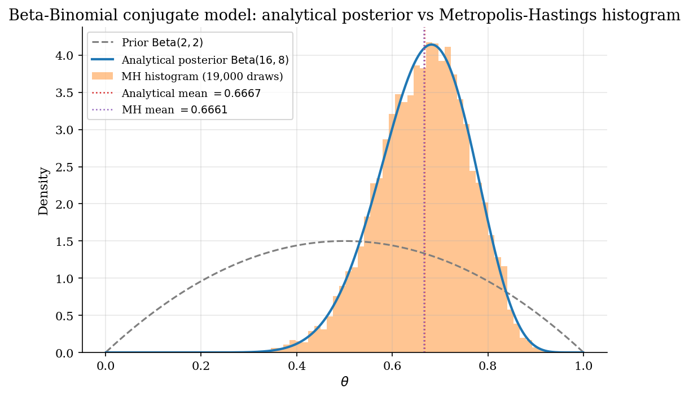
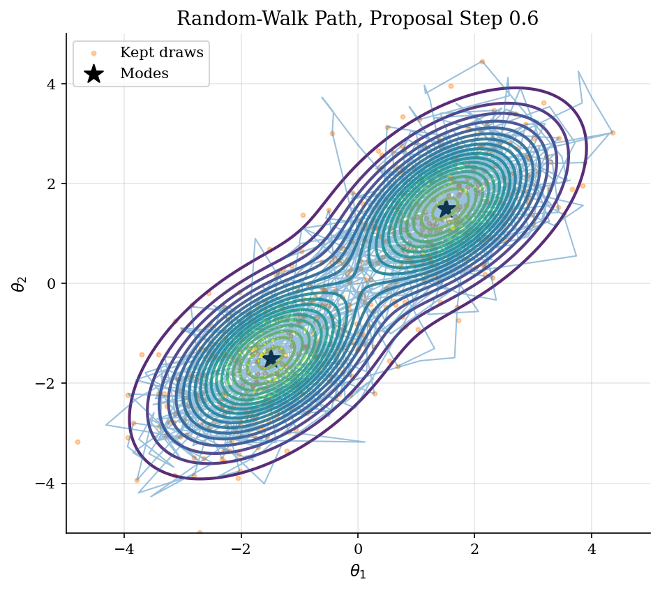
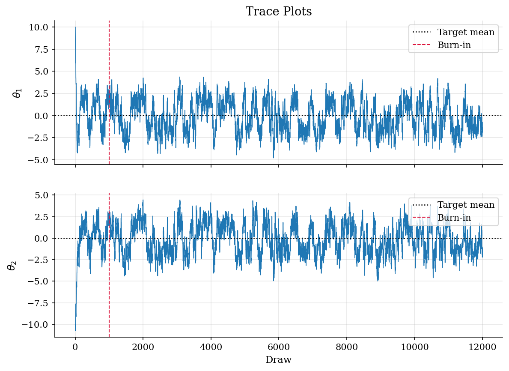
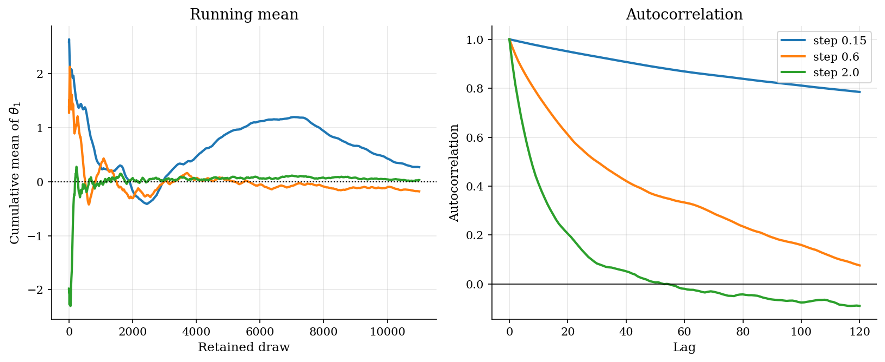

# Posterior Sampling: Random-walk Metropolis-Hastings

## Overview

This tutorial presents the random-walk Metropolis-Hastings algorithm for sampling from a posterior known only up to a normalizing constant. The Bayes-rule framing, conjugate posteriors, and the Beta-Binomial closed form are derived in [`bayesian-methods/bayesian-foundations/`](../../bayesian-methods/bayesian-foundations/). This page picks up where conjugacy fails. The target is a two-component Gaussian mixture that stands in for a structural posterior where two parameter regions fit the same data. There is no closed form. The sampler is the only tool, and the diagnostics on the resulting chain are how we tell whether posterior averages weight the regimes correctly or report a regime artifact.

A bounded one-dimensional random-walk chain on the Beta-Binomial conjugate posterior runs alongside the main mixture experiment as a sanity check on the implementation. The closed-form mean and variance of the Beta posterior come from the prelim; the chain has to recover them to within sampling noise before any harder target can be trusted.

## Preliminary readings

- [`bayesian-methods/bayesian-foundations/`](../../bayesian-methods/bayesian-foundations/)
- [`computational-methods/mcmc-diagnostics/`](../../computational-methods/mcmc-diagnostics/)

## Equations

The likelihood, prior, and posterior decomposition that motivates Metropolis-Hastings is in [`bayesian-methods/bayesian-foundations/`](../../bayesian-methods/bayesian-foundations/). This tutorial picks up where conjugacy fails: the posterior $`\pi(\theta \mid y)`$ can be evaluated pointwise up to a normalizing constant but no closed-form moments are available.

### Random-walk Metropolis-Hastings on a mixture posterior

The target is a posterior over $`\theta = (\theta_1, \theta_2) \in \mathbb{R}^2`$ given by a two-component Gaussian mixture:

```math
\pi(\theta \mid y) = \omega \phi(\theta;  \mu_1, \Sigma) + (1 - \omega)  \phi(\theta;  \mu_2, \Sigma),
```

where $`\omega \in (0, 1)`$ is the mixing weight, $`\mu_1, \mu_2 \in \mathbb{R}^2`$ are the component means, $`\Sigma \in \mathbb{R}^{2 \times 2}`$ is the shared component covariance, and the bivariate normal density is

```math
\phi(\theta;  \mu, \Sigma) = \frac{1}{2 \pi \sqrt{\lvert \Sigma \rvert}}  \exp\left(-\tfrac{1}{2} (\theta - \mu)^{\top} \Sigma^{-1} (\theta - \mu)\right).
```

The two components stand in for two structural regimes that fit the same data.
There is no closed-form posterior moment generator: the moments depend on the mixture and we cannot integrate against $`\pi`$ analytically.

Random-walk Metropolis-Hastings constructs a Markov chain $`(\theta_t)_{t \ge 0}`$ whose stationary distribution is $`\pi(\theta \mid y)`$ using only pointwise evaluations of the kernel.
Given current state $`\theta_t \in \mathbb{R}^d`$ (with $`d = 2`$ here), a Gaussian random-walk proposal draws

```math
\theta^{\star} = \theta_t + s \eta_t,
\qquad
\eta_t \sim \mathcal{N}(0, I_d),
\qquad
\eta_t \in \mathbb{R}^d,
```

where $`s > 0`$ is the proposal scale and $`I_d`$ is the $`d \times d`$ identity matrix.
Because the proposal density $`q(\theta^{\star} \mid \theta_t)`$ is symmetric, the Metropolis-Hastings acceptance probability simplifies to the kernel ratio capped at one:

```math
\alpha(\theta_t, \theta^{\star}) =
\min\bigg\lbrace 1,  \underbrace{\frac{\pi(\theta^{\star} \mid y)}{\pi(\theta_t \mid y)}}_{\text{kernel ratio, marginal cancels}} \bigg\rbrace.
```

The marginal likelihood $`m(y)`$ appears in both the numerator and denominator of the kernel ratio and cancels exactly, which is why the sampler never needs to evaluate the partition function.
This rule satisfies detailed balance: for any pair $`(\theta, \theta')`$ the joint density of "current state and proposal" is symmetric under swapping the two, since

```math
\pi(\theta)  q(\theta' \mid \theta)  \alpha(\theta, \theta')
= \pi(\theta')  q(\theta \mid \theta')  \alpha(\theta', \theta).
```

Detailed balance implies that $`\pi`$ is the stationary distribution of the resulting chain.
The acceptance ratio depends only on the kernel ratio, so the marginal likelihood $`m(y)`$ cancels.
That is the load-bearing reason MH works without ever computing the partition function.
The same algorithm applies to the Beta-Binomial conjugate posterior from [`bayesian-methods/bayesian-foundations/`](../../bayesian-methods/bayesian-foundations/), with the bound $`\theta \in (0, 1)`$ enforced by rejecting proposals outside the unit interval. Running it there is how we verify the sampler before applying it to the harder mixture target.

For curved or strongly correlated posteriors the random walk mixes slowly and effective sample size per evaluation is small; the gradient-based proposal in [`computational-methods/hamiltonian-monte-carlo/`](../../computational-methods/hamiltonian-monte-carlo/) is the fix when $`\nabla \log \pi`$ is available.

Retained draws from the chain approximate posterior averages of any integrable function $`g : \Theta \to \mathbb{R}`$:

```math
\mathbb{E}[g(\theta) \mid y] \approx \frac{1}{T - T_{\mathrm{burn}}}  \sum_{t = T_{\mathrm{burn}} + 1}^{T} g(\theta_t).
```

The approximation is exact in the limit $`T \to \infty`$.
On a finite run it is only as good as the chain's mixing, which on multimodal targets is governed by how often the chain crosses between modes.

## Model Setup

| Object | Value | Role |
|--------|-------|------|
| **Mixture target** | | |
| Posterior interpretation | Two empirically plausible structural regimes | |
| $`\mu_1`$ | (1.5, 1.5) | First-regime mean |
| $`\mu_2`$ | (-1.5, -1.5) | Second-regime mean |
| $`\Sigma`$ | [[1.0, 0.5], [0.5, 1.0]] | Within-regime covariance |
| Mixing probability $`\omega`$ | 0.5 | Regime weight |
| MH draws | 12,000 | After burn-in of 1,000 |
| MH starting point | (10.0, -10.0) | Far from both modes |
| MH proposal steps | [0.15, 0.6, 2.0] | Tuning sweep |
| **Beta-Binomial sanity check** | | |
| Prior $`\mathrm{Beta}(\alpha, \beta)`$ | (2, 2) | Weak symmetric prior |
| Sample size $`n`$ | 20 | Binomial trials |
| Successes $`s`$ | 14 | Observed (the prelim uses $`s`$; code variable is `K_SUCCESSES`) |
| Closed-form posterior | $`\mathrm{Beta}(16, 8)`$ | Derived in `bayesian-foundations` |
| Posterior mean | 0.6667 | Closed-form reference |
| Posterior variance | 0.00889 | Closed-form reference |
| MH proposal scale | 0.10 | Bounded random walk on $`(0, 1)`$ |
| MH draws | 20,000 total | 19,000 retained after burn-in of 1,000 |

## Solution Method

Random-walk Metropolis-Hastings is run on the mixture target as the main experiment. A bounded one-dimensional version is run on the Beta-Binomial conjugate posterior derived in [`bayesian-methods/bayesian-foundations/`](../../bayesian-methods/bayesian-foundations/) as a sanity check on the implementation.

### Bounded random walk on the Beta-Binomial conjugate posterior

The Beta-Binomial conjugate posterior from [`bayesian-methods/bayesian-foundations/`](../../bayesian-methods/bayesian-foundations/) gives a closed-form $`\mathrm{Beta}(\alpha + s,  \beta + n - s)`$ with known mean and variance. Running the sampler on this target is the cheapest way to check that the acceptance rule and the proposal logic work. The proposal is a Gaussian step bounded to the unit interval by rejecting any move outside $`(0, 1)`$. After 1,000 burn-in draws and 19,000 retained draws, the chain's empirical mean and variance should match the closed-form values to within a few percent. If they do not, either the proposal scale is too small to mix or the acceptance rule is implemented wrong. Either way, no further conclusions from the same sampler are trustworthy.

### Random-walk Metropolis-Hastings on a mixture posterior

Random-walk Metropolis-Hastings needs the posterior kernel at the current and proposed parameter values. The normalizing constant cancels from the acceptance ratio. The script runs three proposal scales to expose the tuning trade-off on the mixture target.

```text
Algorithm: random-walk Metropolis-Hastings
Input: log posterior kernel ell(theta), proposal scale s, initial theta_0, draws T
Output: draws from pi(theta | y), plus mode-crossing summaries
1. Set theta = theta_0 and compute ell(theta)
2. For t = 1, ..., T:
       propose theta_star = theta + s * eta_t, eta_t ~ N(0, I)
       compute log alpha = ell(theta_star) - ell(theta)
       accept theta_star with probability min(1, exp(log alpha))
       otherwise repeat the current theta
3. Drop burn-in draws
4. Report acceptance, mode switches, posterior mean error, and ESS
```

Proposal scale $`s`$ controls local move size. Tiny steps accept often but cross modes slowly. Large steps cross low-density regions more often, but many proposals are rejected. The known mixture mean lets the code measure finite-chain error.

For high-dimensional Gaussian targets the asymptotically optimal acceptance rate is roughly 0.23 (Roberts, Gelman, and Gilks 1997). That result is why tuning advice for $`s`$ usually targets acceptance between 0.2 and 0.5. On bimodal targets like this one, the rule is a guide but not a guarantee, because what limits the chain is mode-jumping rather than local mixing.

Effective sample size, integrated autocorrelation time, and $`\hat R`$ diagnostics for the chain output are derived in [`computational-methods/mcmc-diagnostics/`](../../computational-methods/mcmc-diagnostics/). This tutorial reports ESS values in Results without re-deriving the definitions. Mode switches count how often the chain crosses between regimes and complement the ESS as a mixing diagnostic on multimodal targets.

## Results

The Beta-Binomial calibration uses prior $`\mathrm{Beta}(2, 2)`$ and data 14 successes in 20 trials. The closed-form posterior is $`\mathrm{Beta}(16, 8)`$ with mean 0.6667 and variance 0.00889. The Metropolis-Hastings histogram overlays the analytical posterior tightly. Empirical mean is 0.6661 (error 0.0005). Empirical variance is 0.00901 (error 0.00012). Acceptance rate is 0.695, within the rule-of-thumb band for one-dimensional random-walk MH. The match is the licence to trust the same sampler on a target where no closed form exists.



Three posterior summaries on the same Beta-Binomial model. The analytical column is the closed form. The MH column is from the bounded random-walk chain.

**Conjugate-model posterior moments: analytical vs Metropolis-Hastings**

| Quantity                 |   Analytical |   MH empirical |   Absolute error |
|:-------------------------|-------------:|---------------:|-----------------:|
| Posterior mean           |      0.6667  |        0.6661  |          0.0005  |
| Posterior variance       |      0.00889 |        0.00901 |          0.00012 |
| Posterior P(theta > 0.5) |      0.9534  |        0.9517  |          0.0017  |

With proposal step 0.6, the chain visits both regimes and accepts 69.9% of proposed moves.



The traces show burn-in, mode crossing, and persistence in the retained draws.



The running mean and autocorrelation show how proposal scale changes finite-chain error.



The true posterior mean is zero. Each coordinate has marginal variance 3.25 because the modes are far apart.

**Proposal-scale diagnostics on the mixture target**

|   Proposal step |   Acceptance rate |   Mode switches |   Mean error |   ESS theta1 |   ESS theta2 |
|----------------:|------------------:|----------------:|-------------:|-------------:|-------------:|
|            0.15 |             0.918 |              71 |        0.374 |           24 |           23 |
|            0.6  |             0.699 |             319 |        0.255 |          120 |          118 |
|            2    |             0.304 |             689 |        0.048 |          467 |          494 |

On the mixture target the middle proposal step 0.6 is the one used in the path and trace plots. It gives acceptance 69.9% and moves between regimes. The smallest proposal accepts most often but crosses modes slowly. The largest proposal has lower acceptance, more mode switches, and the smallest mean error. The table shows why acceptance rate alone is not enough. Unlike the conjugate model, there is no closed-form posterior mean to compare against; we know the analytical mean here only because we set the mixture by hand. In a real structural application the diagnostics in the table are all we have.

## Takeaway

Random-walk Metropolis-Hastings turns a posterior kernel into draws without ever computing the normalizing constant. It needs only that the kernel can be evaluated pointwise. That is what makes Bayesian inference practical for structural models, latent-variable models, and any posterior with a nonstandard shape.

Run the sampler on a conjugate problem first. The Beta-Binomial conjugate posterior derived in [`bayesian-methods/bayesian-foundations/`](../../bayesian-methods/bayesian-foundations/) has analytical moments, so the empirical mean and variance from the chain can be checked exactly. If the sampler fails on a tractable problem, it cannot be trusted on an intractable one. If it passes, the same machinery transfers to the mixture target and to structural posteriors with similar geometry.

Finite-chain diagnostics matter on multimodal targets. The mixture chain can still weight regimes incorrectly even after thousands of draws. Trace plots, cumulative means, mode switches, autocorrelation, and $`\hat R`$ across multiple chains are the routine checks. The full toolkit is built up in [`computational-methods/mcmc-diagnostics/`](../../computational-methods/mcmc-diagnostics/).

Random-walk Metropolis-Hastings, Hamiltonian Monte Carlo, and Bayesian optimization are three corners of the same problem: doing inference when each evaluation of the posterior or likelihood is expensive. Random-walk MH is the gradient-free, posterior-sampling tool that this tutorial introduces. Hamiltonian Monte Carlo in [`computational-methods/hamiltonian-monte-carlo/`](../../computational-methods/hamiltonian-monte-carlo/) is the gradient-aware posterior-sampling alternative for curved or strongly correlated posteriors. Bayesian optimization in [`numerical-methods/bayesian-optimization/`](../../numerical-methods/bayesian-optimization/) is the gradient-free alternative when the goal is to *maximize* the posterior or any other expensive black-box objective rather than to sample it.

## References

- Gelman, A., Carlin, J. B., Stern, H. S., Dunson, D. B., Vehtari, A., and Rubin, D. B. (2013). *Bayesian Data Analysis*, 3rd edition. CRC Press, Ch. 11 on MCMC.
- [Metropolis, N. et al. (1953). Equation of State Calculations by Fast Computing Machines. *Journal of Chemical Physics*, 21(6), 1087-1092.](https://doi.org/10.1063/1.1699114)
- [Hastings, W. K. (1970). Monte Carlo Sampling Methods Using Markov Chains and Their Applications. *Biometrika*, 57(1), 97-109.](https://doi.org/10.1093/biomet/57.1.97)
- [Chib, S. and Greenberg, E. (1995). Understanding the Metropolis-Hastings Algorithm. *The American Statistician*, 49(4), 327-335.](https://doi.org/10.1080/00031305.1995.10476177)
- Roberts, G. O., Gelman, A., and Gilks, W. R. (1997). *Weak Convergence and Optimal Scaling of Random Walk Metropolis Algorithms*. Annals of Applied Probability, 7, 110-120.
- **See also.** The Bayes-rule framing and the Beta-Binomial conjugate posterior the sanity check is benchmarked against are derived in [`bayesian-methods/bayesian-foundations/`](../../bayesian-methods/bayesian-foundations/). The ESS, IAT, and $`\hat R`$ definitions used to judge the mixture chain are in [`computational-methods/mcmc-diagnostics/`](../../computational-methods/mcmc-diagnostics/). The gradient-aware alternative on curved posteriors is in [`computational-methods/hamiltonian-monte-carlo/`](../../computational-methods/hamiltonian-monte-carlo/). The function-space Bayesian update used for sample-efficient maximization rather than sampling is in [`numerical-methods/bayesian-optimization/`](../../numerical-methods/bayesian-optimization/).
