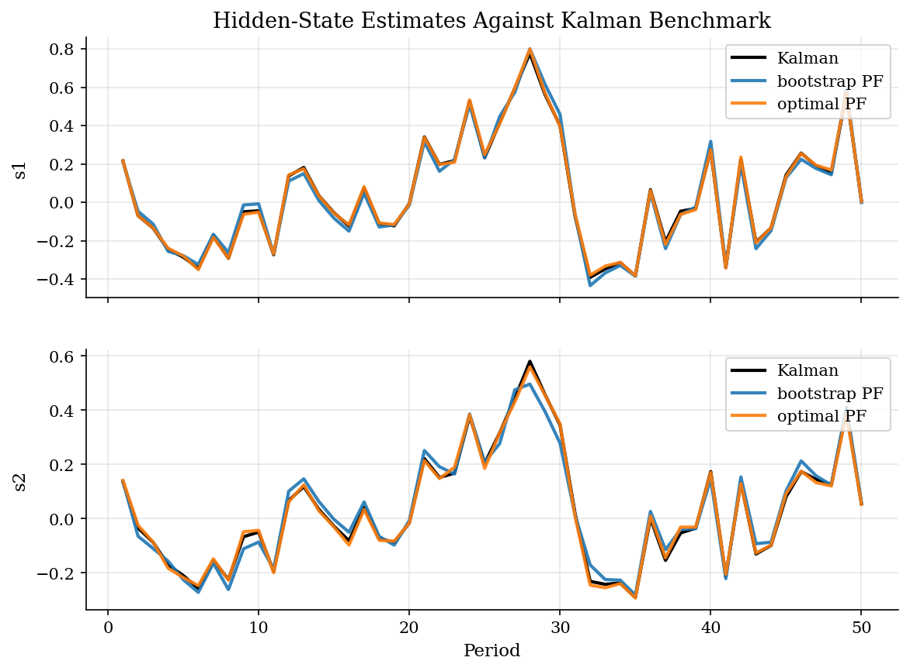
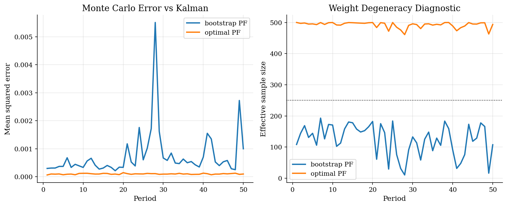
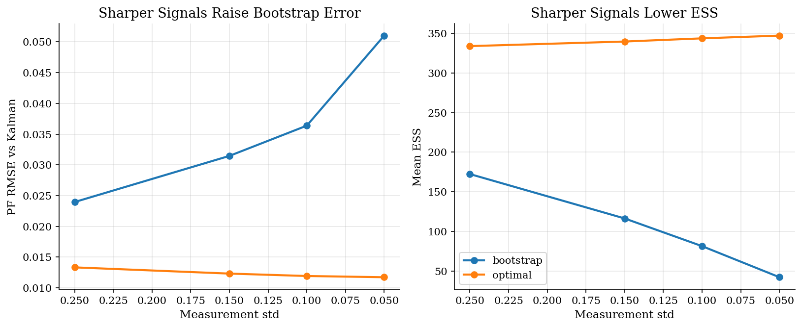

# Nowcasting Hidden Economic States by Particle Filtering

## Overview

A policy analyst observes a noisy activity indicator and wants a current estimate of the hidden state. The state may combine persistent demand pressure and real activity.

The object is the filtered distribution. Its mean is the nowcast used in later likelihood or policy calculations. The whole distribution matters because uncertainty, not only the point estimate, determines how much the next signal should move the state.

Filtering is a predict-update problem. The transition equation carries yesterday's distribution forward. The likelihood of the new signal then reweights that prediction. A Kalman filter does this exactly in the linear Gaussian case. A particle filter does the same Bayesian recursion with simulated states, so it also applies when analytic filtering is unavailable.

## Equations

Let $`s_t`$ collect two latent economic states, and let $`y_t`$ be the observed
signal. The state-space model is:

```math
y_t = \Psi s_t + u_t, \qquad s_t = \Phi s_{t-1} + \epsilon_t.
```

Here $`u_t`$ is measurement noise and $`\epsilon_t`$ is process noise.

Particles approximate the filtered distribution with weighted simulated states.
The filtering recursion has two steps. Prediction integrates over yesterday's
filtered distribution:

```math
p(s_t \mid y_{1:t-1}) =
\int p(s_t \mid s_{t-1})p(s_{t-1} \mid y_{1:t-1})ds_{t-1}.
```

Updating multiplies that prior by the likelihood of the new signal:

```math
p(s_t \mid y_{1:t}) =
\frac{p(y_t \mid s_t)p(s_t \mid y_{1:t-1})}
{p(y_t \mid y_{1:t-1})}.
```

The denominator is also the likelihood increment:

```math
p(y_t \mid y_{1:t-1}) =
\int p(y_t \mid s_t)p(s_t \mid y_{1:t-1})ds_t.
```

Particles replace those integrals with simulated draws and importance weights.
For a proposal density $`q`$, a proposed particle receives unnormalized weight:

```math
\widetilde w_t^{(i)} =
\frac{p(y_t \mid s_t^{(i)})p(s_t^{(i)} \mid s_{t-1}^{(i)})}
{q(s_t^{(i)} \mid s_{t-1}^{(i)}, y_t)}.
```

Normalized weights approximate the posterior:

```math
\widehat p(s_t \mid y_{1:t}) =
\sum_{i=1}^{N} w_t^{(i)} \delta_{s_t^{(i)}}.
```

The bootstrap particle filter propagates particles from:

```math
q_B(s_t \mid s_{t-1}^{(i)},y_t) =
p(s_t \mid s_{t-1}^{(i)})
```

so its weights are just the observation likelihood:

```math
w_t^{(i)} \propto p(y_t \mid s_t^{(i)}).
```

The conditionally optimal proposal uses the current observation:

```math
q_O(s_t \mid s_{t-1}^{(i)},y_t) =
p(s_t \mid s_{t-1}^{(i)}, y_t).
```

In this linear Gaussian example, the optimal proposal is available in closed
form. It draws particles from states that are already plausible after seeing
$`y_t`$, then weights the ancestor by the predictive likelihood of the signal.

Effective sample size summarizes weight concentration:

```math
ESS_t = \frac{1}{\sum_i (w_t^{(i)})^2}.
```

When signals are sharp, most bootstrap particles land far from the observed
$`y_t`$. Their likelihood weights are nearly zero, ESS collapses, and resampling
copies a small number of particles many times. The optimal proposal reduces
that problem by using the signal before drawing the new state.

## Worked Numerical Example

To see one bootstrap step, take the scalar AR(1) state $`x_{t+1} = 0.9 x_t + w_t`$ with $`w_t \sim N(0,1)`$ and observation $`y_t = x_t + v_t`$ with $`v_t \sim N(0,1)`$. Start from $`N = 3`$ particles at $`t = 0`$, $`\{0.0, 0.5, -0.5\}`$, with equal weights $`1/3`$. The new observation is $`y_1 = 1.0`$, and fixed process draws are $`w^{(1)} = 0.2`$, $`w^{(2)} = -0.3`$, $`w^{(3)} = 0.4`$.

Apply the transition to each particle to get the predicted positions at $`t = 1`$:

```math
\begin{aligned}
x_1^{(1)} &= (0.9)(0.0) + 0.2 = 0.20, \\
x_1^{(2)} &= (0.9)(0.5) + (-0.3) = 0.15, \\
x_1^{(3)} &= (0.9)(-0.5) + 0.4 = -0.05.
\end{aligned}
```

Score each particle by the Gaussian observation density $`\widetilde w^{(i)} \propto \exp\bigl(-(y_1 - x_1^{(i)})^2 / 2\bigr)`$:

```math
\begin{aligned}
\widetilde w^{(1)} &\propto \exp(-(0.80)^2 / 2) = \exp(-0.3200) = 0.7261, \\
\widetilde w^{(2)} &\propto \exp(-(0.85)^2 / 2) = \exp(-0.3613) = 0.6968, \\
\widetilde w^{(3)} &\propto \exp(-(1.05)^2 / 2) = \exp(-0.5513) = 0.5763.
\end{aligned}
```

The unnormalized weights sum to $`1.9992`$. Normalize to obtain the posterior weights:

```math
\widehat w = (0.3632,\; 0.3486,\; 0.2882).
```

The posterior mean is the weighted average of predicted particles:

```math
\widehat x_1 = (0.3632)(0.20) + (0.3486)(0.15) + (0.2882)(-0.05) = 0.0726 + 0.0523 - 0.0144 = 0.1105.
```

The effective sample size summarizes how concentrated the weights are:

```math
ESS_1 = \frac{1}{\sum_i \widehat w_i^2} = \frac{1}{0.1319 + 0.1215 + 0.0830} = \frac{1}{0.3365} = 2.97.
```

Multinomial resampling draws three indices from $`\widehat w`$. Expected counts are $`N \widehat w = (1.09, 1.05, 0.86)`$, so a typical draw is $`(1, 1, 1)`$ while $`(2, 1, 0)`$ also occurs.

```math
\boxed{\widehat x_1 \approx 0.111, \qquad ESS_1 \approx 2.97.}
```

The three particles all land near the observation $`y_1 = 1.0`$, so their likelihoods are comparable and $`ESS_1 \approx N`$ signals a balanced posterior. Had the predicted particles been far from $`y_1`$, one weight would dominate, $`ESS`$ would collapse toward 1, and resampling would duplicate that single particle.

## Model Setup

| Object | Value |
|--------|-------|
| Hidden state $`s_t`$ | Two persistent economic components |
| Observed signal $`y_t`$ | Noisy linear indicator of the state |
| Observation matrix $`\Psi`$ | [1.0, 0.9] |
| Transition matrix $`\Phi`$ | diag(0.4, 0.5) |
| Measurement std | 0.10 |
| Process std | (0.30, 0.25) |
| Baseline particles | 500 |
| Repeated runs | 50 |
| Benchmark | Kalman filtered mean |

## Solution Method

Read the algorithm as the same Bayesian update that the Kalman filter performs, but represented by points and weights. At the start of a period, yesterday's resampled particles represent $`p(s_{t-1} \mid y_{1:t-1})`$. The proposal moves them into candidate states for period $`t`$. The weights then turn those candidates into an approximation to $`p(s_t \mid y_{1:t})`$.

The bootstrap proposal is simple because it only uses the transition law. It is also fragile when the signal is precise: many simulated states receive tiny likelihood weights. The optimal proposal is more work per particle, but it uses $`y_t`$ before drawing the state. That timing keeps proposed states close to the part of the state space the signal supports.

```text
Algorithm: particle filtering with resampling
Input: observations y_t, particles s_0^(i), proposal q, particle count N
Output: filtered state means, ESS, likelihood estimate
for t = 1, ..., T:
    for each particle i:
        draw proposed state s_t^(i) from q(s_t | s[t-1]^(i), y_t)
        compute importance weight w_t^((i)) from target / proposal density
    normalize weights and estimate E[s_t | y[1:t]]
    compute ESS_t = 1 / sum_i (w_t^((i)))^2
    resample particles according to normalized weights
    accumulate the likelihood increment
```

Resampling is not a statistical afterthought. It prevents the next period from spending computation on particles with negligible posterior weight. The cost is that duplicated particles reduce diversity, so ESS is the diagnostic to watch.

We repeat each filter and compare its mean with the Kalman mean. The repeated-run error measures Monte Carlo accuracy, while the likelihood increments show how noisy the particle likelihood would be inside an estimator.

## Results

Both filters track the Kalman mean in the baseline run. The visible paths look similar, so repeated-run diagnostics are needed.



ESS falls when weights concentrate on a few particles. The optimal proposal keeps ESS close to the particle count.



Sharper signals reduce bootstrap ESS and raise error. The optimal proposal is less sensitive because it conditions on the signal.



The baseline repeats each filter 50 times with 500 particles. It compares each particle mean with the Kalman mean.

**Baseline repeated-run comparison**

| Method    |   Particles |   PF RMSE vs Kalman |   Mean ESS |   Loglike sd |
|:----------|------------:|--------------------:|-----------:|-------------:|
| bootstrap |         500 |              0.0273 |    121.829 |       0.6914 |
| optimal   |         500 |              0.01   |    492.636 |       0.0397 |

Lower measurement noise makes the signal more informative. That setting reveals weight collapse in the bootstrap filter.

**Measurement-noise sensitivity**

|   Measurement std | Method    |   PF RMSE vs Kalman |   Mean ESS |   Loglike sd |   Kalman RMSE vs truth |
|------------------:|:----------|--------------------:|-----------:|-------------:|-----------------------:|
|              0.25 | bootstrap |              0.0209 |   245.64   |       0.4486 |                 0.2361 |
|              0.25 | optimal   |              0.0112 |   477.14   |       0.0756 |                 0.2361 |
|              0.15 | bootstrap |              0.0254 |   165.99   |       0.6076 |                 0.2188 |
|              0.15 | optimal   |              0.0106 |   485.555  |       0.0608 |                 0.2188 |
|              0.1  | bootstrap |              0.0312 |   115.999  |       0.9175 |                 0.2114 |
|              0.1  | optimal   |              0.0099 |   491.255  |       0.0514 |                 0.2114 |
|              0.05 | bootstrap |              0.0425 |    60.2258 |       1.5488 |                 0.2062 |
|              0.05 | optimal   |              0.0097 |   496.206  |       0.025  |                 0.2062 |

With 500 particles, bootstrap RMSE is 0.0273. The optimal proposal lowers RMSE to 0.0100. The tables show the reason. Bootstrap ESS falls when the signal is sharp because most predicted particles do not explain the observation.

## Takeaway

Particle filters nowcast hidden economic states with weighted simulations. The main diagnostic is whether the weights collapse. Bootstrap filtering is easy to implement, but precise signals can leave it with only a few effective particles. A proposal that conditions on the signal buys accuracy by moving simulation effort toward plausible states. Use ESS and repeated-run error before treating filtered states as inputs to estimation.

## References

- [Gordon, N. J., Salmond, D. J., and Smith, A. F. M. (1993). Novel Approach to Nonlinear/non-Gaussian Bayesian State Estimation. *IEE Proceedings F*, 140(2), 107-113.](https://doi.org/10.1049/ip-f-2.1993.0015)
- [Doucet, A., de Freitas, N., and Gordon, N. (eds.) (2001). *Sequential Monte Carlo Methods in Practice*. Springer.](https://doi.org/10.1007/978-1-4757-3437-9)
