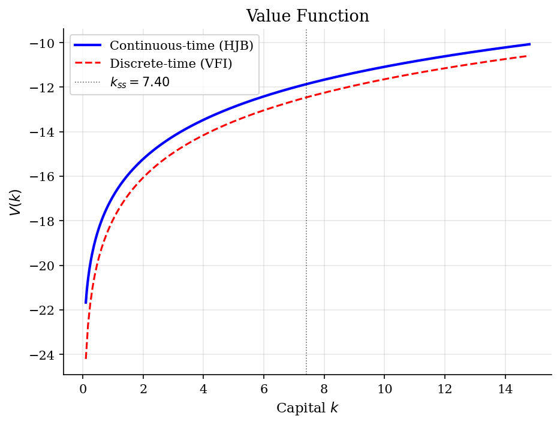
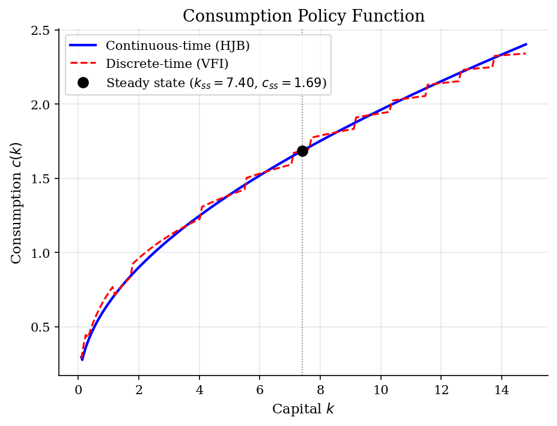
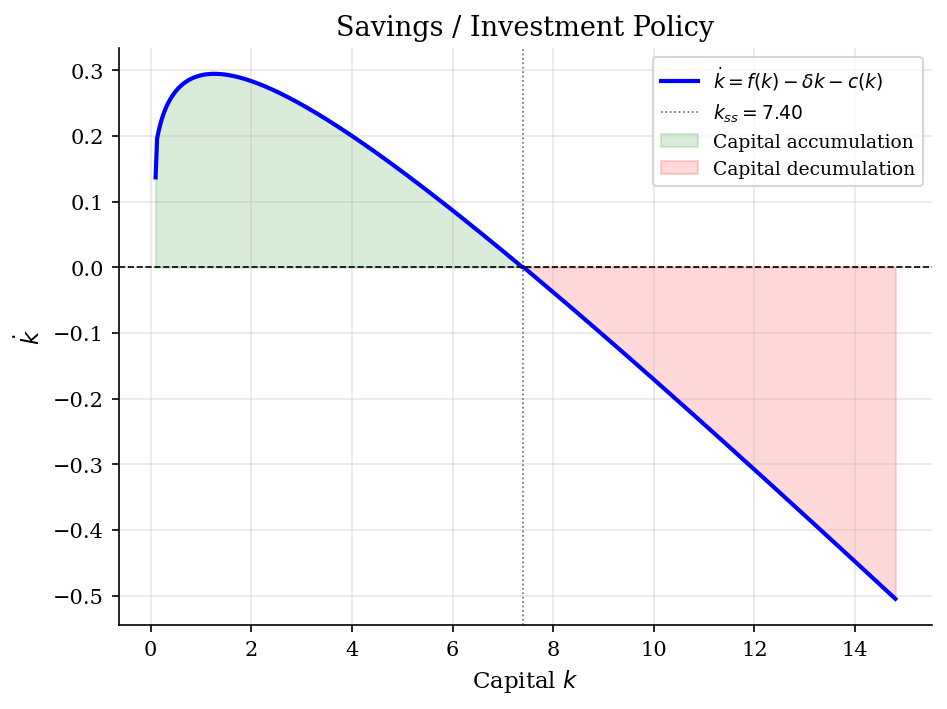
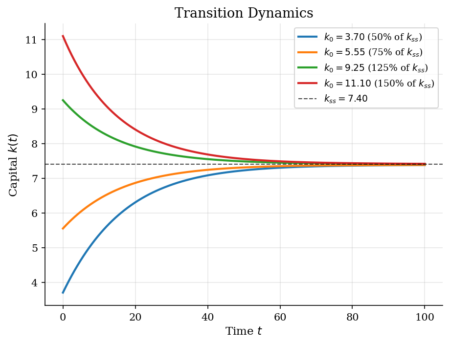

# Continuous-Time Neoclassical Growth (HJB)

> Neoclassical growth model solved via the Hamilton-Jacobi-Bellman equation using upwind finite differences.

## Overview

The neoclassical growth model is the workhorse of macroeconomics. In continuous time, the social planner's problem is characterized by a Hamilton-Jacobi-Bellman (HJB) equation. Rather than iterating on a Bellman operator with a costly max step (as in discrete-time VFI), the continuous-time approach exploits the first-order condition to eliminate the maximization analytically. With CRRA utility, optimal consumption is $c = (V'(k))^{-1/\sigma}$, so the HJB becomes a nonlinear ODE that can be solved by simple forward iteration on a finite-difference grid.

This module implements the upwind finite difference scheme from Moll's growth.m MATLAB code: forward differences when the agent is accumulating capital (below steady state) and backward differences when decumulating (above steady state).

## Equations

**HJB equation:**
$$\rho \, V(k) = \max_{c} \left\{ u(c) + V'(k) \left[ f(k) - \delta k - c \right] \right\}$$

**FOC:** $u'(c) = V'(k) \implies c^*(k) = \left( V'(k) \right)^{-1/\sigma}$

**Production:** $f(k) = A k^\alpha$

**CRRA utility:** $u(c) = \frac{c^{1-\sigma}}{1-\sigma}$

**Capital accumulation:** $\dot{k} = f(k) - \delta k - c$

**Steady state:** $f'(k_{ss}) = \rho + \delta \implies k_{ss} = \left( \frac{\alpha A}{\rho + \delta} \right)^{1/(1-\alpha)}$

**Upwind finite difference:**
$$V'(k_i) \approx \begin{cases} \frac{V_{i+1} - V_i}{\Delta k} & \text{if } \dot{k}_i > 0 \\ \frac{V_i - V_{i-1}}{\Delta k} & \text{if } \dot{k}_i < 0 \end{cases}$$

## Model Setup

| Parameter | Value | Description |
|-----------|-------|-------------|
| $\rho$   | 0.05 | Discount rate |
| $\sigma$ | 2.0 | CRRA coefficient |
| $\alpha$ | 0.36 | Capital share |
| $\delta$ | 0.05 | Depreciation rate |
| $A$       | 1.0 | TFP |
| Grid      | 500 points | $k \in [0.1, 14.80]$ |
| $k_{ss}$ | 7.3998 | Steady-state capital |
| $c_{ss}$ | 1.6855 | Steady-state consumption |
| $y_{ss}$ | 2.0555 | Steady-state output |

## Solution Method

**Implicit upwind finite difference method** (Achdou et al. 2022, Moll 2022): At each iteration, $V'(k)$ is approximated by forward or backward differences depending on the sign of the drift $\dot{k} = f(k) - \delta k - c$. The FOC $c = (V')^{-1/\sigma}$ yields consumption without a grid search.

The upwind scheme constructs a tridiagonal transition matrix $A$, and the implicit time step solves:
$$\left(\frac{1}{\Delta} + \rho - A^n\right) V^{n+1} = u(c^n) + \frac{1}{\Delta} V^n$$

The implicit scheme is unconditionally stable, allowing a large pseudo-time step ($\Delta = 1000$) for rapid convergence — in contrast to the explicit scheme in Moll's growth.m which requires a small CFL-constrained step.

Continuous-time HJB converged in **16 iterations** (change = 5.34e-07).

Discrete-time VFI (on 200-point grid) converged in **243 iterations** (error = 9.87e-07).

## Results


*Value function from continuous-time HJB vs discrete-time VFI*


*Consumption policy c(k) with analytical steady state marked*


*Savings policy s(k) = f(k) - delta*k - c(k); zero crossing at steady state*


*Transition dynamics k(t) from different initial conditions converging to steady state*

**Steady-State Values: Analytical vs Numerical**

| Variable                              | Analytical   |   Numerical |
|:--------------------------------------|:-------------|------------:|
| $k_{ss}$ (capital)                    | 7.3998       |    7.4057   |
| $c_{ss}$ (consumption)                | 1.6855       |    1.6858   |
| $y_{ss}$ (output)                     | 2.0555       |    2.0561   |
| $i_{ss} = \delta k_{ss}$ (investment) | 0.3700       |    0.3703   |
| $s = i/y$ (saving rate)               | 0.1800       |    0.1801   |
| $f'(k_{ss})$ (MPK)                    | 0.1000       |    0.0999   |
| HJB iterations                        | --           |   16        |
| HJB residual                          | --           |    5.34e-07 |
| VFI iterations                        | --           |  243        |

## Economic Takeaway

The continuous-time approach to the neoclassical growth model offers significant computational advantages over discrete-time VFI:

**Key insights:**
- **No max operator:** With CRRA utility, the FOC $u'(c) = V'(k)$ gives $c = (V')^{-1/\sigma}$ in closed form. The costly grid search over consumption choices in discrete-time VFI is replaced by a simple algebraic formula. This is the core advantage of the continuous-time formulation.
- **Upwind scheme is essential:** The finite difference direction must match the drift direction. Below steady state ($k < k_{ss}$), capital is accumulating ($\dot{k} > 0$), so the forward difference is used. Above steady state, the backward difference is used. Using the wrong direction creates numerical instability.
- **Implicit scheme:** The implicit time-stepping method solves a sparse tridiagonal system at each iteration but is unconditionally stable, allowing very large pseudo-time steps ($\Delta = 1000$). This yields convergence in tens of iterations, vs. thousands for the explicit CFL-constrained scheme.
- **Saddle-path stability:** All initial conditions converge monotonically to the unique steady state $k_{ss}$. The speed of convergence depends on the curvature of the production function and the discount rate.
- **Scalability:** The method extends naturally to heterogeneous-agent models (Achdou et al. 2022) where the state space includes both individual capital and the cross-sectional distribution.

## Reproduce

```bash
python run.py
```

## References

- Achdou, Y., Han, J., Lasry, J.-M., Lions, P.-L., and Moll, B. (2022). "Income and Wealth Distribution in Macroeconomics: A Continuous-Time Approach." *Review of Economic Studies*, 89(1), 45-86.
- Moll, B. (2022). "Lecture notes on continuous-time methods in macroeconomics." https://benjaminmoll.com/lectures/
- Barro, R. and Sala-i-Martin, X. (2004). *Economic Growth*. MIT Press, 2nd edition.
