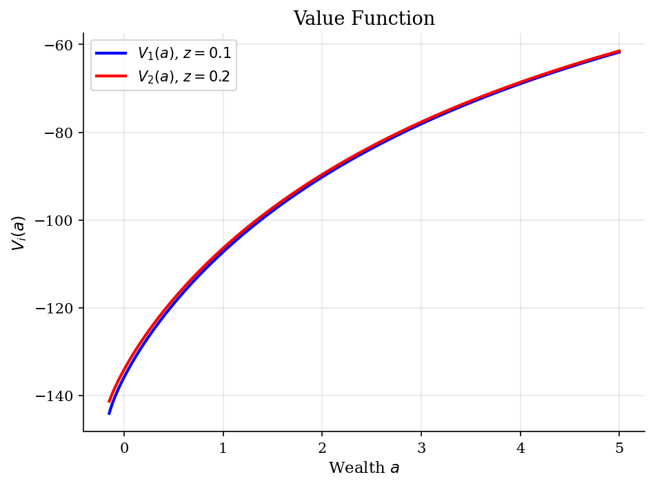
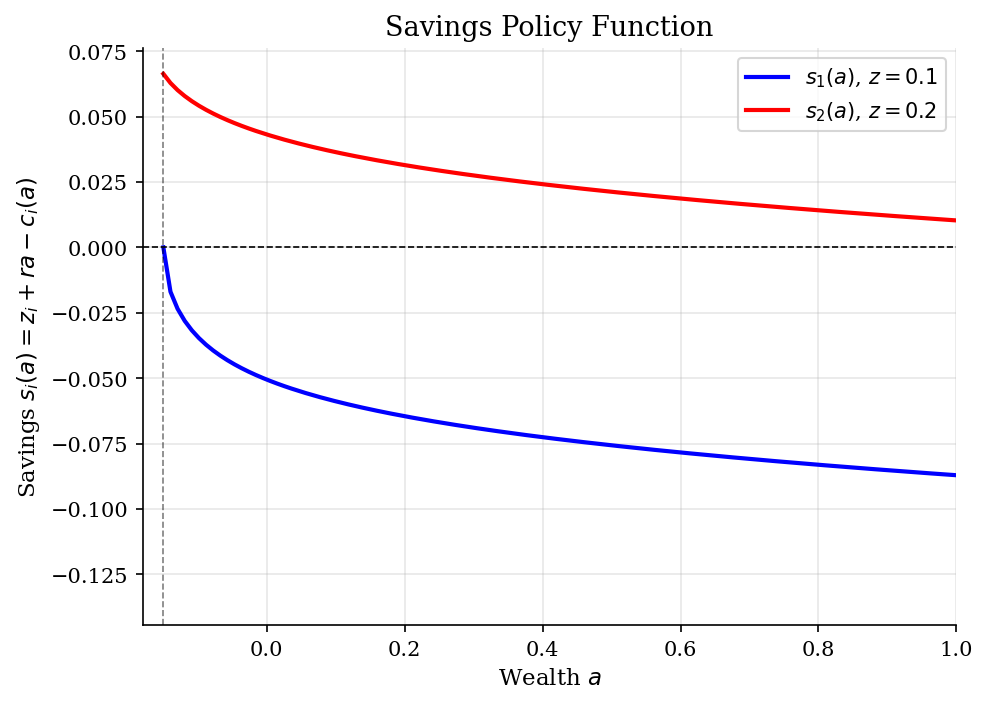
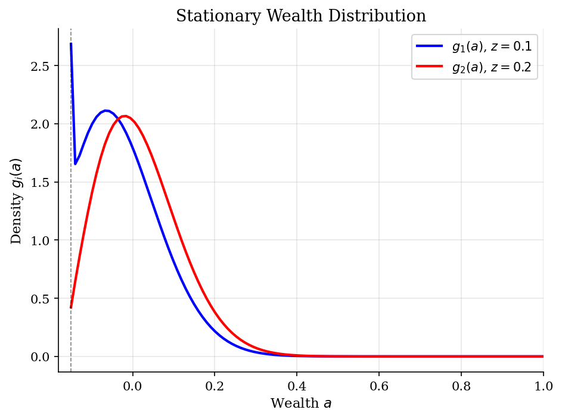
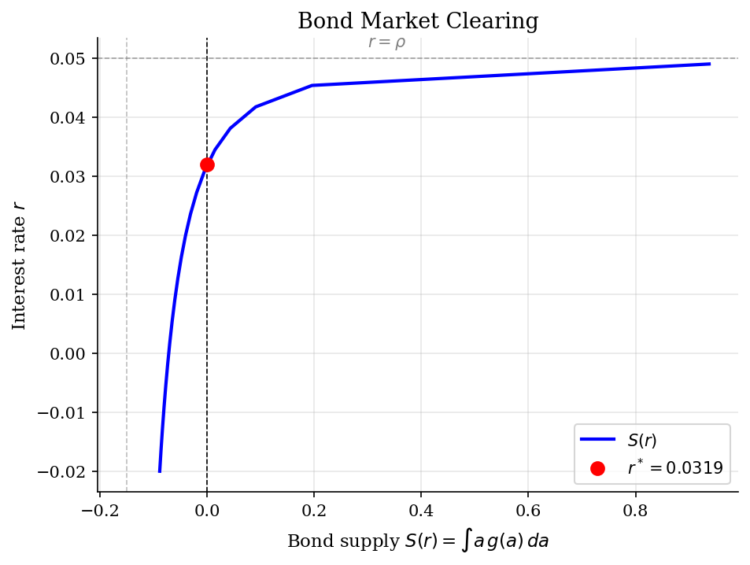

# Huggett (1993) Incomplete Markets Model (Continuous Time)

> Stationary equilibrium of a heterogeneous-agent economy with idiosyncratic income risk, borrowing constraints, and a single bond.

## Overview

The Huggett (1993) model is a foundational heterogeneous-agent model in which a continuum of agents face uninsurable idiosyncratic income shocks and trade a single risk-free bond subject to a borrowing constraint. In the continuous-time formulation of Achdou et al. (2022), optimal behavior is characterized by a Hamilton-Jacobi-Bellman (HJB) equation, and the stationary wealth distribution satisfies a Kolmogorov Forward Equation (KFE). The equilibrium interest rate clears the bond market: net asset demand equals zero in the aggregate.

## Equations

**HJB equation:**
$$\rho V_i(a) = \max_{c} \left\{ \frac{c^{1-\sigma}}{1-\sigma} + V_i'(a)(z_i + ra - c) \right\} + \lambda_i \left[ V_j(a) - V_i(a) \right]$$

**Optimal consumption (FOC):** $c_i(a) = \left( V_i'(a) \right)^{-1/\sigma}$

**Savings policy:** $s_i(a) = z_i + ra - c_i(a)$

**KFE (Kolmogorov Forward Equation):**
$$0 = -\frac{\partial}{\partial a}\left[ s_i(a) \, g_i(a) \right] - \lambda_i \, g_i(a) + \lambda_j \, g_j(a)$$

**Bond market clearing:**
$$\int a \left[ g_1(a) + g_2(a) \right] da = 0$$

## Model Setup

| Parameter | Value | Description |
|-----------|-------|-------------|
| $\rho$   | 0.05 | Discount rate |
| $\sigma$ | 2.0 | CRRA coefficient |
| $z$       | [0.1, 0.2] | Income states |
| $\lambda$ | [1.2, 1.2] | Poisson switching rates |
| $\underline{a}$ | -0.15 | Borrowing constraint |
| $\bar{a}$       | 5.0 | Upper bound on assets |
| Grid points | 500 | Uniform spacing |

## Solution Method

**Finite-difference implicit method:** The HJB is solved using an upwind finite-difference scheme. At each grid point, the derivative $V'(a)$ is approximated by forward or backward differences depending on the sign of the drift (savings). This ensures numerical stability and respects the direction of information flow. The implicit time-stepping scheme

$$\frac{V^{n+1} - V^n}{\Delta} + \rho V^{n+1} = u(c^n) + A^n V^{n+1}$$

is unconditionally stable, allowing large time steps ($\Delta = 1000$) for fast convergence.

**KFE:** The stationary distribution solves $A^\top g = 0$ with $\int g\, da = 1$, computed via a sparse linear system.

**General equilibrium:** Bisection on $r$ until $S(r) = \int a \, g(a)\, da = 0$.

HJB converged in **8 iterations** (error = 1.56e-07). Equilibrium found at **$r^* = 0.03192$**.

## Results


*Value function V(a) for each income state at the equilibrium interest rate*


*Savings policy s(a,z) = z + r*a - c(a,z) at equilibrium; zero crossings are steady states*


*Stationary wealth distribution g(a) by income state; mass piles up near borrowing constraint*


*Bond market: excess demand S(r) vs interest rate; equilibrium where S(r*)=0*

**Equilibrium Values**

| Variable                     |    Value |
|:-----------------------------|---------:|
| Equilibrium interest rate r* |  0.03192 |
| Mean wealth E[a]             | -0       |
| Mean income E[z]             |  0.15    |
| Mean consumption E[c]        |  0.15    |
| Prob(z = z_low)              |  0.5     |
| Prob(z = z_high)             |  0.5     |
| HJB iterations               |  8       |

## Economic Takeaway

The continuous-time approach to heterogeneous-agent models converts the problem into a coupled PDE system: the HJB equation characterizes optimal individual behavior, and the KFE describes the resulting cross-sectional distribution.

**Key insights:**
- The equilibrium interest rate $r^*$ is below the discount rate $\rho$. This is the hallmark result of Huggett (1993): precautionary savings motives push agents to accumulate bonds, driving down the interest rate.
- The wealth distribution features a mass point near the borrowing constraint $\underline{a}$, reflecting agents hit by adverse income shocks who are unable to smooth consumption.
- The savings function exhibits a square-root behavior near the constraint, reflecting the binding nature of the borrowing limit.
- The upwind finite-difference scheme is essential: it selects forward or backward differences based on the direction of asset drift, ensuring stability and correctly capturing the state constraint at $\underline{a}$.

## Reproduce

```bash
python run.py
```

## References

- Huggett, M. (1993). "The risk-free rate in heterogeneous-agent incomplete-insurance economies." *Journal of Economic Dynamics and Control* 17(5-6), 953-969.
- Achdou, Y., Han, J., Lasry, J.-M., Lions, P.-L., and Moll, B. (2022). "Income and Wealth Distribution in Macroeconomics: A Continuous-Time Approach." *Review of Economic Studies* 89(1), 45-86.
- Moll, B. "Lecture notes on continuous-time heterogeneous-agent models." https://benjaminmoll.com/lectures/
