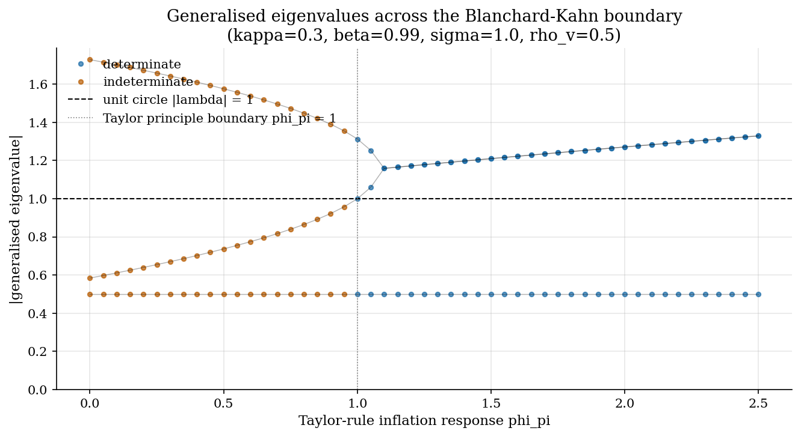
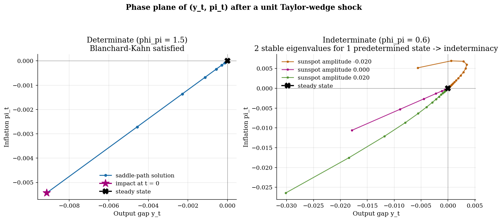
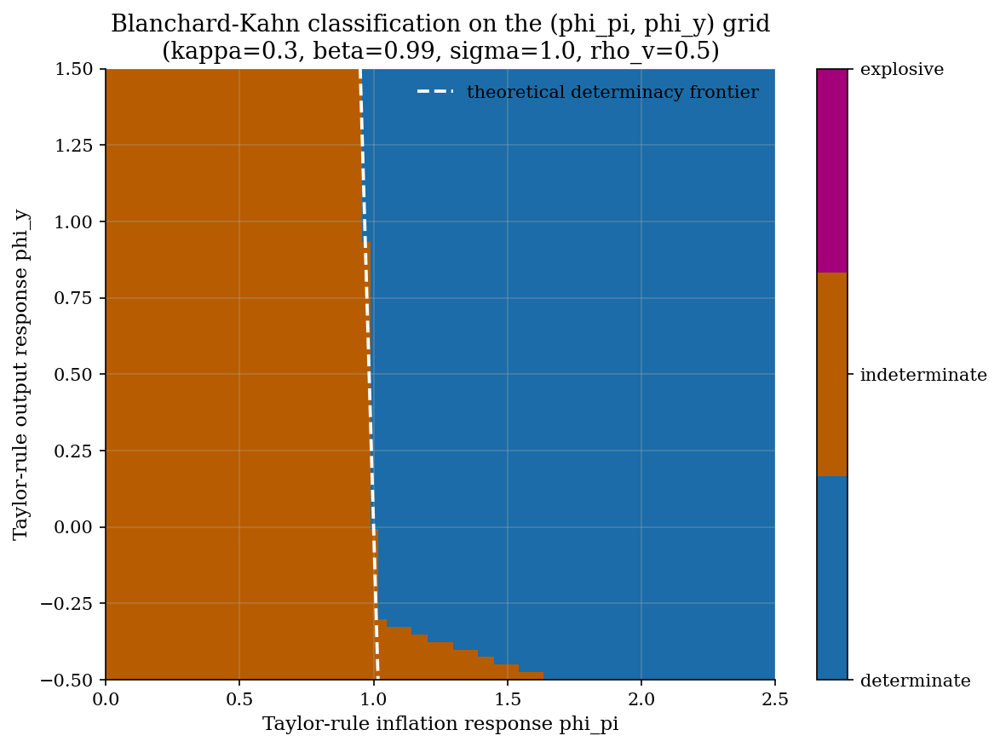

# Blanchard-Kahn Conditions and Saddle-Path Selection in Linear Rational Expectations

## Overview

A forward-looking linear difference equation does not pin down its solution from initial conditions alone. The household forms expectations of every future state, so the model has many algebraic paths through any given starting point. Most of them explode. The economic question is which path the model selects when the household refuses to follow an explosive trajectory.

Blanchard and Kahn answered this in 1980 with an eigenvalue count. The system has one unique non-explosive solution when the number of stable generalised eigenvalues equals the number of predetermined states. Too few stable eigenvalues leaves predetermined states with no bounded path. Too many leaves the jump variables free to load on a sunspot, so the equilibrium is indeterminate.

This tutorial demonstrates the rule on a small New Keynesian toy model. It also runs the same machinery on the canonical Real Business Cycle linearisation. The spec sketched a two-equation consumption-Euler plus capital-accumulation example; the prelim substitutes a three-variable New Keynesian system because the Taylor-rule coefficient crosses the BK boundary at exactly unity (Taylor principle) and gives a textbook-clean sweep. Sweeping the inflation response from zero through two and a half crosses the determinacy boundary, where one generalised eigenvalue migrates across the unit circle. The same QZ partition used here is the inner loop of the dense RBC tutorial in [`dsge/rbc/`](../../dsge/rbc/) and the New Keynesian DSGE in [`dsge/nkdsge/`](../../dsge/nkdsge/). The upstream linearisation step lives in [`computational-methods/perturbation-linearization/`](../../computational-methods/perturbation-linearization/), which produces the matrices this tutorial then partitions.

## Preliminary readings

- [`computational-methods/perturbation-linearization/`](../../computational-methods/perturbation-linearization/)

## Equations

Let $`t`$ index time and let $`s_t \in \mathbb{R}^n`$ stack the state. Partition $`s_t = (x_t, z_t)`$ where $`x_t \in \mathbb{R}^{n_x}`$ collects the predetermined variables and $`z_t \in \mathbb{R}^{n_z}`$ collects the jump variables, with $`n_x + n_z = n`$. Let $`\varepsilon_t`$ denote a vector of mean-zero structural innovations. The linear rational-expectations system is

```math
A \, \mathbb{E}_t s_{t+1} = B \, s_t + C \, \varepsilon_t.
```

The matrices $`A`$, $`B`$, and $`C`$ are the output of log-linearising the model around its deterministic steady state. Each row is one equilibrium condition; columns correspond to entries of $`s_t`$. The expectation $`\mathbb{E}_t s_{t+1}`$ multiplies $`A`$ because the row may involve next-period choices.

The Klein algorithm applies the generalised Schur (QZ) decomposition to the pair $`(B, A)`$. There exist unitary matrices $`Q`$ and $`Z`$ such that

```math
Q \, B \, Z = T,
\qquad
Q \, A \, Z = S,
```

with $`S`$ and $`T`$ upper triangular. The diagonal pairs $`(s_{ii}, t_{ii})`$ encode the generalised eigenvalues $`\lambda_i = t_{ii} / s_{ii}`$. A reordered Schur form puts the stable roots in the leading $`n_x \times n_x`$ block, with stability defined as $`|t_{ii} / s_{ii}| < 1`$.

The Blanchard-Kahn rule counts those stable roots:

```math
\#\bigl\{ \, i : |t_{ii} / s_{ii}| < 1 \, \bigr\} = n_x
\quad\Longleftrightarrow\quad
\text{unique bounded RE solution.}
```

When the equality holds the leading block of $`Z`$ is invertible and the recovered policy is read off the partition. Partition $`Z`$ conformably with $`(x_t, z_t)`$,

```math
Z = \begin{pmatrix} Z_{11} & Z_{12} \\ Z_{21} & Z_{22} \end{pmatrix},
```

and let $`S_{11}, T_{11}`$ be the stable triangular blocks. The state transition matrix and the jump rule are

```math
F = Z_{11} \, S_{11}^{-1} \, T_{11} \, Z_{11}^{-1},
\qquad
P = Z_{21} \, Z_{11}^{-1}.
```

The recovered policy is $`x_{t+1} = F x_t`$ for the predetermined block and $`z_t = P x_t`$ for the jumps. This is the same first-order solution `solve_klein` returns from `lib/perturbation.py`.

The two failure modes carry distinct economic content. When the stable count falls short of $`n_x`$, the predetermined block has too few decaying directions; the only paths consistent with the model are explosive, and the equilibrium does not exist. When the stable count exceeds $`n_x`$, jump variables have more than one bounded loading on the state; the model admits a family of bounded equilibria, indexed by the unused stable directions, and sunspot equilibria can be constructed.

## Model Setup

The toy model is a three-equation New Keynesian system with a Taylor-rule wedge. Variables in deviation from steady state:

| Symbol | Range or value | Role |
|---|---|---|
| $`y_t`$ | jump | output gap [from `dsge/nkdsge/`] |
| $`\pi_t`$ | jump | inflation [from `dsge/nkdsge/`] |
| $`v_t`$ | predetermined | Taylor-rule wedge AR(1) [from `dsge/nkdsge/`] |
| $`\sigma`$ | 1 | inverse intertemporal elasticity [from `dsge/nkdsge/`] |
| $`\beta`$ | 0.99 | discount factor [from `dsge/nkdsge/` and `dsge/rbc/`] |
| $`\kappa`$ | 0.30 | slope of the Phillips curve [from `dsge/nkdsge/`] |
| $`\phi_\pi`$ | swept in $`[0, 2.5]`$ | Taylor-rule inflation response [from `dsge/nkdsge/`] |
| $`\phi_y`$ | swept in $`[-0.5, 1.5]`$ | Taylor-rule output response [from `dsge/nkdsge/`] |
| $`\rho_v`$ | 0.5 | persistence of the Taylor wedge [from `dsge/nkdsge/`] |

The state vector and the canonical form:

| Symbol | Object | Role |
|---|---|---|
| $`s_t`$ | $`(v_t, y_t, \pi_t)`$ | full state, top row predetermined [prelim introduces this name; `dsge/rbc/` writes $`s_t = (\hat k_{t-1}, \hat a_t, \hat c_t)`$ in the same partition] |
| $`x_t`$ | $`v_t`$ | predetermined block [from `dsge/rbc/`] |
| $`z_t`$ | $`(y_t, \pi_t)`$ | jump block [from `dsge/rbc/`] |
| $`n_x`$ | 1 | number of predetermined states [prelim introduces this name following Klein (2000)] |
| $`n_z`$ | 2 | number of jump variables [prelim introduces this name following Klein (2000)] |
| $`A`$ | $`3 \times 3`$ | RE lead matrix multiplying $`\mathbb{E}_t s_{t+1}`$ [matches the Method-2 Klein QZ block of `dsge/rbc/`] |
| $`B`$ | $`3 \times 3`$ | RE contemporaneous matrix multiplying $`s_t`$ [matches the Method-2 Klein QZ block of `dsge/rbc/`] |
| $`C`$ | $`3 \times k`$ | innovation loading [prelim introduces this letter; dense tutorials currently fold it into $`B`$] |
| $`S, T`$ | upper triangular | QZ Schur factors [prelim introduces these names following Klein (2000); `dsge/rbc/` discusses them in prose without naming the factors] |
| $`Q, Z`$ | unitary | QZ rotations [prelim introduces these names following Klein (2000); `dsge/rbc/` does not expose the factor matrices] |
| $`F`$ | $`n_x \times n_x`$ | recovered state transition [from `dsge/rbc/`] |
| $`P`$ | $`n_z \times n_x`$ | recovered jump rule [from `dsge/rbc/`] |

The symbol $`A`$ collides across the catalog. In this tutorial it is the RE lead matrix in the linear system above. In the continuous-time heterogeneous-agent tutorials it is the sparse upwind generator on the asset grid. Each scope labels its $`A`$ on first use; the two objects never appear in the same model.

## Solution Method

The numerical engine is `lib.perturbation.solve_klein(A, B, n_predetermined)`. It applies an ordered generalised Schur decomposition to the pair $`(B, A)`$ with the stable roots placed in the upper-left block. It then recovers $`F`$ and $`P`$ from the leading partition and returns a diagnostic structure carrying the eigenvalues, the stable count, and a Blanchard-Kahn flag.

```text
Algorithm: Klein QZ solve with Blanchard-Kahn diagnostics
Inputs:    matrices A, B in the linear RE system,
           integer n_predetermined indexing the top of the state
Outputs:   state transition F, jump rule P,
           sorted generalised eigenvalues, BK pass or fail message

1. Reorder the state so that the predetermined block sits in the top rows.
2. Build A and B from the linearised equilibrium conditions.
3. Run ordered generalised Schur on the pair (B, A) with stable roots first.
4. Count stable generalised eigenvalues (absolute value below one).
5. Compare the count to n_predetermined:
       equal   -> Blanchard-Kahn satisfied
       larger  -> indeterminacy; sunspot equilibria exist
       smaller -> no bounded solution; equilibrium does not exist
6. When BK is satisfied, partition Z and recover F from the stable
   triangular block; recover P from the lower partition of Z.
7. Return F, P, eigenvalues, BK status.
```

When the stable count exceeds the predetermined count the leading block $`Z_{11}`$ is rank-deficient. The library catches the ill-conditioning and raises; the tutorial wraps that exception and continues recording the diagnostic so the sweep produces a complete classification.

The sanity-check pass calls `solve_klein` on the fixed-labor Real Business Cycle matrices from `dsge/rbc/run.py` and compares the recovered capital decision rule with the hand-derived undetermined-coefficients solve in the same file. Agreement to machine precision is the expected pass condition.

## Results

The Taylor-rule inflation coefficient $`\phi_\pi`$ is swept across the determinacy boundary at unity. At each value the QZ pass returns three generalised eigenvalues; their absolute values are plotted as a function of $`\phi_\pi`$.



One eigenvalue stays at $`0.5`$, equal to the persistence of the Taylor wedge. A second eigenvalue rises smoothly through unity as $`\phi_\pi`$ crosses one; on the right of the boundary it lies outside the unit circle. The third eigenvalue follows the symmetric branch. The stable count is two for $`\phi_\pi < 1`$ and one for $`\phi_\pi \geq 1`$. With one predetermined state, the right region is determinate and the left region is indeterminate. The classification flips discontinuously even though the eigenvalues move continuously.

The phase plane reads the two regimes in $`(y_t, \pi_t)`$ space.



The left panel uses $`\phi_\pi = 1.5`$. The wedge shock pushes the economy onto the saddle path. Output and inflation start below their steady-state values and decay along a single line. The slope of the line is $`P_{21} / P_{11}`$, the ratio of the inflation and output jump loadings on the wedge. The right panel uses $`\phi_\pi = 0.6`$. The QZ pass returns two stable eigenvalues for one predetermined state. The three coloured paths in the right panel are three distinct bounded rational-expectations solutions for the same initial wedge $`v_0 = 0.01`$. Each chooses a different sunspot amplitude in the second stable direction. All three decay to the steady state. The model cannot pick between them on its own.

The two-parameter classification map turns the BK rule into a regime diagram over the Taylor-rule coefficient pair.



The determinate region lies to the right of the dashed white frontier. The frontier follows the Bullard-Mitra long-run Taylor principle $`\phi_\pi + \frac{1 - \beta}{\kappa} \phi_y > 1`$ closely. The grid is computed cell by cell from the QZ count; the analytical curve confirms the empirical frontier is not an artefact of the sweep resolution. Explosive cells do not appear in this calibration because the wedge is the only predetermined state and its single decaying eigenvalue is always stable.

The sanity-check pass on the fixed-labor RBC linearisation from `dsge/rbc/` returns Blanchard-Kahn satisfied with two stable eigenvalues for two predetermined states. The recovered capital decision rule reads $`\hat k_t = 0.9621 \hat k_{t-1} + 0.0801 \hat a_t`$. The hand-derived undetermined-coefficients solve in `dsge/rbc/run.py` gives the same coefficients to absolute differences of $`8.9 \times 10^{-16}`$ and $`1.5 \times 10^{-15}`$, written to `tables/rbc-sanity-check.csv`. The same QZ partition runs on a small DSGE and selects the unique non-explosive path.

The full $`\phi_\pi`$ sweep is written to `tables/eigenvalue-sweep.csv` so a reader can replicate the eigenvalue trajectories without rerunning the script. Each row pairs a $`\phi_\pi`$ value with its three generalised eigenvalues, the BK classification, and the library message string.

## Takeaway

The Blanchard-Kahn rule turns the existence and uniqueness question for a linear rational-expectations model into an eigenvalue count. The boundary is a clean line in parameter space. Crossing the boundary flips the equilibrium between unique, indeterminate, and non-existent without warning from the steady state. Estimation of any DSGE has to live inside the determinate region of the parameter space, and a sibling tutorial walks through a Hamiltonian Monte Carlo posterior that restricts to that region.

## References

1. Blanchard, O. J. and Kahn, C. M. (1980). The Solution of Linear Difference Models under Rational Expectations. *Econometrica*, 48(5), 1305-1311.
2. Klein, P. (2000). Using the Generalized Schur Form to Solve a Multivariate Linear Rational Expectations Model. *Journal of Economic Dynamics and Control*, 24(10), 1405-1423.
3. Sims, C. A. (2002). Solving Linear Rational Expectations Models. *Computational Economics*, 20(1-2), 1-20.
4. DeJong, D. N. and Dave, C. (2011). *Structural Macroeconometrics*, 2nd edition. Princeton University Press, Chapter 2.
5. Bullard, J. and Mitra, K. (2002). Learning About Monetary Policy Rules. *Journal of Monetary Economics*, 49(6), 1105-1129.
- **See also.** The same eigenvalue-counting rule selects the saddle path in the linearised RBC of [`dsge/rbc/`](../../dsge/rbc/) and confirms the unique bounded equilibrium of the sticky-price New Keynesian DSGE in [`dsge/nkdsge/`](../../dsge/nkdsge/). The upstream linearisation step that produces the matrices $`A`$ and $`B`$ is in [`computational-methods/perturbation-linearization/`](../../computational-methods/perturbation-linearization/).
