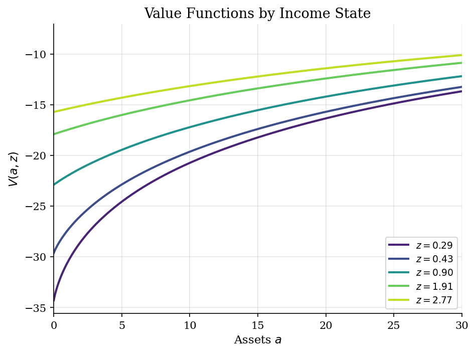
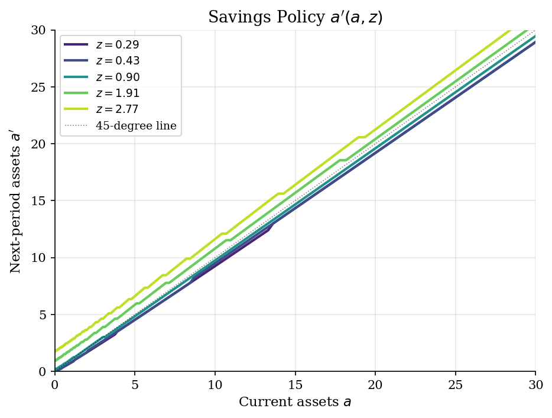
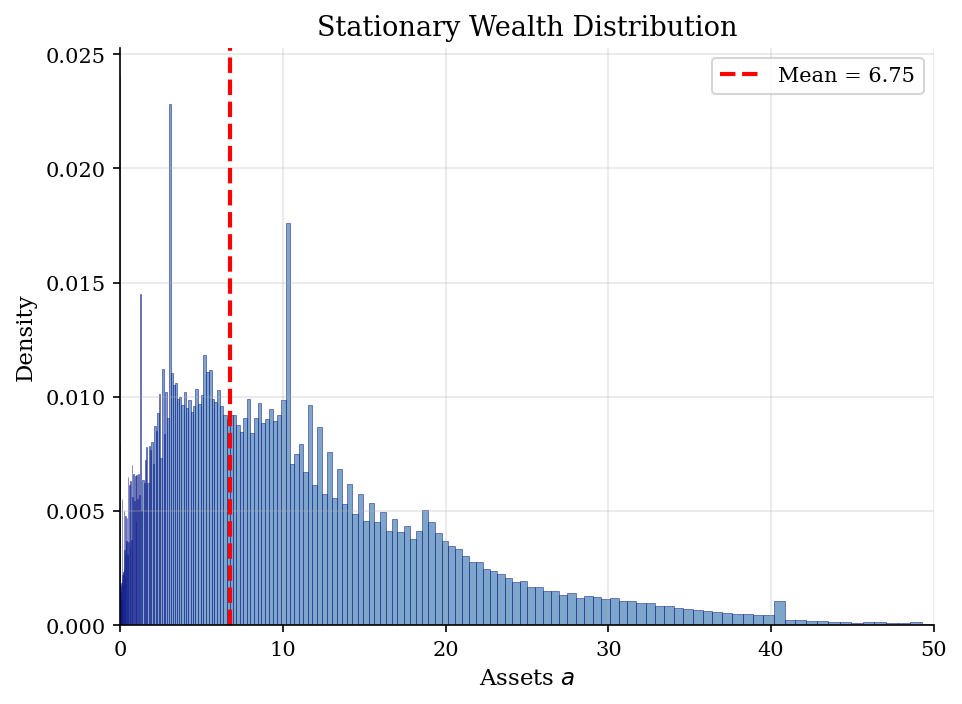
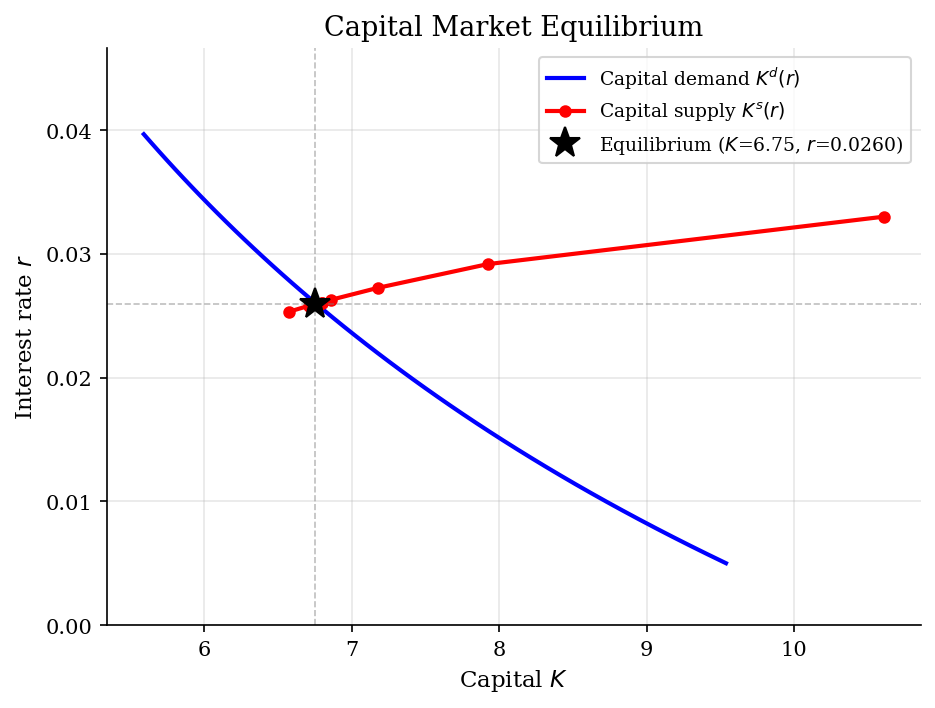

# Aiyagari (1994) General Equilibrium

> Stationary equilibrium with heterogeneous agents, uninsurable income risk, and borrowing constraints.

## Overview

The Aiyagari (1994) model is the canonical heterogeneous-agent general equilibrium framework. Households face uninsurable idiosyncratic income shocks and a borrowing constraint, and must self-insure through precautionary savings. A representative firm rents capital and labor to produce output with Cobb-Douglas technology.

In equilibrium, the interest rate adjusts so that aggregate household savings equals the firm's capital demand. Because households over-accumulate assets as a buffer against income risk, the equilibrium interest rate is pushed below the rate of time preference ($r < 1/\beta - 1$). This model generates an endogenous, right-skewed wealth distribution.

## Equations

**Household problem:**

$$V(a, z) = \max_{c \ge 0} \left\{ u(c) + \beta \, \mathbb{E}\left[V(a', z') \mid z\right] \right\}$$

$$c + a' = (1+r) \, a + w \, z, \quad a' \ge \underline{a}$$

**CRRA utility:** $u(c) = \frac{c^{1-\sigma}}{1-\sigma}$

**Income process:** $\ln z' = \rho \, \ln z + \varepsilon$, $\quad \varepsilon \sim N(0, \sigma_\varepsilon^2)$

**Firm problem (Cobb-Douglas):**

$$r = \alpha K^{\alpha - 1} L^{1-\alpha} - \delta, \qquad w = (1-\alpha) K^{\alpha} L^{-\alpha}$$

**Equilibrium condition:**

$$\int a \, d\mu(a, z) = K \quad \text{(aggregate savings = capital demand)}$$

where $\mu$ is the stationary distribution over $(a, z)$.

## Model Setup

| Parameter | Value | Description |
|-----------|-------|-------------|
| $\beta$  | 0.96 | Discount factor |
| $\sigma$ | 2.0 | CRRA risk aversion |
| $\alpha$ | 0.36 | Capital share |
| $\delta$ | 0.08 | Depreciation rate |
| $\rho$   | 0.9 | Income persistence |
| $\sigma_\varepsilon$ | 0.2 | Income shock std dev |
| $\underline{a}$ | 0.0 | Borrowing limit |
| Asset grid | 200 points | Exponential spacing on $[0.0, 50.0]$ |
| Income states | 7 | Rouwenhorst discretization |

## Solution Method

**Algorithm:** Bisection over the interest rate $r$ to clear the capital market.

For each candidate $r$:
1. Compute firm prices: wage $w$ and capital demand $K^d$ from the firm FOCs.
2. Solve the household problem via **value function iteration** (VFI) with grid search over next-period assets.
3. Compute the **stationary distribution** $\mu(a, z)$ by forward iteration on the policy function and Markov transition matrix.
4. Compute aggregate capital supply $K^s = \int a \, d\mu$.
5. If $K^s > K^d$, lower $r$; if $K^s < K^d$, raise $r$.

Bisection converged in **15 iterations** with tolerance 5e-04.

Equilibrium interest rate: $r^* = 0.025959$ (vs. $1/\beta - 1 = 0.041667$).

## Results


*Value functions V(a,z) for different income states at equilibrium prices*


*Savings policy a'(a,z) showing how next-period assets depend on current state*


*Stationary wealth distribution (marginal over income states)*


*Capital supply and demand curves intersecting at the general equilibrium*

**General Equilibrium Outcomes**

| Variable                   | Value               |
|:---------------------------|:--------------------|
| Interest rate $r$          | 0.025959            |
| Wage $w$                   | 1.2734              |
| Capital $K$                | 6.7514              |
| Output $Y$                 | 1.9888              |
| Capital-output ratio $K/Y$ | 3.3948              |
| Gini coefficient           | 0.5271              |
| Fraction at constraint     | 0.0241              |
| $r$ vs $1/\beta - 1$       | 0.025959 < 0.041667 |

## Economic Takeaway

The Aiyagari model demonstrates how **precautionary savings** and **market incompleteness** shape macroeconomic aggregates and the wealth distribution.

**Key insights:**
- The equilibrium interest rate $r^* = 0.0260$ is below the rate of time preference $1/\beta - 1 = 0.0417$. This wedge arises because agents over-save as a buffer against income risk, pushing down the return on capital.
- The wealth Gini coefficient is 0.527, reflecting the right-skewed distribution generated by persistent income shocks and the borrowing constraint.
- About 2.4% of agents are at the borrowing constraint in the stationary distribution, indicating significant liquidity pressure.
- The capital supply curve is upward-sloping: higher interest rates incentivize more saving, while capital demand is downward-sloping from diminishing returns.
- Greater income risk (higher $\sigma_\varepsilon$) increases precautionary savings, raising $K$ and lowering $r$; tighter borrowing constraints reduce savings and raise $r$.
- This is the foundation for modern HANK (Heterogeneous Agent New Keynesian) models used in monetary and fiscal policy analysis.

## Reproduce

```bash
python run.py
```

## References

- Aiyagari, S. R. (1994). Uninsured Idiosyncratic Risk and Aggregate Saving. *Quarterly Journal of Economics*, 109(3), 659-684.
- Huggett, M. (1993). The Risk-Free Rate in Heterogeneous-Agent Incomplete-Insurance Economies. *Journal of Economic Dynamics and Control*, 17(5-6), 953-969.
- Ljungqvist, L. and Sargent, T. (2018). *Recursive Macroeconomic Theory*. MIT Press, 4th edition, Ch. 18.
- Kaplan, G., Moll, B., and Violante, G. L. (2018). Monetary Policy According to HANK. *American Economic Review*, 108(3), 697-743.
