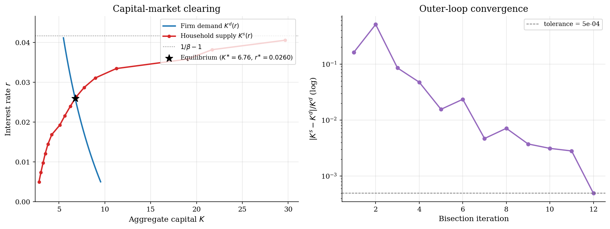
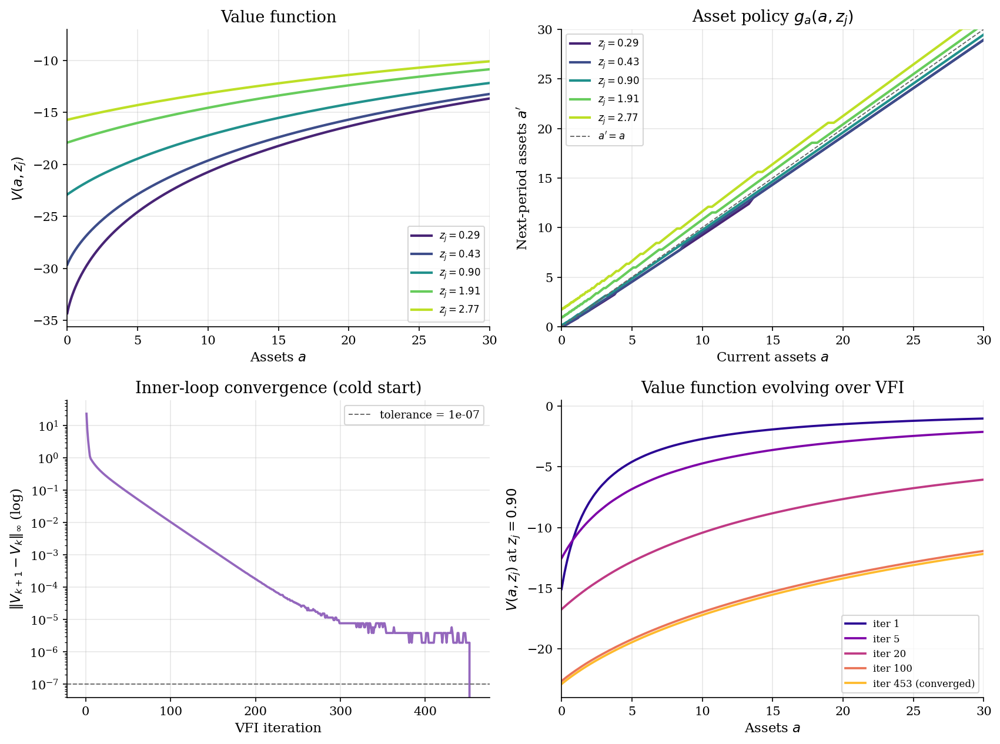
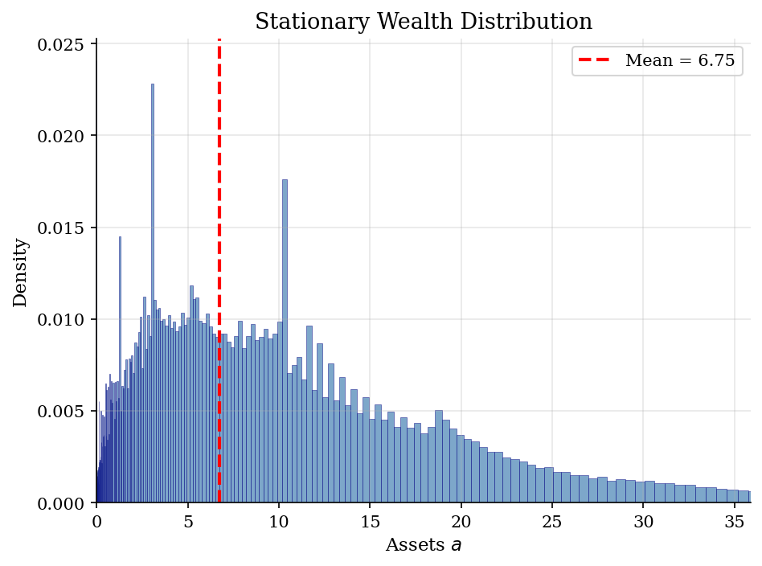

# Aiyagari Saving and Capital-Market Clearing

## Overview

In Aiyagari (1994), households face persistent idiosyncratic income risk and cannot borrow. They save in one risk-free asset to smooth consumption across income states.

The object is a *stationary general equilibrium*. Households choose an asset policy, firms demand capital, and the interest rate makes aggregate assets equal capital demand.

The computation nests two fixed points. Value function iteration gives household saving at a candidate rate. Bisection updates the rate until the capital market clears.

## Read before

- [Consumption-savings under income risk](../consumption-savings/README.md)
- [Shock discretization with Rouwenhorst](../shock-discretization/README.md)
- [Optimal growth model](../optimal-growth/README.md)

## Equations

The household side. Let $`a_t\in[\underline a,\bar a]`$ be beginning-of-period assets and $`z_t`$ idiosyncratic labor efficiency. With prices $`(r,w)`$, a no-borrowing constraint $`\underline a=0`$, and next-period assets denoted $`a_{t+1}=a'`$, consumption is

```math
c_t = (1+r)a_t + w z_t - a_{t+1}, \quad c_t > 0.
```

Preferences are time-separable CRRA with discount factor $`\beta\in(0,1)`$ and curvature $`\sigma>0`$:

```math
U_0 = \mathbb{E}_0\sum_{t=0}^{\infty}\beta^t u(c_t), \quad u(c)=\frac{c^{1-\sigma}}{1-\sigma}.
```

Log productivity is a Gaussian AR(1) with persistence $`\rho`$ and innovation standard deviation $`\sigma_\varepsilon`$:

```math
\log z_{t+1} = \rho\log z_t + \varepsilon_{t+1}, \quad \varepsilon_{t+1}\sim\mathcal{N}(0,\sigma_\varepsilon^2).
```

Discretize to an $`N`$-state Rouwenhorst chain on $`\{z_j\}`$ with transition matrix $`P_{jk}=\Pr(z_{t+1}=z_k\mid z_t=z_j)`$, matched to the AR(1) variance and persistence and normalized so $`\mathbb{E}[z]=1`$.

The *Bellman equation* writes the household's value as the maximum over feasible next-period assets of current utility plus expected continuation value:

```math
V(a,z_j) = \max_{a'\in[\underline a,\,(1+r)a+wz_j)} \left[\, u((1+r)a+wz_j-a') + \beta\sum_k P_{jk} V(a',z_k) \,\right].
```

The solution gives the asset policy $`g_a(a,z_j)`$ and consumption policy $`c^{\ast}(a,z_j) = (1+r)a + w z_j - g_a(a,z_j)`$. The borrowing constraint binds whenever $`g_a(a,z_j)=\underline a`$.

The stationary cross-section. Let $`i`$ index asset-grid nodes $`\{a_i\}`$. Given $`g_a`$ and $`P`$, the long-run distribution $`\mu`$ over $`(a,z)`$ satisfies the operator equation

```math
\mu(a',z_k) = \sum_j P_{jk}\sum_{i:\, g_a(a_i,z_j)=a'} \mu(a_i,z_j),
```

with aggregate household assets $`K^s(r) = \sum_{i,j} a_i\,\mu(a_i,z_j)`$.

The firm side. Cobb-Douglas technology $`Y = K^{\alpha} L^{1-\alpha}`$ with capital share $`\alpha`$ and depreciation $`\delta`$ delivers competitive factor prices

```math
r(K) = \alpha\left(\tfrac{K}{L}\right)^{\alpha-1}-\delta, \quad w(K) = (1-\alpha)\left(\tfrac{K}{L}\right)^{\alpha}.
```

With $`L=1`$, capital demand inverts the first to $`K^d(r) = \left(\tfrac{r+\delta}{\alpha}\right)^{1/(\alpha-1)}`$.

A stationary equilibrium is $`(r^{\ast}, w^{\ast}, g_a, \mu)`$ such that the household problem is solved at $`(r^{\ast},w^{\ast})`$, the distribution is invariant under $`(g_a,P)`$, and the capital market clears:

```math
K^s(r^{\ast}) = K^d(r^{\ast}).
```

Bisection delivers $`K^s(r^{\ast}) \approx K^d(r^{\ast})`$ within tolerance, not exact equality; the residual is a tolerance gap, not a model object. A standard result is $`r^{\ast}<1/\beta-1`$: above that rate, precautionary saving becomes unbounded.

<details>
<summary>Worked Numerical Example (click to expand)</summary>

One *Bellman operator* application by hand. Take $`a \in \{0, 2\}`$, $`z \in \{0.5, 1.5\}`$, symmetric chain with $`P_{\text{stay}} = 0.9, P_{\text{switch}} = 0.1`$, $`\beta = 0.96`$, $`\sigma = 2`$ (so $`u(c) = -1/c`$), $`r = 0.025`$, $`w = 1.25`$. Guess

```math
V(0, 0.5) = -40, \quad V(0, 1.5) = -20, \quad V(2, 0.5) = -25, \quad V(2, 1.5) = -15.
```

Evaluate at $`(a, z_j) = (2, 1.5)`$. Cash-on-hand is $`(1.025)(2) + (1.25)(1.5) = 3.925`$. Conditional on $`z_j = 1.5`$, $`P_{1.5,0.5} = 0.1`$ and $`P_{1.5,1.5} = 0.9`$. The two feasible choices give

```math
a' = 0: \quad u(3.925) + \beta\,[(0.1)(-40) + (0.9)(-20)] = -0.2548 + (0.96)(-22.0) = -21.375,
```

```math
a' = 2: \quad u(1.925) + \beta\,[(0.1)(-25) + (0.9)(-15)] = -0.5195 + (0.96)(-16.0) = -15.880.
```

Argmax is $`a' = 2`$:

```math
\boxed{g_a(2, 1.5) = 2, \quad c^{\ast}(2, 1.5) = 1.925, \quad V_{\text{new}}(2, 1.5) = -15.880.}
```

The high-income household holds wealth flat. The better continuation beats the curvature cost of cutting consumption from 3.925 to 1.925. The production solver in `run.py` repeats this argmax at every $`(a_i, z_j)`$ node on the 7×200 grid until $`V_{\text{new}} \approx V`$ in sup-norm.

</details>

## Model Setup

| Object | Value | Role |
|---|---:|---|
| Discount factor $`\beta`$ | 0.96 | Annual time preference |
| Impatience benchmark $`1/\beta-1`$ | 0.0417 | Complete-markets ceiling on $`r^{\ast}`$ |
| CRRA $`\sigma`$ | 2.0 | Curvature; controls precautionary motive |
| Capital share $`\alpha`$ | 0.36 | Cobb-Douglas exponent on $`K`$ |
| Depreciation $`\delta`$ | 0.08 | Pinning $`K^d(r)`$ |
| Income persistence $`\rho`$ | 0.9 | AR(1) coefficient on $`\log z`$ |
| Innovation s.d. $`\sigma_\varepsilon`$ | 0.2 | AR(1) shock scale |
| Income states $`N`$ | 7 | Rouwenhorst nodes for $`\{z_j\}`$ |
| Asset bracket | $`[0,50]`$ | $`\underline a`$ at no-borrowing limit |
| Asset grid (coarse) | 200 pts | Exponential, denser at $`\underline a`$ |
| Capital-market tolerance | 5e-04 | Stop when $`\lvert K^s-K^d\rvert/K^d`$ falls below |
| Bracket-width tolerance | 1e-06 | Backup stop on $`r_H-r_L`$ |
| VFI tolerance | 1e-07 | Sup-norm on $`V`$ |

## Solution Method

What's new in Aiyagari is the outer *bisection* that ties household saving to firm capital demand. The inner blocks (household Bellman and stationary distribution) are covered in the prereq tutorials and used here as black boxes.

<details>
<summary>Algorithm structure: outer bisection around inner VFI (click to expand)</summary>

```
+------------------- outer loop: bisect r ------------------+
|                                                           |
|   r  -->  firm FOC  -->  K^d(r), w(r)                     |
|                                                           |
|   +-------- inner loop: VFI --------+                     |
|   |  V_k --> Bellman op --> V_{k+1} | --> policy g_a      |
|   +---------------------------------+                     |
|                                                           |
|   g_a   -->  forward iteration  -->  mu(a, z)             |
|   mu    -->  aggregate          -->  K^s(r)               |
|                                                           |
|   compare K^s vs K^d  -->  update [r_low, r_high]         |
|                                                           |
+-----------------------------------------------------------+
                             |
                             v
                       r*, w*, K*, mu*
```

</details>

```python
# Outer loop: bisect over r until K^s(r) = K^d(r).
def find_equilibrium(r_low, r_high, primitives, tol=5e-4):
    while r_high - r_low > tol:
        r = (r_low + r_high) / 2

        # firm FOC inverted: K^d(r) = ((r + δ) / α)^(1 / (α - 1)); w(r) = (1 - α) K^α
        K_d, w = firm_block(r, primitives)

        # inner blocks (see consumption-savings + shock-discretization tutorials)
        g_a = solve_household_bellman(r, w, primitives)
        mu = stationary_distribution(g_a, primitives)

        # K^s(r) = Σ_{i, j} a_i * μ(a_i, z_j)
        K_s = aggregate_assets(mu, primitives)

        # market-clearing: K^s > K^d means households save too much, rate too high
        if K_s > K_d:
            r_high = r
        else:
            r_low = r

    return r, w, K_s, mu
```

The outer bisection reaches relative gap 4.94e-04 in 12 steps. The cold-start inner VFI at the equilibrium prices takes about 500 iterations to sup-norm 1e-07; inside the bisection a warm-started VFI converges in one to two iterations after the first solve.

## Results

The firm schedule is analytic and slopes down. The household schedule solves the Bellman problem at each rate. The crossing is the stationary equilibrium. The bisection driving toward that crossing shows a roughly log-linear decay in the relative market-clearing gap, hitting tolerance in 12 steps.



Value functions rise with assets and income. Asset policies show stronger saving after good income states, with a visible kink at the borrowing limit and each income line eventually crossing below the 45-degree line. That crossing is the *buffer-stock target* at the equilibrium rate. The inner VFI converges geometrically in sup-norm; the value-function snapshots show the Bellman operator pulling the initial guess toward the fixed point monotonically.



The stationary distribution comes from the asset policy and income chain. Mean wealth exceeds median, with a small mass at the borrowing limit and a long right tail from repeated high-income draws. With no ex-ante heterogeneity, the run produces a Gini around 0.5.



### Stationary equilibrium diagnostics

| Variable                     |       Value |
|:-----------------------------|------------:|
| Interest rate $`r^{\ast}`$     |   0.025959  |
| Wage $`w^{\ast}`$              |   1.2734    |
| Aggregate capital $`K^{\ast}`$ |   6.7599    |
| Output $`Y^{\ast}`$            |   1.9897    |
| Capital-output ratio $`K/Y`$   |   3.3975    |
| Mean wealth $`\mathbb{E}[a]`$  |   6.7633    |
| Median wealth $`\tilde a`$     |   4.4728    |
| P90 wealth                   |  16.3145    |
| Gini                         |   0.5261    |
| Mass at constraint           |   0.0245    |
| Relative market-clearing gap |   0.0004939 |
| Bisection steps              |  12         |
| VFI iterations               | 188         |

## Takeaway

*Precautionary saving* turns a household policy into an aggregate capital supply curve. Incomplete insurance pushes the equilibrium interest rate below the complete-markets benchmark. The gap is the price of self-insurance. The model closes via VFI inside bisection: household optimization at a candidate rate, stationary distribution from the policy, and an outer rate adjustment that clears the capital market.

## See also

- [Huggett incomplete-markets model](../../heterogeneous-agents/huggett-incomplete-markets/README.md)
- [Aiyagari in continuous time (HJB + KFE)](../../heterogeneous-agents/aiyagari-hact/README.md)
- [Sequence-space Jacobian HANK](../../heterogeneous-agents/sequence-space-jacobian-hank/README.md)

## References

- Aiyagari, S. R. (1994). Uninsured Idiosyncratic Risk and Aggregate Saving. *Quarterly Journal of Economics*, 109(3), 659-684.
- Ljungqvist, L. and Sargent, T. (2018). *Recursive Macroeconomic Theory*. MIT Press, 4th edition, Ch. 18.
