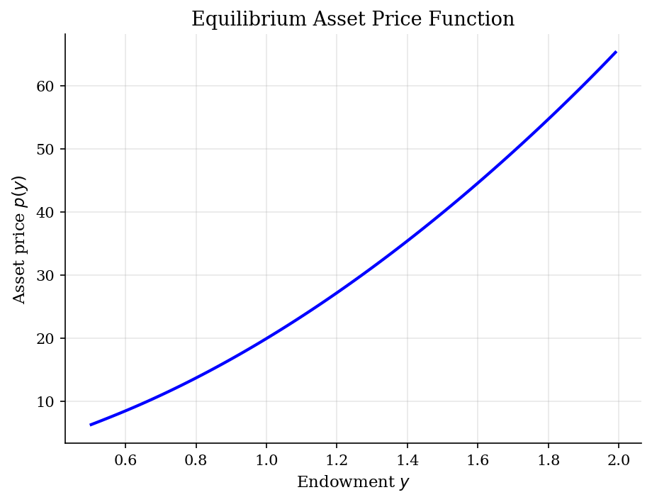
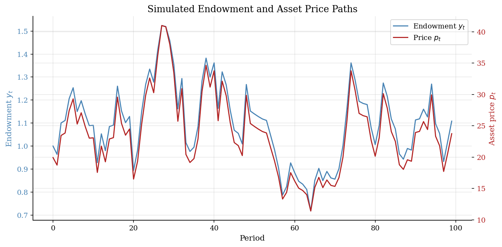
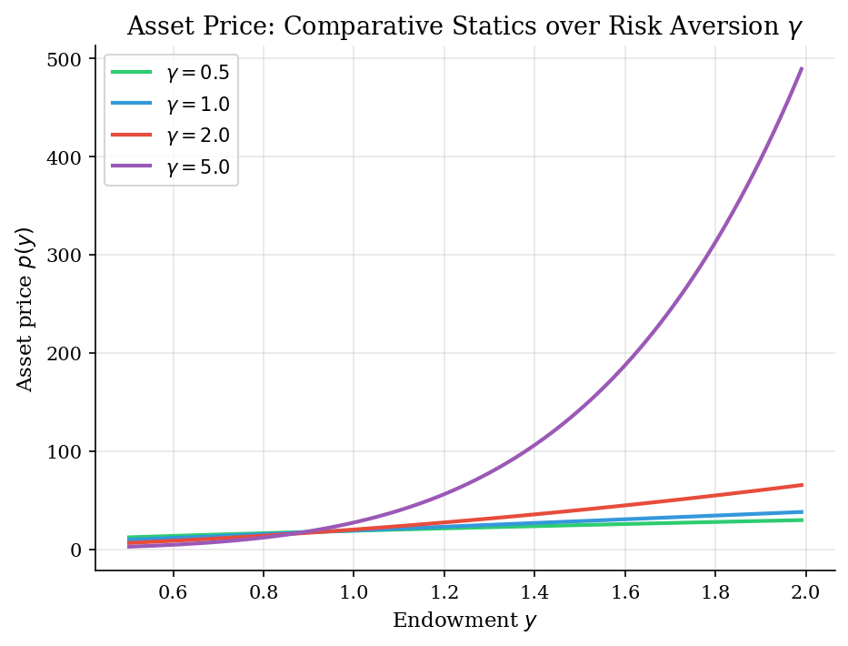

# Lucas Asset Pricing

> Equilibrium asset prices in a pure exchange economy with a representative agent.

## Overview

The Lucas (1978) tree model is the foundational framework for understanding how asset prices are determined in general equilibrium. A representative agent owns a tree that produces a stochastic endowment (dividend) each period. Since the agent cannot trade in equilibrium, consumption must equal the endowment, and the asset price adjusts to make the agent willing to hold the tree.

This model shows that asset prices are determined by the marginal rate of substitution between current and future consumption, weighted by future dividends. Risk aversion plays a central role: more risk-averse agents demand higher compensation for holding risky assets, lowering equilibrium prices.

## Equations

$$V(y) = u(y) + \beta \, \mathbb{E}\left[ V(y') \mid y \right]$$

**Euler equation (asset pricing):**
$$p(y) = \beta \, \mathbb{E}\left[ \frac{u'(y')}{u'(y)} \left( p(y') + y' \right) \mid y \right]$$

where $y$ is the endowment (= dividend = consumption in equilibrium).

**Endowment process (AR(1) in logs):**
$$\log y' = \rho \, \log y + z, \qquad z \sim \mathcal{N}(0, \sigma^2)$$

**Pricing kernel transformation:** Define $f(y) = u'(y) \cdot p(y)$, then:
$$f(y) = \beta \, \mathbb{E}\left[ f(y') + u'(y') \cdot y' \right]$$

This is a contraction mapping in $f$, solved by iteration. The asset price is recovered as $p(y) = f(y) / u'(y)$.

## Model Setup

| Parameter | Value | Description |
|-----------|-------|-------------|
| $\beta$  | 0.95 | Discount factor |
| $\rho$   | 0.9 | Persistence of log-endowment |
| $\gamma$ | 2.0 | CRRA risk aversion |
| $\sigma$ | 0.1 | Std dev of endowment shock |
| Grid points | 100 | Endowment grid |
| MC draws | 100 | For expectation approximation |

## Solution Method

**Value Function Iteration on Pricing Kernel:** We iterate on the transformed Euler equation $f(y) = \beta \, \mathbb{E}[f(y') + u'(y') y']$ using Monte Carlo integration with 100 fixed draws for the expectation. The operator is a contraction mapping under standard conditions (bounded, discounted), guaranteeing convergence.

Starting from $f_0 = 0$, we iterate until $\|f_{n+1} - f_n\|_\infty < 10^{-6}$.

Converged in **271 iterations** (error = 9.81e-07).

## Results


*Equilibrium asset price as a function of endowment*


*Simulated endowment and asset price over 100 periods (dual y-axis)*


*Asset price function for different levels of risk aversion gamma*

**Price-Dividend Ratio at Selected Endowment Levels**

|     y |    p(y) |   p(y)/y |   p/y (gamma=0.5) |   p/y (gamma=1.0) |   p/y (gamma=2.0) |   p/y (gamma=5.0) |
|------:|--------:|---------:|------------------:|------------------:|------------------:|------------------:|
| 0.578 |  7.9558 |  13.7739 |           22.698  |                19 |           13.7739 |            6.7619 |
| 0.773 | 12.9185 |  16.7131 |           20.4821 |                19 |           16.7131 |           13.4544 |
| 0.968 | 18.8767 |  19.4942 |           18.9423 |                19 |           19.4942 |           24.734  |
| 1.179 | 26.3669 |  22.3692 |           17.7084 |                19 |           22.3692 |           44.2008 |
| 1.374 | 34.2888 |  24.954  |           16.811  |                19 |           24.954  |           71.4008 |
| 1.584 | 43.8352 |  27.6655 |           16.0248 |                19 |           27.6655 |          113.442  |
| 1.78  | 53.6349 |  30.1348 |           15.4128 |                19 |           30.1348 |          167.356  |
| 1.99  | 65.2685 |  32.7945 |           14.835  |                19 |           32.7945 |          245.835  |

## Economic Takeaway

The Lucas tree model reveals how equilibrium asset prices emerge from the interaction of time preference, risk aversion, and the stochastic properties of dividends.

**Key insights:**
- Asset prices are *increasing* in the endowment level: when income is high, the agent is wealthy and willing to pay more for the asset (wealth effect).
- The price-dividend ratio *varies* with the level of risk aversion $\gamma$. Higher risk aversion lowers prices because the agent demands greater compensation for bearing dividend risk (precautionary effect).
- With low risk aversion ($\gamma < 1$), the substitution effect dominates: prices are high because the agent is relatively indifferent between consumption today and tomorrow.
- Asset prices comove positively with endowment in the simulation, reflecting the procyclical nature of asset valuations in this model.
- The pricing kernel transformation $f(y) = u'(y) p(y)$ converts the Euler equation into a standard contraction mapping, making VFI straightforward and guaranteed to converge.

## Reproduce

```bash
python run.py
```

## References

- Lucas, R. (1978). "Asset Prices in an Exchange Economy." *Econometrica*, 46(6), 1429-1445.
- Ljungqvist, L. and Sargent, T. (2018). *Recursive Macroeconomic Theory*. MIT Press, 4th edition, Ch. 13.
- Stokey, N., Lucas, R., and Prescott, E. (1989). *Recursive Methods in Economic Dynamics*. Harvard University Press.
