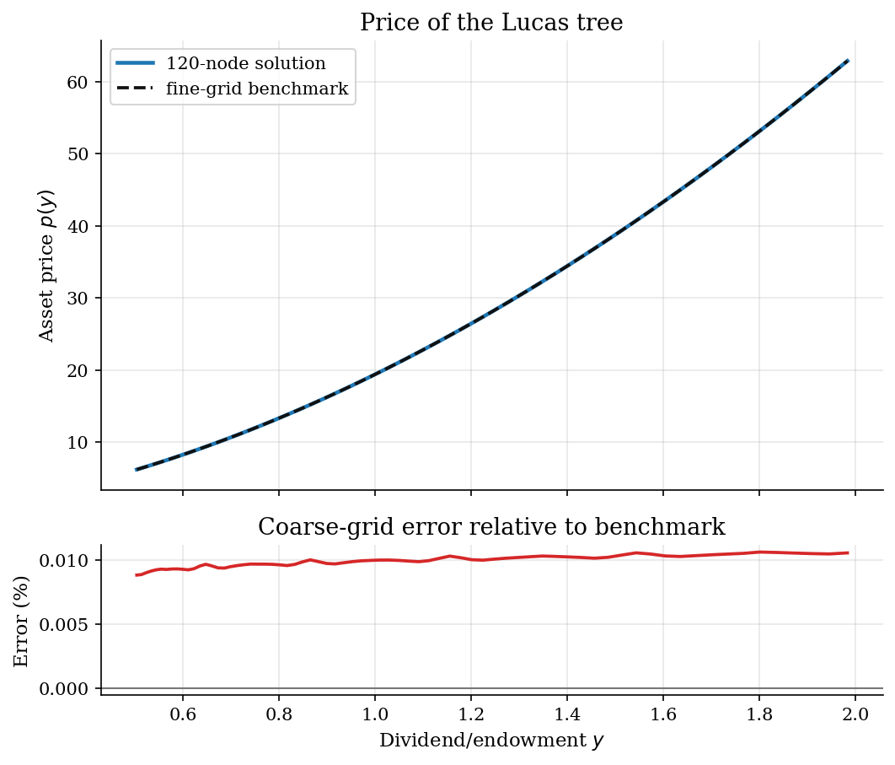
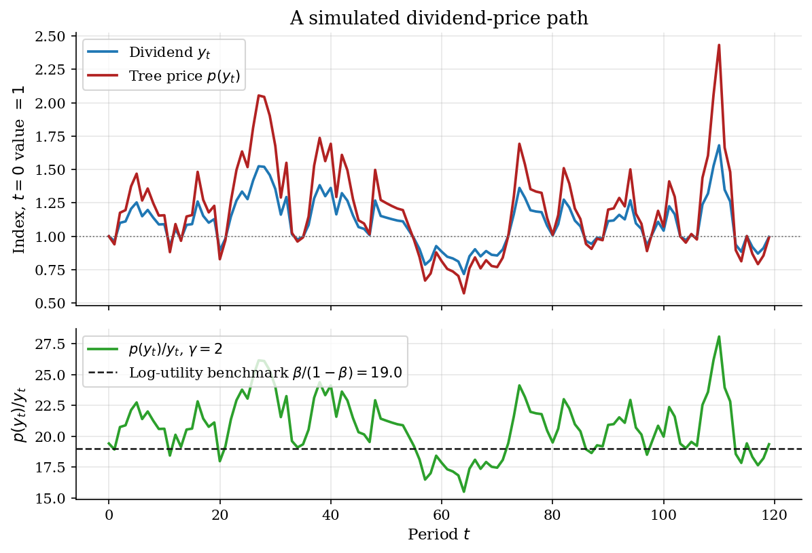
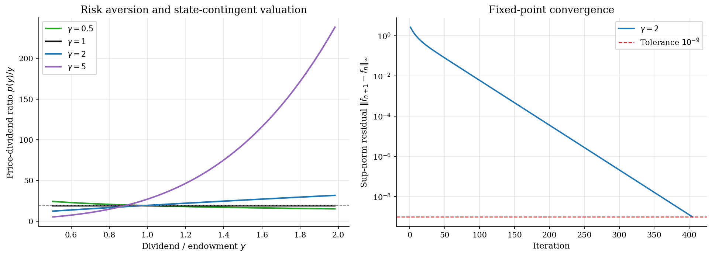

# Lucas Tree I: SDF Baseline by Scaled-Price Iteration

## Overview

Before Lucas (1978), asset pricing theories priced securities relative to the market portfolio (CAPM) without a consumption-theoretic foundation for the discount rate. Lucas embedded pricing in a pure exchange economy with a representative agent, deriving prices from first principles as a fixed point in the consumption Euler equation.

A Lucas tree pays a stochastic dividend each period. A representative household owns the tree and consumes the dividend. Market clearing sets consumption equal to the dividend, so there is no savings choice.

The equilibrium object is the price function. It makes the household willing to hold the tree after seeing today's dividend. The *stochastic discount factor* prices the next dividend and resale value.

The price satisfies an Euler equation with a conditional expectation. We solve a one-dimensional fixed point after scaling price by marginal utility. Gauss-Hermite quadrature evaluates the expectation at off-grid dividend states.

## Read before

- [Consumption-savings under income risk](../consumption-savings/README.md)
- [Shock discretization with Rouwenhorst](../shock-discretization/README.md)
- [Optimal growth model](../optimal-growth/README.md)

## Equations

Let $`x_t=\log y_t`$ follow

```math
x_{t+1}=\rho x_t+\varepsilon_{t+1}, \qquad \varepsilon_{t+1}\sim \mathcal{N}(0,\sigma^2), \qquad |\rho|<1.
```

The process is stationary with variance $`\sigma^2/(1-\rho^2)`$. Persistence $`\rho`$ controls how fast dividends revert toward the mean.

The representative household has CRRA utility

```math
u(c)=\frac{c^{1-\gamma}}{1-\gamma}, \qquad u'(c)=c^{-\gamma}, \qquad \gamma>0.
```

The log case is $`u(c)=\log c`$ as $`\gamma\to 1`$.

Market clearing imposes $`c_t=y_t`$. A claim pays $`y_{t+1}`$ plus resale value $`p(y_{t+1})`$. Its price satisfies

```math
p(y_t)=\mathbb{E}_t\left[M_{t+1}(y_{t+1}+p(y_{t+1}))\right],
\qquad M_{t+1}=\beta\left(\frac{y_{t+1}}{y_t}\right)^{-\gamma}.
```

Equivalently,

```math
p(y_t)=\beta\mathbb{E}_t\left[
\frac{u'(y_{t+1})}{u'(y_t)}(p(y_{t+1})+y_{t+1})\right].
```

Define the marginal-utility-scaled price

```math
f(y)\equiv u'(y) p(y).
```

Multiplying the Euler equation by $`u'(y_t)`$ gives

```math
f(y)=\beta\mathbb{E}\left[f(y')+u'(y') y'\big|y\right].
```

Here $`y'`$ denotes next-period endowment; primes denote next-period values throughout.

This is a linear fixed point in $`f`$. The price and price-dividend ratio recover from

```math
p(y)=\frac{f(y)}{u'(y)},\qquad \frac{p(y)}{y}=\frac{f(y)}{yu'(y)}.
```

When $`\gamma=1`$, $`u'(y)y=1`$. The recursion is $`f=\beta(f+1)`$ at every $`y`$. It implies the constant ratio

```math
\frac{p(y)}{y}=\frac{\beta}{1-\beta}.
```

The flat ratio gives a direct check on the numerical solution.

## Worked Numerical Example

To see the SDF mechanism in one step, solve the fixed point analytically under log utility, then extend to CRRA $`\gamma=2`$ using a special case that admits a closed form.

Start with log utility, $`\gamma=1`$. Marginal utility is $`u'(y)=y^{-1}`$, so $`u'(y)y=1`$ for all $`y`$. The scaled-price recursion

```math
f = \beta\,\mathbb{E}\!\left[f + u'(y')\,y'\right] = \beta(f + 1)
```

is a scalar equation. Solving for the fixed point:

```math
f(1-\beta) = \beta \implies f^{\ast} = \frac{\beta}{1-\beta}.
```

With $`\beta=0.95`$:

```math
\frac{p(y)}{y} = f^{\ast} = \frac{0.95}{1-0.95} = \boxed{19.0}
```

for every dividend state $`y`$. The flat ratio is the benchmark the numerical solver must recover at $`\gamma=1`$.

Now move to CRRA $`\gamma=2`$ with iid dividends. Set $`\rho=0`$ so $`x'\sim\mathcal{N}(0,\sigma^2)`$ and each period's state is independent. The forcing term becomes $`u'(y')y'=(y')^{1-\gamma}=(y')^{-1}=e^{-x'}`$. By the log-normal moment-generating function, $`\mathbb{E}[e^{-x'}]=e^{\sigma^2/2}`$. At the mean state $`y=1`$, where $`u'(1)=1`$, the fixed-point equation is

```math
f^{\ast} = \beta\!\left(f^{\ast} + e^{\sigma^2/2}\right)
\implies f^{\ast}(1-\beta) = \beta\,e^{\sigma^2/2}
\implies f^{\ast} = \frac{\beta\,e^{\sigma^2/2}}{1-\beta}.
```

With $`\sigma=0.10`$, $`e^{\sigma^2/2}=e^{0.005}\approx 1.00501`$:

```math
\frac{p(1)}{1} = f^{\ast} = 19.0\times e^{0.005} \approx \boxed{19.10}.
```

The ratio exceeds 19.0 because higher risk aversion ($`\gamma=2`$) depresses $`u'(y')y'`$ on average relative to log utility. Dividend persistence ($`\rho=0.9`$ in the full model) strengthens this effect further, raising $`p/y`$ at the mean to $`\approx 19.29`$ as reported in the Results table.

## Model Setup

| Parameter | Value | Parameter | Value |
|---|---:|---|---:|
| Discount factor $`\beta`$ | 0.95 | CRRA risk aversion $`\gamma`$ | 2.0 |
| Log-dividend persistence $`\rho`$ | 0.90 | Coarse grid nodes | 120 |
| Innovation s.d. $`\sigma`$ | 0.10 | Quadrature nodes (coarse) | 21 |
| Stationary s.d. of $`\log y`$ | 0.2294 | Benchmark grid nodes | 900 |
| Fine-grid quadrature nodes | 45 | Stopping tolerance | $`10^{-9}`$ |

## Solution Method

What is new here relative to the consumption-savings prereq is the *scaled-price iteration*. There is no household policy to solve for. Market clearing collapses the Bellman equation to a valuation equation in $`f(y) = u'(y)p(y)`$. The scaling removes current marginal utility from the denominator and turns the Euler equation into a linear contraction. Gauss-Hermite quadrature integrates over the continuous log-normal innovation at each grid point.

```
         beta, rho, sigma, gamma; log-endowment grid X; GH nodes, weights
                                       |
                                       v
             +---------- scaled-price iteration (Tf) -----------+
             |                                                   |
             |   f_n  -->  [ Bellman operator T ]  -->  f_{n+1} |
             |                                                   |
             +----------  err >= tol: repeat  ------------------+
                                       |
                                   err < tol
                                       v
                              f*(x), p(y) = f* / u'(y), p/y
```

```python
# Precompute next-state nodes and forcing term u'(y') y' = (y')^{1 - gamma}
x_next = rho * x_grid[:, None] + shocks[None, :]   # shape (n_grid, n_quad)
y_next = np.exp(x_next)
dividend_term = y_next ** (1 - gamma)               # u'(y') y' under CRRA

f = np.zeros_like(x_grid)   # initial guess f_0 = 0

for iteration in range(1, max_iter + 1):
    # Interpolate old f at off-grid next-state nodes (prereq: linear interp)
    continuation = np.interp(x_next.ravel(), x_grid, f).reshape(x_next.shape)
    # Apply operator T: f_{n+1}(x_i) = beta * sum_j w_j * (f_n(x'_ij) + d_ij)
    f_new = beta * np.sum((continuation + dividend_term) * weights[None, :], axis=1)
    error = float(np.max(np.abs(f_new - f)))
    f = f_new
    if error < tol:
        break

price = f / y_grid ** (-gamma)   # p(y) = f(x) / u'(y) = f(x) * y^gamma
```

The operator $`T`$ is a $`\beta`$-contraction on the sup-norm ball. The baseline $`\gamma=2.0`$ solution converges in 405 iterations to sup-norm residual 9.76e-10. A fine grid with 900 state nodes and 45 quadrature nodes checks interpolation and quadrature error. On the central $`\pm 3\,\mathrm{sd}(\log y)`$ region, the maximum relative error is 0.011%.

## Results

The price rises with the dividend state. Persistence makes a high current dividend predict higher future dividends. Convexity reflects future cash flows and state-dependent discounting.

The lower panel compares the coarse grid with the fine-grid benchmark. The maximum central relative error is 0.011%, so visible curvature is not a grid artifact.



In simulation, prices move closely with dividends. The price index is more volatile because it capitalizes the continuation stream.

The lower panel plots $`p(y_t)/y_t`$. Under $`\gamma=2`$, the ratio moves with the dividend state.



Risk aversion changes the slope of the price-dividend ratio. Log utility gives the flat benchmark $`\beta/(1-\beta)\approx 19.0`$. The $`\gamma=1`$ curve overlaps the dashed line.

When $`\gamma<1`$, the ratio falls with current dividends. When $`\gamma>1`$, it rises. Dotted lines are fine-grid benchmarks. The right panel shows the sup-norm residual falling geometrically across iterations, confirming that $`T`$ is a $`\beta`$-contraction.



Rows compare dividend states. Near $`y\approx 1`$, all ratios are close to the log-utility benchmark $`\beta/(1-\beta)=19.0`$. Away from the mean, risk aversion changes how the SDF prices mean reversion.

Price-dividend ratios at selected dividend states:

|     y |   p(y), gamma=2 |   p/y, gamma=0.5 |   p/y, gamma=1 |   p/y, gamma=2 |   p/y, gamma=5 |
|------:|----------------:|-----------------:|---------------:|---------------:|---------------:|
| 0.504 |           6.221 |           24.302 |             19 |         12.334 |          5.208 |
| 0.624 |           8.815 |           22.534 |             19 |         14.137 |          8.09  |
| 0.786 |          12.949 |           20.772 |             19 |         16.477 |         14.075 |
| 0.99  |          19.105 |           19.167 |             19 |         19.29  |         26.323 |
| 1.248 |          28.308 |           17.706 |             19 |         22.679 |         52.398 |
| 1.573 |          42.114 |           16.373 |             19 |         26.771 |        109.637 |
| 1.983 |          62.894 |           15.157 |             19 |         31.724 |        238.292 |

### Solution diagnostics

| Quantity | Value | Quantity | Value |
|---|---:|---|---:|
| Baseline iterations | 405 | Baseline sup-norm residual | 9.76e-10 |
| Central max relative error (%) | 0.011 | Convergence rate (per iter) | $`\approx\beta`$ |

## Takeaway

The Lucas tree has no household policy once market clearing sets $`c=y`$. The Euler equation is therefore a valuation equation for $`p(y)`$. Scaling by $`u'(y)`$ gives a linear fixed point. The price-dividend ratio shows how risk aversion prices dividend mean reversion.

Mehra and Prescott (1985) used this exact framework and found that matching the observed equity premium requires risk aversion near 50, far above any plausible value. That tension launched three decades of habit, heterogeneous-agent, and rare-disaster extensions, all anchored to Lucas's stochastic discount factor.

## See also

- [Huggett incomplete-markets model](../../heterogeneous-agents/huggett-incomplete-markets/README.md)
- [Aiyagari model with production](../aiyagari/README.md)
- [Optimal growth model](../optimal-growth/README.md)

## References

- Lucas, R. (1978). "Asset Prices in an Exchange Economy." *Econometrica*, 46(6), 1429-1445.
- Mehra, R. and Prescott, E. (1985). "The Equity Premium: A Puzzle." *Journal of Monetary Economics*, 15(2), 145-161.
- Ljungqvist, L. and Sargent, T. (2018). *Recursive Macroeconomic Theory*. MIT Press, 4th edition, Ch. 13.
- Stokey, N., Lucas, R., and Prescott, E. (1989). *Recursive Methods in Economic Dynamics*. Harvard University Press.
