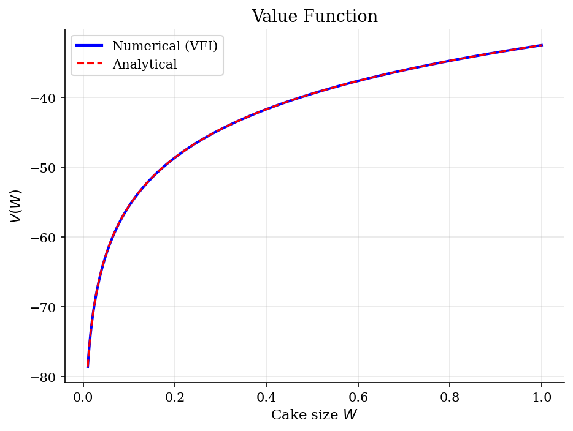
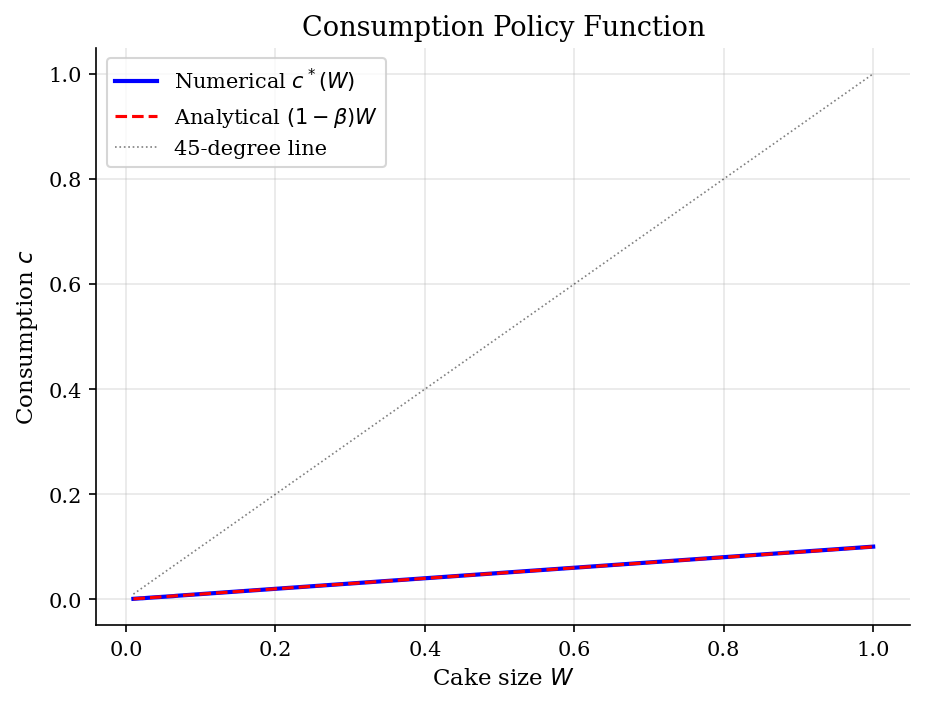
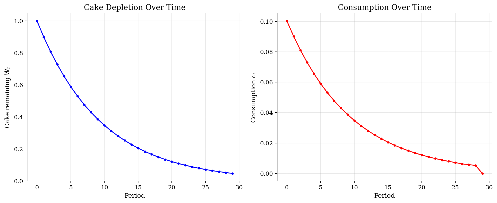

# Cake-Eating Problem

> Optimal consumption of a finite, non-renewable resource over an infinite horizon.

## Overview

The cake-eating problem is the simplest dynamic programming model. An agent has a cake of size $W$ and must decide how much to eat each period. The cake does not grow — any portion not consumed today is saved for tomorrow. The agent discounts the future at rate $\beta$ and has CRRA utility over consumption.

This model introduces the core machinery of dynamic programming: Bellman equations, value function iteration, and policy functions.

## Equations

$$V(W) = \max_{0 \le c \le W} \left\{ u(c) + \beta \, V(W - c) \right\}$$

where $W$ is the remaining cake, $c$ is consumption, and $\beta \in (0,1)$ is the
discount factor.

**CRRA utility:** $u(c) = \frac{c^{1-\sigma}}{1-\sigma}$, with $u(c) = \ln(c)$ when $\sigma = 1$.

**Analytical solution (log utility):**
$$V(W) = \frac{\ln((1-\beta) W)}{1-\beta} + \frac{\beta \ln \beta}{(1-\beta)^2}$$
$$c^*(W) = (1-\beta) W, \qquad W' = \beta W$$

## Model Setup

| Parameter | Value | Description |
|-----------|-------|-------------|
| $\beta$  | 0.9 | Discount factor |
| $\sigma$ | 1.0 | CRRA coefficient |
| Grid points | 500 | Uniform spacing |
| $W \in$  | [0.01, 1.0] | Cake size range |

## Solution Method

**Value Function Iteration (VFI):** Starting from an initial guess $V_0(W) = u(W)$, we iterate on the Bellman equation:

$$V_{n+1}(W) = \max_{0 \le c \le W} \left\{ u(c) + \beta \, V_n(W-c) \right\}$$

until $\|V_{n+1} - V_n\|_\infty < 10^{-6}$. The Bellman operator is a contraction mapping (by the Blackwell sufficient conditions), guaranteeing convergence to the unique fixed point.

Converged in **68 iterations** (error = 4.23e-07).

## Results

The near-perfect overlap between numerical and analytical curves validates the VFI implementation. The concavity of V(W) reflects diminishing marginal utility: additional cake is worth less when you already have a lot.


*Value function: numerical VFI vs analytical solution*

The optimal policy is linear in cake size: the agent always eats fraction (1-beta) of the remaining cake. The policy lies well below the 45-degree line, confirming the agent never consumes everything in a single period.


*Consumption policy: numerical vs analytical*

Both paths decay geometrically at rate beta, illustrating the constant-fraction rule. The cake is never fully exhausted but asymptotically approaches zero -- the patient agent always preserves a sliver for the future.


*Simulation: cake depletion and consumption paths starting from W=1*

The close agreement between numerical and analytical values across the grid confirms that VFI has converged to the true solution, providing a reliability benchmark for more complex models.

**Numerical vs Analytical Solution at Selected Grid Points**

|     W |   V(W) numerical |   V(W) analytical |   c* numerical |   c* analytical |
|------:|-----------------:|------------------:|---------------:|----------------:|
| 0.109 |         -54.6794 |          -54.6542 |         0.011  |          0.0109 |
| 0.236 |         -46.9527 |          -46.9402 |         0.0237 |          0.0236 |
| 0.363 |         -42.646  |          -42.6378 |         0.0364 |          0.0363 |
| 0.49  |         -39.6455 |          -39.6393 |         0.0492 |          0.049  |
| 0.617 |         -37.3406 |          -37.3356 |         0.0619 |          0.0617 |
| 0.744 |         -35.4687 |          -35.4645 |         0.0746 |          0.0744 |
| 0.871 |         -33.8925 |          -33.8889 |         0.0874 |          0.0871 |
| 1     |         -32.5114 |          -32.5083 |         0.1003 |          0.1    |

## Economic Takeaway

The cake-eating problem reveals the fundamental trade-off in intertemporal optimization: consuming today yields immediate utility, but saving preserves options for the future.

**Key insights:**
- The optimal policy is *linear* in wealth: consume a fixed fraction $(1-\beta)$ each period. More patient agents (higher $\beta$) consume less today.
- The cake shrinks geometrically: $W_t = \beta^t W_0$. The resource is never fully exhausted in finite time but asymptotically approaches zero.
- VFI converges reliably because the Bellman operator is a contraction mapping — this is the workhorse method for solving dynamic programs.
- The analytical solution provides a benchmark for validating numerical methods. Any VFI implementation should be tested against this known solution first.

## Reproduce

```bash
python run.py
```

## References

- Stokey, N., Lucas, R., and Prescott, E. (1989). *Recursive Methods in Economic Dynamics*. Harvard University Press, Ch. 4.
- Ljungqvist, L. and Sargent, T. (2018). *Recursive Macroeconomic Theory*. MIT Press, 4th edition, Ch. 3.
