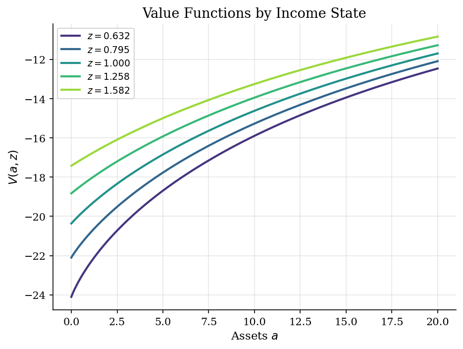
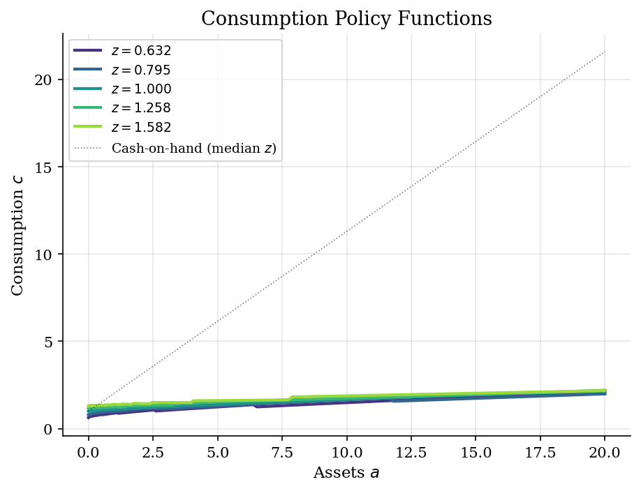
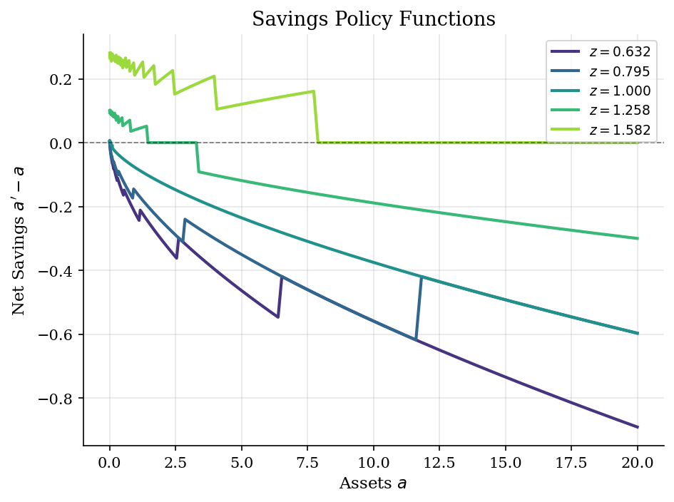
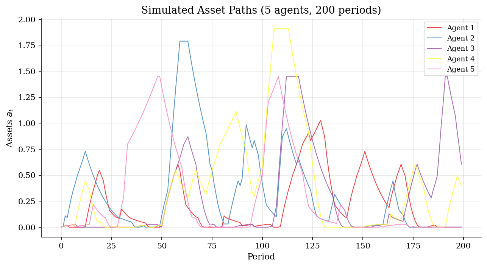

# Consumption-Savings with Income Shocks

> Optimal saving and consumption under Markovian income uncertainty (Bewley/Aiyagari).

## Overview

The income fluctuation problem (also known as the Bewley or Aiyagari model at the individual level) studies how a risk-averse agent optimally allocates between consumption and savings when facing stochastic, mean-reverting income. A borrowing constraint prevents the agent from perfectly smoothing consumption, generating a precautionary savings motive.

This is a foundational building block for heterogeneous-agent macroeconomics: aggregate the individual decision rules to obtain wealth distributions, and embed them in general equilibrium (Aiyagari 1994).

## Equations

$$V(a, z) = \max_{c \ge 0} \left\{ u(c) + \beta \, \mathbb{E}\left[V(a', z') \mid z\right] \right\}$$

**Budget constraint:** $c + a' = (1+r) \, a + z$

**Borrowing constraint:** $a' \ge \underline{a}$

**CRRA utility:** $u(c) = \frac{c^{1-\sigma}}{1-\sigma}$

**Income process:** $\ln z' = \rho \, \ln z + \varepsilon$, $\quad \varepsilon \sim N(0, \sigma_\varepsilon^2)$

## Model Setup

| Parameter | Value | Description |
|-----------|-------|-------------|
| $\beta$  | 0.95 | Discount factor |
| $r$      | 0.03 | Risk-free interest rate |
| $\sigma$ | 2.0 | CRRA risk aversion |
| $\rho$   | 0.9 | Income persistence |
| $\sigma_\varepsilon$ | 0.1 | Income shock std dev |
| $\underline{a}$ | 0.0 | Borrowing limit |
| Asset grid | 200 points | Exponential spacing on $[0.0, 20.0]$ |
| Income states | 5 | Rouwenhorst discretization |

## Solution Method

**Value Function Iteration (VFI)** with discrete grid search over next-period assets $a'$. For each state $(a, z)$, the agent's cash-on-hand is $(1+r)a + z$, and we search over a grid of feasible $a'$ values to maximize current utility plus the discounted expected continuation value.

The expected continuation value $\mathbb{E}[V(a', z') | z]$ is computed by weighting $V(a', z')$ across income states using the Markov transition matrix.

Converged in **260 iterations** (error = 9.91e-07).

## Results


*Value functions for each income state*


*Consumption policy functions by income state*


*Net savings (a' - a) by income state*


*Simulated asset paths for 5 agents over 200 periods*

**Policy Functions at Selected Grid Points**

|   Assets $a$ |   $c^*(a, z_{low})$ |   $c^*(a, z_{mid})$ |   $c^*(a, z_{high})$ |   $a'^*(a, z_{low})$ |   $a'^*(a, z_{mid})$ |   $a'^*(a, z_{high})$ |
|-------------:|--------------------:|--------------------:|---------------------:|---------------------:|---------------------:|----------------------:|
|         0    |              0.632  |              0.993  |               1.3016 |               0      |               0.007  |                0.2807 |
|         0.06 |              0.6769 |              1.0074 |               1.3224 |               0.0125 |               0.05   |                0.3172 |
|         0.45 |              0.7925 |              1.0594 |               1.3443 |               0.2986 |               0.3996 |                0.697  |
|         1.56 |              0.938  |              1.1542 |               1.3984 |               1.2994 |               1.4511 |                1.7891 |
|         3.66 |              1.1172 |              1.3009 |               1.4942 |               3.2866 |               3.4709 |                3.8598 |
|         7.27 |              1.3009 |              1.5207 |               1.6456 |               6.8158 |               6.9639 |                7.4213 |
|        12.47 |              1.6546 |              1.809  |               1.9563 |              11.8201 |              12.0337 |               12.4686 |
|        20    |              2.123  |              2.197  |               2.1822 |              19.109  |              19.403  |               20      |

## Economic Takeaway

The income fluctuation problem reveals the **precautionary savings motive**: risk-averse agents save more than they would under certainty, building a buffer stock against bad income shocks.

**Key insights:**
- The consumption function is **concave** in wealth: poorer agents have a higher marginal propensity to consume (MPC) than wealthier agents. This creates the characteristic kink near the borrowing constraint.
- Agents in **low income states** dissave (run down assets), while agents in **high income states** accumulate wealth. The net savings function crosses zero at different asset levels for each income state.
- Higher income **persistence** ($\rho$) amplifies wealth inequality: long runs of good or bad luck create large differences in accumulated assets.
- The borrowing constraint binds for low-wealth, low-income agents, forcing them to consume less than they would under perfect markets. This is the key friction that drives precautionary behavior.
- This individual problem is the building block of the Aiyagari (1994) general equilibrium model, where the interest rate $r$ adjusts to clear the capital market.

## Reproduce

```bash
python run.py
```

## References

- Aiyagari, S. R. (1994). Uninsured Idiosyncratic Risk and Aggregate Saving. *Quarterly Journal of Economics*, 109(3), 659-684.
- Deaton, A. (1991). Saving and Liquidity Constraints. *Econometrica*, 59(5), 1221-1248.
- Ljungqvist, L. and Sargent, T. (2018). *Recursive Macroeconomic Theory*. MIT Press, 4th edition, Ch. 18.
- Carroll, C. D. (1997). Buffer-Stock Saving and the Life Cycle/Permanent Income Hypothesis. *Quarterly Journal of Economics*, 112(1), 1-55.
