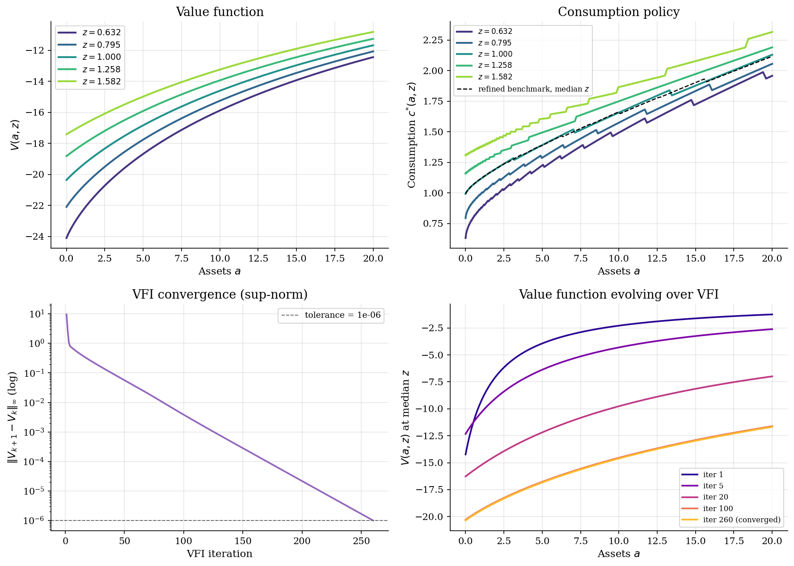
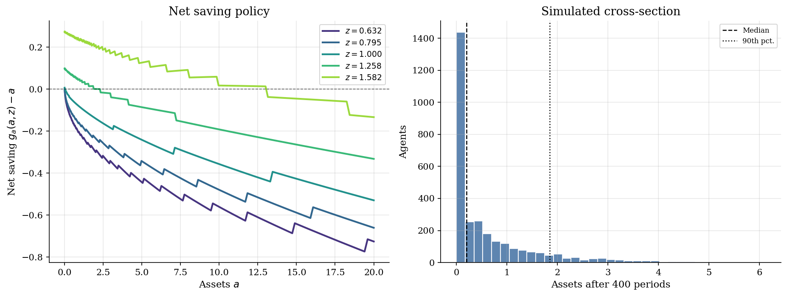

# Consumption-Savings under Income Risk

## Overview

Deaton (1991) and Carroll (1997) showed that impatient households facing uninsurable income risk do not smooth consumption the way the permanent-income hypothesis predicts. The Euler equation tilts toward saving whenever marginal utility is convex and income could fall. Together, impatience and a borrowing constraint produce a finite *buffer-stock target*: a wealth level where the precautionary motive and the impatience motive exactly offset.

The object here is a household savings rule in partial equilibrium. The state is assets and current income. The control is next-period assets under a no-borrowing constraint. The solution maps the state into a consumption policy with high marginal propensities to consume near zero assets and a crossing of the 45-degree line at the buffer-stock target.

Value function iteration solves the Bellman equation on an asset-income grid. Prices are exogenous. The downstream Aiyagari tutorial endogenizes the rate.

## Read before

- [Cake-eating problem](../cake-eating/README.md)
- [Optimal growth model](../optimal-growth/README.md)
- [Shock discretization with Rouwenhorst](../shock-discretization/README.md)

## Equations

Let $`a_t`$ be beginning-of-period assets, $`z_t`$ labor income, and $`R = 1 + r`$ the gross risk-free return. The household chooses next-period assets $`a_{t+1} = a'`$ and consumes the residual,

```math
c_t = R a_t + z_t - a_{t+1}.
```

Assets respect the no-borrowing constraint,

```math
a_{t+1} \geq \underline{a} = 0.
```

Utility is CRRA with curvature $`\sigma > 0`$,

```math
u(c) = \frac{c^{1-\sigma}}{1 - \sigma}.
```

Log income follows a Gaussian AR(1) with persistence $`\rho`$ and innovation standard deviation $`\sigma_\varepsilon`$,

```math
\log z_{t+1} = \rho \log z_t + \varepsilon_{t+1}, \quad \varepsilon_{t+1} \sim \mathcal{N}(0, \sigma_\varepsilon^2).
```

Discretize to a $`J`$-state Rouwenhorst chain on $`\{z_j\}`$ with transition matrix $`P_{jk} = \Pr(z_{t+1} = z_k \mid z_t = z_j)`$. The *Bellman equation* writes the household's value as the maximum over feasible next-period assets,

```math
V(a, z_j) = \max_{\underline{a} \leq a' \leq R a + z_j} \left[\, u(R a + z_j - a') + \beta \sum_{k=1}^{J} P_{jk} V(a', z_k) \,\right].
```

The solution gives the asset policy $`g_a(a, z_j)`$ and consumption policy $`c^{\ast}(a, z_j) = R a + z_j - g_a(a, z_j)`$. At an interior choice, the Euler equation holds with equality,

```math
u'(c_t) = \beta R\, \mathbb{E}_t[u'(c_{t+1})].
```

When the constraint binds, $`a_{t+1} = 0`$ and the Euler inequality holds,

```math
u'(c_t) \geq \beta R\, \mathbb{E}_t[u'(c_{t+1})].
```

## Worked Numerical Example

One *Bellman operator* application by hand. Take $`a \in \{0, 2\}`$, $`z \in \{0.5, 1.5\}`$, symmetric chain with $`P_{\text{stay}} = 0.9`$, $`P_{\text{switch}} = 0.1`$, $`\beta = 0.95`$, $`\sigma = 2`$ so $`u(c) = -1/c`$, $`r = 0.03`$, $`R = 1.03`$. Guess

```math
V(0, 0.5) = -40, \quad V(0, 1.5) = -20, \quad V(2, 0.5) = -25, \quad V(2, 1.5) = -15.
```

Evaluate at $`(a, z_j) = (2, 1.5)`$. Cash-on-hand is $`(1.03)(2) + 1.5 = 3.56`$. Conditional on $`z_j = 1.5`$, $`P_{1.5, 0.5} = 0.1`$ and $`P_{1.5, 1.5} = 0.9`$. The two feasible choices give

```math
a' = 0: \quad u(3.56) + \beta\,[(0.1)(-40) + (0.9)(-20)] = -0.2809 + (0.95)(-22.0) = -21.180,
```

```math
a' = 2: \quad u(1.56) + \beta\,[(0.1)(-25) + (0.9)(-15)] = -0.6410 + (0.95)(-16.0) = -15.841.
```

Argmax is $`a' = 2`$,

```math
\boxed{g_a(2,\, 1.5) = 2, \quad c^{\ast}(2,\, 1.5) = 1.56, \quad V_{\text{new}}(2,\, 1.5) = -15.841.}
```

The high-income household holds wealth flat. Saving preserves the continuation value despite the curvature cost of cutting consumption from 3.56 to 1.56. The solver in `run.py` repeats this argmax at every $`(a_i, z_j)`$ node on the 300×5 grid and iterates until $`V_{\text{new}} \approx V`$ in sup-norm.

## Model Setup

| Parameter | Value | Parameter | Value |
|---|---:|---|---:|
| Discount factor $`\beta`$ | 0.95 | Income persistence $`\rho`$ | 0.9 |
| CRRA $`\sigma`$ | 2.0 | Innovation s.d. $`\sigma_\varepsilon`$ | 0.1 |
| Gross return $`R = 1 + r`$ | 1.03 | Income states $`J`$ (Rouwenhorst) | 5 |
| No-borrowing bound $`\underline{a}`$ | 0.0 | Asset grid support $`[0, 20]`$ | 300 pts (exponential) |
| Choice grid | 900 pts | Refined diagnostic grid | 600 states, 1500 choices |
| VFI tolerance (sup-norm on $`V`$) | 1e-06 | Simulation panel | 3000 agents, 400 periods |

## Solution Method

What is new here relative to cake-eating or optimal growth is the income risk. The Bellman operator now sums over income states when computing the continuation value.

```
              primitives (β, R, σ), grids (A, G, Z), transition P
                                  |
                                  v
              +---------- VFI loop ----------+
              |                              |
              |   V_k  -->  [ Bellman op ]  -->  V_{k+1}
              |                              |
              +------ err >= tol: repeat ----+
                                  |
                              err < tol
                                  v
                         V*(a, z), policy g_a(a, z)
```

```python
# VFI: iterate T until sup-norm change is below tolerance.
def solve_bellman(a_grid, a_choice_grid, z_grid, transition, beta, R, sigma, tol):
    # eat-cash-on-hand initial guess
    cash_on_hand = R * a_grid[:, None] + z_grid[None, :]
    V = u(cash_on_hand, sigma) / (1 - beta)

    while True:
        V_new = empty_like(V)
        for j, z_j in enumerate(z_grid):
            # E[V(a', z') | z_j] on the state grid, then interpolate to choice grid
            EV_state = V @ transition[j, :]
            EV_choice = interp(a_choice_grid, a_grid, EV_state)

            # u(c) + beta * E[V(a', z')|z_j] for each (a_i, g_l) pair
            c = R * a_grid[:, None] + z_j - a_choice_grid[None, :]   # (n_a, n_g)
            obj = u(c, sigma) + beta * EV_choice[None, :]
            obj[c <= 0] = -inf   # enforce feasibility

            # Bellman operator: take argmax over choice grid
            idx = argmax(obj, axis=1)
            V_new[:, j] = obj[arange(n_a), idx]

        if max|V_new - V| < tol:
            return V_new, a_choice_grid[argmax(obj, axis=1)]
        V = V_new
```

The main grid converges in 260 iterations to sup-norm residual 9.91e-07. The Bellman operator is a $`\beta`$-contraction on bounded functions of $`(a, z)`$. Geometric convergence is visible in the log-scale convergence panel below.

## Results

Value functions rise with assets and income. Near the borrowing limit, income states have large value gaps. Low assets leave the household with little insurance against a bad draw.

Consumption rises with assets and is steepest near the constraint. Average MPC is 0.51 near zero assets and 0.04 near the top of the grid for the median income state. The fall measures buffer-stock saving. An extra dollar is mostly consumed when assets are scarce. It is mostly saved once the buffer is large.

The VFI sup-norm converges geometrically in log scale. The value-function snapshots show the Bellman operator pulling the initial guess toward the fixed point monotonically.



Net saving $`g_a(a, z_j) - a`$ shows when the household builds the buffer. High income raises saving, especially near the constraint. Low income leads to dissaving until the constraint stops it. Each income line crosses zero at the *buffer-stock target* for that state. The forward simulation confirms the distribution implied by the policy. About 20.5% of agents sit near the constraint after 400 periods.



### Solution diagnostics

| Quantity | Value | Quantity | Value |
|---|---:|---|---:|
| VFI iterations | 260 | MPC near zero assets | 0.5051 |
| Sup-norm residual | 9.91e-07 | MPC near top assets | 0.0416 |
| Refined-grid max gap (median $`z`$) | 2.55e-02 | Simulated median wealth | 0.2043 |
| Share near constraint | 0.2053 | Simulated P90 wealth | 1.8467 |

## Takeaway

*Precautionary saving* and impatience pull in opposite directions. The borrowing constraint caps downside insurance and amplifies the precautionary motive near zero assets. Carroll (1997) showed that the resulting target wealth is finite and stable: starting from any initial condition, households converge to the buffer-stock level. That target governs average MPC, the mass near the constraint, and the shape of the wealth distribution. Aiyagari (1994) embeds this partial-equilibrium problem inside a general-equilibrium model where the interest rate clears the capital market.

## See also

- [Aiyagari saving and capital-market clearing](../aiyagari/README.md)
- [Job search (McCall)](../job-search-mccall/README.md)
- [Optimal growth model](../optimal-growth/README.md)

## References

- Carroll, C. D. (1997). Buffer-Stock Saving and the Life Cycle/Permanent Income Hypothesis. *Quarterly Journal of Economics*, 112(1), 1-55.
- Deaton, A. (1991). Saving and Liquidity Constraints. *Econometrica*, 59(5), 1221-1248.
- Ljungqvist, L. and Sargent, T. (2018). *Recursive Macroeconomic Theory*. MIT Press, 4th edition, Ch. 18.
