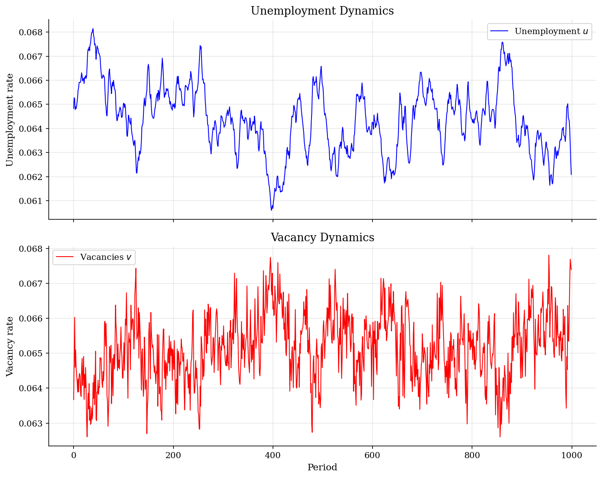
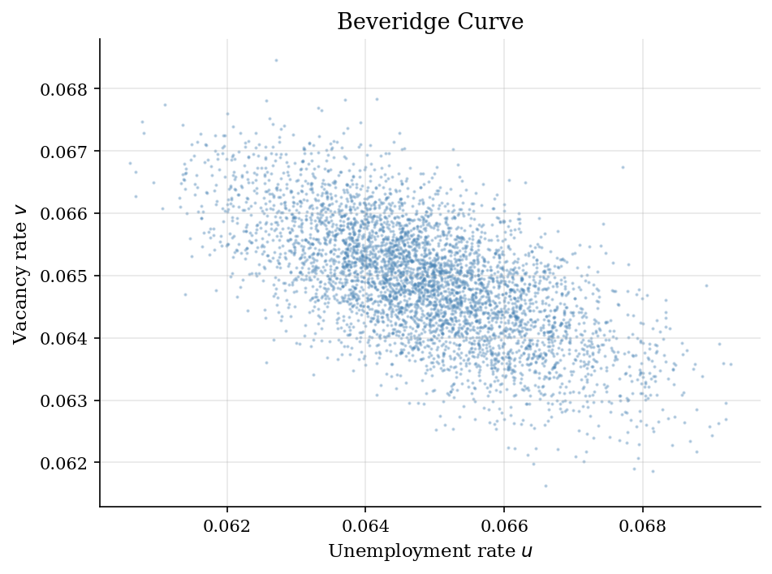
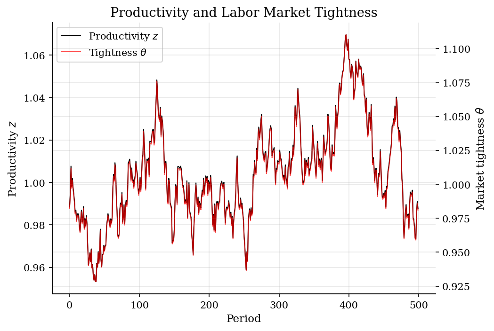

# Diamond-Mortensen-Pissarides Model

> Equilibrium search and matching model of unemployment with aggregate productivity shocks.

## Overview

The DMP model is the workhorse framework for analyzing labor market dynamics. Firms post vacancies at a cost, unemployed workers search for jobs, and wages are determined by Nash bargaining. The key state variable is *labor market tightness* $\theta = v/u$ (vacancies per unemployed worker), which determines both the job finding rate and the vacancy filling rate through a matching function.

This implementation follows Shimer (2005), who showed that the standard DMP model generates too little unemployment volatility relative to the data — the *Shimer puzzle*.

## Equations

**Matching function:** $m = \chi \cdot v^{\eta} \cdot u^{1-\eta}$

**Job finding rate:** $f(\theta) = \chi \cdot \theta^{\eta}$, where $\theta = v/u$

**Vacancy filling rate:** $q(\theta) = \chi \cdot \theta^{\eta - 1}$

**Free entry (vacancy creation):**
$$\frac{k}{q(\theta)} = \beta \left[ (1-\gamma)(z - b) + \frac{k \cdot \theta}{1-\gamma} \cdot \gamma + (1-\sigma) \frac{k}{q(\theta)} \right]$$

**Nash bargaining wage:**
$$w = \gamma (z + k\theta) + (1-\gamma) b$$

**Unemployment dynamics:**
$$u_{t+1} = \sigma (1 - u_t) + (1 - f(\theta_t)) u_t$$

**Log-linearized tightness response:** $\hat{\theta}_t = C \cdot \hat{z}_t$, where $C = \frac{\rho}{A - B\rho}$

## Model Setup

| Parameter | Value | Description |
|-----------|-------|-------------|
| $\beta$ | 0.996 | Monthly discount factor |
| $\rho$ | 0.949 | Productivity persistence |
| $\sigma_e$ | 0.0065 | Productivity innovation std |
| $\sigma$ | 0.034 | Separation rate |
| $\chi$ | 0.49 | Matching efficiency |
| $b$ | 0.4 | Unemployment benefit |
| $\gamma$ | 0.72 | Worker bargaining power |
| $\eta$ | 0.72 | Matching elasticity |

## Solution Method

The model is solved by log-linearization around the steady state. The key object is the elasticity $C$ of labor market tightness with respect to productivity: $C = 1.5545$. This means a 1% increase in productivity leads to a 1.55% increase in tightness.

Simulation: 5,000 periods of aggregate productivity shocks drawn from $\hat{z}_{t+1} = 0.949 \hat{z}_t + \epsilon_t$, $\epsilon_t \sim N(0, 0.0065^2)$. Unemployment evolves according to the flow equation.

## Results


*Unemployment and vacancy dynamics over 1000 periods*


*Beveridge curve: negative correlation between unemployment and vacancies*


*Productivity shocks drive labor market tightness (amplification factor C)*

**Business Cycle Statistics (simulated)**

| Variable        |   Mean |   Std Dev |   Corr(x, z) |
|:----------------|-------:|----------:|-------------:|
| Productivity z  | 1.0008 |    0.021  |       1      |
| Unemployment u  | 0.0649 |    0.0014 |      -0.9393 |
| Vacancies v     | 0.0649 |    0.0009 |       0.8649 |
| Tightness theta | 1.0014 |    0.0327 |       1      |
| v/u ratio       | 1.0014 |    0.0327 |       1      |

## Economic Takeaway

The DMP model captures the key qualitative features of labor market dynamics:

**Key insights:**
- The **Beveridge curve**: unemployment and vacancies are negatively correlated. In booms, firms post more vacancies and unemployment falls; in recessions, the reverse.
- **Amplification**: small productivity shocks generate fluctuations in tightness, unemployment, and vacancies. The elasticity $C = 1.55$ measures this amplification.
- **The Shimer puzzle**: with standard calibration ($b = 0.4$, $\gamma = 0.72$), the model generates too little unemployment volatility compared to U.S. data. The unemployment rate barely moves in response to productivity shocks.
- **Resolution**: Hagedorn and Manovskii (2008) show that setting $b$ close to productivity (e.g., $b = 0.95$) dramatically increases amplification, as small surplus changes cause large vacancy responses.

## Reproduce

```bash
python run.py
```

## References

- Diamond, P. (1982). "Aggregate Demand Management in Search Equilibrium." *Journal of Political Economy*, 90(5).
- Mortensen, D. and Pissarides, C. (1994). "Job Creation and Job Destruction in the Theory of Unemployment." *Review of Economic Studies*, 61(3).
- Shimer, R. (2005). "The Cyclical Behavior of Equilibrium Unemployment and Vacancies." *American Economic Review*, 95(1).
- Hagedorn, M. and Manovskii, I. (2008). "The Cyclical Behavior of Equilibrium Unemployment and Vacancies Revisited." *American Economic Review*, 98(4).
