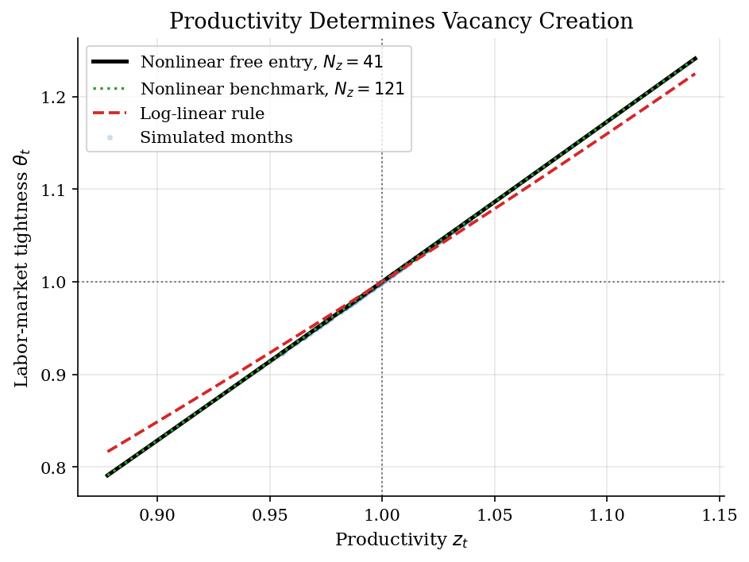
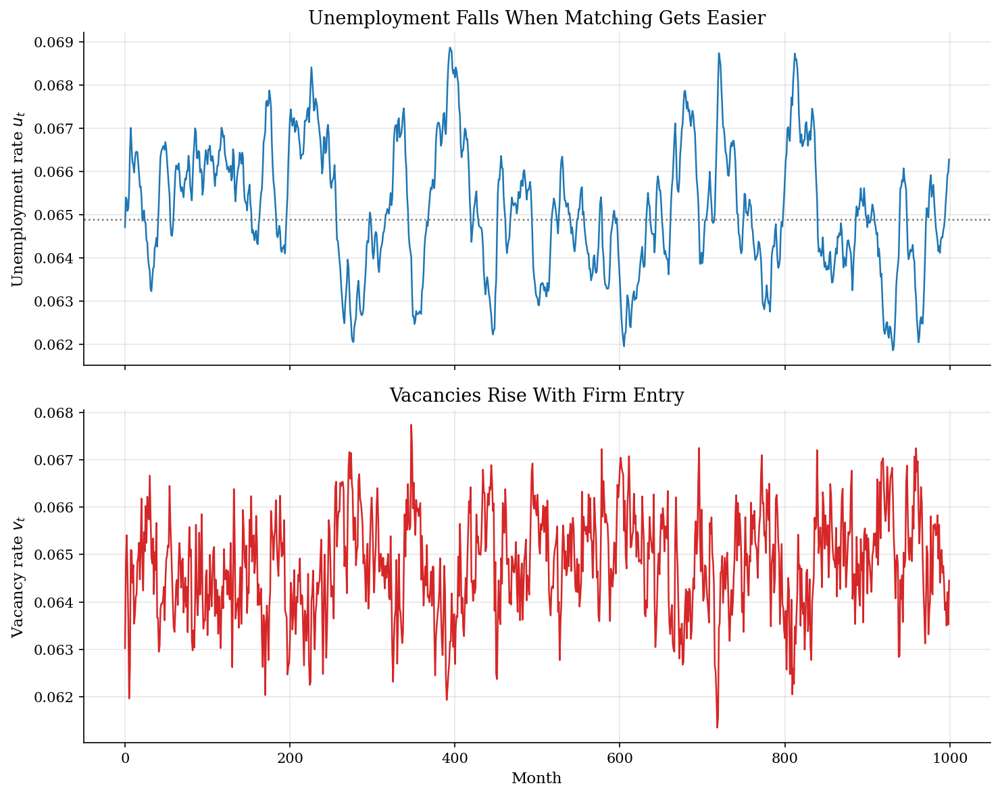
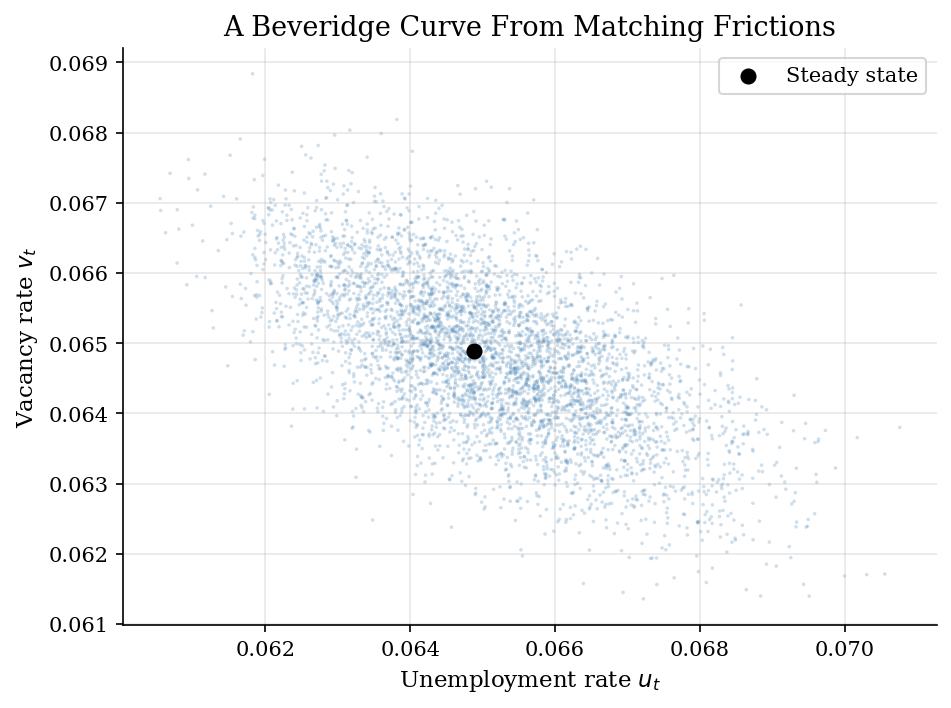

# DMP Search, Vacancies, and Unemployment

## Overview

Before the DMP framework, search models treated unemployment as exogenous and could not explain why job vacancies and unemployment coexist. Mortensen and Pissarides (1994) made both endogenous by embedding a matching function and a free-entry condition in the same equilibrium. The question their model answers: how much do matching frictions amplify productivity shocks into unemployment and vacancy fluctuations?

The equilibrium object is *labor-market tightness*. Free entry pins down tightness because firms post vacancies until expected job value covers vacancy cost. Nash bargaining then splits the match surplus, and stock dynamics follow.

## Read before

- [Shock discretization with Rouwenhorst](../shock-discretization/README.md)
- [Job search (McCall)](../job-search-mccall/README.md)
- [Consumption-savings under income risk](../consumption-savings/README.md)

## Equations

Let $`u_t`$ be unemployment, $`v_t`$ vacancies, and $`\theta_t = v_t / u_t`$ tightness. Constant-returns matching gives

```math
m(u_t, v_t) = \chi u_t^{1-\eta} v_t^\eta.
```

The worker job-finding rate is $`f(\theta_t) = \chi \theta_t^\eta`$ and the firm vacancy-filling rate is $`q(\theta_t) = \chi \theta_t^{\eta-1}`$.

Aggregate productivity is a stationary AR(1) in logs with persistence $`\rho`$ and innovation standard deviation $`\sigma_\epsilon`$,

```math
\hat z_{t+1} = \rho \hat z_t + \epsilon_{t+1}, \quad \epsilon_{t+1} \sim \mathcal{N}(0, \sigma_\epsilon^2),
```

```math
z_t = \bar z \exp(\hat z_t).
```

*Nash bargaining* with worker weight $`\gamma`$ splits joint surplus. The equilibrium wage satisfies

```math
w_t = \gamma(z_t + k \theta_t) + (1 - \gamma) b,
```

where $`b`$ is the flow value of unemployment and $`k`$ is the per-period vacancy cost.

A filled job has value $`J_t`$ given by the Bellman equation

```math
J_t = z_t - w_t + \beta(1 - \sigma) \mathbb{E}_t[J_{t+1}],
```

where $`\sigma`$ is the exogenous separation rate. Free entry equates expected discounted job value with vacancy cost,

```math
k = \beta q(\theta_t) \mathbb{E}_t[J_{t+1}].
```

This condition pins down $`\theta_t`$. Once $`\theta_t`$ is known, unemployment follows

```math
u_{t+1} = \sigma(1 - u_t) + (1 - f(\theta_t)) u_t, \qquad v_t = \theta_t u_t.
```

The deterministic steady state has $`u_{ss} = \sigma / (\sigma + f(\theta_{ss}))`$.

Write $`\hat\theta_t = \log\theta_t - \log\theta_{ss}`$. Linearizing free entry at $`\theta_{ss} = 1`$ gives $`\hat\theta_t = C \hat z_t`$, with

```math
C = \frac{\rho}{A - B\rho}, \qquad A = \frac{\eta k}{(1-\gamma)\beta\chi}, \qquad B = \beta A(1-\sigma) - \frac{\gamma k}{1-\gamma}.
```

At baseline, $`A = 1.1098`$ and $`B = 0.5262`$. A one-percent productivity innovation raises tightness by $`C = 1.55`$ percent.

## Worked Numerical Example

Solve the deterministic steady state at $`z = \bar z = 1`$ with $`\theta_{ss} = 1`$ to recover the calibrated vacancy cost $`k`$ and steady-state unemployment $`u_{ss}`$. Use the baseline calibration $`\beta = 0.996`$, $`\sigma = 0.034`$, $`\chi = 0.49`$, $`\eta = 0.72`$, $`\gamma = 0.72`$, $`b = 0.40`$.

At $`\theta_{ss} = 1`$ the matching rates collapse to constants,

```math
f(\theta_{ss}) = \chi \cdot 1^\eta = 0.49, \qquad q(\theta_{ss}) = \chi \cdot 1^{\eta-1} = 0.49.
```

The Nash wage at $`z = \bar z`$ becomes a linear function of $`k`$,

```math
w_{ss} = \gamma(\bar z + k\theta_{ss}) + (1-\gamma) b = 0.72(1 + k) + 0.28(0.40) = 0.832 + 0.72k.
```

The deterministic job-value *Bellman* gives

```math
J_{ss} = \frac{\bar z - w_{ss}}{1 - \beta(1-\sigma)} = \frac{0.168 - 0.72k}{1 - 0.996(0.966)} = \frac{0.168 - 0.72k}{0.037864}.
```

Free entry at the steady state reads $`k = \beta q(\theta_{ss}) J_{ss} = 0.48804 \, J_{ss}`$. Substituting the expression for $`J_{ss}`$,

```math
k = \frac{0.48804 \, (0.168 - 0.72k)}{0.037864}.
```

Clearing the denominator and collecting terms in $`k`$,

```math
0.037864 \, k + 0.48804 \cdot 0.72 \, k = 0.48804 \cdot 0.168,
```

```math
0.389253 \, k = 0.081991 \implies \boxed{k = 0.2106}.
```

Back out the wage and the surplus per match: $`w_{ss} = 0.832 + 0.72(0.2106) = 0.9837`$ and $`J_{ss} = 0.2106 / 0.48804 = 0.4316`$. Steady-state unemployment follows from the Beveridge law,

```math
u_{ss} = \frac{\sigma}{\sigma + f(\theta_{ss})} = \frac{0.034}{0.034 + 0.49} = \boxed{0.0649}.
```

These values match the entries in the Model Setup table. The calibration absorbs all surplus into the vacancy cost so that posting is just profitable at $`\theta_{ss} = 1`$. The small denominator $`1 - \beta(1-\sigma) = 0.0379`$ explains why a tiny per-period surplus $`\bar z - w_{ss} = 0.0163`$ supports a job value of $`0.43`$.

## Model Setup

| Parameter | Value | Parameter | Value |
|---|---:|---|---:|
| Discount factor $`\beta`$ | 0.996 | Productivity persistence $`\rho`$ | 0.949 |
| Innovation s.d. $`\sigma_\epsilon`$ | 0.0065 | Mean productivity $`\bar z`$ | 1.00 |
| Separation rate $`\sigma`$ | 0.034 | Matching efficiency $`\chi`$ | 0.49 |
| Matching elasticity $`\eta`$ | 0.72 | Worker bargaining weight $`\gamma`$ | 0.72 |
| Flow value of unemployment $`b`$ | 0.40 | Vacancy cost $`k`$ | 0.2106 |
| Steady-state unemployment $`u_{ss}`$ | 0.0649 | Steady-state wage $`w_{ss}`$ | 0.9837 |
| Surplus $`\bar z - b`$ | 0.60 | Coarse grid $`N_z`$ | 41 |
| Fine-grid benchmark $`N_z`$ | 121 | Simulation length | 4500 months |

## Solution Method

Two solvers compute the same tightness rule. The log-linear rule linearizes free entry around the deterministic steady state and gives a closed-form elasticity $`C`$. The nonlinear *fixed-point* solver discretizes productivity on a Rouwenhorst grid and iterates the job-value Bellman with free entry substituted inside each sweep. Both are compared to quantify how much curvature the linearization misses.

```
          guess theta_0 (log-linear: compute C analytically)
                        |
                        v
+-------- nonlinear fixed-point loop --------+
|                                            |
|  J  -->  [ expected job value ]  -->  theta_new  |
|                                            |
|  theta_new  -->  [ Bellman update ]  -->  J_new  |
|                                            |
+---- |J_new - J| >= tol: repeat ------------+
                        |
                    converged
                        v
                  theta*(z), J*(z)
```

```python
# Nonlinear free-entry fixed point.
# Substitutes free entry inside each Bellman sweep so the iteration
# stays in J-space with contraction modulus ~0.29 (well below beta*(1-sigma)=0.96).
def solve_nonlinear_tightness(beta, chi, eta, gamma, b, k, sigma, z_grid, transition, tol=1e-11):
    # initialise: J = k / (beta * chi) -- value if free entry binds today
    job_value = np.full(n_z, k / (beta * chi))
    for _ in range(max_iter):
        # E[J'|z] = P @ J  (one mat-vec multiply)
        expected_job_value = transition @ job_value
        # invert free entry: theta = (beta * chi * E[J'] / k)^(1/(1-eta))
        theta = (beta * chi * np.maximum(expected_job_value, 0.0) / k) ** (1.0 / (1.0 - eta))
        # J_new = (1-gamma)(z - b) - gamma*k*theta + beta*(1-sigma)*E[J']
        new_job_value = (
            (1.0 - gamma) * (z_grid - b)
            - gamma * k * theta
            + beta * (1.0 - sigma) * expected_job_value
        )
        if np.max(np.abs(new_job_value - job_value)) < tol:
            return theta, new_job_value
        job_value = new_job_value
```

The linear term $`\beta(1-\sigma) = 0.962`$ alone would imply slow convergence. The substituted free-entry feedback adds a negative correction. The effective contraction modulus of the full operator at the steady state is about $`0.293`$, so the fixed point converges in a few dozen iterations.

## Results

The nonlinear rule, fine-grid rule, and local rule are close over the simulated productivity range. Tightness moves about 1.72 times as much as productivity, far below the data value near 19. Switching solvers does not close the gap.



Given tightness, unemployment follows the stock law and vacancies equal $`\theta_t u_t`$. Vacancies jump with entry. Unemployment falls more slowly because hires reduce tomorrow's search pool.



The simulated pairs trace a *Beveridge curve*. Productivity shocks move the economy along that curve because separations and matching efficiency stay fixed.



The fixed-point convergence is tracked across iterations.


The signs match the model logic. Tightness and vacancies are procyclical, unemployment is countercyclical, and both solvers give similar volatility.

### Simulated business-cycle moments

| Variable                    |   Mean |   Std. log dev. |   Std./Std. z |   Corr. with z |
|:----------------------------|-------:|----------------:|--------------:|---------------:|
| Productivity z              | 0.9976 |          0.0216 |          1    |          1     |
| Unemployment u              | 0.0651 |          0.0243 |          1.13 |         -0.94  |
| Vacancies v                 | 0.0648 |          0.0166 |          0.77 |          0.866 |
| Tightness theta             | 0.9959 |          0.0372 |          1.72 |          1     |
| Tightness theta, log-linear | 0.9965 |          0.0336 |          1.55 |          1     |

Raising $`b`$ shrinks surplus and raises elasticity $`C`$. Moving from $`b = 0.40`$ to $`b = 0.95`$ takes $`C`$ from 1.55 to 18.65. The surplus calibration drives amplification.

### Tightness elasticity by flow value of unemployment

|   Flow value b |   Surplus z-b |   Vacancy cost k |   Tightness elasticity C |
|---------------:|--------------:|-----------------:|-------------------------:|
|           0.40 |          0.60 |           0.2106 |                     1.55 |
|           0.55 |          0.45 |           0.1580 |                     2.07 |
|           0.71 |          0.29 |           0.1018 |                     3.22 |
|           0.85 |          0.15 |           0.0527 |                     6.22 |
|           0.95 |          0.05 |           0.0176 |                    18.65 |

The policy gap, interpolation gap, and iteration counts are persisted here so the convergence claims in the Solution Method section can be cross-checked against a committed artifact.

### Nonlinear fixed-point solver diagnostics

| Quantity | Value | Quantity | Value |
|---|:--|---|:--|
| Coarse-grid policy gap vs. log-linear | 3.2287% | Coarse-grid grid gap vs. fine | 0.000397% |
| Coarse-grid fixed-point iterations | 26 | Fine-grid fixed-point iterations | 31 |

## Takeaway

*Free entry* links productivity to vacancy creation, and matching frictions translate that into unemployment dynamics. The quantitative surprise from Shimer (2005) is that the baseline DMP calibration amplifies far too little: tightness moves roughly one-for-one with productivity rather than the twenty-to-one ratio in the data. The mismatch comes from Nash bargaining making wages too flexible, not from numerical error. Hagedorn and Manovskii (2008) showed that shrinking the surplus restores amplification, anchoring a decade of debate about what the right outside option is. The DMP framework itself went on to become the standard labor block in New Keynesian DSGE models and heterogeneous-agent frameworks with unemployment risk, recognized by the 2010 Nobel Prize in Economic Sciences.

## See also

- [Aiyagari saving and capital-market clearing](../aiyagari/README.md)
- [Optimal growth model](../optimal-growth/README.md)
- [Shock discretization with Rouwenhorst](../shock-discretization/README.md)

## References

- Diamond, P. (1982). "Aggregate Demand Management in Search Equilibrium." *Journal of Political Economy*, 90(5), 881-894.
- Mortensen, D. and Pissarides, C. (1994). "Job Creation and Job Destruction in the Theory of Unemployment." *Review of Economic Studies*, 61(3), 397-415.
- Pissarides, C.A. (2000). *Equilibrium Unemployment Theory*. MIT Press, 2nd edition.
- Shimer, R. (2005). "The Cyclical Behavior of Equilibrium Unemployment and Vacancies." *American Economic Review*, 95(1), 25-49.
- Hagedorn, M. and Manovskii, I. (2008). "The Cyclical Behavior of Equilibrium Unemployment and Vacancies Revisited." *American Economic Review*, 98(4), 1692-1706.
