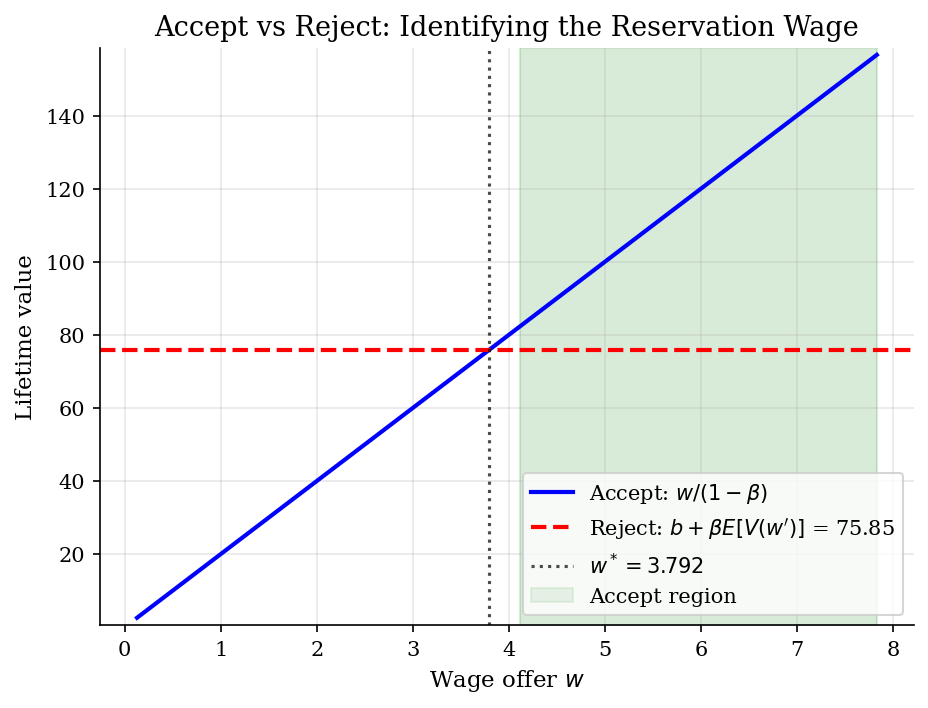
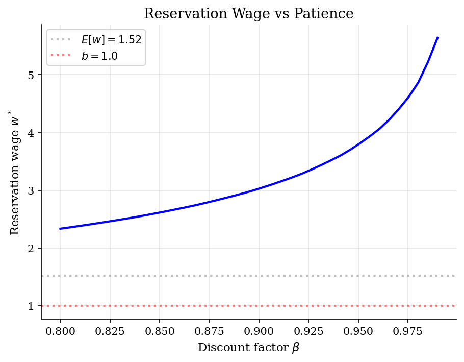
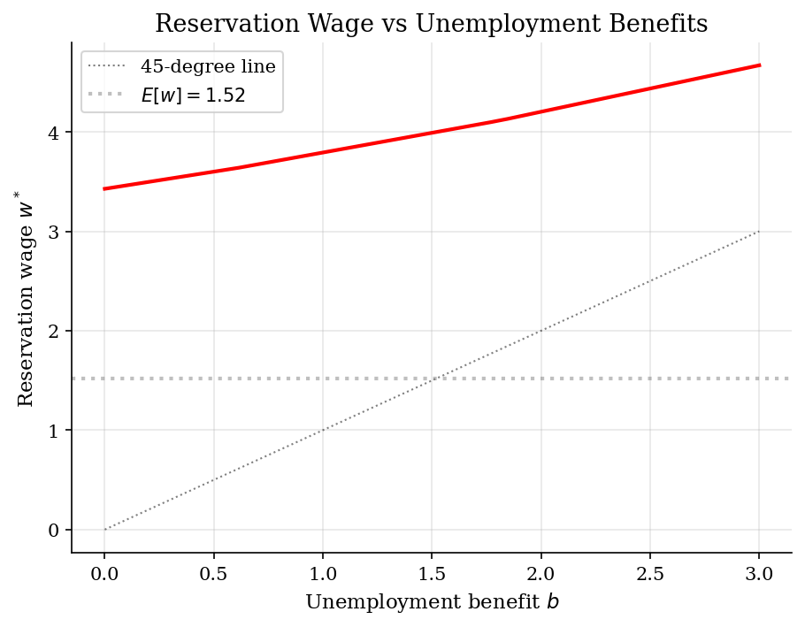

# McCall Job Search Model

> Optimal sequential search by an unemployed worker drawing wage offers from a known distribution.

## Overview

The McCall (1970) job search model is the foundational model of frictional unemployment. An unemployed worker sequentially draws wage offers from a known distribution. Each period, the worker must make an irreversible decision: accept the current offer (and work at that wage forever) or reject it (receive unemployment benefit $b$ and draw a new offer next period).

The key question: how selective should the worker be? The answer is a simple **reservation wage** policy: accept any offer above a threshold $w^*$ and reject anything below it. This threshold balances the cost of continued search (foregone wages) against the option value of potentially finding a better match.

## Equations

$$V(w) = \max\left\{ \frac{w}{1-\beta},\; b + \beta \, \mathbb{E}[V(w')] \right\}$$

where $w/(1-\beta)$ is the lifetime value of accepting wage $w$ forever, and
$b + \beta \, \mathbb{E}[V(w')]$ is the value of rejecting (collecting benefit $b$
today, then drawing a new offer $w'$ tomorrow).

**Reservation wage** $w^*$ solves:
$$\frac{w^*}{1-\beta} = b + \beta \, \mathbb{E}[V(w')]$$

The optimal policy is a threshold rule: accept if $w \ge w^*$, reject otherwise.

## Model Setup

| Parameter | Value | Description |
|-----------|-------|-------------|
| $\beta$  | 0.95 | Discount factor |
| $b$       | 1.0 | Unemployment benefit (per period) |
| $\mu$    | 0.0 | Log-mean of wage distribution |
| $\sigma$ | 1.0 | Log-std of wage distribution |
| Grid      | 50 points | Quantile-based discretization |

## Solution Method

**Value Function Iteration (VFI):** Starting from an initial guess $V_0(w) = w/(1-\beta)$ (accept everything), we iterate on the Bellman equation:

$$V_{n+1}(w) = \max\left\{ \frac{w}{1-\beta},\; b + \beta \sum_{w'} p(w') V_n(w') \right\}$$

The continuation value $b + \beta \, \mathbb{E}[V(w')]$ is the same for all wages, which makes the McCall model particularly clean: each iteration requires only a single dot product to compute the expected value, then an elementwise max.

Converged in **149 iterations** (error = 9.11e-09).

**Baseline reservation wage:** $w^* = 3.7923$

## Results


*Value of accepting vs rejecting each wage offer. The reservation wage is where the two curves intersect.*


*More patient workers (higher beta) are more selective, demanding higher wages before accepting.*


*Higher unemployment benefits raise the reservation wage: workers can afford to be more selective when the safety net is generous.*

**Reservation wage and acceptance probability for different parameter combinations**

|   beta |   b |     w* |   Accept % |   Iterations |
|-------:|----:|-------:|-----------:|-------------:|
|   0.9  | 0.5 | 2.8027 |         14 |           77 |
|   0.9  | 1   | 3.0277 |         12 |           85 |
|   0.9  | 2   | 3.5307 |         10 |           95 |
|   0.95 | 0.5 | 3.5999 |         10 |          130 |
|   0.95 | 1   | 3.7923 |          8 |          149 |
|   0.95 | 2   | 4.2024 |          6 |          175 |
|   0.99 | 0.5 | 5.5412 |          4 |          414 |
|   0.99 | 1   | 5.642  |          4 |          415 |
|   0.99 | 2   | 5.8733 |          2 |          644 |

## Economic Takeaway

The McCall model provides the cleanest illustration of the **search-theoretic approach** to unemployment. Unemployment is not involuntary idleness but an investment in finding a better match.

**Key insights:**
- The optimal policy is a simple **threshold rule**: accept any wage above $w^*$, reject below. No complicated history-dependence is needed.
- **Higher unemployment benefits $\Rightarrow$ higher reservation wage $\Rightarrow$ longer unemployment spells** but better eventual matches. This is the core policy trade-off in unemployment insurance design.
- **More patient workers (higher $\beta$) are more selective.** A patient worker values the option of future draws more, so they hold out for better offers.
- The reservation wage $w^*$ is *always above* the unemployment benefit $b$ (since the option value of search is positive) but *below* the expected wage $E[w]$ (since accepting a good offer now avoids the risk of worse draws later).
- Despite its simplicity, this model is the building block for richer search models with on-the-job search, matching functions, and equilibrium wage determination (Mortensen-Pissarides).

## Reproduce

```bash
python run.py
```

## References

- McCall, J.J. (1970). "Economics of Information and Job Search." *Quarterly Journal of Economics*, 84(1), 113-126.
- Ljungqvist, L. and Sargent, T. (2018). *Recursive Macroeconomic Theory*. MIT Press, 4th edition, Ch. 6.
- Stokey, N., Lucas, R., and Prescott, E. (1989). *Recursive Methods in Economic Dynamics*. Harvard University Press.
