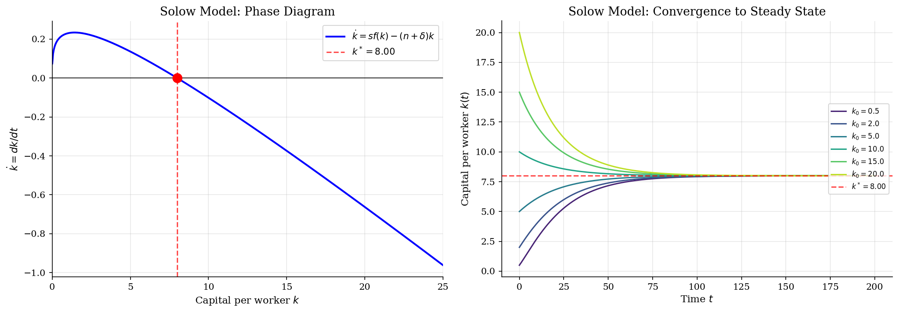
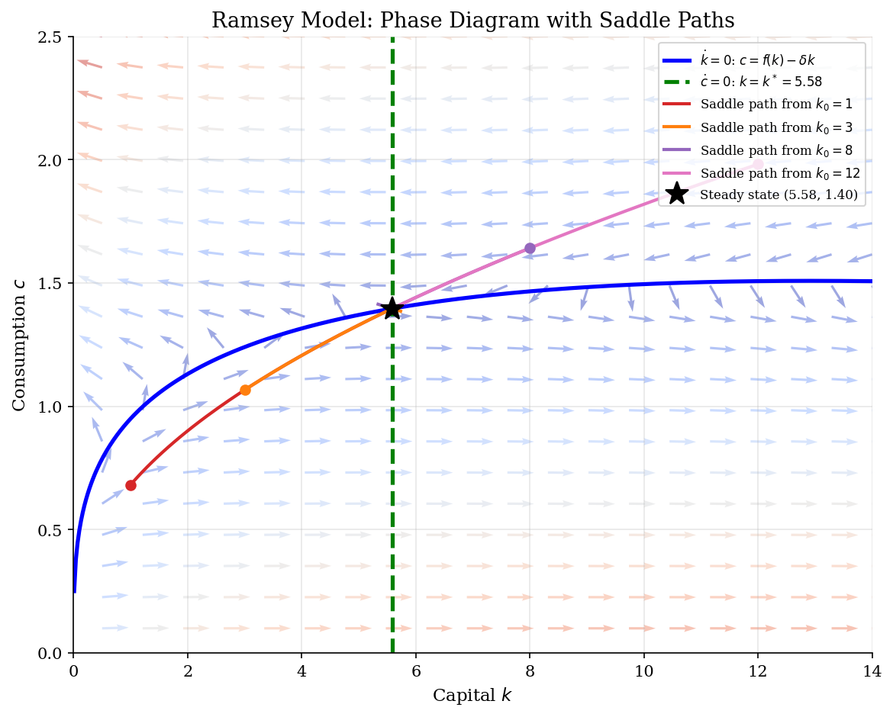
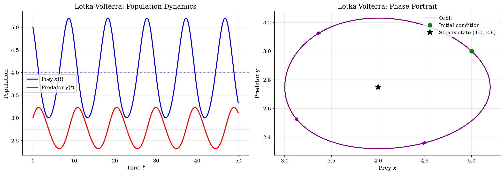
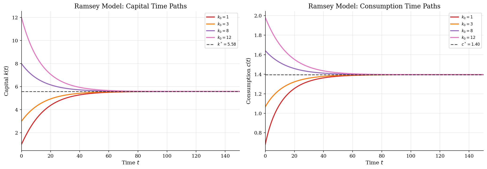

# Numerical ODE Methods for Economics

> Solving continuous-time economic models as systems of ordinary differential equations.

## Overview

Many fundamental economic models are naturally formulated in continuous time, giving rise to systems of ordinary differential equations (ODEs). This module demonstrates three canonical examples:

1. **Solow Growth Model** -- A single ODE with a globally stable steady state. The phase diagram immediately reveals the convergence dynamics.
2. **Ramsey Optimal Growth Model** -- A two-dimensional ODE system with a saddle point equilibrium. Only the *saddle path* converges to the steady state; all other trajectories diverge. The shooting method finds this path numerically.
3. **Lotka-Volterra Predator-Prey** -- A classic nonlinear ODE system exhibiting perpetual cycles, illustrating how phase diagrams reveal qualitative dynamics.

## Equations

**Solow Growth Model:**
$$\frac{dk}{dt} = s \cdot f(k) - (n + \delta) \cdot k, \qquad f(k) = k^\alpha$$

**Ramsey Optimal Growth (Euler Equation + Capital Accumulation):**
$$\frac{dc}{dt} = \frac{1}{\sigma}\left(f'(k) - \delta - \rho\right) c$$
$$\frac{dk}{dt} = f(k) - \delta k - c$$

**Lotka-Volterra Predator-Prey:**
$$\frac{dx}{dt} = \alpha x - \beta x y, \qquad \frac{dy}{dt} = \delta x y - \gamma y$$

## Model Setup

| Parameter | Value | Description |
|-----------|-------|-------------|
| $\alpha$ | 0.3 | Capital share (Cobb-Douglas) |
| $\delta$ | 0.05 | Depreciation rate |
| $s$ | 0.3 | Savings rate (Solow) |
| $n$ | 0.02 | Population growth rate (Solow) |
| $\rho$ | 0.04 | Discount rate (Ramsey) |
| $\sigma$ | 2.0 | CRRA coefficient (Ramsey) |
| Solver | `solve_ivp` (RK45) | Adaptive Runge-Kutta 4(5) |

## Solution Method

All ODE systems are solved using `scipy.integrate.solve_ivp` with the RK45 (Dormand-Prince) adaptive step-size method, using tight tolerances (`rtol=1e-10`, `atol=1e-12`).

**Solow model:** Direct forward integration from various initial conditions. The single ODE has a unique, globally stable steady state.

**Ramsey model:** The steady state is a *saddle point* -- most initial conditions diverge. We use a **shooting method** (bisection on initial consumption $c_0$) to find the unique saddle path that converges to $(k^*, c^*)$. For each candidate $c_0$, we integrate forward and check whether the trajectory approaches or diverges from the steady state.

**Lotka-Volterra:** Direct forward integration reveals perpetual cycles (the system has a conserved quantity, so orbits are closed curves in the phase plane).

## Results


*Solow growth model: phase diagram (left) and convergence dynamics (right)*


*Ramsey optimal growth: phase diagram with nullclines, vector field, and saddle paths from multiple initial conditions*


*Lotka-Volterra predator-prey: time series (left) and phase portrait showing closed orbits (right)*


*Ramsey model: time paths of capital k(t) and consumption c(t) along saddle paths*

**Steady-State Values for Each Model**

| Model                 | Variable      |   Value | Formula                           |
|:----------------------|:--------------|--------:|:----------------------------------|
| Solow Growth          | k*            |  7.9963 | (s/(n+delta))^(1/(1-alpha))       |
| Solow Growth          | y*            |  1.8658 | f(k*) = k*^alpha                  |
| Solow Growth          | c*            |  1.3061 | (1-s)*y*                          |
| Ramsey Optimal Growth | k*            |  5.5843 | (alpha/(delta+rho))^(1/(1-alpha)) |
| Ramsey Optimal Growth | y*            |  1.6753 | f(k*) = k*^alpha                  |
| Ramsey Optimal Growth | c*            |  1.3961 | f(k*) - delta*k*                  |
| Lotka-Volterra        | x* (prey)     |  4      | gamma/delta                       |
| Lotka-Volterra        | y* (predator) |  2.75   | alpha/beta                        |

## Economic Takeaway

These three examples illustrate the rich dynamics that arise from continuous-time economic models:

**Key insights:**
- **Solow model:** The steady state is *globally stable* -- regardless of initial capital, the economy converges to $k^*$. The phase diagram (a single curve crossing zero) makes this immediately transparent.
- **Ramsey model:** The steady state is a *saddle point*. Only one trajectory (the saddle path) converges; all others diverge. This reflects the forward-looking nature of optimal consumption: the agent must choose exactly the right initial consumption to satisfy the transversality condition.
- **Shooting method:** Finding saddle paths numerically requires a shooting approach -- bisecting over initial conditions until convergence is achieved. This is a fundamental technique in computational economics.
- **Lotka-Volterra:** The closed orbits (limit cycles) demonstrate that nonlinear ODE systems can exhibit qualitatively different behavior (cycles vs. convergence). Phase diagrams reveal this structure at a glance.
- **Phase diagrams as tools:** Nullclines partition the phase space into regions with qualitatively different dynamics. Combined with vector fields, they provide complete qualitative understanding before any numerical solution is computed.

## Reproduce

```bash
python run.py
```

## References

- Acemoglu, D. (2009). *Introduction to Modern Economic Growth*. Princeton University Press, Ch. 2, 7-8.
- Barro, R. and Sala-i-Martin, X. (2004). *Economic Growth*. MIT Press, 2nd edition, Ch. 1-2.
- Strogatz, S. (2015). *Nonlinear Dynamics and Chaos*. Westview Press, 2nd edition.
- Judd, K. (1998). *Numerical Methods in Economics*. MIT Press, Ch. 10.
