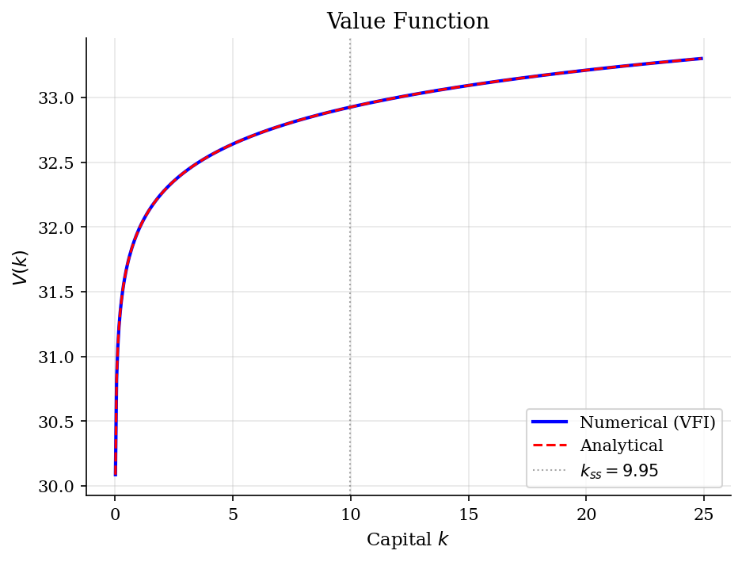
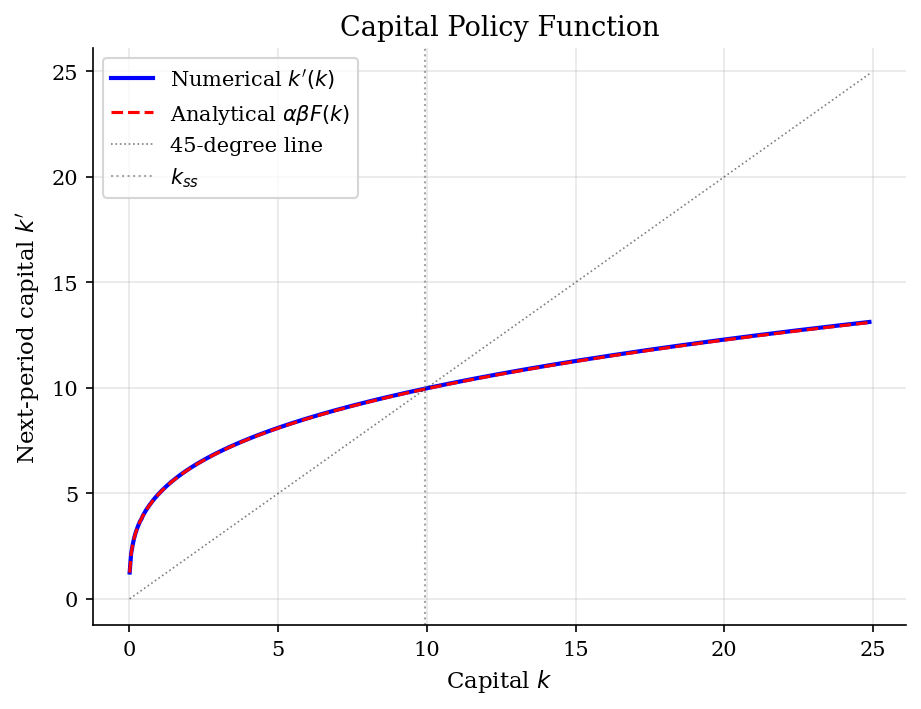
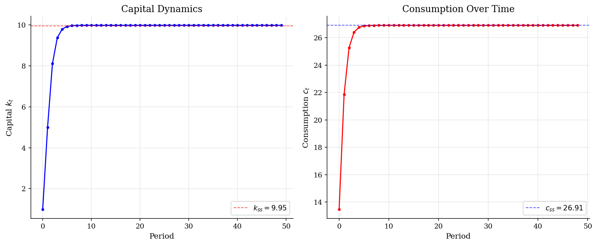

# Neoclassical Optimal Growth Model

> The Ramsey-Cass-Koopmans model: optimal consumption and capital accumulation with a Cobb-Douglas production technology.

## Overview

The neoclassical optimal growth model (Ramsey-Cass-Koopmans) is a foundational model in macroeconomics. A representative agent chooses consumption each period to maximize discounted lifetime utility, subject to a production technology that transforms capital into output.

Unlike the cake-eating problem, capital is *productive* here: saving today yields more output tomorrow via the production function $F(k) = Ak^\alpha$. This creates a non-trivial steady state where the economy converges regardless of its initial capital stock.

## Equations

$$V(k) = \max_{0 \le k' \le F(k)} \left\{ u(F(k) - k') + \beta \, V(k') \right\}$$

where $k$ is capital, $k'$ is next-period capital, $c = F(k) - k'$ is consumption,
$F(k) = Ak^\alpha$ is the production function, and $\beta \in (0,1)$ is the discount factor.

**Log utility:** $u(c) = \ln(c)$

**Analytical solution:**
$$V(k) = E + F \ln(k), \qquad E = \frac{\ln(A(1-\alpha\beta)) + \frac{\beta\alpha\ln(A\alpha\beta)}{1-\alpha\beta}}{1-\beta}, \quad F = \frac{\alpha}{1-\alpha\beta}$$

**Optimal policy:** $k'(k) = \alpha \beta A k^\alpha$ (save fraction $\alpha\beta$ of output)

**Steady state:** $k_{ss} = (\alpha \beta A)^{1/(1-\alpha)}$

## Model Setup

| Parameter | Value | Description |
|-----------|-------|-------------|
| $\alpha$  | 0.3 | Capital share (Cobb-Douglas) |
| $A$       | 18.5 | Total factor productivity |
| $\beta$   | 0.9 | Discount factor |
| $k_{ss}$ | 9.9519 | Steady state capital |
| Grid points | 500 | Uniform spacing |
| $k \in$   | [0.01, 24.88] | Capital range |

## Solution Method

**Value Function Iteration (VFI):** Starting from an initial guess $V_0(k) = u(F(k))$, we iterate on the Bellman equation:

$$V_{n+1}(k) = \max_{0 \le k' \le F(k)} \left\{ u(F(k) - k') + \beta \, V_n(k') \right\}$$

until $\|V_{n+1} - V_n\|_\infty < 10^{-6}$. At each state, we search over a fine grid of $k'$ values and interpolate the continuation value between grid points. The analytical solution provides boundary extrapolation for $k'$ values outside the grid range.

Converged in **102 iterations** (error = 9.43e-07).

## Results


*Value function: numerical VFI vs analytical solution*


*Capital policy function: numerical vs analytical*


*Simulation: capital and consumption converging to steady state from k0=1.00*

**Numerical vs Analytical Solution at Selected Grid Points**

|      k |   V(k) numerical |   V(k) analytical |   k' numerical |   k' analytical |
|-------:|-----------------:|------------------:|---------------:|----------------:|
|  2.502 |          32.3565 |           32.3565 |         6.5894 |          6.5769 |
|  5.692 |          32.6943 |           32.6943 |         8.4321 |          8.416  |
|  8.881 |          32.8771 |           32.8771 |         9.6362 |          9.6179 |
| 12.071 |          33.0032 |           33.0032 |        10.5654 |         10.5453 |
| 15.261 |          33.0996 |           33.0996 |        11.3354 |         11.3138 |
| 18.451 |          33.1776 |           33.1776 |        11.9995 |         11.9767 |
| 21.64  |          33.2431 |           33.2431 |        12.5875 |         12.5636 |
| 24.88  |          33.3004 |           33.3005 |        13.1255 |         13.1006 |

## Economic Takeaway

The neoclassical growth model reveals how productive capital creates a non-trivial steady state, unlike the cake-eating problem where the resource monotonically declines.

**Key insights:**
- Capital converges to the steady state $k_{ss} = 9.95$ regardless of initial conditions. The economy self-corrects: low capital means high marginal product, incentivizing saving.
- The optimal savings rate is $\alpha\beta = 0.27$. More patient agents (higher $\beta$) or more capital-intensive technologies (higher $\alpha$) lead to greater capital accumulation.
- The policy function $k'(k) = \alpha\beta F(k)$ shows that the agent saves a constant fraction of *output* (not wealth), reflecting the log utility / Cobb-Douglas structure.
- VFI converges reliably because the Bellman operator is a contraction mapping. The analytical solution provides an exact benchmark for validation.

## Reproduce

```bash
python run.py
```

## References

- Stokey, N., Lucas, R., and Prescott, E. (1989). *Recursive Methods in Economic Dynamics*. Harvard University Press, Ch. 2 & 4.
- Ljungqvist, L. and Sargent, T. (2018). *Recursive Macroeconomic Theory*. MIT Press, 4th edition, Ch. 3.
- Ramsey, F. (1928). A Mathematical Theory of Saving. *Economic Journal*, 38(152), 543-559.
