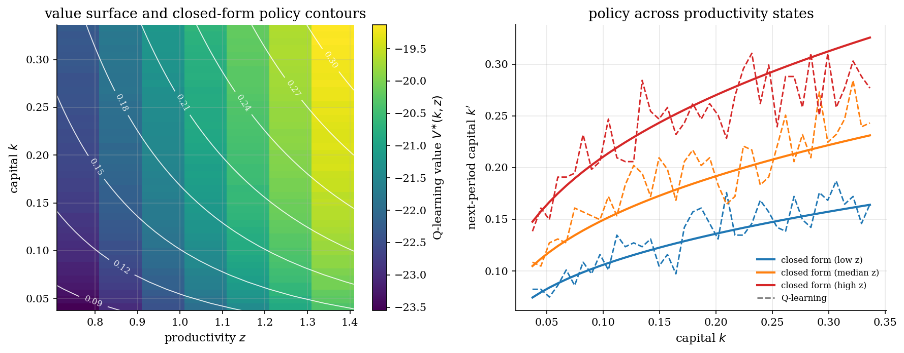

# Stochastic Optimal Growth by Q-Learning

## Overview

A planner allocates output between consumption and productive capital. Productivity moves stochastically each period. The saving choice carries today's shock into tomorrow's capital stock.

The target object is the optimal saving rule. Log utility, Cobb-Douglas production, and full depreciation pin down a closed form. The closed form audits any numerical solver.

Classical dynamic programming solves the Bellman equation but requires the full *transition matrix*. Watkins (1989) showed that an agent interacting with a Markov environment can recover the same optimal policy through sampled transitions alone, with no model of the dynamics. Value iteration and Q-learning converge to the same saving rule. The surprise in Watkins and Dayan (1992) was that a convergence proof with probability one follows from mild Robbins-Monro conditions on the step size.

## Read before

- [Optimal growth model](../optimal-growth/README.md)
- [Consumption-savings under income risk](../consumption-savings/README.md)
- [Shock discretization with Rouwenhorst](../shock-discretization/README.md)

## Equations

Let $`k_t`$ be capital and $`z_t`$ a productivity shock with persistence $`\rho`$ and innovation standard deviation $`\sigma`$. Output is $`y_t = z_t A k_t^{\alpha}`$ with capital share $`\alpha`$ and TFP $`A`$. The resource constraint is $`c_t + k_{t+1} = y_t`$. Productivity follows

```math
\log z_{t+1} = \rho \log z_t + \sigma \varepsilon_{t+1}, \quad \varepsilon_{t+1} \sim N(0, 1).
```

The planner discounts at rate $`\beta`$. The *value function* solves the Bellman equation:

```math
V(k, z) = \max_{k' \in [0, y]} \lbrace \log(z A k^{\alpha} - k') + \beta \mathbb{E}[V(k', z') \mid z] \rbrace.
```

Tabular Q-learning stores an action-value $`Q(s, a)`$ for each state-action pair and updates it from observed transitions:

```math
Q(s, a) \leftarrow Q(s, a) + \alpha_t [ r + \beta \max_{a'} Q(s', a') - Q(s, a) ].
```

Here $`\alpha_t`$ is the step size (learning rate) for update $`t`$.

Exploration draws each transition uniformly over feasible state-action pairs $`(s, a)`$, so every region of the grid receives updates regardless of the on-policy distribution. The greedy policy is read off the table as $`a^{\ast}(s) = \arg\max_a Q(s, a)`$.

## Worked Numerical Example

Run two Q-learning updates on a toy 3-state, 2-action slice of the model. States are capital levels $`k \in \{0.10, 0.19, 0.28\}`$ (low, near-steady-state, high). Actions are next-capital choices $`k' \in \{0.10, 0.19\}`$ (save-low, save-high). Productivity is fixed at $`z = 1`$. Calibration $`\alpha = 0.36`$, $`\beta = 0.95`$, $`A = 1.0`$. Learning rate $`\alpha_t = 0.5`$. Initialise the *Q table* with $`Q(s, a) = 0`$ for every feasible pair.

*Update 1*: sample state $`k = 0.19`$ and action $`k' = 0.10`$ (save-low). Output is

```math
y = z A k^{\alpha} = (1)(1)(0.19)^{0.36} = 0.5343,
```

so consumption is $`c = y - k' = 0.5343 - 0.10 = 0.4343`$ and the reward is $`r = \log c = \log(0.4343) = -0.8341`$. The next state is $`k' = 0.10`$, where every action still has $`Q = 0`$, so $`\max_{a'} Q(0.10, a') = 0`$. The update is

```math
Q(0.19, 0.10) \leftarrow 0 + 0.5 \cdot [-0.8341 + 0.95 \cdot 0 - 0] = -0.4171.
```

Update 2: sample state $`k = 0.19`$ and action $`k' = 0.19`$ (save-high). Consumption is $`c = 0.5343 - 0.19 = 0.3443`$ and the reward is $`r = \log(0.3443) = -1.0664`$. The next state is $`k' = 0.19`$, where actions now have $`Q(0.19, 0.10) = -0.4171`$ and $`Q(0.19, 0.19) = 0`$, so $`\max_{a'} Q(0.19, a') = 0`$. The update is

```math
Q(0.19, 0.19) \leftarrow 0 + 0.5 \cdot [-1.0664 + 0.95 \cdot 0 - 0] = \boxed{-0.5332}.
```

After two updates, $`Q(0.19, 0.10) = -0.4171 > Q(0.19, 0.19) = -0.5332`$, so the greedy action at $`k = 0.19`$ is save-low. The ranking is correct on these two samples because save-low yields a higher current reward and the continuation values are still uninformative zeros. Repeated sampling backs up nonzero continuation values from rewarding states and eventually flips the ordering toward the closed-form rule $`k' = \alpha\beta A k^{\alpha} = 0.342 \cdot 0.5343 = 0.183`$, which sits between save-low and save-high.

## Model Setup

The *calibration* follows Brock and Mirman (1972): log utility, Cobb-Douglas production with capital share 0.36, and full depreciation, so the closed-form saving rate equals $`\alpha \beta`$.

| Parameter | Value | Parameter | Value |
|---|---:|---|---:|
| Capital state $`k`$ | 41 grid points | Capital grid range | $`[0.20,\, 1.80] \cdot k_{ss}`$ |
| Action $`k'`$ | 21 grid points | Productivity $`z`$ | 7-state Rouwenhorst |
| Capital share $`\alpha`$ | 0.36 | Discount $`\beta`$ | 0.95 |
| Productivity persistence $`\rho`$ | 0.70 | Innovation std $`\sigma`$ | 0.10 |
| TFP parameter $`A`$ | 1.0 | Steady-state capital $`k_{ss}`$ | 0.187 |
| Q-learning steps per seed | 1,500,000 | Q-learning seeds (averaged) | 4 |
| DQN training steps | 250,000 | Benchmark | $`k'(k, z) = \alpha\beta z A k^{\alpha}`$ |

## Solution Method

What is new here relative to value iteration is that Q-learning never forms the transition matrix. Each step samples one state-action pair at random, draws the next productivity from the Markov chain, and applies a *temporal-difference* correction to the action-value estimate. Uniform exploration keeps coverage of the grid independent of the steady-state distribution. Independent seeds are averaged to dampen the variance introduced by the action argmax.

```
   Q table (pessimistic init), feasible reward table, productivity transition
                              |
                              v
          +----------- training loop (tabular Q-learning) -----------+
          |                                                          |
          |  (s, a) uniform sample  -->  [ TD update ]  -->  Q       |
          |                                                          |
          +----------- steps remain: repeat ------------------------+
                              |
                        budget exhausted
                              v
                      Q*(k, z, k'),  greedy policy g(k, z)
```

```python
# Tabular Q-learning: uniform off-policy exploration.
def tabular_q_learning(k_grid, z_grid, z_trans, rewards, a_to_k_index, seed=7):
    q = np.full((n_k, n_z, n_a), PESSIMISTIC_INIT)
    visits = np.zeros((n_k, n_z, n_a), dtype=np.int64)

    for step in range(1, QL_STEPS + 1):
        # sample state and feasible action uniformly
        i_k, i_z = rng.integers(n_k), rng.integers(n_z)
        i_a = rng.choice(feasible_indices_by_state[i_k * n_z + i_z])

        # one Markov transition in productivity
        i_kp = a_to_k_index[i_a]
        i_zp = sample_next_z(rng, z_trans, i_z)

        # Robbins-Monro step size decays with visit count
        visits[i_k, i_z, i_a] += 1
        lr = 1.0 / visits[i_k, i_z, i_a] ** 0.6

        # Bellman TD update
        target = rewards[i_k, i_z, i_a] + BETA * q[i_kp, i_zp].max()
        q[i_k, i_z, i_a] += lr * (target - q[i_k, i_z, i_a])

    return q
```

The DQN appendix replaces the table with a two-layer MLP $`Q_\theta(k, z, \cdot)`$. A replay buffer stores recent transitions. The loss is a Huber penalty against a slow-moving target network.

```
   online network Q_theta, target network Q_target, replay buffer
                              |
                              v
          +----------- training loop (DQN) -------------------------+
          |                                                          |
          |  s  -->  [ epsilon-greedy action ]  -->  a               |
          |  (s, a, r, s')  -->  [ replay buffer ]                   |
          |  minibatch  -->  [ Huber TD loss ]  -->  Q_theta         |
          |  (periodic)  -->  [ target copy ]  -->  Q_target         |
          |                                                          |
          +----------- steps remain: repeat ------------------------+
                              |
                        budget exhausted
                              v
                      Q_theta(k, z, .), greedy policy g(k, z)
```

```python
# DQN inner loop: epsilon-greedy exploration with replay.
for step in range(1, DQN_STEPS + 1):
    eps = max(0.05, 1.0 - step / (DQN_STEPS * 0.6))

    # epsilon-greedy action (feasible actions only)
    if rng.random() < eps:
        i_a = rng.choice(feasible_action_indices)
    else:
        qv = online(state_tensor).numpy()
        i_a = int(np.where(feasible, qv, -1e9).argmax())

    # step environment, store transition
    buffer.store(state, i_a, reward, next_state, done)

    # gradient step on Huber loss against target network
    if buffer.ready():
        optimizer.zero_grad()
        loss_fn(online(s_b).gather(1, a_b), targets).backward()
        optimizer.step()

    # periodic target-network copy
    if step % DQN_TARGET_EVERY == 0:
        target.load_state_dict(online.state_dict())
```

## Results

The *greedy policy* out of the Q-table tracks the closed-form saving rule across capital and productivity states. Both numerical methods reproduce the same proportional response to a productivity shock.

Policy error against the closed form falls as the agent visits more states. The curve flattens once each region of the grid has enough samples to anchor the maximizer.


The learned value surface is monotone in capital and increasing in productivity. White contours mark the closed-form saving rule. The iso-policy curves rise with $`z`$.



The table compares the solvers on the same calibration. Q-learning uses no transition matrix. It matches the VFI policy to a few hundredths in capital units. The policy MAE column covers interior capital states only. The three lowest and three highest capital grid rows are excluded because the closed-form rule can push next-period capital outside the discrete action grid at the boundary. All three solvers use the identical mask.

### Algorithm comparison

| Algorithm | Transition matrix | Policy MAE (interior) | Value sup-norm vs VFI |
|:---|:---|---:|---:|
| Value iteration | yes | 0.0038 | 0.0000 |
| Tabular Q-learning (4 seeds avg.) | no | 0.0154 | 0.6721 |
| DQN | no | 0.0299 | nan |

## Takeaway

When the transition is unknown, the planner can still recover the saving rule. Sampled transitions are enough. The quantitative surprise in Watkins and Dayan (1992) was that *convergence* holds with probability one under conditions no stricter than standard stochastic-approximation requirements on step sizes. Q-learning went on to anchor deep reinforcement learning. The DQN of Mnih et al. (2015) is tabular Q-learning with a neural function approximator, a replay buffer, and a target network added for stability.

## See also

- [Value function iteration for optimal growth](../optimal-growth/README.md)
- [Aiyagari saving and capital-market clearing](../aiyagari/README.md)
- [Deep Q-network (Atari)](../../reinforcement-learning/dqn-atari/README.md)

## References

- [Brock, W. A. and Mirman, L. J. (1972). Optimal Economic Growth and Uncertainty: The Discounted Case. *Journal of Economic Theory*, 4(3), 479-513.](https://doi.org/10.1016/0022-0531(72)90135-4)
- [Watkins, C. J. C. H. (1989). *Learning from Delayed Rewards*. PhD thesis, King's College, University of Cambridge.](https://www.cs.rhul.ac.uk/~chrisw/new_thesis.pdf)
- [Watkins, C. J. C. H. and Dayan, P. (1992). Q-Learning. *Machine Learning*, 8(3), 279-292.](https://doi.org/10.1007/BF00992698)
- [Sutton, R. S. and Barto, A. G. (2018). *Reinforcement Learning: An Introduction*, 2nd ed. MIT Press.](http://incompleteideas.net/book/the-book-2nd.html)
- [Mnih, V., Kavukcuoglu, K., Silver, D., et al. (2015). Human-Level Control through Deep Reinforcement Learning. *Nature*, 518, 529-533.](https://doi.org/10.1038/nature14236)
