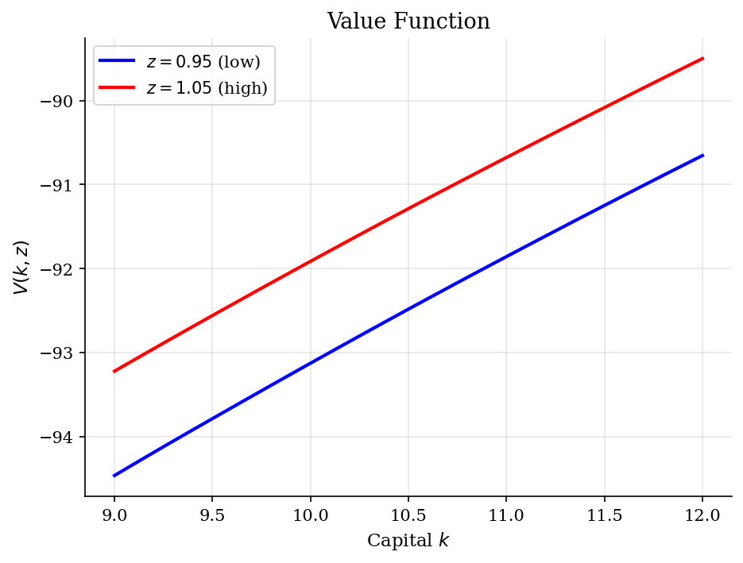
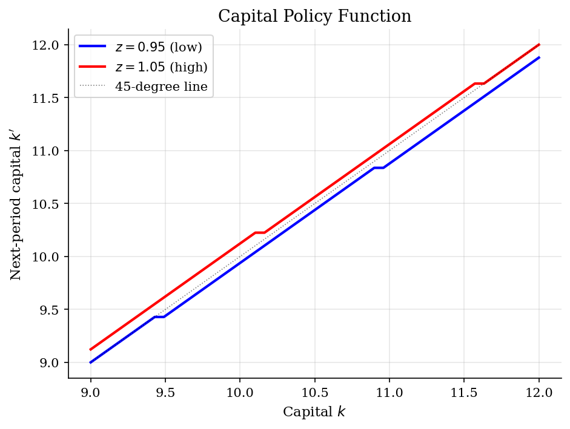
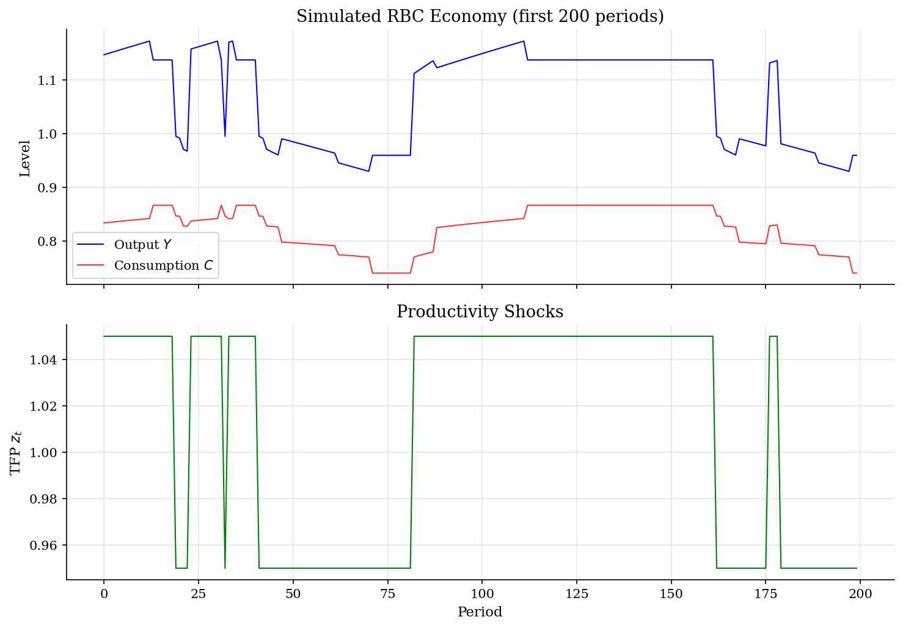
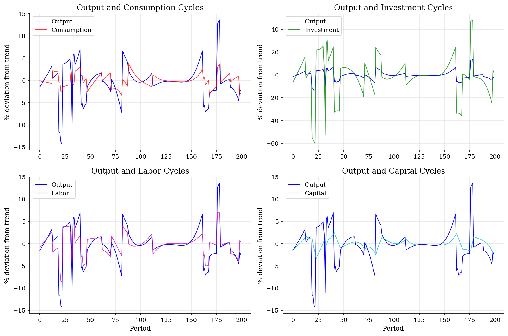

# Real Business Cycle Model

> Aggregate TFP shocks drive business cycles through optimal responses of consumption, investment, and labor supply (Kydland and Prescott, 1982).

## Overview

The Real Business Cycle (RBC) model is the foundational framework of modern macroeconomics. A representative agent chooses consumption, labor supply, and investment to maximize expected discounted utility. Aggregate productivity follows a stochastic process (here a 2-state Markov chain), and the economy's response to these shocks generates business cycle fluctuations.

This implementation solves the full model with endogenous labor supply using value function iteration with grid search over both the capital and labor choice variables.

## Equations

$$V(k, z) = \max_{k', l} \left\{ \ln(c) + \phi \ln(1-l) + \beta \, \mathbb{E}\left[ V(k', z') \,|\, z \right] \right\}$$

subject to the budget constraint:

$$c = z \, k^\alpha \, l^{1-\alpha} + (1-\delta) k - k'$$

where $k$ is capital, $z$ is TFP, $l$ is labor, $c$ is consumption, $k'$ is next-period capital, $\alpha$ is the capital share, $\delta$ is depreciation, and $\phi$ is the weight on leisure.

**TFP process:** $z \in \{0.95, 1.05\}$ with transition matrix $P_{ij} = \Pr(z'=z_j \mid z=z_i)$:

$$P = \begin{pmatrix} 0.95 & 0.05 \\ 0.05 & 0.95 \end{pmatrix}$$

**Steady state (deterministic, $z=1$):** $k/l = \left[\frac{1}{\alpha}\left(\frac{1}{\beta} + \delta - 1\right)\right]^{1/(\alpha-1)}$

## Model Setup

| Parameter | Value | Description |
|-----------|-------|-------------|
| $\beta$  | 0.99 | Discount factor |
| $\delta$ | 0.0233 | Depreciation rate |
| $\alpha$ | 0.3333 | Capital share |
| $\phi$   | 1.74 | Weight on leisure |
| $z$       | {0.95, 1.05} | TFP states |
| $K$ grid  | [9.0, 12.0], 50 pts | Capital grid |
| $L$ grid  | [0.2, 0.6], 50 pts | Labor grid |

## Solution Method

**Value Function Iteration (VFI) with grid search:** For each state $(k, z)$, we search over all combinations of next-period capital $k'$ and current labor $l$ to find the maximizing pair. The continuation value $\mathbb{E}[V(k',z') | z]$ is computed using the Markov transition matrix.

Starting from $V_0 = 0$, iterate:

$$V_{n+1}(k, z) = \max_{k', l} \left\{ \ln(c) + \phi \ln(1-l) + \beta \sum_{z'} P(z'|z) V_n(k', z') \right\}$$

until $\|V_{n+1} - V_n\|_\infty < 1e-05$.

Converged in **515 iterations** (error = 9.95e-06).

## Results


*Value function V(k,z) for both TFP states*


*Capital policy k'(k,z): investment is higher in the high-TFP state*


*Simulated output, consumption, and TFP paths*


*Business cycle comovements: cyclical components from HP filter*

**Business Cycle Statistics (HP-filtered, simulated 5000 periods)**

| Variable        |   Std Dev (%) |   Relative Std |   Corr with Y |   Autocorr(1) |
|:----------------|--------------:|---------------:|--------------:|--------------:|
| Output (Y)      |          4.55 |           1    |          1    |          0.71 |
| Consumption (C) |          1.54 |           0.34 |          0.48 |          0.74 |
| Investment (I)  |         18.75 |           4.12 |          0.96 |          0.69 |
| Capital (K)     |          1.32 |           0.29 |          0.07 |          0.95 |
| Labor (L)       |          2.75 |           0.6  |          0.94 |          0.7  |

## Economic Takeaway

The RBC model replicates several key stylized facts of business cycles:

**Key insights:**
- **Investment is more volatile than output** (relative std = 4.12), while **consumption is smoother** (relative std = 0.34). This reflects consumption smoothing: agents use investment as a buffer against shocks.
- **Labor and output are strongly procyclical** (corr = 0.94). When productivity is high, higher wages induce agents to work more.
- **Capital is a slow-moving state variable** (autocorr = 0.95) that generates persistence in output even from i.i.d.-like shocks to TFP.
- All variables are procyclical, consistent with a supply-driven theory of business cycles where technology shocks are the main impulse.
- The model's main limitation: it struggles to match the observed volatility of hours worked relative to output, a well-known challenge for the basic RBC framework.

## Reproduce

```bash
python run.py
```

## References

- Kydland, F. and Prescott, E. (1982). "Time to Build and Aggregate Fluctuations." *Econometrica*, 50(6), 1345-1370.
- Cooley, T. and Prescott, E. (1995). "Economic Growth and Business Cycles." In Cooley (ed.), *Frontiers of Business Cycle Research*, Princeton University Press.
- King, R., Plosser, C., and Rebelo, S. (1988). "Production, Growth and Business Cycles: I. The Basic Neoclassical Model." *Journal of Monetary Economics*, 21(2-3), 195-232.
- Ljungqvist, L. and Sargent, T. (2018). *Recursive Macroeconomic Theory*. MIT Press, 4th edition, Ch. 12.
