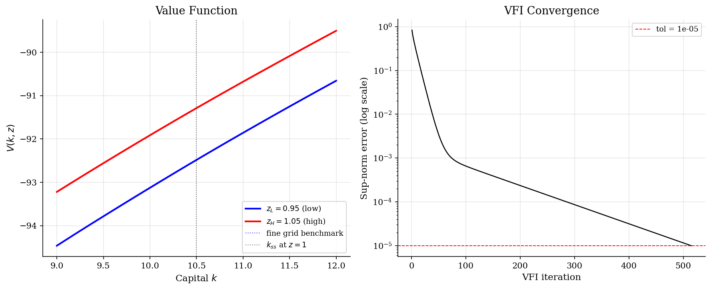
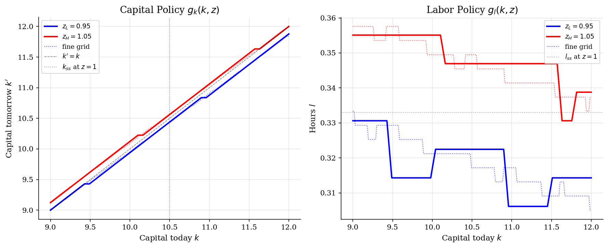
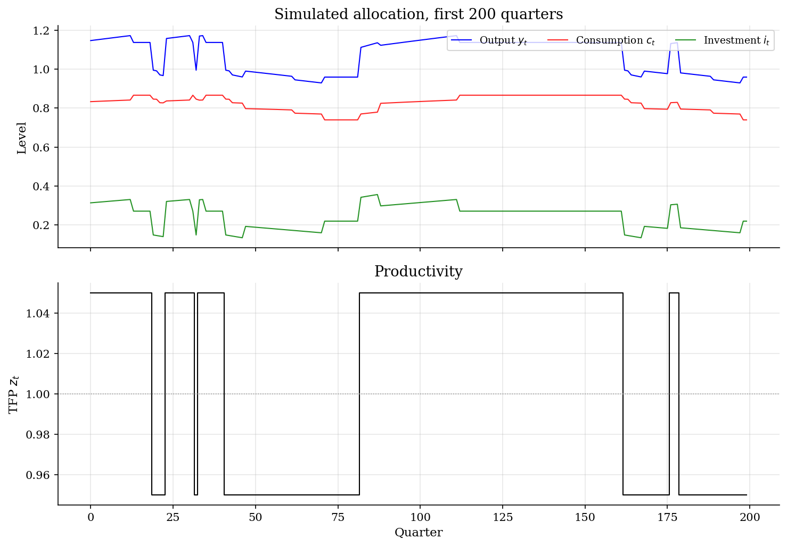
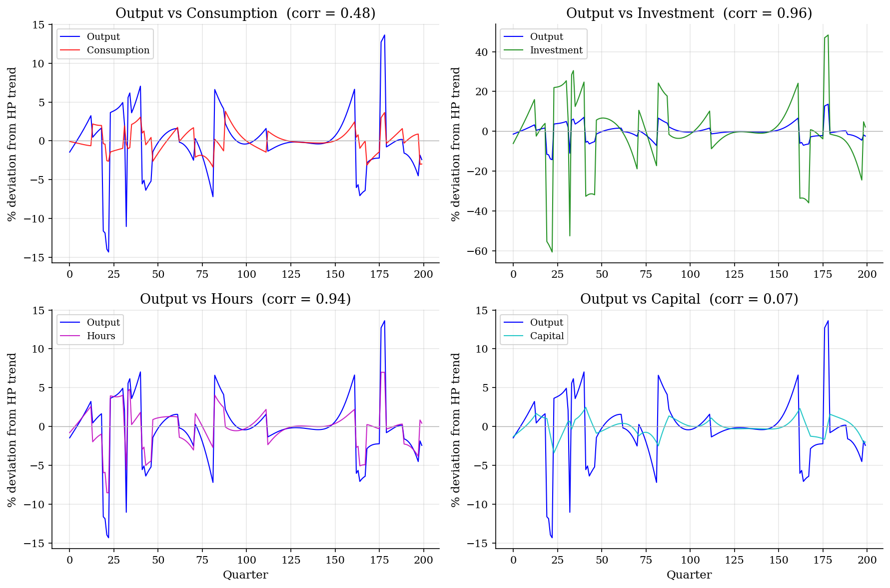

# RBC Capital, Labor, and Business-Cycle Moments

## Overview

Aggregate productivity changes over time. A representative household owns capital, supplies labor, and chooses investment after observing productivity. The shock moves output directly and also changes work and saving.

The object is a stochastic RBC allocation. The state is capital and a two-state TFP process. The policies choose next-period capital and current labor.

The Bellman equation has no closed-form stochastic policy. We solve it on a global grid, simulate the economy, and compare simulated cycles with standard RBC moments.

## Equations

**Technology and resources.** Capital $`k_t`$, labor $`l_t\in(0,1)`$, and TFP $`z_t`$
produce output through Cobb-Douglas technology:

```math
y_t = z_tk_t^{\alpha} l_t^{1-\alpha},\qquad \alpha\in(0,1),
```

The resource constraint is

```math
c_t + k_{t+1} = z_tk_t^{\alpha} l_t^{1-\alpha} + (1-\delta) k_t,
```

with $`c_t>0`$ and $`k_{t+1}\geq 0`$. Investment is $`i_t = k_{t+1} - (1-\delta) k_t`$.

**Preferences.** Period utility uses log consumption and log leisure:

```math
u(c,l)=\log c+\phi\log(1-l),\qquad \phi>0,
```

The household maximizes
$`\mathbb{E}_0\sum_{t=0}^{\infty}\beta^t u(c_t,l_t)`$.

**TFP process.** Productivity takes two values $`z_t\in\lbrace z_L,z_H\rbrace=\lbrace0.95,1.05\rbrace`$
with persistent symmetric transitions:

```math
P_{ij}=\Pr(z_{t+1}=z_j\mid z_t=z_i),\qquad
P=\begin{pmatrix}0.95 & 0.05\\ 0.05 & 0.95\end{pmatrix}.
```

**Bellman equation.** Conditioning on the current state $`(k,z_i)`$, the household
solves:

```math
V(k,z_i)=\max_{k', l\in(0,1)}[\log c+\phi\log(1-l)+\beta\sum_{j}P_{ij} V(k',z_j)],
```

subject to $`c=z_i k^{\alpha} l^{1-\alpha}+(1-\delta)k-k'>0`$. The policy
functions are $`g_k(k,z)=k'`$ and $`g_l(k,z)=l`$.

**Deterministic $`z=1`$ benchmark.** Setting $`z\equiv 1`$ in the stochastic
Bellman, the Euler condition for capital pins down the steady-state
capital-labor ratio,

```math
\frac{k_{ss}}{l_{ss}}=(\frac{1/\beta-1+\delta}{\alpha})^{1/(\alpha-1)},
```

and the labor first-order condition pins down hours

```math
l_{ss}=\frac{w_{ss}}{w_{ss}+\phi(c_{ss}/l_{ss})},\qquad
w_{ss}=(1-\alpha)(k_{ss}/l_{ss})^{\alpha}.
```

The stochastic policy fluctuates around this benchmark.

## Worked Numerical Example

The model has two interlocking first-order conditions at the deterministic steady state ($`z = 1`$, all expectations realized). Solving them in sequence pins down every object the VFI converges to.

The Euler equation for capital, evaluated at a constant interior path ($`c_{t+1} = c_t`$), requires the net return on capital to equal the inverse of the discount factor:

```math
\alpha (k/l)^{\alpha - 1} = \frac{1}{\beta} - 1 + \delta
= \frac{1}{0.99} - 1 + 0.0233 = 0.03340.
```

Rearranging isolates the capital-labor ratio. With $`\alpha = 1/3`$ the exponent on the left is $`-2/3`$, so inverting gives an exponent of $`3/2`$:

```math
(k/l)^{2/3} = \frac{\alpha}{0.03340} = \frac{1/3}{0.03340} = 9.982,
\qquad
k/l = 9.982^{3/2} = 31.54.
```

The wage follows from the labor marginal product at this ratio:

```math
w = (1-\alpha)(k/l)^{\alpha} = \frac{2}{3} \times 31.54^{1/3}
= \frac{2}{3} \times 3.160 = 2.107.
```

The labor first-order condition ties hours to consumption through the leisure weight $`\phi`$:

```math
\phi \frac{c}{1-l} = w \quad \Longrightarrow \quad
c = \frac{w(1-l)}{\phi} = \frac{2.107(1-l)}{1.74}.
```

The resource constraint at steady state gives a second expression for $`c`$ in terms of $`l`$. Output per worker is $`(k/l)^\alpha = 3.160`$, capital per worker is $`31.54`$, so investment per worker is $`\delta \times 31.54 = 0.7349`$, and consumption per worker is $`(3.160 - 0.7349) \times l = 2.425 l`$. Setting the two expressions equal and solving:

```math
2.425 l = \frac{2.107(1-l)}{1.74} = 1.211(1-l),
```

```math
l(2.425 + 1.211) = 1.211,
\qquad l = \frac{1.211}{3.636} = 0.333.
```

Capital and consumption recover immediately:

```math
k = 31.54 \times 0.333 = 10.50, \qquad
c = 2.425 \times 0.333 = 0.808.
```

```math
\boxed{k_{ss} \approx 10.50, \quad l_{ss} \approx 0.333, \quad c_{ss} \approx 0.808.}
```

These three numbers are the fixed point that VFI converges to. The Euler equation pins the capital-labor ratio alone; labor hours are determined only when the leisure weight $`\phi`$ enters through the labor-leisure tradeoff. Without endogenous labor there would be one equation in one unknown; adding $`l`$ as a choice requires the second condition to close the system. The VFI policy functions $`g_k`$ and $`g_l`$ fluctuate around these values as $`z`$ switches between $`z_L`$ and $`z_H`$.

## Model Setup

| Object | Value | Role |
|---|---:|---|
| $`\beta`$ | 0.99 | Discount factor (quarterly) |
| $`\delta`$ | 0.0233 | Depreciation rate |
| $`\alpha`$ | 0.3333 | Capital share in Cobb-Douglas |
| $`\phi`$ | 1.74 | Leisure weight in utility |
| $`z\in\lbrace z_L,z_H\rbrace`$ | $`\lbrace0.95,1.05\rbrace`$ | Two-state aggregate TFP |
| $`P_{ii}`$ | 0.95 | Probability of staying in the same TFP state |
| $`k_{ss}`$ | 10.4980 | Deterministic steady-state capital at $`z=1`$ |
| $`l_{ss}`$ | 0.3330 | Deterministic steady-state hours |
| $`c_{ss}`$ | 0.8073 | Deterministic steady-state consumption |
| $`i_{ss}`$ | 0.2446 | Deterministic steady-state investment |
| Capital grid | $`[9.0,12.0]`$, 50 pts | State and $`k'`$ choice grid |
| Labor grid | $`[0.2,0.6]`$, 50 pts | $`l`$ candidates |
| Fine benchmark | 200 capital, 100 labor pts | Audit only |
| Tolerance | 1e-05 | Sup-norm stopping rule for VFI |
| Simulation | 5000 periods after 500 burn-in | Stationary moments |

## Solution Method

**Bellman update.** The Bellman operator

```math
(TV)(k,z_i)=\max_{(l,k')}[\log c(k,z_i,l,k')+\phi\log(1-l)+\beta\sum_{j}P_{ij}V(k',z_j)]
```

is a $`\beta`$-contraction. VFI applies it until the value function changes by less than the tolerance. For each state, the code evaluates every labor and next-capital pair. It masks negative consumption and takes a joint argmax. The selected indices define the two policy rules.

**Pseudocode.**

```text
Algorithm  Global VFI for the two-state RBC model
Inputs   capital grid K = {k_i}, labor grid L = {l_m}, TFP states {z_1,z_2},
           transition matrix P, primitives (beta, delta, alpha, phi),
           tolerance epsilon
Outputs  V(k_i, z_s), capital policy g_k(k_i, z_s), labor policy g_l(k_i, z_s)

Precompute  u[i,s,m,j] <- log c + phi log(1 - l_m)
            with c = z_s k_i^alpha l_m^(1-alpha) + (1-delta) k_i - k_j,
            and u[i,s,m,j] <- -infinity if c <= 0
Initialize  V[i,s] <- (log c_guess + phi log(1 - l_guess)) / (1 - beta)
repeat n = 0, 1, 2, ...:
    EV[j,s] <- sum_t P[s,t] V[j,t]                  # 1 mat-mat
    M[i,s,m,j] <- u[i,s,m,j] + beta * EV[j,s]        # broadcast add
    (m*, j*)[i,s] <- argmax over (m, j) of M[i,s,m,j] # joint argmax
    V^new[i,s]    <- max over (m, j) of M[i,s,m,j]
    err            <- max[i,s] | V^new[i,s] - V[i,s] |
    V              <- V^new
stop when err < epsilon
g_k(k_i, z_s) <- k[j*[i,s]];   g_l(k_i, z_s) <- l[m*[i,s]]
```

**Fine-grid audit.** The fine grid uses 200 capital nodes and 100 labor nodes on the same domain. It is an audit, not the policy used for simulation. The max relative value error is **2.1e-04**. The max capital-policy gap is **0.0461**. The max hours gap is **0.0150**.

The coarse VFI converged in **515 iterations** with sup-norm error **9.95e-06**. The fine-grid VFI converged in **525 iterations** with error **9.96e-06**.

## Results

The value function rises with capital. High TFP shifts the curve up because installed capital is more productive. The dotted fine-grid lines sit on the coarse-grid curves. The deterministic steady state sits between the two stochastic centers.



The capital policy stays near the 45-degree line, so capital moves slowly. High TFP raises next-period capital at each current capital level. Hours rise in high TFP states and fall slightly with capital. The fine grid shows the same policies with smoother steps.



Output jumps when TFP changes. Consumption moves less because capital buffers resources. Investment absorbs most of the gap between output and consumption. Capital then adjusts slowly after each regime switch.



Consumption is smoother than output. Investment moves with output and is about four times as volatile. Hours are strongly procyclical. Capital is persistent because it accumulates past investment.



The table gives standard HP-filtered moments from the simulated economy. Investment is the most volatile flow. Consumption is smoother than output. Hours are strongly procyclical. Capital has high autocorrelation because it is a stock.

**Business-cycle moments, HP-filtered (lambda=1600), 5000-quarter simulation**

| Variable        |   Std Dev (%) |   Relative to Y |   Corr with Y |   Autocorr(1) |
|:----------------|--------------:|----------------:|--------------:|--------------:|
| Output (Y)      |          4.55 |            1    |          1    |          0.71 |
| Consumption (C) |          1.54 |            0.34 |          0.48 |          0.74 |
| Investment (I)  |         18.75 |            4.12 |          0.96 |          0.69 |
| Hours (L)       |          2.75 |            0.6  |          0.94 |          0.7  |
| Capital (K)     |          1.32 |            0.29 |          0.07 |          0.95 |

## Takeaway

The global-grid RBC model turns a two-state productivity shock into familiar business-cycle comovements. Investment is volatile, consumption is smooth, and hours are procyclical. Capital is the persistent state that carries shocks forward. The fine-grid audit shows the moments are not driven by coarse discretization.

## References

- Kydland, F. and Prescott, E. (1982). "Time to Build and Aggregate Fluctuations." *Econometrica*, 50(6), 1345-1370.
- King, R., Plosser, C., and Rebelo, S. (1988). "Production, Growth and Business Cycles: I. The Basic Neoclassical Model." *Journal of Monetary Economics*, 21(2-3), 195-232.
- Cooley, T. and Prescott, E. (1995). "Economic Growth and Business Cycles." In Cooley (ed.), *Frontiers of Business Cycle Research*, Princeton University Press.
- Hansen, G. (1985). "Indivisible Labor and the Business Cycle." *Journal of Monetary Economics*, 16(3), 309-327.
- Ljungqvist, L. and Sargent, T. (2018). *Recursive Macroeconomic Theory*. MIT Press, 4th edition, Ch. 12.
