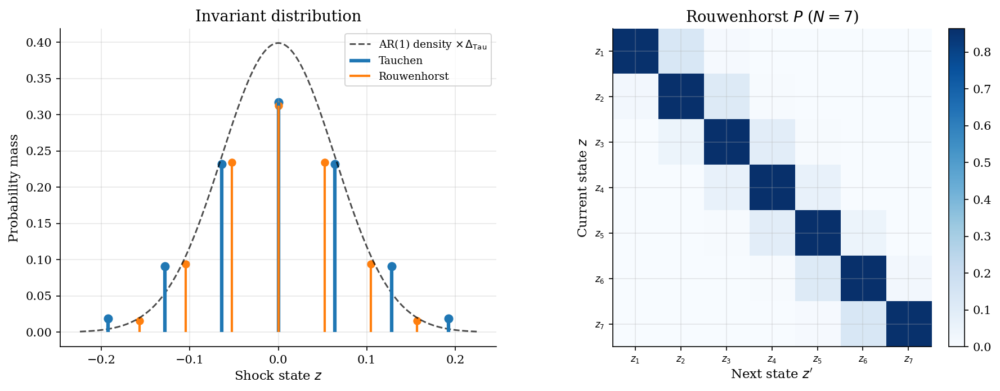
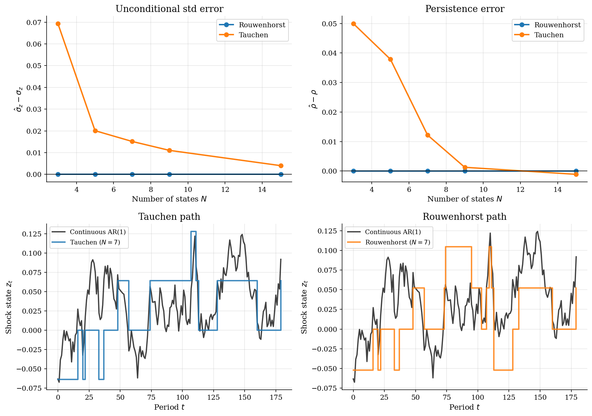

# Discretizing Persistent Shocks: Tauchen and Rouwenhorst

## Overview

In computational macroeconomics, household income and productivity shocks are continuous Gaussian AR(1) processes. Dynamic programming requires a finite discrete object: a grid of shock states and a transition matrix for next-period expectations. Before 1986, models either worked with very coarse approximations or abstracted away from persistence entirely. Tauchen (1986) wrote down a systematic procedure for building a finite Markov chain whose transition probabilities integrate the Gaussian conditional density between cell midpoints. Rouwenhorst (1995) introduced a moment-matching recursion that constructs the chain to satisfy the AR(1) variance and autocorrelation exactly for any number of states.

The object is a *Markov chain* on $`N`$ states that approximates a Gaussian AR(1) with persistence $`\rho`$ and innovation standard deviation $`\sigma_\varepsilon`$. The chain enters every downstream Bellman equation through the transition matrix $`P`$. Two properties of $`P`$ carry the most weight in those equations: the unconditional variance, which controls risk exposure, and the autocorrelation, which controls expected continuation values after good and bad draws.

## Read before

- [AR processes and impulse responses](../../time-series/ar-processes/README.md)
- [Optimal growth model](../optimal-growth/README.md)

## Equations

Let $`z_t`$ be a log income or log productivity shock with persistence $`\rho\in(-1,1)`$ and innovation standard deviation $`\sigma_\varepsilon>0`$,

```math
z_{t+1} = \rho\, z_t + \sigma_\varepsilon\, \varepsilon_{t+1}, \qquad \varepsilon_{t+1}\sim\mathcal{N}(0,1).
```

The AR(1) has unconditional distribution $`z_t\sim\mathcal{N}(0,\sigma_z^2)`$ with

```math
\sigma_z^2 = \frac{\sigma_\varepsilon^2}{1-\rho^2}.
```

The lag-$`k`$ autocorrelation is $`\rho_k = \rho^k`$, so the shock half-life is $`\ln 2 / {-\ln\rho}`$ periods.

A finite chain replaces the continuous conditional law with $`P\in\mathbb{R}^{N\times N}`$. Let $`i`$ and $`j`$ index states in $`\{z_1,\dots,z_N\}`$. Each entry $`P_{ij} = \Pr(z_{t+1}=z_j\mid z_t=z_i)`$ and rows sum to one. The chain has an invariant distribution $`\pi`$ satisfying $`\pi = \pi P`$ and $`\sum_i \pi_i = 1`$.

In a household *Bellman equation*, the chain enters through expected continuation values,

```math
V(a, z_i) = \max_{a'\in\mathcal{A}}\left[\,u\!\left((1+r)a + w\exp(z_i) - a'\right) + \beta\sum_{j=1}^{N}P_{ij}\,V(a', z_j)\right].
```

Here $`a`$ is assets, $`r`$ is the net return, $`w`$ is the wage, $`\beta\in(0,1)`$ is the discount factor, and $`\mathcal{A}`$ is the feasible asset set.

Two diagnostics govern chain quality. Does the chain match $`\sigma_z`$? Does it match $`\rho`$? Variance controls risk exposure. Persistence controls expected continuation values after good and bad shocks.

## Worked Numerical Example

One *Tauchen CDF-difference* computation by hand. Take $`N=3`$, $`\rho=0.5`$, $`\sigma_\varepsilon=1.0`$, half-width $`m=2`$. These toy parameters produce round CDF arguments; the algorithm is identical to the main calibration.

The unconditional standard deviation is

```math
\sigma_z = \frac{\sigma_\varepsilon}{\sqrt{1-\rho^2}} = \frac{1}{\sqrt{0.75}} = 1.1547.
```

The grid spans $`[-m\sigma_z, m\sigma_z]`$ with three evenly spaced nodes:

```math
z_1 = -2.309, \qquad z_2 = 0, \qquad z_3 = 2.309.
```

Cell midpoints between nodes are $`c_2 = -1.155`$ and $`c_3 = 1.155`$, with $`c_1 = -\infty`$ and $`c_4 = +\infty`$. The half-step is $`h/2 = 1.155`$.

Row $`i=2`$ (from middle state $`z_2=0`$, so $`\rho z_i = 0`$):

```math
P_{2,2} = \Phi\!\left(\tfrac{c_3 - \rho z_2}{\sigma_\varepsilon}\right) - \Phi\!\left(\tfrac{c_2 - \rho z_2}{\sigma_\varepsilon}\right) = \Phi(1.155) - \Phi(-1.155) = 2(0.8759) - 1 = 0.7518.
```

```math
P_{2,1} = \Phi(-1.155) = 0.1241, \qquad P_{2,3} = 1 - \Phi(1.155) = 0.1241.
```

Row $`i=1`$ ($`\rho z_1 = -1.155`$): the left endpoint cell absorbs all tail mass past $`-m\sigma_z`$, giving $`P_{1,1} = \Phi(0) = 0.5`$, $`P_{1,2} = \Phi(2.310) - \Phi(0) = 0.4896`$, $`P_{1,3} = 0.0104`$. By symmetry of the Gaussian kernel, row 3 reverses row 1.

```math
\boxed{P = \begin{pmatrix} 0.500 & 0.490 & 0.010 \\ 0.124 & 0.752 & 0.124 \\ 0.010 & 0.490 & 0.500 \end{pmatrix}.}
```

The endpoint rows pile half their mass on themselves because tail probability past $`\pm m\sigma_z`$ collapses onto $`z_1`$ and $`z_3`$. On a coarse grid with high $`\rho`$, that endpoint stickiness pushes the chain's persistence above target. The Results table quantifies this for the full calibration.

## Model Setup

| Parameter | Value | Parameter | Value |
|---|---:|---|---:|
| Persistence $`\rho`$ | 0.95 | Main grid size $`N`$ | 7 |
| Innovation s.d. $`\sigma_\varepsilon`$ | 0.02 | Grid sweep | [3, 5, 7, 9, 15] |
| Unconditional s.d. $`\sigma_z`$ | 0.0641 | Tauchen half-width $`m`$ | 3 |
| Shock half-life | ~14 periods | Simulation horizon $`T`$ | 180 |

## Solution Method

What is new here is the discretization itself. Prereq tutorials use a chain as a black box. This tutorial builds one.

```
        ρ, σ_ε, N                       ρ, σ_ε, N
            |                                |
            v                                v
   +------------------+             +------------------+
   |    [ Tauchen ]   |             |  [ Rouwenhorst ] |
   +------------------+             +------------------+
            |                                |
            v                                v
       {z_j}, P                          {z_j}, P
```

```python
# Tauchen (1986): integrate Gaussian mass between cell midpoints.
# rho, sigma: AR(1) parameters. n: grid size. m: half-width in sigma_z units.
def tauchen(rho: float, sigma: float, n: int, m: float = 3.0):
    sigma_z = sigma / np.sqrt(1.0 - rho**2)
    z = np.linspace(-m * sigma_z, m * sigma_z, n)
    # cell edges: midpoints between nodes; extend to ±inf at endpoints
    edges = np.concatenate([[-np.inf], (z[:-1] + z[1:]) / 2, [np.inf]])
    P = np.empty((n, n))
    for i in range(n):
        # conditional mean is rho * z[i]; normalize by sigma_eps
        P[i] = norm.cdf((edges[1:] - rho * z[i]) / sigma) \
             - norm.cdf((edges[:-1] - rho * z[i]) / sigma)
    return z, P


# Rouwenhorst (1995): moment-matching recursion. Builds P_N from a 2-state base.
# p encodes rho; the recursion preserves autocorrelation as states are added.
def rouwenhorst_P(n: int, p: float) -> np.ndarray:
    P = np.array([[p, 1 - p], [1 - p, p]])           # 2-state base
    for _ in range(n - 2):
        m = P.shape[0]
        TL = np.zeros((m + 1, m + 1)); TL[:m, :m] = P
        TR = np.zeros((m + 1, m + 1)); TR[:m, 1:] = P
        BL = np.zeros((m + 1, m + 1)); BL[1:, :m] = P
        BR = np.zeros((m + 1, m + 1)); BR[1:, 1:] = P
        P = p * TL + (1 - p) * TR + (1 - p) * BL + p * BR
        P[1:-1] /= 2                                  # interior rows counted twice
    return P
```

Tauchen's transition matrix is transparent: each entry is a difference of normal CDFs, and the grid support is visible. Rouwenhorst's recursion carries no *quadrature error* in variance or persistence. Kopecky and Suen (2010) show that for $`\rho \ge 0.9`$, Rouwenhorst outperforms Tauchen by one to two orders of magnitude in moment accuracy at the same $`N`$.

## Results

The *invariant distribution* shows where each chain puts probability. The dashed curve is the AR(1) Gaussian density scaled by the Tauchen cell width. Tauchen follows the curve near the center. At $`N=7`$ its outer states sit slightly above the Gaussian tails. Rouwenhorst has a binomial invariant distribution, so its center is heavier and its tails are thinner. The right panel shows the Rouwenhorst $`N=7`$ transition matrix as a heatmap. The diagonal band reflects persistence: high probability of staying near the current state, decaying smoothly away from it.



Moment errors show the main diagnostic. The zero line is the AR(1) target. Rouwenhorst stays at zero across all $`N`$ because the recursion enforces variance and persistence by construction. Tauchen approaches both targets as $`N`$ grows. The simulated paths use common random numbers: both chains receive the same innovation ranks as the continuous AR(1) path. Each chain moves on a coarse grid, so it cannot match the continuous path point by point. The useful check is the rhythm of persistence. Rouwenhorst tracks slow drift more closely at $`N=7`$.



### Moment accuracy across discretization methods

| Method | States | Std | Std error | Persistence | Persistence error |
|:---|---:|---:|---:|---:|---:|
| Tauchen | 3 | 0.13344 | 0.06939 | 0.99999 | 0.04999 |
| Rouwenhorst | 3 | 0.06405 | 0 | 0.95000 | 0 |
| Tauchen | 5 | 0.08414 | 0.02009 | 0.98787 | 0.03787 |
| Rouwenhorst | 5 | 0.06405 | 0 | 0.95000 | 0 |
| Tauchen | 7 | 0.07918 | 0.01513 | 0.96220 | 0.01220 |
| Rouwenhorst | 7 | 0.06405 | 0 | 0.95000 | 0 |
| Tauchen | 9 | 0.07509 | 0.01103 | 0.95128 | 0.00128 |
| Rouwenhorst | 9 | 0.06405 | 0 | 0.95000 | 0 |
| Tauchen | 15 | 0.06805 | 0.00400 | 0.94889 | −0.00111 |
| Rouwenhorst | 15 | 0.06405 | 0 | 0.95000 | 0 |

## Takeaway

*Discretization* is not a preprocessing step. It is part of the economic model. The transition matrix $`P`$ enters every continuation value in the Bellman equation, so its errors propagate into policies and stationary distributions. Tauchen's procedure is transparent and approximates the Gaussian shape well as $`N`$ grows. Rouwenhorst is preferred for persistent processes because it matches the unconditional variance and autocorrelation exactly at any $`N`$, removing the moment errors that shift continuation values. The size of those errors, negligible on fine grids but material on the coarse grids that enter Bellman solvers, is the practical lesson from Kopecky and Suen (2010). The chain choice went on to shape every calibrated heterogeneous-agent model, from Bewley-Huggett-Aiyagari to HANK, because the income process enters every continuation value.

## See also

- [Aiyagari incomplete-markets model](../aiyagari/README.md)
- [Consumption-savings under income risk](../consumption-savings/README.md)
- [Optimal growth model](../optimal-growth/README.md)

## References

- Tauchen, G. (1986). Finite State Markov-Chain Approximations to Univariate and Vector Autoregressions. *Economics Letters*, 20(2), 177-181.
- Rouwenhorst, K. G. (1995). Asset Pricing Implications of Equilibrium Business Cycle Models. In T. Cooley (ed.), *Frontiers of Business Cycle Research*. Princeton University Press, Ch. 10.
- Kopecky, K. A. and Suen, R. M. H. (2010). Finite State Markov-Chain Approximations to Highly Persistent Processes. *Review of Economic Dynamics*, 13(3), 701-714.
