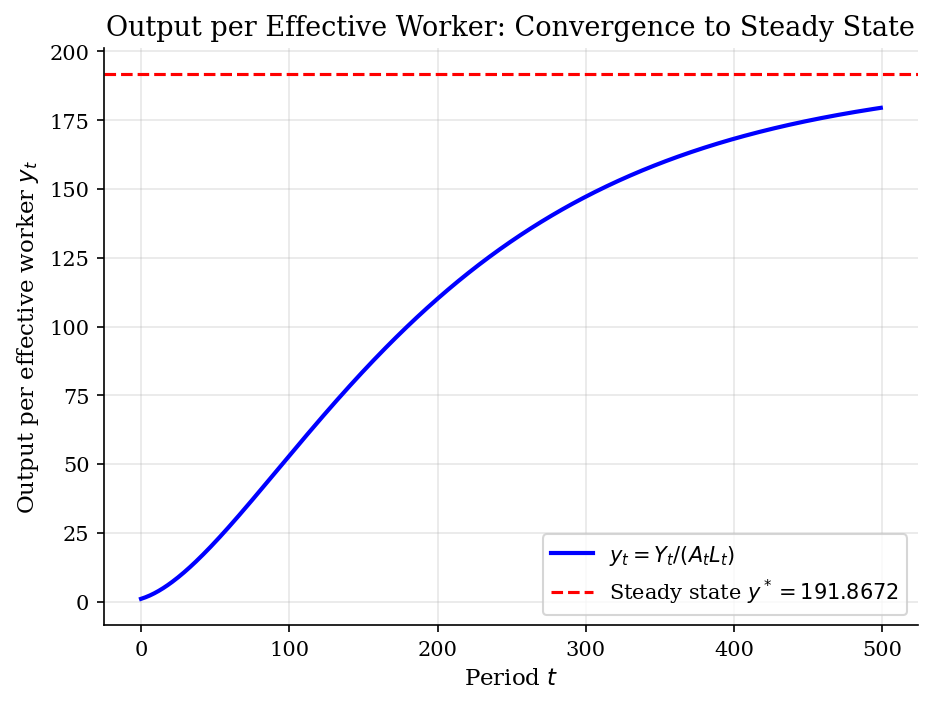
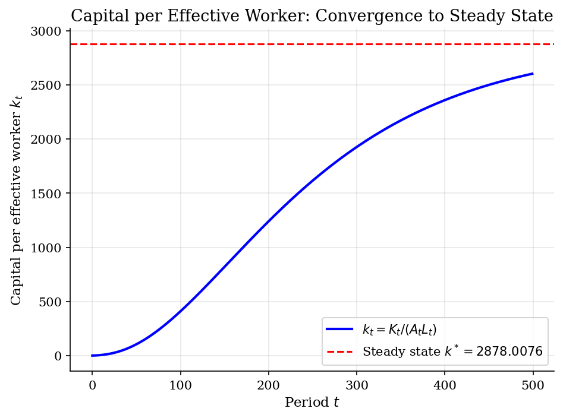
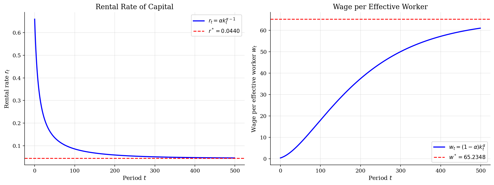

# Solow Growth Model

> Deterministic simulation of the neoclassical growth model with exogenous savings, technology growth, and population growth.

## Overview

The Solow (1956) growth model is the foundational framework for understanding long-run economic growth. Unlike dynamic programming models where agents optimize intertemporally, the Solow model assumes a constant, exogenous savings rate $s$. Output is produced via a Cobb-Douglas production function with constant returns to scale, and the economy converges to a balanced growth path (steady state) where all per-capita variables grow at the rate of technological progress.

This simulation traces the transition dynamics from an initial capital stock to the steady state, illustrating how savings, population growth, depreciation, and technology jointly determine long-run living standards.

## Equations

**Production function (Cobb-Douglas):**
$$Y_t = K_t^{\alpha} (A_t L_t)^{1-\alpha}$$

**Laws of motion:**
$$K_{t+1} = (1-\delta) K_t + s Y_t$$
$$A_{t+1} = (1+g) A_t, \qquad L_{t+1} = (1+n) L_t$$

**Effective units:** Let $k_t = K_t / (A_t L_t)$ and $y_t = Y_t / (A_t L_t) = k_t^{\alpha}$.

**Steady state:** Setting $k_{t+1} = k_t = k^*$:
$$k^* = \left( \frac{s}{n + g + \delta} \right)^{1/(1-\alpha)}$$
$$y^* = (k^*)^{\alpha}, \qquad c^* = (1-s) \, y^*$$

**Factor prices (competitive):**
$$r_t = \alpha \, k_t^{\alpha - 1}, \qquad w_t = (1-\alpha) \, k_t^{\alpha}$$

## Model Setup

| Parameter | Value | Description |
|-----------|-------|-------------|
| $\alpha$  | 0.66 | Capital share (Cobb-Douglas exponent) |
| $s$       | 0.3 | Savings rate (exogenous) |
| $\delta$  | 0.0 | Depreciation rate |
| $n$       | 0.0 | Population growth rate |
| $g$       | 0.02 | Technology growth rate |
| $K_0$     | 1.0 | Initial capital stock |
| $A_0$     | 1.0 | Initial technology level |
| $L_0$     | 1.0 | Initial labor force |
| $T$       | 500 | Simulation periods |

## Solution Method

**Deterministic simulation:** The Solow model requires no optimization — the savings rate is exogenous. We simply iterate the laws of motion forward for $T = 500$ periods starting from $(K_0, A_0, L_0) = (1.0, 1.0, 1.0)$.

In each period:
1. Compute output: $Y_t = K_t^{\alpha} (A_t L_t)^{1-\alpha}$
2. Update capital: $K_{t+1} = (1-\delta) K_t + s Y_t$
3. Update technology and labor: $A_{t+1} = (1+g) A_t$, $L_{t+1} = (1+n) L_t$

We then convert to effective units $k_t = K_t / (A_t L_t)$ to analyze convergence to the steady state $k^*$.

## Results


*Output per effective worker converges to the analytically computed steady state*


*Capital per effective worker converges to the steady state determined by savings and effective depreciation*


*Factor prices (rental rate and wage per effective worker) converge to steady-state values*

**Steady-State Comparison: Analytical vs Simulated**

| Variable                        |   Analytical |   Simulated (t=499) |       Gap |
|:--------------------------------|-------------:|--------------------:|----------:|
| Capital per eff. worker (k)     |    2878.01   |         2601.77     | 276       |
| Output per eff. worker (y)      |     191.867  |          179.505    |  12.4     |
| Consumption per eff. worker (c) |     134.307  |          125.654    |   8.65    |
| Rental rate (r)                 |       0.044  |            0.045536 |   0.00154 |
| Wage per eff. worker (w)        |      65.2348 |           61.0318   |   4.2     |

## Economic Takeaway

The Solow model illustrates how an economy's long-run prosperity is determined by a few fundamental parameters, even without any optimizing behavior by agents.

**Key insights:**
- **Higher savings rate** $\rightarrow$ higher steady-state capital and output per effective worker. But savings cannot drive *growth* in the long run — only the *level* of output.
- **Population growth and depreciation** reduce steady-state capital intensity by diluting capital across more workers and wearing out existing stock.
- **Technology growth** is the sole driver of long-run output per capita growth. On the balanced growth path, output per capita grows at rate $g$.
- **No optimization:** The savings rate $s$ is exogenous. This is both the model's simplicity and its limitation — contrast with the Ramsey model where households choose savings optimally via an Euler equation.
- **Convergence:** Economies below steady state grow faster (diminishing returns to capital), predicting conditional convergence across countries.

## Reproduce

```bash
python run.py
```

## References

- Solow, R. (1956). "A Contribution to the Theory of Economic Growth." *Quarterly Journal of Economics*, 70(1), 65-94.
- Romer, D. (2019). *Advanced Macroeconomics*. McGraw-Hill, 5th edition, Ch. 1.
- Barro, R. and Sala-i-Martin, X. (2004). *Economic Growth*. MIT Press, 2nd edition, Ch. 1.
- Acemoglu, D. (2009). *Introduction to Modern Economic Growth*. Princeton University Press, Ch. 2.
