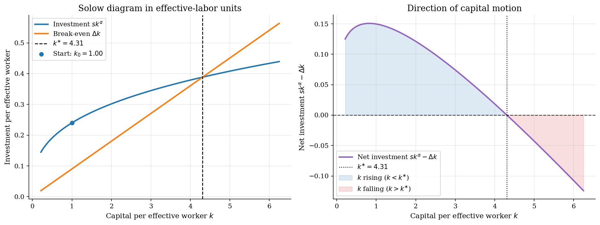
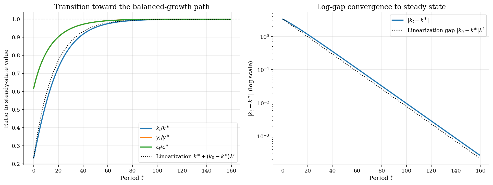
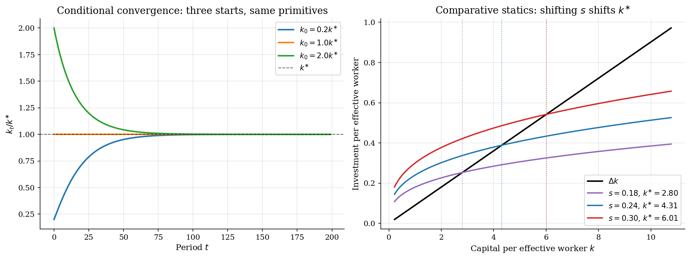

# Solow Growth and Conditional Convergence

## Overview

Before Solow (1956), the dominant framework was Harrod-Domar, which predicted knife-edge instability: any deviation from a precise saving or growth rate would push the economy into runaway unemployment or unbounded inflation. Solow replaced the fixed-coefficient production function with a Cobb-Douglas that admits diminishing returns to capital. That single change made the steady state stable and killed the knife-edge. The paper asked how much of long-run growth comes from capital accumulation versus an unexplained residual. The answer was startling: roughly seven-eighths of US productivity growth from 1909 to 1949 came from the residual, not from capital.

A *saving rate* fixes what fraction of output is invested each period. The model is one scalar map applied repeatedly from an initial capital stock. Concavity gives one positive steady state, and the economy converges to it from any starting point with the same primitives.

Mankiw, Romer, and Weil (1992) added human capital, brought the model to cross-country data, and explained roughly 80 percent of the variation in income per capita. The residual Solow identified became the object that endogenous growth theory (Romer 1986, Lucas 1988) set out to explain.

## Read before

- [Optimal growth model](../optimal-growth/README.md)
- [Consumption-savings under income risk](../consumption-savings/README.md)

## Equations

Let $`K_t`$ denote aggregate capital, $`A_t`$ labor-augmenting technology, and $`L_t`$ raw labor. Output is Cobb-Douglas with capital share $`\alpha\in(0,1)`$,

```math
Y_t = K_t^\alpha (A_t L_t)^{1-\alpha}.
```

Let $`s`$ be the saving rate, $`\delta`$ depreciation, $`g`$ technology growth, and $`n`$ labor-force growth. Capital, technology, and labor evolve as

```math
K_{t+1} = (1-\delta)K_t + sY_t,
```

```math
A_{t+1} = (1+g)A_t,
```

```math
L_{t+1} = (1+n)L_t.
```

Divide by $`A_t L_t`$ and define capital per effective worker $`k_t = K_t/(A_t L_t)`$ and output per effective worker $`y_t = Y_t/(A_t L_t)`$,

```math
y_t = k_t^\alpha,
```

with consumption per effective worker $`c_t = (1-s) y_t`$.

In these units, the *law of motion* is one scalar equation,

```math
k_{t+1} = \phi(k_t) := \frac{(1-\delta) k_t + sk_t^\alpha}{(1+g)(1+n)}.
```

Define break-even investment as

```math
\Delta := (1+g)(1+n) - 1 + \delta.
```

The steady state $`k^{\ast}`$ solves $`\phi(k^{\ast}) = k^{\ast}`$, which is equivalent to $`s(k^{\ast})^\alpha = \Delta k^{\ast}`$. The closed-form values are

```math
k^{\ast} = \left(\frac{s}{\Delta}\right)^{1/(1-\alpha)},
```

```math
y^{\ast} = (k^{\ast})^\alpha, \qquad c^{\ast} = (1-s)\,y^{\ast}.
```

## Worked Numerical Example

Set $`\alpha = 0.33`$, $`s = 0.24`$, $`\delta = 0.06`$, $`n = 0.01`$, $`g = 0.02`$, and $`k_0 = 1.0`$, matching the calibration below.

Break-even investment per unit of $`k`$ is

```math
\Delta = (1+g)(1+n) - 1 + \delta = (1.02)(1.01) - 1 + 0.06 = 0.0902.
```

At $`k_0 = 1`$, output, consumption, and investment per effective worker are

```math
y_0 = k_0^\alpha = 1.00, \qquad c_0 = (1-s)\,y_0 = 0.76, \qquad i_0 = s\,y_0 = 0.24.
```

One application of the *Solow map* gives

```math
k_1 = \frac{(1-\delta)\,k_0 + s\,k_0^\alpha}{(1+g)(1+n)}
    = \frac{0.94 + 0.24}{1.0302}
    = \boxed{k_1 \approx 1.145}.
```

The closed-form steady state is

```math
k^{\ast} = \left(\frac{s}{\Delta}\right)^{1/(1-\alpha)}
         = \left(\frac{0.24}{0.0902}\right)^{1/0.67}
         = (2.661)^{1.493}
         = \boxed{k^{\ast} \approx 4.309},
```

with $`y^{\ast} = (k^{\ast})^\alpha \approx 1.619`$ and $`c^{\ast} = (1-s)\,y^{\ast} \approx 1.231`$.

Since $`k_1 = 1.145 > k_0 = 1.0`$ and $`k_1 < k^{\ast}`$, the economy is still below steady state after one period. The simulation takes 160 periods to close that gap to below $`3 \times 10^{-4}`$.

## Model Setup

*Annual calibration* matches standard textbook Solow numbers.

| Parameter | Value | Parameter | Value |
|---|---:|---|---:|
| Capital share $`\alpha`$ | 0.33 | Technology growth $`g`$ | 0.02 |
| Saving rate $`s`$ | 0.24 | Labor-force growth $`n`$ | 0.01 |
| Depreciation $`\delta`$ | 0.06 | Horizon $`T`$ | 160 periods |
| Break-even $`\Delta`$ | 0.0902 | Initial stocks $`K_0,A_0,L_0`$ | 1.0, 1.0, 1.0 |
| Steady-state capital $`k^{\ast}`$ | 4.3086 | Convergence factor $`\lambda`$ | 0.9414 |

## Solution Method

There is no optimization here. Once $`s`$ is fixed, the model is the scalar map $`\phi`$. The simulation applies $`\phi`$ from $`k_0`$ until the path is close to $`k^{\ast}`$. A local linearization gives the *convergence rate* near the steady state,

```math
\lambda \equiv \phi'(k^{\ast}) = \frac{(1-\delta) + s\alpha(k^{\ast})^{\alpha-1}}{(1+g)(1+n)}.
```

When $`\lambda \in (0,1)`$, deviations shrink geometrically. The half-life is $`H := \ln(0.5)/\ln(\lambda)`$.

```
              primitives (s, delta, alpha, n, g), k_0
                              |
                              v
    +---------- simulation ----------+
    |  k_t --> [ Solow map phi ] --> k_{t+1}  |
    +---------- T steps / until gap < tol ----+
                              |
                           done
                              v
                       {k_t, y_t, c_t}, k* (steady state)
```

```python
def solow_next_k(k, alpha, savings_rate, depreciation, population_growth, technology_growth):
    dilution = (1.0 + technology_growth) * (1.0 + population_growth)
    return ((1.0 - depreciation) * k + savings_rate * k**alpha) / dilution

# closed-form fixed point
gross_dilution = (1.0 + technology_growth) * (1.0 + population_growth)
effective_depreciation = gross_dilution - 1.0 + depreciation
k_star = (savings_rate / effective_depreciation) ** (1.0 / (1.0 - alpha))

# convergence factor
local_lambda = (
    (1.0 - depreciation) + savings_rate * alpha * k_star ** (alpha - 1.0)
) / gross_dilution
```

For this calibration, $`\lambda \approx 0.941`$ and the local half-life is roughly 11.5 periods.

## Results

The left panel shows the Solow diagram. At $`k_0 = 1.00`$, the curved schedule $`sk^\alpha`$ sits above the linear break-even line $`\Delta k`$. Capital deepens from the start. The curves cross at $`k^{\ast} = 4.309`$, the unique positive steady state. The right panel plots net investment $`sk^\alpha - \Delta k`$. It is positive left of $`k^{\ast}`$ and negative to the right, confirming that $`k^{\ast}`$ is a global attractor.



The left panel normalizes each series by its steady-state value. Output and consumption move together because $`c_t = (1-s)y_t`$. Capital moves more slowly because it inherits the past stock. The dotted line is the local linearization $`k^{\ast} + (k_0 - k^{\ast})\lambda^t`$. It tracks the simulated path well near $`k^{\ast}`$. The right panel plots $`|k_t - k^{\ast}|`$ on a log scale. The decay is nearly linear near the steady state, confirming the geometric rate predicted by $`\lambda`$. In early periods the log gap falls faster than the linearization predicts. The nonlinearity accelerates convergence when the economy starts far from $`k^{\ast}`$.



The left panel starts three economies from different capital stocks. They share the same primitives, so they converge to the same $`k^{\ast}`$. *Conditional convergence* means convergence to each economy's own steady state, not to a common income level across countries with different saving rates or depreciation. The right panel shifts the saving rate. Higher $`s`$ raises $`k^{\ast}`$ and the level of output per worker. It does not change the long-run growth rate, which remains $`g`$.



The table compares the closed form with the terminal simulation. The gap comes from finite horizon truncation.

### Steady-state diagnostics

| Object | Closed form | Object | Simulated $`t=159`$ |
|---|---:|---|---:|
| Capital $`k^{\ast}`$ | 4.30859 | Capital $`k_{159}`$ | 4.30832 |
| Output $`y^{\ast}`$ | 1.61931 | Output $`y_{159}`$ | 1.61928 |
| Consumption $`c^{\ast}`$ | 1.23068 | Consumption $`c_{159}`$ | 1.23065 |
| Convergence factor $`\lambda`$ | 0.9414 | Half-life $`H`$ | 11.5 periods |
| Linearization gap at $`t=159`$ | 2.21e-04 | Simulated gap $`|k_{159}-k^{\ast}|`$ | 2.73e-04 |

## Takeaway

*Diminishing returns* to capital are the engine. They guarantee a unique stable steady state and rule out the knife-edge instability that made Harrod-Domar so alarming. The quantitative surprise was that capital accumulation explains only a small fraction of long-run productivity growth. Most growth fell into an unexplained residual, and that finding redirected a generation of research toward understanding technology. The Solow framework anchored cross-country empirics through Mankiw, Romer, and Weil, and the residual it identified became the object that endogenous growth theory set out to explain.

## See also

- [Aiyagari saving and capital-market clearing](../aiyagari/README.md)
- [Optimal growth model](../optimal-growth/README.md)
- [Shock discretization with Rouwenhorst](../shock-discretization/README.md)

## References

- Solow, R. M. (1956). A Contribution to the Theory of Economic Growth. *Quarterly Journal of Economics*, 70(1), 65-94.
- Mankiw, N. G., Romer, D., and Weil, D. N. (1992). A Contribution to the Empirics of Economic Growth. *Quarterly Journal of Economics*, 107(2), 407-437.
- Romer, D. (2019). *Advanced Macroeconomics*. McGraw-Hill, 5th edition, Ch. 1.
- Barro, R. and Sala-i-Martin, X. (2004). *Economic Growth*. MIT Press, 2nd edition, Ch. 1.
- Acemoglu, D. (2009). *Introduction to Modern Economic Growth*. Princeton University Press, Ch. 2.
