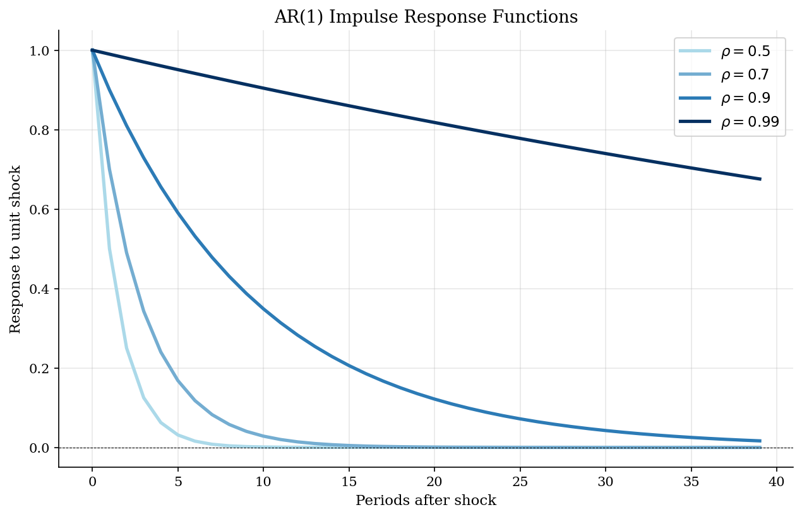
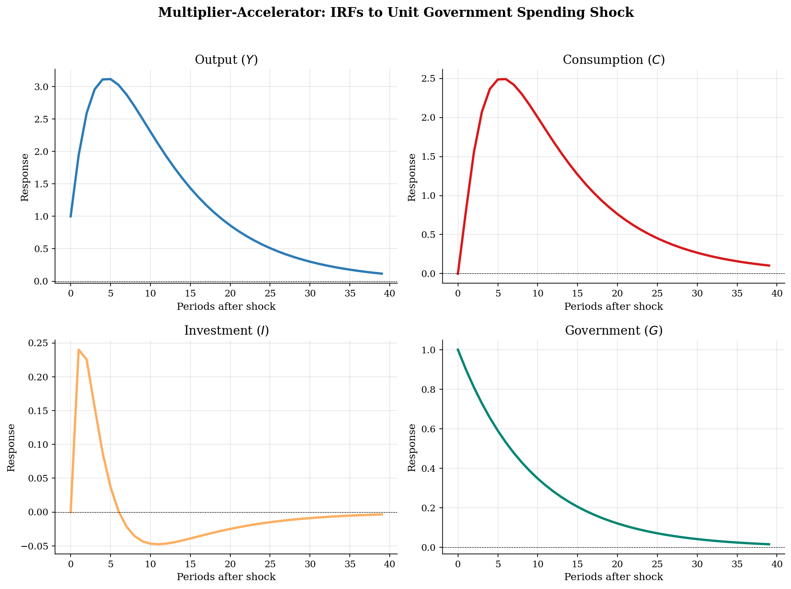
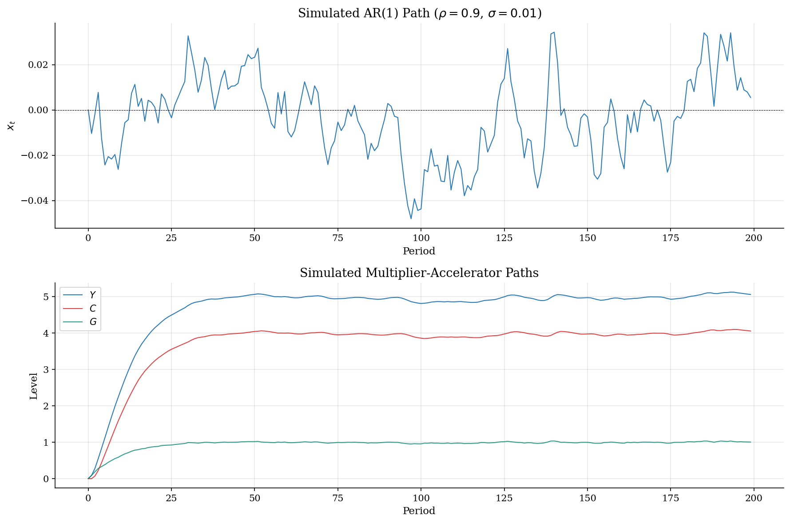
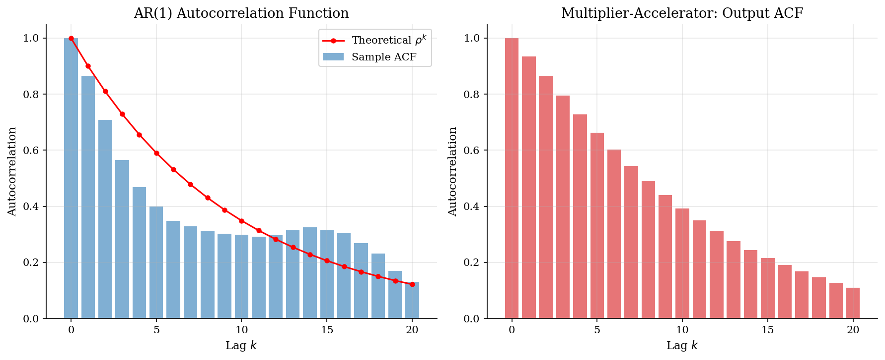
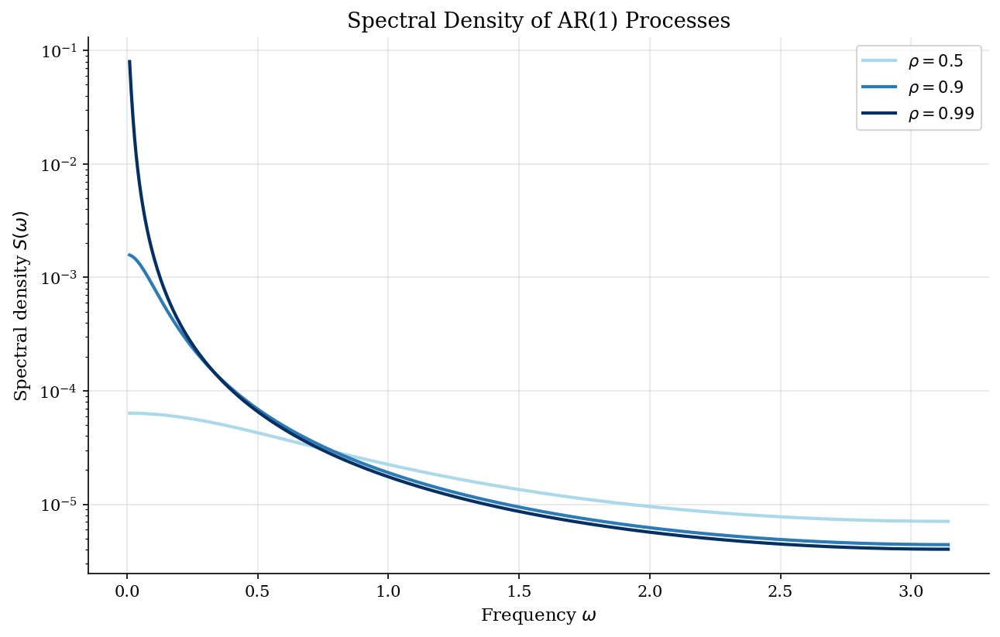

# AR Process Dynamics

> Impulse responses, simulated paths, and spectral properties of AR(1) and multiplier-accelerator models from Dynare.

## Overview

Autoregressive processes are the building blocks of time series econometrics and DSGE modeling. Every linearized DSGE model reduces to a vector autoregression in the state variables.

This module analyzes two models from the Dynare examples:
1. **AR(1):** The simplest persistent process, $x_t = \rho x_{t-1} + \varepsilon_t$
2. **Multiplier-Accelerator:** A classic Keynesian dynamics model where consumption depends on lagged income (multiplier) and investment depends on consumption changes (accelerator), producing richer dynamics than a simple AR.

## Equations

**AR(1) Process** (`ar1/model.mod`):
```
x = rho*x(-1) + e
```
$$x_t = \rho \, x_{t-1} + \varepsilon_t, \quad \varepsilon_t \sim N(0, \sigma^2)$$

**Multiplier-Accelerator Model** (`ar2/model.mod`):
```
C = beta * Y(-1)           [Consumption function]
G = rho * G(-1) + (1-rho)*Gbar + e   [Government spending]
I = alpha * (C - C(-1))    [Accelerator investment]
Y = C + I + G              [Income identity]
```
$$C_t = \beta Y_{t-1}$$
$$G_t = \rho G_{t-1} + (1-\rho)\bar{G} + \varepsilon_t$$
$$I_t = \alpha (C_t - C_{t-1})$$
$$Y_t = C_t + I_t + G_t$$

## Model Setup

**AR(1) Parameters:**

| Parameter | Value | Description |
|-----------|-------|-------------|
| $\rho$   | 0.9 | Persistence |
| $\sigma$ | 0.01 | Shock std. dev. |

**Multiplier-Accelerator Parameters:**

| Parameter | Value | Description |
|-----------|-------|-------------|
| $\alpha$  | 0.3 | Accelerator coefficient |
| $\beta$   | 0.8 | Marginal propensity to consume |
| $\rho$    | 0.9 | Government spending persistence |
| $\bar{G}$ | 1.0 | Steady-state government spending |
| $\sigma$  | 0.01 | Shock std. dev. |

## Solution Method

These models are **purely backward-looking**, so no expectations need to be solved --- the system can be simulated forward directly.

**AR(1) properties (analytical):**
- Unconditional mean: $E[x] = 0$
- Unconditional variance: $\sigma^2_x = \sigma^2 / (1-\rho^2) = 0.000526$
- Autocorrelation at lag $k$: $\rho^k$
- Half-life: $\ln(0.5)/\ln(\rho) = 6.6$ periods

**Multiplier-Accelerator:** The interaction of the consumption multiplier ($\beta$) and investment accelerator ($\alpha$) can produce oscillatory dynamics when the characteristic roots are complex.

## Results


*AR(1) impulse responses for different persistence parameters*


*Multiplier-accelerator impulse responses to a unit government spending shock*


*Simulated time series for AR(1) and multiplier-accelerator models*


*Autocorrelation functions: AR(1) sample vs theoretical, and multiplier-accelerator output*


*Spectral density of AR(1) for different persistence levels (log scale)*

**AR(1) Process Properties**

| Property               | AR(1), $\rho=0.5$      | AR(1), $\rho=0.9$      | AR(1), $\rho=0.99$     |
|:-----------------------|:-----------------------|:-----------------------|:-----------------------|
| Persistence ($\rho$)   | 0.5                    | 0.9                    | 0.99                   |
| Unconditional variance | 0.000133               | 0.000526               | 0.005025               |
| Half-life (periods)    | 1.0                    | 6.6                    | 69.0                   |
| Spectral peak          | Frequency 0 (low-pass) | Frequency 0 (low-pass) | Frequency 0 (low-pass) |

## Economic Takeaway

Autoregressive dynamics are the foundation of time series econometrics and macroeconomic modeling.

**Key insights:**
- AR(1) persistence ($\rho$) controls the half-life of shocks: at $\rho=0.9$, a shock takes 7 periods to decay by half. At $\rho=0.99$, this rises to 69 periods.
- Higher persistence concentrates spectral power at low frequencies, meaning the process exhibits long, smooth cycles rather than rapid fluctuations.
- The multiplier-accelerator model shows how interaction between consumption (multiplier: $\beta$) and investment (accelerator: $\alpha$) can produce oscillatory dynamics even from monotone AR(1) government spending.
- The accelerator effect amplifies shocks: investment responds to *changes* in consumption, creating a derivative-like feedback that can overshoot.
- Understanding AR dynamics is essential because every linearized DSGE model reduces to a VAR in its state variables.

## Reproduce

```bash
python run.py
```

## References

- Hamilton, J. (1994). *Time Series Analysis*. Princeton University Press.
- Samuelson, P. (1939). Interactions between the Multiplier Analysis and the Principle of Acceleration. *Review of Economics and Statistics*, 21(2), 75-78.
- Ljungqvist, L. and Sargent, T. (2018). *Recursive Macroeconomic Theory*. MIT Press, 4th edition, Ch. 2.
