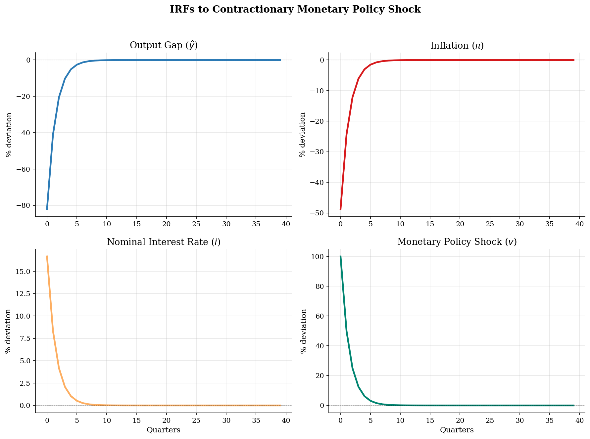
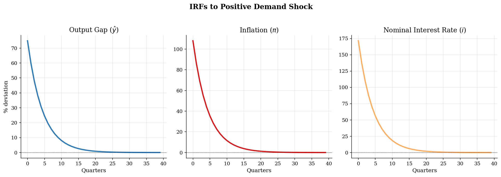
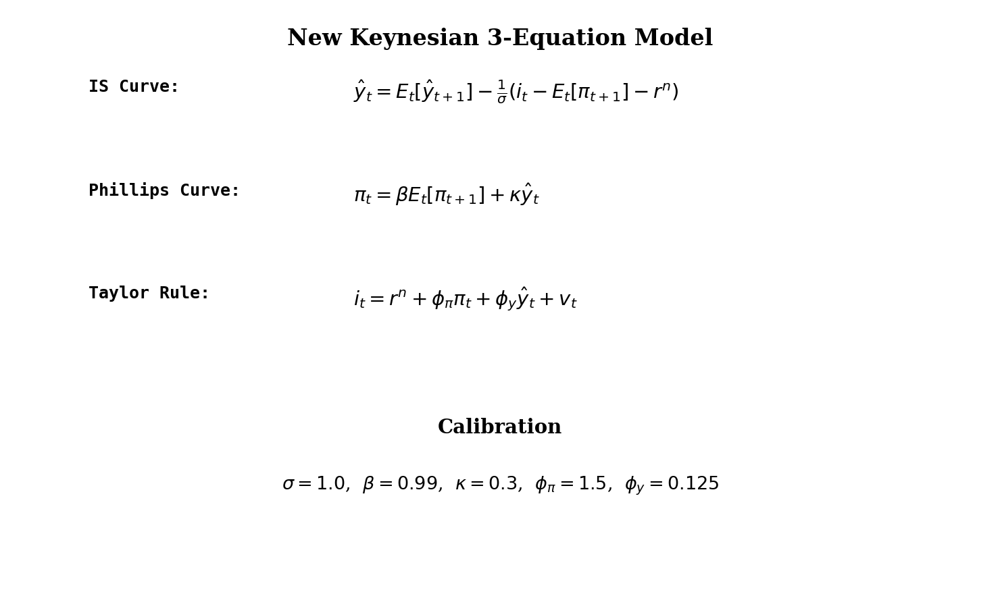

# New Keynesian DSGE Model

> The canonical 3-equation New Keynesian model: IS curve, Phillips curve, and Taylor rule.

## Overview

The New Keynesian model is the foundation of modern monetary policy analysis. It augments the frictionless RBC framework with nominal rigidities (sticky prices) that give monetary policy real effects.

The model reduces to three equations: (1) a dynamic IS curve relating the output gap to expected future output and the real interest rate, (2) a New Keynesian Phillips curve linking inflation to expected future inflation and the output gap, and (3) a Taylor rule describing how the central bank sets the nominal interest rate in response to inflation and output deviations.

This implementation parses the Dynare `model.mod` specification and solves the system analytically via the method of undetermined coefficients.

## Equations

**From `model.mod` (Dynare syntax):**
```
y = y(+1) - sigma^(-1)*(i - pi(+1) - rho)      [Dynamic IS curve]
pi = beta*pi(+1) + k*y                           [NK Phillips curve]
i = rho + phi_pi*pi + phi_y*y + e                [Taylor rule]
```

**Standard form (log-linearized):**

$$\hat{y}_t = \mathbb{E}_t[\hat{y}_{t+1}] - \frac{1}{\sigma}\left(i_t - \mathbb{E}_t[\pi_{t+1}] - r^n\right)$$

$$\pi_t = \beta \, \mathbb{E}_t[\pi_{t+1}] + \kappa \, \hat{y}_t$$

$$i_t = r^n + \phi_\pi \pi_t + \phi_y \hat{y}_t + v_t$$

where $\hat{y}_t$ is the output gap, $\pi_t$ is inflation, $i_t$ is the nominal
interest rate, $r^n$ is the natural rate, and $v_t$ is a monetary policy shock.

## Model Setup

| Parameter | Value | Description |
|-----------|-------|-------------|
| $\sigma$    | 1.0 | Inverse EIS |
| $\beta$     | 0.99 | Discount factor |
| $\phi_\pi$  | 1.5 | Taylor rule: inflation |
| $\phi_y$    | 0.125 | Taylor rule: output gap |
| $\kappa$    | 0.3 | Phillips curve slope |
| $\rho_v$    | 0.5 | Monetary shock persistence |
| $\rho_d$    | 0.8 | Demand shock persistence |

*Note:* The original `model.mod` uses $\phi_\pi = 0.33$ and $\kappa = 0.95$, which violates the Taylor principle and yields a very steep Phillips curve. We use standard Gali (2015) values for pedagogical clarity.

## Solution Method

**Method of undetermined coefficients:** We guess that endogenous variables are linear in the exogenous state:

$$\hat{y}_t = \psi_y v_t, \quad \pi_t = \psi_\pi v_t$$

Substituting into the three equations and matching coefficients yields a system of two equations in two unknowns ($\psi_y$, $\psi_\pi$), which we solve analytically.

This is valid when the Taylor principle ($\phi_\pi > 1$ in many calibrations, or more precisely the Blanchard-Kahn conditions) ensures a unique stable equilibrium. With $\phi_\pi = 1.5$ and $\kappa = 0.3$, the model has a unique rational expectations equilibrium.

## Results


*Impulse responses to a contractionary monetary policy shock (1% increase in the policy rate)*


*Impulse responses to a positive demand shock (1% increase in natural rate)*


*The three core equations of the New Keynesian model*

**Impact Responses to Unit Shocks**

| Variable     |   Impact (monetary, %) |   Impact (demand, %) |
|:-------------|-----------------------:|---------------------:|
| Output gap   |                -82.03  |               74.928 |
| Inflation    |                -48.731 |              108.069 |
| Nominal rate |                 16.65  |              171.47  |

## Economic Takeaway

The New Keynesian model illustrates how nominal rigidities give monetary policy real effects and create a fundamental policy trade-off.

**Key insights:**
- A contractionary monetary shock (positive $v_t$) raises the nominal rate, which with sticky prices increases the real rate. The higher real rate reduces demand via the IS curve, lowering both output and inflation.
- The Phillips curve slope $\kappa$ governs the output-inflation trade-off: a flatter curve means larger output costs of disinflation.
- The Taylor rule parameters determine whether equilibrium is unique: the Taylor principle ($\phi_\pi > 1$) is often needed for determinacy.
- Demand shocks raise output, inflation, and the interest rate simultaneously, while supply shocks create a trade-off between output and inflation stabilization.
- The model's forward-looking nature (expectations of future output and inflation enter today's equations) is what makes rational expectations essential.

## Reproduce

```bash
python run.py
```

## References

- Gali, J. (2015). *Monetary Policy, Inflation, and the Business Cycle*. Princeton University Press, 2nd edition.
- Woodford, M. (2003). *Interest and Prices: Foundations of a Theory of Monetary Policy*. Princeton University Press.
- Clarida, R., Gali, J., and Gertler, M. (1999). The Science of Monetary Policy: A New Keynesian Perspective. *Journal of Economic Literature*, 37(4), 1661-1707.
