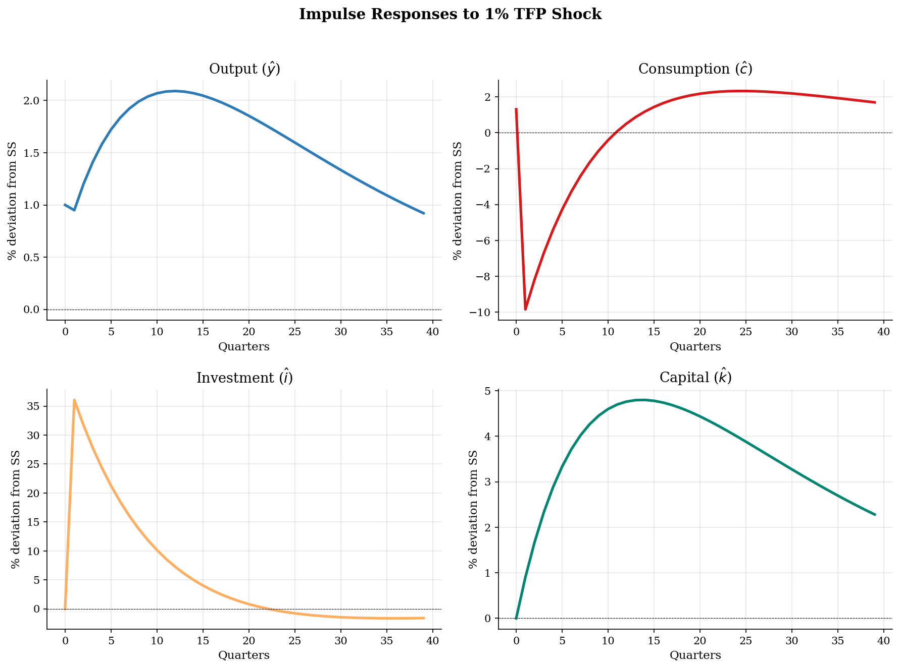
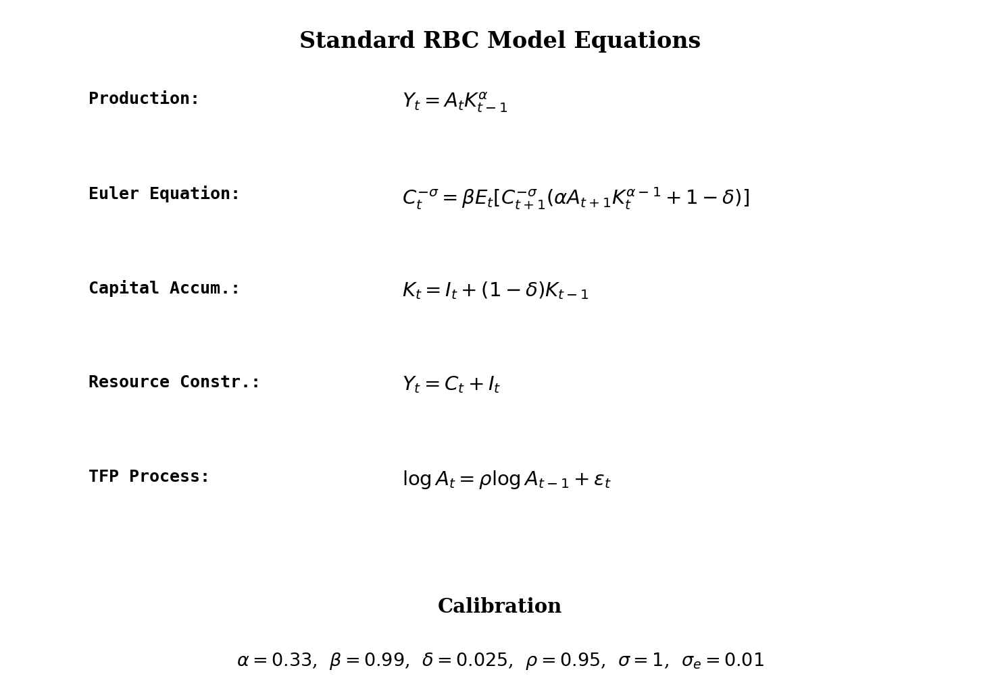

# Standard Real Business Cycle (RBC) Model

> A log-linearized RBC model with TFP shocks, solved via first-order perturbation in Python.

## Overview

The Real Business Cycle model is the workhorse of modern macroeconomics. A representative household maximizes lifetime utility over consumption and leisure, while a representative firm produces output using capital and labor with a Cobb-Douglas technology subject to stochastic total factor productivity (TFP).

This implementation parses the Dynare `model.mod` specification and replicates the first-order perturbation solution in pure Python, generating impulse response functions to a 1% TFP shock.

## Equations

**From `model.mod` (Dynare syntax):**
```
exp(y) = exp(a)*exp(k(-1))^(alpha)
exp(c)^(-sigma) = beta*exp(c(+1))^(-sigma)*(alpha*exp(a(+1))*exp(k)^(alpha-1)+(1-delta))
exp(k) = exp(i) + (1-delta)*exp(k(-1))
exp(y) = exp(c) + exp(i)
a = rho * a(-1) + e
```

**Interpretation (level form):**

$$Y_t = A_t K_{t-1}^\alpha$$

$$C_t^{-\sigma} = \beta \, \mathbb{E}_t \left[ C_{t+1}^{-\sigma} \left( \alpha A_{t+1} K_t^{\alpha-1} + 1-\delta \right) \right]$$

$$K_t = I_t + (1-\delta) K_{t-1}$$

$$Y_t = C_t + I_t$$

$$\log A_t = \rho \log A_{t-1} + \varepsilon_t, \quad \varepsilon_t \sim N(0, \sigma_e^2)$$

## Model Setup

| Parameter | Value | Description |
|-----------|-------|-------------|
| $\alpha$  | 0.33 | Capital share |
| $\beta$   | 0.99 | Discount factor |
| $\delta$  | 0.025 | Depreciation rate |
| $\rho$    | 0.95 | TFP persistence |
| $\sigma$  | 1 | CRRA coefficient (log utility) |
| $\sigma_e$ | 0.01 | Shock std. dev. |

## Solution Method

**First-order perturbation (log-linearization):** The model is approximated around the non-stochastic steady state by taking a first-order Taylor expansion of the equilibrium conditions in log-deviations.

The resulting system takes the state-space form:

$$\hat{x}_{t+1} = A \, \hat{x}_t + B \, \varepsilon_{t+1}$$

where $\hat{x}_t = [\hat{k}_t, \hat{a}_t]'$. The stable eigenvalue for capital is $\lambda_k = 0.9044$, reflecting the high persistence of the capital stock.

## Results


*Impulse responses of output, consumption, investment, and capital to a 1% TFP shock*


*Model equations and calibration for the standard RBC*

**IRF Summary Statistics**

| Variable    |   Peak response (%) |   Peak quarter |   Half-life (quarters) |
|:------------|--------------------:|---------------:|-----------------------:|
| Output      |               2.091 |             12 |                      0 |
| Consumption |               9.839 |              1 |                      0 |
| Investment  |              36.065 |              1 |                      0 |
| Capital     |               4.8   |             14 |                      0 |
| TFP         |               1     |              0 |                     14 |

## Economic Takeaway

The standard RBC model produces business cycle dynamics driven entirely by real (technology) shocks.

**Key insights:**
- A positive TFP shock raises output on impact, with the response shaped by both the direct productivity effect and endogenous capital accumulation.
- Investment is the most volatile variable, overshooting on impact as agents take advantage of temporarily high returns to capital.
- Consumption responds smoothly (consumption smoothing via the permanent income hypothesis) --- the Euler equation ensures marginal utility is a martingale.
- Capital inherits the persistence of the TFP shock but adjusts even more slowly due to the high depreciation-adjusted eigenvalue.
- The model's key limitation: it requires large, persistent TFP shocks to match observed business cycle volatility.

## Reproduce

```bash
python run.py
```

## References

- Kydland, F. and Prescott, E. (1982). Time to Build and Aggregate Fluctuations. *Econometrica*, 50(6), 1345-1370.
- King, R., Plosser, C., and Rebelo, S. (1988). Production, Growth and Business Cycles: I. The Basic Neoclassical Model. *Journal of Monetary Economics*, 21(2-3), 195-232.
- Uhlig, H. (1999). A Toolkit for Analysing Nonlinear Dynamic Stochastic Models Easily. In *Computational Methods for the Study of Dynamic Economies*.
