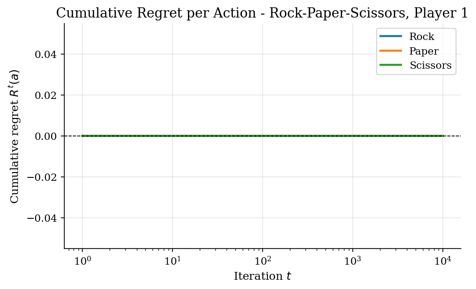
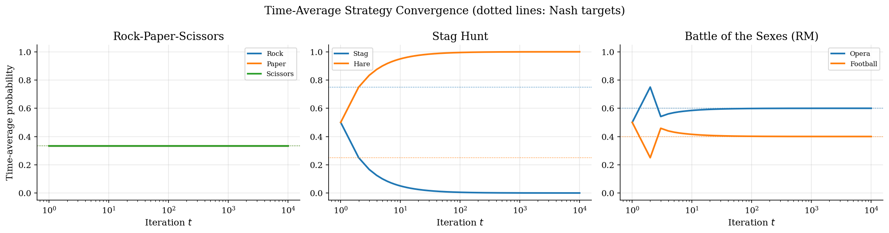
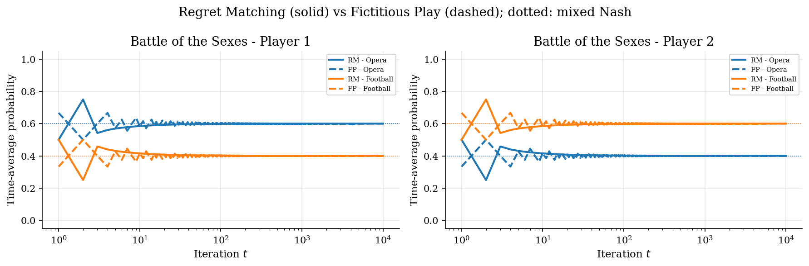

# Regret Matching and No-Regret Dynamics

## Overview

Two players sit at a table and play a game repeatedly. Each round they choose an action without seeing the opponent's choice in advance. After many rounds, what do their average play patterns look like?

The fictitious-play and best-response answers say each player should optimise against the empirical distribution of the opponent's past actions. Hart and Mas-Colell proposed a different rule, called regret matching: each player keeps a running tally of the regret they feel for having not played each alternative action in the past, and they play in proportion to the positive part of that tally. There is no model of the opponent. Each player only needs their own payoff function and their own action history.

Regret matching is interesting because its convergence guarantee is unconditional. Hart and Mas-Colell prove that the time-average empirical play converges to a correlated equilibrium of the stage game, regardless of what the opponent does. The same primitive extends to counterfactual regret minimisation (CFR) for extensive-form games, where it underlies state-of-the-art poker solvers.

This prelim derives the regret-matching update rule, applies it to three classic small games (Rock-Paper-Scissors, Stag Hunt, Battle of the Sexes), and compares against fictitious play. The same primitive is the core update step in [`game-theory/cfr-asymmetric-auction/`](../../game-theory/cfr-asymmetric-auction/) inside a more complex sequential auction setting.

## Equations

We need notation for the per-round play of a two-player normal-form game. Let $`i \in \{1, 2\}`$ index the players, let $`A_i`$ be player $`i`$'s action set with $`|A_i| = K_i`$, and let $`u_i(a_i, a_{-i})`$ be player $`i`$'s payoff when she plays $`a_i`$ and her opponent plays $`a_{-i}`$. At round $`t`$, player $`i`$ plays a mixed strategy $`\pi_i^t \in \Delta(A_i)`$ (a probability distribution over actions).

We need a notion of regret for not having played a specific action. The instantaneous regret player $`i`$ feels at round $`t`$ for action $`a`$ is the difference between the payoff she would have received if she had played $`a`$ and the payoff she actually received:

```math
r_i^t(a) = u_i(a, a_{-i}^t) - u_i(a_i^t, a_{-i}^t).
```

A positive regret means $`a`$ would have been a better choice; a negative regret means it would have been worse. Summing instantaneous regrets across rounds gives cumulative regret:

```math
R_i^T(a) = \sum_{t=1}^{T} r_i^t(a).
```

Cumulative regret records how much player $`i`$ would have gained, in total, by always playing $`a`$ instead of what she actually played, holding the opponent's actual play fixed.

We need a rule that maps cumulative regret into a next-round mixed strategy. The regret-matching update is to play in proportion to positive cumulative regret:

```math
\pi_i^{T+1}(a) = \frac{\max(R_i^T(a),  0)}{\sum_{a' \in A_i} \max(R_i^T(a'),  0)},
```

with the convention $`\pi_i^{T+1}`$ uniform when all cumulative regrets are negative or zero. The intuition is direct: actions that would have done better are played with higher probability next round; actions that would have done worse are dropped from the support.

We need a convergence statement. Hart and Mas-Colell (2000) prove that if both players follow the regret-matching rule, then the time-average empirical play $`\bar\pi^T = (1/T) \sum_t (a_1^t, a_2^t)`$, viewed as a joint distribution over $`A_1 \times A_2`$, converges almost surely to the set of correlated equilibria of the stage game. The same result holds with the expected-payoff version of the regret (replacing the actual opponent action $`a_{-i}^t`$ by the expected payoff against $`\pi_{-i}^t`$), which is the variant used in the implementation here for faster, deterministic convergence.

## Worked Numerical Example

Take Matching Pennies for player 1 with $`A_1 = \{H, T\}`$ and payoffs $`u_1(H, H) = u_1(T, T) = 1`$, $`u_1(H, T) = u_1(T, H) = -1`$. Initialise cumulative regret at $`R_1^0 = (0, 0)`$, which gives the uniform start $`\pi_1^1 = (1/2, 1/2)`$.

Round 1: player 1 plays $`a_1^1 = H`$ and the opponent plays $`a_{-1}^1 = T`$. The actual payoff is $`u_1(H, T) = -1`$, and the counterfactual payoff from $`T`$ would have been $`u_1(T, T) = 1`$. Instantaneous regrets are

```math
r_1^1(H) = u_1(H, T) - u_1(H, T) = 0, \qquad r_1^1(T) = u_1(T, T) - u_1(H, T) = 1 - (-1) = 2.
```

Cumulative regret after round 1 is $`R_1^1 = (0, 2)`$. The regret-matching update gives

```math
\pi_1^2(H) = \frac{\max(0, 0)}{0 + 2} = 0, \qquad \pi_1^2(T) = \frac{\max(2, 0)}{0 + 2} = 1.
```

Round 2: player 1 plays $`a_1^2 = T`$ and the opponent switches to $`H`$. The actual payoff is $`u_1(T, H) = -1`$, and the counterfactual from $`H`$ would have been $`u_1(H, H) = 1`$. Instantaneous regrets are

```math
r_1^2(H) = 1 - (-1) = 2, \qquad r_1^2(T) = -1 - (-1) = 0.
```

Cumulative regret after round 2 is $`R_1^2 = (0 + 2,  2 + 0) = (2, 2)`$, and the next-round mixed strategy is

```math
\pi_1^3(H) = \frac{2}{2 + 2} = \frac{1}{2}, \qquad \pi_1^3(T) = \frac{2}{2 + 2} = \frac{1}{2}.
```

The boxed result is the post-round-2 mixed strategy that the regret-matching rule prescribes:

```math
\boxed{\pi_1^3 = (1/2,  1/2).}
```

After two opposing plays the cumulative regret vector is symmetric, so the prescribed mix collapses to the unique mixed Nash $`(1/2, 1/2)`$ of Matching Pennies. The same algebra runs for any 2-action zero-sum game: each round adds a non-negative regret to the action that would have done better against the realised opponent move, and the positive-part normalisation in the update converts that running tally into the next-round mix.

## Model Setup

| Object | Symbol | Role |
|---|---|---|
| Player index | $`i`$ | $`i \in \{1, 2\}`$ |
| Action set | $`A_i`$ | Finite set of pure actions |
| Action count | $`K_i`$ | $`\lvert A_i \rvert`$ |
| Payoff function | $`u_i`$ | $`A_1 \times A_2 \to \mathbb{R}`$ |
| Round index | $`t`$ | $`t = 1, \ldots, T`$ |
| Mixed strategy | $`\pi_i^t`$ | $`\Delta(A_i)`$ at round $`t`$ |
| Instantaneous regret | $`r_i^t(a)`$ | $`u_i(a, a_{-i}^t) - u_i(a_i^t, a_{-i}^t)`$ [from `cfr-asymmetric-auction/`] |
| Cumulative regret | $`R_i^T(a)`$ | $`\sum_t r_i^t(a)`$ [from `cfr-asymmetric-auction/`] |
| Joint time-average play | $`\bar\pi^T`$ | $`(1/T) \sum_t (a_1^t, a_2^t)`$, joint distribution on $`A_1 \times A_2`$ |
| Per-player time-average | $`\bar\pi_i^T`$ | $`(1/T) \sum_t \pi_i^t`$, marginal mixed strategy of player $`i`$ (tracked by the pseudocode) |
| Rounds | $`T`$ | 10000 in the example |
| RPS payoffs | | $`u_1(R, P) = -1`$, $`u_1(P, R) = +1`$, $`u_1(R, R) = 0`$, etc.; $`u_2 = -u_1`$ |
| Stag-Hunt payoffs | | $`u_1(\text{Stag}, \text{Stag}) = 4`$, $`u_1(\text{Hare}, \cdot) = 3`$, $`u_1(\text{Stag}, \text{Hare}) = 0`$ |
| BoS payoffs | | $`(u_1, u_2)(\text{Op}, \text{Op}) = (3, 2)`$, $`(\text{Fb}, \text{Fb}) = (2, 3)`$, mismatches give $`(0, 0)`$ |

The annotations record which symbols are shared with the dense tutorial that adopts this prelim.

## Solution Method

The procedure is a self-play loop with one regret update per round per player. The implementation uses the expected-payoff version, which converges faster and removes Monte Carlo noise from the regret estimate.

```text
Procedure: Regret matching with expected-payoff counterfactuals
Inputs : payoff matrices U_1 and U_2; round count T.
Outputs: time-average mixed strategy for each player and cumulative regret.

1. Initialise cumulative regret R_i = 0 for both players.
   Initialise time-average strategy bar_pi_i = uniform.

2. For t = 1, ..., T:
   a. Compute current mixed strategy from positive cumulative regret:
        pi_i = max(R_i, 0) / sum(max(R_i, 0))   if denominator > 0
             = uniform                          otherwise.
   b. Update cumulative regret using the expected payoff:
        for each own action a:
           counterfactual(a) = expectation over opponent's actions a' of u_i(a, a')
        actual = expectation over own actions of counterfactual
        R_i(a) += counterfactual(a) - actual.
   c. Update the running average bar_pi_i = ((t - 1) bar_pi_i + pi_i) / t.

3. Return bar_pi_1, bar_pi_2, and the final R_1, R_2.
```

Specific CFR variants for extensive-form games, deep CFR with neural-network function approximation, and multi-agent learning theory beyond Hart-Mas-Colell build on this base and are out of scope.

## Results

The first figure tracks cumulative regret per action in Rock-Paper-Scissors.



The three lines stay tightly bunched and grow far more slowly than $`T`$ itself, which is the algorithmic signature of Hart-Mas-Colell convergence. Sublinear growth in cumulative regret is the precise sense in which the time-average play converges to a correlated equilibrium: no single action would have been substantially better than the time-average policy.

The second figure shows the time-average play converging to the appropriate equilibrium in all three games.



In Rock-Paper-Scissors, the time-average converges to the unique mixed Nash $`(1/3, 1/3, 1/3)`$ within numerical precision. In Battle of the Sexes, the time-average converges to the mixed-Nash $`(0.6, 0.4)`$ for player 1 and $`(0.4, 0.6)`$ for player 2. In Stag Hunt the dynamics lock into the Hare-Hare pure-strategy Nash rather than the mixed Nash $`(0.75, 0.25)`$. Both Hare-Hare and the mixed Nash are correlated equilibria of the Stag-Hunt game; regret matching's guarantee is convergence to a correlated equilibrium, and the risk-dominant pure equilibrium is the one regret matching picks here. The mixed Nash is unstable under no-regret dynamics on this game.

The third figure compares regret matching against fictitious play on Battle of the Sexes.



Both algorithms converge to the same mixed Nash equilibrium to five decimal places. Battle of the Sexes is well-behaved enough that the choice of update rule does not matter for the eventual time-average. In larger or extensive-form games the two rules can disagree, and regret matching scales better because it does not require enumerating opponent strategies at every step.

## Takeaway

Regret matching is a simple no-regret update: keep a running tally of the regret you would feel for not having played each action, and play in proportion to the positive part. The time-average play converges to a correlated equilibrium of the stage game under self-play. The same primitive is the inner update rule of counterfactual regret minimisation in extensive-form games.

In small games regret matching may favour a pure equilibrium when the mixed Nash is unstable (the Stag-Hunt example here). This is a feature, not a bug: the algorithm's guarantee is convergence to a correlated equilibrium, and pure equilibria are also correlated equilibria. In larger and extensive-form games, the same primitive scales up to CFR; see [`game-theory/cfr-asymmetric-auction/`](../../game-theory/cfr-asymmetric-auction/) for the asymmetric-auction application.

## References

- Hart, S. and Mas-Colell, A. (2000). "A Simple Adaptive Procedure Leading to Correlated Equilibrium." *Econometrica*, 68(5), 1127-1150. The founding regret-matching paper.
- Zinkevich, M., Johanson, M., Bowling, M., and Piccione, C. (2008). "Regret Minimization in Games with Incomplete Information." *Advances in Neural Information Processing Systems*, 20. CFR foundation.
- Cesa-Bianchi, N. and Lugosi, G. (2006). *Prediction, Learning, and Games*. Cambridge University Press, Chapter 4. Learning-theoretic foundations of no-regret dynamics.
- Brown, N. and Sandholm, T. (2019). "Superhuman AI for Multiplayer Poker." *Science*, 365(6456), 885-890. Modern CFR-variant benchmark.
- **See also.** The extensive-form application of regret matching is in [`game-theory/cfr-asymmetric-auction/`](../../game-theory/cfr-asymmetric-auction/), where the per-information-set CFR update reuses this primitive at every decision node.
